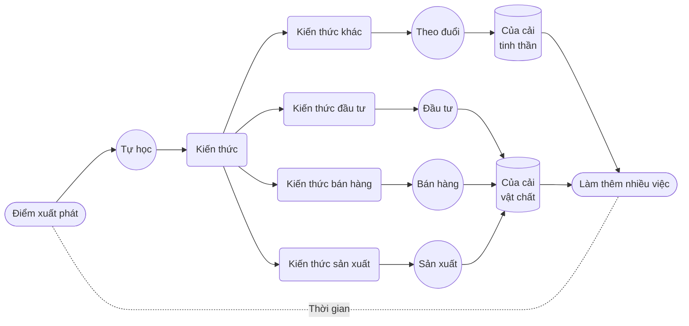

# 1. Đưa quân vào trận

Mọi người không tiếc tiền cho giáo dục. Tiếc là họ thường không muốn dành sự chú ý cho giáo dục. Cách nói tiếng Anh rất chính xác: **chú ý đến điều gì** là *pay attention to something*, dùng động từ *pay*, “trả”.

Ta thường có ba nguồn lực: **tiền**, **thời gian**, **sự chú ý**. Bản chất của giáo dục là **đầu tư** vào bản thân. Đầu tư trên đời đều giống nhau: cần thời gian làm tư liệu sản xuất cơ bản. Không bỏ thời gian, hoặc chỉ bỏ rất ít, thì không phải **đầu tư**; ta có tên khác cho hành vi ấy: **đầu cơ**.

Khi đầu tư, về bản chất ta đều đang **rót tiền vào thời gian**. Nếu dùng chiến lược đầu tư định kỳ, đó là **liên tục rót tiền vào thời gian nhưng tuyệt đối không rót sự chú ý**. Khi học, hay đầu tư vào bản thân, có một khác biệt quan trọng: thứ cần rót vào **thời gian** cũng có **tiền**, nhưng đồng thời, quan trọng hơn là **sự chú ý**.

Nhìn từ góc ấy, mọi thất bại trong học tập không ngoài hai căn nguyên:

> * Bỏ tiền nhưng không bỏ thời gian.
> * Bỏ thời gian nhưng không dành sự chú ý.

Cuối cùng, mọi thất bại đều giống nhau: chỉ vì **không rót đủ sự chú ý vào thời gian**.

Mọi người thường lầm tưởng IQ quyết định thành bại học tập, lại lầm tưởng IQ là thứ bất biến. Thực ra, cả hai quan điểm ấy đều là ảo tưởng dựa trên hiểu lầm.

Yếu tố thực sự quyết định là **sự chú ý**.

Tôi có một cách nói hình tượng. Nếu một người có thể tập trung liên tục khoảng 25 phút, người ấy giống một **vị tướng có quân để dùng**. Mỗi lần tập trung liên tục 25 phút tương đương một người lính. Nếu trong một ngày làm được vài lần như vậy thì **vị tướng có vài người lính để dùng**.

Càng nhiều quân tất nhiên càng tốt. Nhưng thời gian mỗi ngày hữu hạn, mà để tập trung, não phải tiêu nhiều năng lượng, nên quân không thể vô hạn. Tuy vậy, với đại đa số người bình thường, chỉ cần mỗi ngày có bảy, tám người lính đã làm được nhiều việc. Nếu duy trì, chắc chắn có thể đạt thành tích đáng kinh ngạc.

**Có quân để dùng** rồi còn phải **có trận để đánh**. Nuôi quân bằng việc đánh trận. Không có trận, quân dần suy yếu. Chỉ cần liên tục ra trận, quân sẽ mạnh hơn: từ **tập trung được 25 phút** phát triển thành **30 phút, 40 phút hoặc lâu hơn**. Quân càng mạnh càng tốt; quân mạnh thì ít người cũng đánh được trận lớn.

Dùng **quân** mạnh đánh **trận** nào? Học là điều quân đánh trận; tự học là tự mình điều quân. Phần lớn thời gian đời người nên dành cho **tự học**. Học gì? Kiến thức sản xuất, bán hàng, đầu tư để tạo của cải vật chất; rồi nhiều kiến thức khác để theo đuổi sự phong phú tinh thần, từ đó dùng thời gian làm thêm nhiều việc.

Tiếc là đa số hoàn toàn **không có quân để dùng**, không tập trung liên tục nổi 25 phút, nên khó làm vị tướng trong phép ví này. Họ cũng **không có trận để đánh**, nên không nuôi được quân. Điều này chẳng liên quan IQ hay năng khiếu: không có quân thì thông minh đến đâu cũng vô ích. Có chút quân nhưng không có trận vẫn vô ích; vì không có trận, ngay chút quân ấy sớm muộn cũng suy yếu. Vẫn vậy, thông minh đến đâu cũng chẳng ích gì.

Thử đoán điều đáng tiếc nhất là gì?

> **Mỗi người ban đầu đều có quân, lại toàn quân mạnh**.

Trẻ nhỏ có thể chú ý rất lâu. Nếu không bị quấy rầy, chúng dễ bị một sự vật hay hoạt động cuốn hút, rồi cứ tập trung cho đến khi đói.

Cha mẹ thường không biết cần gìn giữ sự chú ý của con. Bất kể con đang làm gì, họ có thể lao tới ôm hoặc hôn, chỉ lo thỏa mãn mình. Nhà trường cũng có thể góp phần phá sự chú ý của đa số trẻ, dù chắc chắn không cố ý. Bị buộc ngồi lâu trong lớp nhàm chán, nhiều em không học được cách tập trung; điều thực sự luyện được là ngồi mơ màng mà không bị phát hiện. Kinh tế hàng hóa đã thành kinh tế chú ý, cả thế giới tranh giành sự chú ý của ta. Theo khẳng định trong nguyên tác, thiết bị di động thông minh nổi lên hơn mười năm gần đây đã ép khoảng chú ý (*attention span*) của đại đa số người trên Trái Đất xuống dưới hai phút.

Cứ vậy, đa số dần trở thành người hoàn toàn **không có quân**, cũng **không có trận**. Điều vô cùng đáng tiếc là mỗi người trong số họ, thuở ban đầu, vốn đều là tướng mạnh sinh ra cùng quân mạnh.

Sự thông minh thể hiện ra cho người khác thấy đều được tích lũy. Không chỉ thông minh, ngay cái gọi là năng khiếu cũng vậy, nếu năng khiếu thực sự tồn tại.

Trước kia, người ta xem **khả năng nhận biết cao độ tuyệt đối** (*perfect pitch*) là năng khiếu: có thì có, không thì không. Theo số liệu tác giả nêu, gần như chỉ một trên một trăm nghìn người có nó, chẳng hạn Mozart. Mozart có thể phân biệt cao độ (*pitch*) của mọi âm thanh; ngay cả khi bạn ho ở phòng bên, ông cũng có thể dùng phím đàn chơi lại cao độ tiếng ho ấy.

Nhưng về sau, theo tác giả, các nhà nghiên cứu phát hiện mọi thứ từng bị tưởng là năng khiếu thực ra đều do **luyện**, không ngoại lệ. Bí quyết **luyện mà thành** chỉ là **luyện lâu**. Lợi thế thực sự của người được gọi là thiên tài chỉ là **luyện sớm**, nên **tương đối luyện lâu hơn**. Ông cho rằng ngày càng nhiều nghiên cứu não bộ ủng hộ kết luận mọi người có thể sinh ra với **tiềm năng** gần như nhau, chỉ cần **luyện** mới **hiện thực hóa**. Nói cách khác, nhiều người không phải không có năng khiếu, mà vì để thời gian trôi phí nên bỏ lỡ cơ hội hiện thực hóa nó.

Theo tác giả, luyện cao độ tuyệt đối không khó hay phức tạp, trên mạng còn có nhiều chương trình mã nguồn mở miễn phí. Ông khẳng định tỷ lệ người có khả năng này nay không còn là một phần một trăm nghìn, một phần mười nghìn hay một phần nghìn, mà đã vượt một phần trăm và vẫn tăng. Vô số ví dụ, theo lời ông, cho thấy ai cũng học được ở bất kỳ tuổi nào, chỉ cần mật độ tập đủ cao và thời gian đủ lâu. Vì sao? Đây không phải thứ **có thì có, không thì không**, mà là thứ **luyện thì có, không luyện thì không**.

Suy cho cùng, con người vẫn khác nhau, nên “năng khiếu” còn có nghĩa là **khác biệt bẩm sinh không tránh khỏi**. Chẳng hạn người ngón tay ngắn có thể hơi bất lợi khi chơi đàn; người thấp có thể hơi bất lợi khi chơi bóng rổ; người đẹp trai có thể thuận lợi hơn trong giao tiếp; người có cao độ tuyệt đối chắc chắn có lợi thế tương đối khi học ngoại ngữ, nhất là luyện phát âm. Điều ấy dường như không thể phủ nhận. Nhưng đồng thời ta luôn thấy nhiều **phản ví dụ**: không ít bậc thầy piano ngón ngắn, ngôi sao bóng rổ thấp không hiếm, chuyên gia đàm phán ngoại hình kém hấp dẫn nhưng tỷ lệ thành công cao thì rất phổ biến.

Cứ học, cứ luyện. Dù sao bạn nên là một vị tướng, bạn vốn đúng là một vị tướng: hãy đưa quân vào trận.

Sau hết trận thắng này đến trận thắng khác, thứ tích lũy không chỉ là thành tích, mà còn là quân ngày càng mạnh, ngày càng đông và kinh nghiệm điều động, chỉ huy. Nhìn vậy, năng lực mạnh nhất cuối cùng một người có thể có là **huy động và chỉ huy sự chú ý**. Một khi thực sự có năng lực ấy, có quân để điều, có trận để đánh thì chỉ còn tiến đâu thắng đó, việc gì cũng thuận. Điều này rõ ràng chẳng liên quan IQ hay năng khiếu. Nếu có, có lẽ chỉ là mọi người thường hiểu biểu hiện của năng lực này thành IQ hoặc năng khiếu.

Hãy **đổi quan niệm**!

> Năng khiếu dù thực sự tồn tại cũng giống cái gọi là IQ: đều **do luyện**, **do tích lũy**, chứ không phải linh kiện có thể lắp thẳng vào hoặc được lắp sẵn.

Đổi sang quan niệm hợp lý hơn ở đây rất đáng giá, vì gần như trong chớp mắt bạn đã thay được bộ não, thực tế hơn nhiều so với cách nói lột xác hoàn toàn.

Có lẽ trình bày từng bước sẽ chính xác và hiệu quả hơn:

> - Bạn có **tiềm năng** vô hạn.
> - Tiềm năng có **thành hiện thực** hay không phụ thuộc bạn **có luyện không**, **luyện bao lâu**, **bắt đầu sớm đến đâu**, **luyện quyết liệt đến đâu**.
> - Bạn hiện thực hóa được **bao nhiêu tiềm năng** phụ thuộc **có bao nhiêu thời gian**.
> - **Thời gian của bạn** có hiệu quả hay không phụ thuộc **rót bao nhiêu sự chú ý vào đó**.

Có vô số lý do để học. Nhưng từ góc này, lý do rất đơn giản, trực tiếp và rõ: ta phải **có quân mạnh để làm tướng mạnh**, nếu không thì đáng sợ biết bao. Dùng thời gian để điều quân đánh trận. Không có trận thì đi tìm trận. Còn sống còn chiến đấu, hiện thực hóa được bao nhiêu tiềm năng thì làm bấy nhiêu.

::: info Ghi chú biên tập cho bản tiếng Việt
Quân, tướng và trận đánh là phép ví của tác giả cho sự chú ý và nhiệm vụ học. Mốc 25 phút, bảy hoặc tám lượt mỗi ngày không phải ngưỡng sinh học hay số buổi bắt buộc. Các khẳng định mọi thất bại chỉ do thiếu chú ý, mọi trẻ vốn tập trung lâu, hoặc thiết bị di động làm hầu hết mọi người chỉ chú ý dưới hai phút không được bài này dẫn chứng. Xem đối chiếu ở [bài về sự chú ý](../in-the-brain/12-unreproducible.md).

Đoạn về đầu tư là phép so sánh phục vụ quan điểm giáo dục của tác giả, không phải hướng dẫn đầu tư tài chính. Nhận xét về nhà trường và cha mẹ phản ánh quan điểm nguyên tác, không phải kết luận về mọi gia đình hoặc trường học Việt Nam.

*Absolute pitch*, thường gọi là **cảm âm tuyệt đối**, là khả năng xác định tên nốt không cần âm tham chiếu. Một số người trưởng thành có thể cải thiện hoặc đạt khả năng này qua luyện tập, nhưng chưa thể suy ra mọi người ở mọi tuổi đều thành công chỉ cần tập đủ lâu. [Van Hedger và cộng sự (2019)](https://journals.plos.org/plosone/article?id=10.1371/journal.pone.0223047) ghi nhận phần lớn người tham gia chỉ tiến bộ vừa phải; [Wong và cộng sự (2025)](https://link.springer.com/article/10.3758/s13423-024-02620-2) nghiên cứu 12 người có kinh nghiệm âm nhạc, tuổi 19 đến 44, cũng cho kết quả khác nhau. Các thí nghiệm không xác nhận tỷ lệ toàn dân đã vượt 1% hoặc đang tăng như nguyên tác khẳng định. Không dùng thành tích cảm âm để kết luận người học có hoặc không có năng khiếu tiếng Anh.
:::
