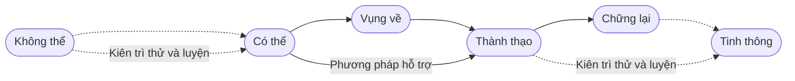
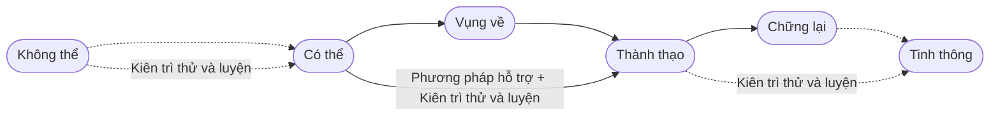

# 3. Kiên trì thử và luyện

Dù làm gì, não cũng phải phối hợp nhiều cơ quan mới hoàn thành được. Nó phối hợp cả các cơ quan bên ngoài lẫn nhiều bộ phận bên trong chính mình. Đối với não, tất cả đều là hoạt động liên kết của vô số **mạng cục bộ** trong nó.

Những mạng này được xây dần: mỗi mạng hình thành qua học và được củng cố bằng rất nhiều lần sử dụng. Dù muốn học gì, bước đầu luôn là tập trung quan sát, huy động giác quan cần thiết như thị giác, thính giác hoặc xúc giác, rồi mới bắt đầu thử.

Quy trình gần như luôn giống nhau: vừa **thử** thì điều đầu tiên gặp chắc chắn là **không thể**. Sau **nhiều lần thử** mới gặp **có thể**; ngay sau đó là **vụng về**. Qua một thời gian nữa mới có thể **thành thạo**, rồi có thể là một quãng **chững lại** dài; sau nhiều luyện tập có chủ đích mới có thể **tinh thông**.

Quan trọng và khó nhất tất nhiên là bước từ **không thể** sang **có thể**, bước đột phá từ 0 đến 1.

Khó khăn cốt lõi đầu tiên là **ta gần như không bao giờ quan sát được đầy đủ**. Chẳng hạn, một trong những tiếng mẹ đẻ của tôi là tiếng Hàn, nên tôi có thể phát âm rung lợi hữu thanh ([*voiced alveolar trill*](https://en.wikipedia.org/wiki/Voiced_dental,_alveolar_and_postalveolar_trills)). Một em nhỏ nhà tôi có tên gọi ở nhà là Đô Đô, nguyên tác ghi là *dū dū*. Khi đùa với em, tôi cố ý dùng âm rung lợi để gọi tên:

<audio controls><source src="/audios/dudu.mp3">Trình duyệt của bạn không hỗ trợ phát âm thanh.</source></audio>

Các em thấy thú vị và muốn phát âm giống vậy. Nhưng trong một thời gian dài sau đó, các em không làm được. Cứ thử đi thử lại vẫn không được. Âm tạo ra có thể là âm rung bằng môi, nhưng ngay lúc ấy các em cũng biết đó không phải âm đã nghe. Các em tiếp tục tìm cách, thử đủ kiểu, vẫn chưa được.

Nguyên nhân chính là các em không thấy đầu lưỡi tôi rung thế nào ở vùng lợi: khó vì không quan sát đầy đủ. Tôi cũng thật sự không giải thích rõ mình làm thế nào, lại tưởng từ nhỏ đã biết. Thực ra không phải: hồi ấy tôi cũng giống con bây giờ, ban đầu không sao phát được, rất lâu sau mới được. Nhưng tôi đã quên mình học qua vô số lần thử, đến mức tưởng đó là khả năng bẩm sinh.

May là Wikipedia có giải thích đầy đủ, hệ thống về âm rung lợi này. Nguyên tác nêu có 37 bản ngôn ngữ, trong đó bản tiếng Anh là [*Voiced alveolar trill*](https://en.wikipedia.org/wiki/Voiced_dental,_alveolar_and_postalveolar_trills), bản tiếng Trung là [âm rung lợi](https://zh.wikipedia.org/?curid=274842). Ngoài giải thích bằng chữ còn có video quay chậm:

<video controls width="480"> <source src="/videos/voiced-alveolar-trill.mp4" type="video/mp4"></source>Trình duyệt của bạn không hỗ trợ phát video. </video>

Giờ quan sát đã đầy đủ, phương pháp cũng hệ thống. Nhưng xem xong là làm được sao? Rõ ràng vẫn không thể. Trong não chưa có các mạng chức năng cơ sở tương ứng để gọi dùng, cần xây mới. Không chỉ một, hai mạng: động tác nhỏ ấy thực ra cần nhiều mạng phối hợp hơn ta tưởng rất nhiều. Tạo kết nối và mạng mới cần thời gian; dù quan sát đầy đủ hay không, có phương pháp hay không, ta vẫn không thể nhảy qua thời gian.

Vậy làm sao **đột phá**?

Thời tôi lớn lên, phim bộ Hồng Kông rất nổi ở Trung Quốc. Khi ấy ít thứ để xem, thường cả nước cùng theo một phim. Trong một phim võ hiệp, cận cảnh một **cao thủ võ lâm** cho khán giả thấy tai ông ta cử động được! Hôm sau cả lớp hỏi nhau: tai bạn có động được không? Không ai làm được. Trước đó tai mỗi người chưa từng động, cũng chẳng ai nghĩ đến việc làm nó động. Vài ngày sau, một bạn nói đã **cử động được tai**. Mọi người ngạc nhiên xem bạn biểu diễn. Vài ngày nữa, nhiều bạn trong lớp cũng **học** được cách **cử động tai**. Tất nhiên, không ai giải thích rõ **phương pháp cử động tai**, ai cũng chỉ nói: “Thử nhiều là được”.

Đúng vậy: **thử nhiều là được**.

Ở Tân Cương, theo cách kể của tác giả, mọi người từ nhỏ đều **học** được cách **lắc cổ**, một động tác ít người thuộc các dân tộc khác làm được. Hỏi chính xác phải làm thế nào, họ thật sự khó giải thích; đôi khi có người nói rõ, bạn vẫn chưa học được. Thật sự **không học được** sao? Chắc chắn được. Còn **phương pháp**, không phải không cần, nhưng tác dụng không lớn như ta tưởng.

Ít người **cử động được đầu mũi**, đời sống cũng không có **nhu cầu** ấy. Nhưng hai nữ chính trong hai phiên bản *Bewitched*, Elizabeth Montgomery ở bản truyền hình và Nicole Kidman ở bản điện ảnh, đều học được. Học thế nào? Giống cử động tai hay lắc cổ: **thử nhiều** là được.

Mấu chốt đột phá là **thử không ngừng**, cách này không được thì đổi cách khác. Tạo kết nối và mạng mới dù sao cũng cần thời gian; lấy gì lấp đầy thời gian ấy? Thử và sai, điều tác giả gọi là chiến lược hiệu quả duy nhất tự nhiên dùng để tiến hóa. Vì sao có thể thử mãi, vì sao sẵn sàng thất bại rồi thử tiếp? Vì **chắc chắn có thể**: người khác làm được, tôi cũng làm được.

Đây mới là cách học quyết liệt nhất trong đời, tôi gọi là **kiên trì thử và luyện**: không ngừng thử và sai đến khi có thể, không ngừng lặp lại đến khi thành thạo.

> Vì chắc chắn có thể nên mới sẵn sàng thử mãi. Thất bại là bình thường; đổi cách rồi tiếp tục thử cho đến khi làm được.

Mọi việc học đối với não đều như nhau. Bước đột phá ban đầu từ 0 đến 1 không thể giải quyết bằng phương pháp, chỉ có thể vượt qua bằng kiên trì thử và luyện. Qua cửa này, biến không thể thành có thể rồi, trong quá trình từ vụng về đến thành thạo, phương pháp mới có cơ hội phát huy.

Vấn đề là phương pháp, dù hữu ích, thường không hoạt động độc lập. Chẳng hạn tôi nói t nằm giữa các nguyên âm cần dùng âm vỗ t̬ ([3.2.2.3.1](../sounds-of-american-english/3.2.2-td#flap-t)). Bạn có thể hiểu ngay, thậm chí nhớ, nhưng lần sau mở miệng có làm được không? Mười lần thì tám, chín lần chưa được. Ví dụ như vậy có ở khắp nơi. Đại đa số điểm ngữ pháp tiếng Anh cũng vậy với người học ngôn ngữ thứ hai: trong phòng thi làm đúng, nhưng mở miệng nói hoặc cầm bút viết là sai liên tiếp, dù vừa sai đã tự nhận ra.

Nhiều kiến thức, kỹ năng quan trọng là vậy: biết thôi không có tác dụng, thành thạo còn chưa đủ, phải tinh thông mới thật sự hữu dụng, vì phải đúng cả khi làm tự động, không cần ý thức. Vì cái gọi là **biết** ấy, não phải xây kết nối và mạng mới, rồi củng cố liên tục đến mức xử lý đúng một cách tự động, thậm chí không cần ý thức. Thành thạo mới giảm một phần gánh nặng, cần rất nhiều lần lặp, tốt nhất lặp đủ nhiều trong thời gian ngắn. Phải tinh thông mới trút hết gánh nặng, lại cần rất nhiều lần lặp, tốt nhất cũng trong thời gian ngắn. Chỉ khi tinh thông, não mới hoàn toàn nhẹ gánh để đồng thời làm việc khác. Nói đi nói lại, chẳng phải đều chỉ có thể dựa vào kiên trì thử và luyện sao?

Vì thế, kiên trì thử và luyện xuyên suốt toàn bộ quá trình học. Từ đầu đến cuối, lúc nào cũng có thể cần, nhất là những lúc then chốt. Cách nói trước cũng nên sửa: **không ngừng thử và sai đến khi có thể, không ngừng lặp lại đến khi tinh thông**, chứ không chỉ thành thạo.

**Kiên trì thử và luyện vốn là khả năng bẩm sinh của chúng ta**. Không nghi ngờ gì, trong những năm đầu, mọi thứ đều được nắm bằng cách ấy. Theo lý thuyết tác giả trình bày, xử lý ngôn ngữ tự nhiên là nhiệm vụ cao cấp và phức tạp nhất mà não có thể làm suốt đời, không có việc nào ngang hàng. Tương ứng, tiếp thu ngôn ngữ tự nhiên là nhiệm vụ học phức tạp, khó nhất mà ta gặp nhưng buộc phải hoàn thành. Vậy mà hai phần nền tảng, **rèn phát âm** và **mở rộng trí nhớ**, lại được hoàn thành dần trước khi đến trường, trước khi biết chữ, toàn nhờ kiên trì thử và luyện.

Ngay cả nhiều lĩnh vực được xem là cao cấp cũng vậy. Có người cầm tay chỉ việc thì rất tốt, nhưng luôn có thứ không ai gần mình biết. Làm sao? Đọc sách, rồi tự học, tự luyện. Có thể đến sách cũng không tìm được không? Tất nhiên. Không ai chỉ bên cạnh, sách cũng không có, làm sao? Cuối cùng, điều luôn có thể dựa vào một lần nữa chỉ là kiên trì thử và luyện.

Thời gian trôi, đại đa số lại quên hoàn toàn mình từng có bản lĩnh ấy. Căn nguyên hơi tinh tế nhưng cũng rất đơn giản.

Thời gian mỗi người đều hữu hạn. Ban đầu chưa cảm thấy nên khó coi trọng **hiệu suất**. Tuổi tăng, tỷ lệ quá khứ lớn dần, tương lai nhỏ dần, hiệu suất càng có vẻ quan trọng, khiến ta càng khao khát mọi phương pháp có thể nâng hiệu suất. Ta say mê phương pháp, thậm chí tự lừa để tin những thứ làm bừa nhưng vẫn dám khẳng định có hiệu quả. Ta còn bắt đầu vô cớ xem thường kiên trì thử và luyện. Việc gì cần cách ấy thì bỏ qua, viện cớ cần tài năng mình không có nên mãi không học được. Thế là dễ tha thứ cho mình, nhân danh hiệu suất.

Vấn đề của đại đa số chỉ là đòi hỏi bản thân quá thấp, đòi hỏi thế giới quá cao. Họ rất giỏi qua loa với mình, rồi quen qua loa với thế giới. Nói thật, thế giới cũng khá bao dung, thường không phản ứng ngay; nhưng luôn có lúc nó không nhịn nữa. Nếu nó đáp lại bằng một cái tát, chẳng ai chịu nổi.

Kiên trì thử và luyện cũng có kỹ thuật: **liên tục đổi cách làm**. **Thử và sai** cần thử cách mới, nhưng **lặp lại** cũng cần đổi cách, lặp từ nhiều góc nhìn, nhiều tầng, nhiều hình thức. Chỉ cần chịu đổi cách, việc thử và luyện vốn tưởng vô cùng nhàm chán sẽ trở nên đầy thú vị, vui không dứt.

::: info Ghi chú biên tập cho bản tiếng Việt
Tên Đô Đô, bối cảnh Trung Quốc, Tân Cương và các trải nghiệm gia đình là dẫn chứng của tác giả, không được đổi thành câu chuyện Việt Nam. Số 37 phiên bản Wikipedia phản ánh thời điểm nguyên tác, chưa xác minh là số hiện tại. Media gốc được giữ để đối chiếu, vẫn thuộc danh mục kiểm tra nội dung.

Ví dụ âm t trong bài là cách nói rút gọn của tác giả. Không phải mọi t giữa hai nguyên âm đều thành âm vỗ; hãy đọc điều kiện và ví dụ tại [mục âm vỗ](../sounds-of-american-english/3.2.2-td#flap-t). Học phát âm cần quan sát, phản hồi và luyện phù hợp, không chỉ tăng số lần bất kể chất lượng. Xem thêm ghi chú [luyện dồn và ôn cách quãng](../in-the-brain/07-repitition.md).

“Người khác làm được thì tôi chắc chắn làm được” và các khẳng định mọi kỹ năng chỉ có một con đường học là quan điểm động viên của nguyên tác. Chúng không bảo đảm khả năng vận động giống nhau ở mọi người, không phải yêu cầu cố lắc cổ hoặc ép một động tác gây khó chịu. Người học tiếng Anh cũng không cần làm được mọi động tác trong các câu chuyện này.

Câu chuyện tiếng Hàn phản ánh khả năng và nền ngôn ngữ riêng của tác giả. Âm [ɾ] tap/flap thường được mô tả trong tiếng Hàn không đồng nhất với [r] trill nhiều lần rung; các phương ngữ có thể khác nhau. Xem [bảng âm tiếng Hàn của ASHA](https://www.asha.org/siteassets/uploadedfiles/koreanphonemicinventory.pdf). Không suy ra mọi người nói tiếng Hàn tự động phát được trill, hoặc coi trill là âm /r/ bắt buộc của tiếng Anh Mỹ.

Một số cử động cơ quanh tai có thể cải thiện qua luyện, nhưng khả năng và mức tiến bộ khác nhau. [Nghiên cứu nhỏ năm 2019](https://link.springer.com/article/10.1186/s12984-019-0540-x) dùng phản hồi sinh học và kích thích điện ghi nhận cả 10 người hoàn thành có cử động tai ở mức nào đó, nhưng chỉ 6 người hoàn thành cả ba bài điều khiển. Điều này không chứng minh chỉ thử nhiều là ai cũng làm được mọi động tác tai, cổ, mũi; đây cũng không phải hướng dẫn tự dùng thiết bị kích thích điện.
:::
