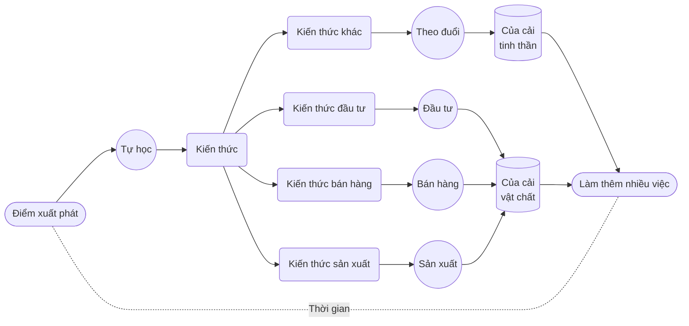

# 7. Tự khích lệ

Tự tạo động lực là điều tốt. Một khi khởi động, ta giống chiếc xe đang chạy. Gặp xóc hay khúc cua có thể phải chậm lại; gặp dốc phải tăng công suất; thậm chí có thể hỏng giữa đường, cần khởi động lại. Những việc ấy luôn cần chính ta thực hiện. Không phải không được nhờ bên ngoài, nhưng theo tác giả, tự làm luôn hiệu quả hơn.

Trước hết, ta cần liên tục củng cố động cơ để dễ **khởi động lại** khi **bất ngờ tắt máy**.

**Cách tích cực** là chủ động gắn nhiều **ý nghĩa** lớn hơn, ở nhiều tầng, cho mục tiêu, hành động và kết quả. **Cách tiêu cực**, theo tác giả, là huy động **nỗi sợ**. Ông khẳng định với não, nỗi sợ luôn là động lực tốt nhất, âm thầm tạo tác động lớn ở tầng tiềm thức.

Ta có thể làm một **phép tính giả định**.

Trong *Sự thật về của cải*, tôi viết:

> Mọi của cải trong đời, vật chất hay tinh thần, đều được đào lên từ **thời gian** của chính mình.

Nếu **thời gian là tư liệu sản xuất**, dùng nó làm gì đáng nhất?

Cuối cùng, chọn tới chọn lui chỉ còn **tự học**. Nhưng **luyện tiếng Anh** dường như không liên quan trực tiếp **sản xuất**, **bán hàng**, **đầu tư**, vậy **học làm gì**? Ta chưa nói kiếm tiền, hãy nói **tiết kiệm tiền** trước.

Xét tỷ lệ, cha mẹ tiêu đại đa số tiền cho con, nhất là **học**, một hiện tượng tác giả cho là phổ biến toàn thế giới. Ông cho rằng vượt *60%* tổng thu nhập cha mẹ không hiếm, lên tới *80%* cũng không lạ.

Khi nói **dành ít nhất một nghìn giờ chú ý trong một năm** để **luyện tiếng Anh**, cốt lõi không chỉ là tiếng Anh. Thực ra luyện ngôn ngữ hay kỹ năng khác theo cùng cách cũng vậy. Trong quá trình đó, thứ ta học, luyện và thấu hiểu nhiều hơn là **tự học**, là sự hình thành và phát triển **năng lực tự học**.

Nếu cha mẹ thực sự có năng lực tự học, con chỉ qua quan sát, nghe thấy cũng sẽ có năng lực tương đối mạnh hơn. Huống chi từ đầu cả nhà đã có thể cùng tập. Chỉ cần con có năng lực tự học nhất định, phần lớn tiền cha mẹ chi cho con sẽ được tiết kiệm; cha mẹ bớt tiền, con lại nhờ đó phát triển thêm năng lực.

Theo tác giả, một **tác dụng phụ**, hay **tác dụng tiêu cực**, của việc cha mẹ kiếm tiền cật lực để chi cho con là con liên tục **suy giảm trí lực**. Mọi năng lực vốn chỉ **phát triển** qua **gặp và giải quyết vấn đề**. Nhưng kết quả của đa số cha mẹ làm vậy là người gặp, giải quyết vấn đề luôn là cha mẹ, tuyệt đối không phải con. Những vấn đề con đáng ra gặp đều được cha mẹ dùng tiền giải quyết. **Giải quyết thật** hay **giả**, thường không biết, vì sự thật dễ bị che lấp.

Vấn đề vốn thuộc về con, vốn là cơ hội **phát triển năng lực**. Kết quả là cơ hội bị tước, vấn đề thực ra chưa giải quyết nhưng lại tưởng xong. Vấn đề và hiểu lầm tích lũy, cả ảo tưởng cũng lớn lên, cuối cùng thần tiên cũng chịu. Tác giả khẳng định đây không phải dọa suông: hậu quả xấu sẽ hiện và bùng phát với đại đa số quanh tuổi 15, rồi không kiểm soát nổi.

Hãy tính đơn giản. Giả sử thu nhập năm của hai vợ chồng là 300.000 nhân dân tệ. Qua 12 năm tiểu học, trung học cơ sở và trung học phổ thông, lấy 60% thì bình quân mỗi năm chi cho con khoảng 180.000. Trong đó khoảng 60% cho **học thêm ngoài trường**, tức 108.000 mỗi năm, tổng 12 năm là *1.296.000*. Tác giả lý giải chi phí giáo dục cơ bản không quá cao vì cho rằng khắp thế giới phần lớn thời gian trước khi hết phổ thông đều là giáo dục bắt buộc. Nếu con thực sự tự học được, chưa nói tiết kiệm tất cả, ít nhất tiết kiệm *80%*, tức *1.036.800 nhân dân tệ*.

Còn **chi phí đầu tư** của bạn? Chủ yếu không phải tiền, cũng không chỉ thời gian, mà là **sự chú ý**, thứ tác giả xem là chỉ tốn thời gian, không tốn tiền. **Ít nhất một nghìn giờ chú ý trong một năm**, chỉ cần một trong hai vợ chồng làm. Như vậy gần như không bỏ tiền, còn lợi ích tương đối có thể là *1.036.800*, lại như thể **kiếm hoặc tích cóp trong một năm**. Đó là khoản hai vợ chồng thu nhập năm 300.000, không ăn uống trong ba năm cũng chưa kiếm được, càng chưa để dành được. Đi làm hay khởi nghiệp, lợi suất như vậy rất đáng kinh ngạc? Không tính không biết, tính mới giật mình.

Cuối cùng, **lợi ích đầu tư** không chỉ đơn giản là **một năm tạo ra một triệu**. Bạn thành **người dùng hai ngôn ngữ**, thậm chí tiếng Anh thành ngôn ngữ thứ nhất. Bạn, con và cả bạn đời đều mở mang, tận mắt thấy điều tác giả gọi là sự thật và tác dụng rèn não. Bạn có năng lực tự học thực sự; họ cũng âm thầm vượt ngưỡng lớn nhất.

Nếu con chịu ảnh hưởng từ bạn, mà nếu thực sự làm thì theo tác giả con tất yếu chịu ảnh hưởng toàn diện, con cũng thành **người đa ngữ**, ít nhất **song ngữ**. Tác giả khẳng định vô số nghiên cứu cho thấy người đa ngữ có năng lực suy nghĩ, học, giải quyết vấn đề, tổ chức, quản lý mạnh hơn, thậm chí giảm nhiều nguy cơ sa sút trí tuệ khi già. Về cấu trúc não, ông nói chất xám có mật độ, thể tích lớn hơn, chất trắng phủ diện tích rộng hơn.

Quan trọng hơn, tác giả khẳng định vô số khảo sát cho thấy thu nhập người đa ngữ cao hơn người đơn ngữ ít nhất *30%* suốt đời. Hãy ước tính thu nhập cả đời của con, nhân 30%: đó là tiền bạn có thể kiếm thêm cho con bằng **một nghìn giờ chú ý trong một năm**. Nếu sinh thêm vài con thì tính tiếp xem?

Theo tác giả, dùng tiền kích thích mình luôn khá hiệu quả. Buồn cười là cái gọi là **dùng tiền kích thích mình** chỉ là **làm phép tính giả định**.

Không chỉ tiền, còn nhiều thứ. Chẳng hạn một năm nỗ lực chắc chắn mang lại **sự tôn trọng** mà tiền không mua được. Con người là vậy: điều mình không làm được mà người khác làm được thì chỉ còn tôn trọng. Người ngoài chưa bàn, được bạn đời tôn trọng quan trọng vì giúp vợ chồng gần gũi; được con tôn trọng còn quan trọng hơn. Theo tác giả, nếu cha mẹ **giành được sự tôn trọng bằng hành động**, con không có cái gọi là **nổi loạn**. Ông xem mọi nổi loạn là đủ dạng biểu hiện trên nền cha mẹ không đáng được con tôn trọng. **Làm một năm đổi lấy sự tôn trọng cả đời của con**, có đáng không?

Nếu có kỹ năng nào đó giúp bạn **dễ vượt hơn 90% mọi người**, mà theo tác giả bí quyết chỉ là **một nghìn giờ chú ý trong một năm**, cả **phong thái** sẽ đổi. Trước hết do thái độ người khác, rồi do **tự tin**. Mấu chốt là tự tin không thể là tự phụ vì có thành tích chống lưng. Không có gì thực tế hỗ trợ, tự tin thật buồn cười; nhưng có nhiều kỹ năng, sao không tự tin từ trong ra ngoài? Có khi còn phải cố kín đáo để người khác thoải mái hơn. Vẻ điềm tĩnh, ánh mắt tập trung, cử động tự nhiên, thái độ ung dung đều tự xuất hiện, không diễn được. Bên ngoài ngày càng ít quan trọng, xây dựng vỏ não trở thành việc bạn thích nhất.

::: warning Ghi chú biên tập về đoạn tự đe dọa trong nguyên tác
Đoạn tiếp theo được giữ để phản ánh đầy đủ phương pháp tác giả đã đề xuất. **Bản Việt hóa không khuyến nghị dùng lời đe dọa cái chết hoặc tự hạ thấp bản thân làm động lực học.** Không có căn cứ trong bài để coi cách này là phương pháp tốt nhất cho não. Với mục tiêu học tiếng Anh, có thể dùng lời nhắc như “Hôm nay luyện một việc nhỏ, ghi nhận tiến bộ và nghỉ khi cần”. Câu thay thế này là đề xuất biên tập, không phải lời nguyên tác.
:::

Tác giả tiếp tục đề nghị dùng **nỗi sợ** làm động lực nền tảng. Ông viết:

> Tìm mọi cách khiến mình tin rằng nếu luyện không tốt thì thà chết còn hơn.

Theo giải thích của ông, não sợ chết nhất; chỉ cần có đe dọa tử vong, nó sẽ liên tục nâng **ngưỡng an toàn** đến khi thoát đe dọa. Ông coi đây là cơ chế không thể thay đổi, nên thay vì bị giới hạn hãy tận dụng. Nguyên tác đề xuất điền khẩu hiệu **“Không luyện tốt ____ thì phải chết!”**, in ra để nơi thấy ngay lúc mở mắt mỗi ngày, thậm chí in nhiều bản hoặc dùng làm hình nền [điện thoại](/images/iPhone-wp.png) và [đồng hồ](/images/iWatch-wp.png). Tác giả kết rằng não dễ bị lừa: lặp đủ nhiều thì nó chỉ còn cách tin.

Ngoài củng cố động cơ, ta còn cần thường xuyên **tự khích lệ**, không thể cứ chờ người khác, đúng không? Theo tác giả, cách tự khích lệ tốt nhất có lẽ ngoài dự đoán: **bằng mọi cách khích lệ người khác**, rất đơn giản.

Ai cũng cần khích lệ, nhưng khích lệ luôn khan hiếm, nên theo tác giả, bất cứ lúc nào, bằng mọi cách khích lệ người khác đều đúng, càng nhiều càng tốt. Bản chất là thúc đẩy người được khích lệ hoàn thành mục tiêu họ **không tin** hoặc **không dám tin**. Khích lệ một lần, khi chưa làm được, họ vẫn nghi ngờ khả năng, điều tác giả coi là lý do căn bản khiến đa số lời khích lệ không có tác dụng. Nhưng liên tục khích lệ người khác khiến **não của chính mình tin trước sau đủ số lần lặp**. Vậy người hưởng lợi lớn nhất là ai? Hóa ra là chính mình.

::: info Ghi chú biên tập cho người học Việt Nam
Phép tính tiền giữ đầy đủ giả định và đơn vị nhân dân tệ của nguyên tác: 300.000 × 60% × 60% × 12 × 80% = 1.036.800. Nó không chứng minh khoản tiết kiệm thật, không phải lợi nhuận nhận trong một năm, và không đại diện chi phí giáo dục Việt Nam. Tỷ lệ chi cho con, học thêm, mức tiết kiệm 80% cùng khẳng định thu nhập suốt đời tăng tối thiểu 30% không có nguồn khảo sát cụ thể kèm theo. Không dùng chúng để quyết định chi tiêu hoặc sinh thêm con.

Các kết luận chi tiền cho con làm giảm trí lực, hậu quả tất yếu ở tuổi 15, một năm học đổi lấy tôn trọng cả đời hoặc mọi nổi loạn đều do cha mẹ không đáng tôn trọng là đánh giá của tác giả, không phải kết luận tâm lý học được chứng minh trong bài. Một nghìn giờ cũng không bảo đảm vượt 90% dân số. Mục tiêu của bản Việt hóa là hỗ trợ học tiếng Anh, không dùng thành tích học để định giá một người hoặc gia đình.

Các mô tả cấu trúc não cần đọc cùng [ghi chú về hình ảnh não](../in-the-brain/03-sports.md). Media khẩu hiệu gốc còn trong danh mục kiểm tra; giữ tham chiếu không có nghĩa nội dung ấy đã được chuyển thành học liệu khuyến nghị cho người Việt.

Cần phân biệt việc triệu chứng hoặc chẩn đoán sa sút trí tuệ xuất hiện trễ với giảm nguy cơ mắc bệnh. [NIA về song ngữ và dự trữ nhận thức](https://www.nia.nih.gov/research/dn/workshops/workshop-bilingualism-and-cognitive-reserve-and-resilience) nêu các gợi ý từ nghiên cứu hồi cứu cùng nhu cầu đo lường chặt chẽ và khảo sát nhiều nhóm hơn. Không coi học hai ngôn ngữ là bảo đảm phòng bệnh hoặc khiến mọi năng lực nhận thức đều cao hơn.

[Nghiên cứu của Azam, Chin và Prakash](https://www.iza.org/publications/dp/4802/the-returns-to-english-language-skills-in-india) dùng dữ liệu Ấn Độ năm 2005, ghi nhận chênh lệch lương giờ trung bình 34% ở nam nói tiếng Anh thành thạo và 13% ở nam nói được chút ít, khác nhau theo tuổi và học vấn. Kết quả ấy không chứng minh mọi người đa ngữ tăng thu nhập cả đời ít nhất 30%, cũng không chứng minh một nghìn giờ học của cha mẹ tạo ra khoản lợi đó cho con.
:::
