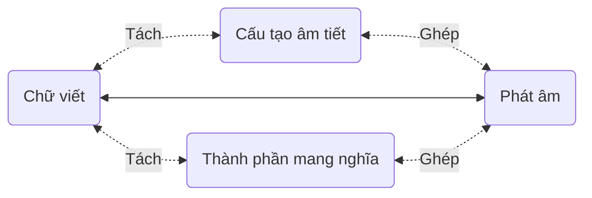
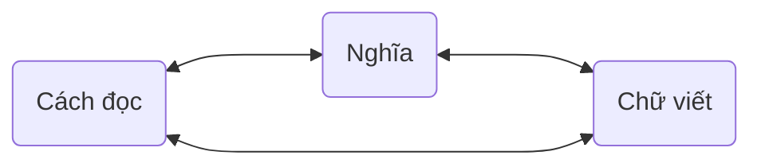

# 6.1. Ghi nhớ từ hiệu quả

Ở chương ba, *Tìm hiểu từng âm vị*, mỗi mục đều liệt kê “các cách viết thường gặp” tương ứng với âm. Tác giả xem đó là phương tiện hỗ trợ ghi nhớ hiệu quả nhất khi mở rộng vốn từ sau này.

Tác giả chia cách cấu tạo từ tiếng Anh thành hai hướng chính: liên hệ **chữ viết với âm** và liên hệ **thành phần với nghĩa**.

Tác giả dùng *apple* ˈæp.əl làm ví dụ liên hệ chữ và âm: từ có hai âm tiết, *app* tương ứng âm tiết thứ nhất ˈæp, *le* tương ứng âm tiết thứ hai əl. Khi nhớ, không đọc thuộc từng chữ cái “*a, p, p, l, e... apple!*”, mà liên hệ æ với *a*, p với hai chữ *pp*, rồi *le* với əl. Cách viết này thường gặp, như *double*, *impossible*.

Trong *impossible* ɪmˈpɑː.sə.bəl có thành phần mang nghĩa: tiền tố *im-* cũng như *un-*, *ir-* thường biểu thị phủ định; *possible* là “có thể”, nên *impossible* là “không thể”. Tác giả tiếp tục xem *possible* ˈpɑː.sə.bəl như từ có thể ghi nhớ hoàn toàn qua liên hệ chữ và âm: *po* đọc ˈpɑː, hoặc ˈpɑː viết thành *po*, *ssi* ⭤ sə, *ble* ⭤ bəl. Theo ông, không nên chỉ học chuỗi “*p, o, s, s, i, b, l, e... possible!*”. Ghi cứng bảy chữ cái theo thứ tự rõ ràng khó hơn “chỉ nhớ ba âm tiết”; điểm cần chú ý thêm chỉ là *ss* (*double s*). Nguyên tác đếm nhầm: *possible* gồm tám chữ cái. Đây là cách phân tích để học của tác giả, không có nghĩa các từ không còn cấu tạo hình thái khác.

Nhiều từ thường dùng là **từ ghép** (*compound words*), với các thành phần mang nghĩa, như *classroom* ˈklæs.ruːm , *doorbell* ˈdɔːr.bel , *handwriting* ˈhændˌraɪ.t̬ɪŋ , *sunshine* ˈsʌn.ʃaɪn , *upstairs* ʌpˈsterz .

Tác giả cho rằng gốc từ và phụ tố, nhất là những thành phần từ tiếng Latinh, chưa có nhiều ích lợi thực tế khi vốn từ còn thấp. Đến một mức nhất định, chẳng hạn hơn 5.000 từ, trên nền tảng vững đó, tìm hiểu thêm gốc từ và phụ tố sẽ giúp mở rộng vốn từ nhanh và nhiều. Đây là mốc gợi ý của tác giả, không phải ngưỡng bắt buộc cho người học.

Ví dụ *ichthyosaur* ˈɪk.θiə.sɔːr, nhìn đã biết không phải từ thường gặp, được tác giả xem là khá đơn giản. Về chữ và âm, ˈɪk.θi.ə.sɔːr được Cambridge chia thành bốn âm tiết; nhưng ông cảm thấy âm tiết thứ hai và ba có thể gộp lại thành ˈɪk.θiə.sɔːr: *ich* ⭤ ˈɪk, *thyo* ⭤ θiə, *saur* ⭤ sɔːr. Về nghĩa, *ichthyo-* là “liên quan đến cá”; còn *-saur* là gì? Tác giả liên hệ phần này với tên các loài khủng long, rồi giải thích cả từ là “ngư long”, một loài bò sát biển cổ. Cách gộp âm tiết là cảm nhận của tác giả; hãy theo bản nghe của giọng bạn luyện.

Theo tác giả, cách ghi nhớ từ mộc mạc và hiệu quả nhất là gắn chữ viết, cách đọc và nghĩa với nhau, vốn chính là cấu trúc và ý nghĩa của chữ viết.

Ngoài cách đó, tác giả khẳng định mọi “phương pháp” khác không những vô hiệu mà chỉ gây tác dụng phụ, hại nhiều hơn lợi. Ông lấy ví dụ ghi nhớ bằng âm gần giống hoặc mẹo gây hứng thú, cho rằng chúng trái với cơ chế cơ bản của não khi xử lý ngôn ngữ và chữ viết, không thể tăng hiệu quả mà chỉ thêm gánh nặng không cần thiết, dù đôi khi thấy thú vị. Đây là đánh giá của nguyên tác; ghi chú biên tập bên dưới phân biệt lời khẳng định tuyệt đối với bằng chứng về học từ.

Tác giả cho rằng nguyên nhân thất bại rất đơn giản: mọi người luôn muốn “đỡ công hơn”, ngồi chỉ nhìn mà không đọc thành tiếng hay viết, nên thực ra cũng ít vận dụng đầu óc hơn. Ông ví việc dùng một cơ quan với dùng nhiều cơ quan cùng lúc là khác nhau: cách đầu có vẻ nhàn hơn nhưng vì huy động trí lực quá ít, hiệu quả gần như bằng không. Đây là cách diễn giải của tác giả, không phải phép đo hoạt động não.

Tác giả khẳng định tám, chín trong mười người học ngoại ngữ thất bại. Ông kể nhiều người từng hỏi giáo viên: “Học từ mà không nhớ phát âm được không?”, “Học từ mà không nhớ cách viết được không?”. Ông gọi đó là câu hỏi cực kỳ vô lý, không nhằm tìm câu trả lời mà nhằm xin “chứng nhận được lười”, một sự bảo chứng cho việc ngại cố gắng. Ông còn phê phán một số lượng và tỷ lệ đáng kể giáo viên trả lời “được” để được học sinh yêu thích hơn, từ đó tăng thu nhập. Đây là nhận định và phê bình của nguyên tác, không phải tỷ lệ khảo sát hay đánh giá giáo viên Việt Nam.

Lúc đầu, ghi nhớ từ dù thế nào cũng tốn sức. Tác giả đưa lời khuyên thẳng thắn: ai không tin thì chịu thiệt, tùy bạn tin hay không:

> Đừng thử dùng bất kỳ cách nào để tăng tốc.

Ông khẳng định không ai có thể tăng tốc bằng bất kỳ thủ thuật nào; cách duy nhất thực sự tăng tốc là **tích lũy**. Đây là lời nhấn mạnh của nguyên tác, không loại trừ việc chọn phương pháp học có bằng chứng.

Theo tác giả, mở rộng vốn từ là quá trình có **gia tốc**, có thể ngày càng nhanh. Ban đầu tốc độ thấp, gia tốc bằng không nên rất nặng nhọc. Nhưng các từ liên hệ với nhau; một từ mới càng liên hệ với nhiều từ đã biết, não càng dễ nhớ. Vốn từ càng lớn, khả năng liên hệ càng nhiều nên việc học càng dễ. Ông cho rằng khi có khoảng 3.000 đến 5.000 từ, nhiều từ mới gần như chỉ cần nhìn một lần đã nhớ được chữ viết, phát âm, nghĩa và thậm chí cách dùng. Ông ví toàn bộ quá trình như đường cong **lãi kép** với **gia tốc ngày càng lớn**. Những ngưỡng và hình dung toán học này là cách trình bày của nguyên tác, không phải cam kết kết quả cá nhân.

Tác giả còn đưa một mẹo: **học thuộc trực tiếp câu ví dụ**. Theo ông, đọc thành tiếng câu ví dụ nhiều lần dễ hơn nhiều cho não so với dồn sức vào một từ hoặc cụm từ. Với ngôn ngữ, ông cho rằng càng làm nhiều, não càng thấy nhẹ; làm ít để “đỡ công” dần tạo ra rào cản không thể vượt.

Từ đó, tác giả xem **đọc kỹ** là cách đáng tin nhất để tăng vốn từ. Chọn vài sách hư cấu và vài sách phi hư cấu mà mình thực sự yêu thích; gặp từ mới thì tra, lần lượt xử lý, và đọc mỗi sách nhiều lần, nên cần chọn sách mình thật sự mê. Ông cho rằng càng đọc, vốn từ càng lớn, trở ngại cú pháp biến mất, khả năng hiểu tăng và tốc độ đọc nhanh lên. Ông khẳng định mọi ngôn ngữ, kể cả tiếng mẹ đẻ, đều được rèn theo cách ấy. Cuối đoạn, tác giả phê phán gay gắt rằng môn ngữ văn và giáo viên chưa từng giúp ích, thậm chí cho rằng tác dụng duy nhất của họ là đặt ra những trở ngại kỳ lạ trong kỳ thi cho phần lớn học sinh. Đây là quan điểm của nguyên tác, không phải nhận xét của bản Việt hóa về nhà trường hoặc giáo viên.

::: info Ghi chú biên tập: kết hợp phương pháp có bằng chứng
Liên hệ chữ viết, phát âm và nghĩa là hữu ích, nhưng không có cơ sở để kết luận mọi phương pháp khác đều vô dụng. Ôn cách quãng và tự nhớ lại trước khi xem đáp án có bằng chứng hỗ trợ ghi nhớ lâu dài. Có thể kết hợp chúng với câu ví dụ, nghe và phát âm; không xem một lần nhớ đúng là đã học xong.

[Hướng dẫn của Institute of Education Sciences](https://ies.ed.gov/ncee/wwc/PracticeGuide/1) khuyến nghị học cách quãng và truy hồi chủ động. [Thí nghiệm Karpicke và Roediger với từ vựng ngoại ngữ](https://learninglab.psych.purdue.edu/downloads/2008/2008_Karpicke_Roediger_Science.pdf) cho thấy tiếp tục tự kiểm tra sau lần nhớ đúng đầu tiên giúp khả năng nhớ lại sau một tuần. Những kết quả này không đảm bảo mọi người đạt cùng tốc độ hoặc nhớ ngay sau một lần nhìn.
:::
