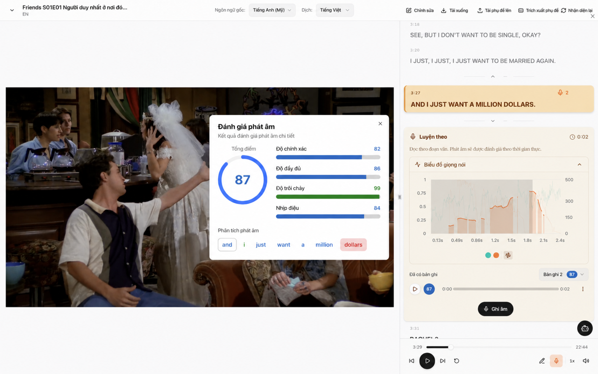
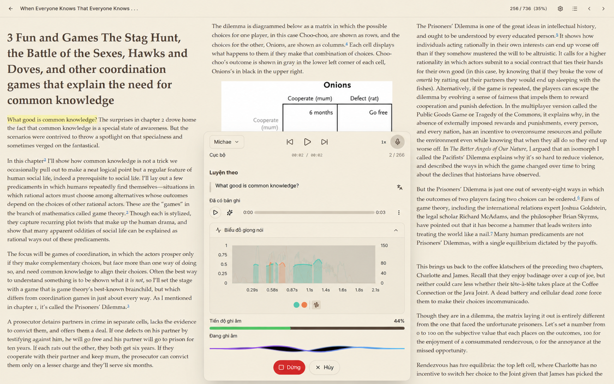
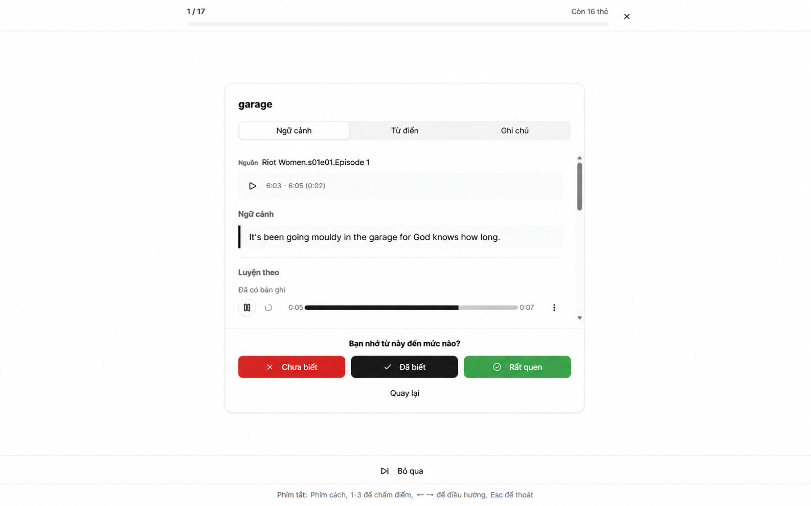
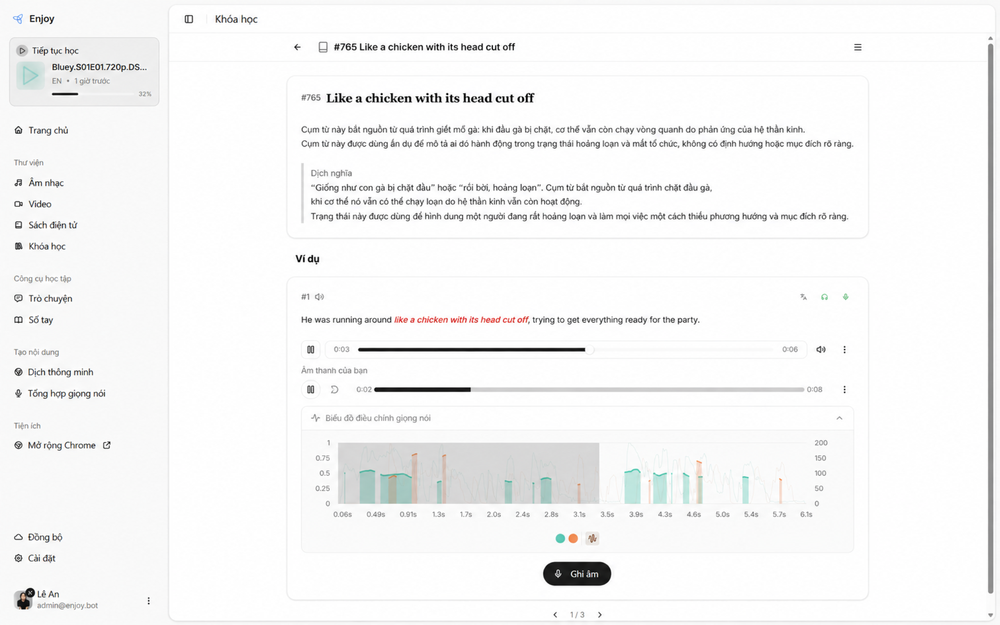

  

<h3 align="center">
AI là người thầy ngoại ngữ hàng đầu hiện nay; Enjoy đồng hành như một trợ giảng cho AI.
</h3>

---

## Bản dành cho người Việt học tiếng Anh

Repo này đang được Việt hóa: giao diện và hướng dẫn bằng tiếng Việt, ngôn ngữ học mặc định là tiếng Anh. Các ví dụ tiếng Anh và phiên âm IPA được giữ để luyện tập. Sách và tài liệu được dịch từ nguyên tác; nội dung bổ sung cho người Việt được ghi rõ để phân biệt với lời tác giả.

Theo dõi phạm vi đã kiểm tra và phần còn lại trong [tiến độ Việt hóa](./execution-notes.md). Các website, bản phát hành và tiện ích bên ngoài dưới đây thuộc dự án gốc; chúng không tự nhận các thay đổi tiếng Việt trong repo này.

## Ứng dụng học tập local

Ứng dụng máy tính trong repo này sử dụng hồ sơ và thư viện trên máy. Các chức năng AI dùng nhà cung cấp do bạn cấu hình, không cần tài khoản hoặc số dư Enjoy. Xem [hướng dẫn cài đặt](./1000-hours/enjoy-app/install.md) và [cấu hình dịch vụ](./1000-hours/enjoy-app/settings.md).

## Tiện ích trình duyệt

Tiện ích Enjoy của dự án gốc hỗ trợ YouTube và Netflix. Bạn có thể xem và cài đặt tại [Chrome Web Store](https://chromewebstore.google.com/detail/enjoy-echo/hiijpdndbjfnffibdhajdanjekbnalob).

---

## Phiên bản máy tính

Mã nguồn Electron nằm trong thư mục [enjoy](./enjoy/README.md). Mỗi khả năng AI cần provider tương ứng đã cấu hình; thư viện và nội dung đã lưu vẫn mở được khi offline. Bản build local và bản phát hành công khai là hai trạng thái riêng, xem [hướng dẫn chạy mã nguồn](./1000-hours/enjoy-app/install.md#vietnamese-source-build).

## Tài liệu liên quan

### Thiết lập dịch vụ AI cho Enjoy

- [Azure API key, deployment và các model](./docs/azure-api-key-models-setup.vi.md)
- [Vertex AI Express](./docs/vertex-express-setup.vi.md)

### Một nghìn giờ (2024)

- [Giới thiệu ngắn](./1000-hours/intro.md)
- [Nhiệm vụ luyện tập](./1000-hours/training-tasks/kick-off.md)
- [Rèn luyện phát âm](./1000-hours/sounds-of-american-english/0-intro.md)
- [Bên trong não bộ](./1000-hours/in-the-brain/01-inifinite.md)
- [Tự luyện tập](./1000-hours/self-training/00-intro.md)

### Ai cũng có thể sử dụng tiếng Anh (2010)

- [Giới thiệu](./book/README.md)
- [Chương 1: Điểm xuất phát](./book/chapter1.md)
- [Chương 2: Nói](./book/chapter2.md)
- [Chương 3: Phát âm](./book/chapter3.md)
- [Chương 4: Đọc thành tiếng](./book/chapter4.md)
- [Chương 5: Từ điển](./book/chapter5.md)
- [Chương 6: Ngữ pháp](./book/chapter6.md)
- [Chương 7: Đọc kỹ](./book/chapter7.md)
- [Chương 8: Lời nhắn nhủ](./book/chapter8.md)
- [Lời kết](./book/end.md)

## Câu hỏi thường gặp

Xem [tài liệu câu hỏi thường gặp](./1000-hours/enjoy-app/faq.md).
