# Chương 5. Từ điển

## 1. Cầm từ điển lên và tự bước đi

Tra từ điển, cũng như đọc thành tiếng, là một trong những cách trực tiếp và hiệu quả nhất để nâng cao khả năng đọc hiểu, theo tác giả.

Giả sử ta gặp một câu gồm 20 từ, trong đó có một từ mới. Lúc này nên tra từ điển, thay vì đoán bừa, dù đôi khi đoán đúng. Giả sử tra xong thấy từ ấy có ba nghĩa, nhiệm vụ trước mắt là gì? Ta phải hiểu ý của 19 từ đã biết, rồi mới xác định “trong ba nghĩa của từ mới, nghĩa nào đặt vào câu này mới phù hợp và chính xác?”. Tất nhiên, thường ta không may như vậy. Chẳng hạn có hai từ chưa biết; tra ra từ thứ nhất có ba nghĩa, từ thứ hai có bảy nghĩa, tức là phải chọn, và chỉ chọn, một trong 21 tổ hợp có thể để câu đang đọc có nghĩa thông suốt.

Đó chẳng phải quá trình “đọc hiểu” sao? Có cách nào rèn khả năng đọc hiểu tốt hơn thường xuyên tham gia chính quá trình ấy? Đôi khi tôi rất ngạc nhiên: vì sao nhiều người đến vậy, dường như ít nhất hơn 90%, bỏ không dùng những cách học mà tôi cho là hiệu quả nhất và không tốn tiền, đọc thành tiếng và tra từ điển, để hết lần này đến lần khác phí cả thời gian lẫn tiền bạc, rồi vẫn dứt khoát đăng ký thêm một khóa đào tạo khác? Không phải mọi khóa học đều hoàn toàn vô ích; chỉ là nhìn chung, theo tác giả, ngay cả khóa có ích cuối cùng cũng chỉ có tác dụng hạn chế.

> **Ghi chú biên tập cho người Việt:** Phép tính 3 × 7 = 21 minh họa việc phải chọn nghĩa theo ngữ cảnh, không yêu cầu người đọc thử máy móc mọi tổ hợp. Nhận xét “hơn 90%” và so sánh hiệu quả khóa học là lời ước đoán, đánh giá của tác giả. Khi đọc, có thể đoán có căn cứ rồi dùng từ điển kiểm tra nghĩa, từ loại, cách kết hợp và ví dụ. Tra từ và phản hồi của giáo viên có thể hỗ trợ nhau.

## 2. Không tra từ điển thì “chết”

Theo tác giả, mỗi cơ quan trong cơ thể đều ít nhiều có “khả năng tiến hóa”: chơi đàn lâu, ngón tay linh hoạt hơn; tập luyện lâu dài, chức năng tim phổi mạnh hơn; nói nhiều hơn người khác, lưỡi linh hoạt hơn… Trong các bộ phận ấy, ông cho rằng não có khả năng tiến hóa mạnh nhất vì thích nghi giỏi nhất. Nhưng chính vì thế, dư địa tiến hóa của não chưa chắc lớn nhất. Nghe có vẻ trái logic; hãy xem thích nghi quá mạnh thì có thể xảy ra chuyện gì.

> Trong rừng Amazon có một loài kỳ giông được các nhà khoa học đem ra “chơi”, vì nó thích nghi quá mạnh: đặt vào nơi không có ánh sáng, trong hai ngày nó có thể làm mắt thoái hóa; đưa trở lại chỗ có ánh sáng, trong hai ngày nó lại mọc mắt. Ném xuống nước, nó làm phổi thoái hóa và mọc mang; vớt lên cạn, nó làm mang thoái hóa và mọc phổi…

“Dùng thì phát triển, bỏ thì thoái hóa.” Theo câu chuyện của tác giả, loài kỳ giông ấy thích nghi mạnh đến mức hàng trăm triệu năm không hề tiến hóa, vì không cần: thay đổi môi trường chẳng đáng gì với nó. Nói hình tượng, não ta cũng thích nghi mạnh gần như vậy, nên sẽ “dùng thì phát triển, bỏ thì thoái hóa” nhanh nhất và đến mức cao nhất. Ông dùng điều này để giải thích vì sao nhiều người không tiến bộ mà vẫn không thấy có gì xấu: não nhanh chóng thích nghi với môi trường xung quanh lúc ấy, bất kể tốt hay xấu.

> **Ghi chú biên tập về thuật ngữ và câu chuyện sinh học:** Đoạn trên là lập luận của nguyên tác, không phải mô tả sinh học đã được kiểm chứng. Thay đổi kỹ năng ở một cá nhân qua luyện tập không đồng nghĩa với tiến hóa của quần thể qua các thế hệ; xem [UC Berkeley về nhầm lẫn giữa thay đổi cá nhân và tiến hóa](https://evolution.berkeley.edu/teach-evolution/misconceptions-about-evolution/). Câu chuyện kỳ giông chưa nêu loài hoặc nghiên cứu để kiểm tra những mốc “hai ngày”, việc đổi mắt, mang, phổi hay “hàng trăm triệu năm không tiến hóa”; không dùng nó làm bằng chứng rằng người học thụ động khiến não nhanh chóng thoái hóa.

Khác biệt lớn nhất giữa giáo viên và học sinh tiếng Anh có lẽ chỉ một điều, theo tác giả: giáo viên buộc phải tra từ điển, nếu có thêm thì là sách ngữ pháp và các tài liệu tham khảo tương tự, còn học sinh có lựa chọn khác ngoài tra cứu: đi học đủ loại khóa. Giáo viên làm gì trong giờ tiếng Anh? Thường chỉ giảng lại những từ, cụm từ đã tra tối qua và những câu mình hiểu ra sau khi tra từ điển, tài liệu khác rồi suy nghĩ. Học sinh thì ngồi dưới nghe. Họ có nghe, nhưng về bản chất chưa tham gia quá trình đọc hiểu, theo ông. Quá trình ấy phải có bực bội, lạc lối, bất lực, hoảng hốt, những điều ai cũng ghét, rồi mới đến khoảnh khắc bừng hiểu mà ai cũng muốn có ngay. Vì vậy, tác giả cho rằng đa số học sinh căn bản không động não, cùng lắm chỉ tưởng đã hiểu. Thực ra, nếu thiếu hai cảnh giới trước làm nền, dù “bỗng ngoảnh đầu nhìn lại” cũng chẳng thấy “người ấy đứng nơi đèn đóm thưa dần”, theo hình ảnh thơ ông dùng.

Vì thế, theo cách phê bình của tác giả, nhiều khóa đào tạo chỉ diễn ra thế này: não giáo viên tiến hóa nhanh vì liên tục được dùng, đồng thời giáo viên còn kiếm tiền; não học sinh thoái hóa nhanh vì không dùng, trong khi họ lại một lần nữa mất tiền. Chẳng ai cố ý cả. Đây là lý do quan trọng khiến tôi luôn bảo học sinh: “Các bạn phải sớm thoát khỏi sự lệ thuộc vào giáo viên.” Bạn phải trở thành người thầy sáng suốt của chính mình; nếu không, hãy làm kỳ giông cả đời, biết đâu kiếp sau vẫn vậy. Tác giả lý giải rằng IQ chưa chắc di truyền nhưng thói quen gần như chắc chắn được thế hệ sau thừa hưởng. Đối với con người,

> **Ghi chú biên tập:** Cụm “Đối với con người,” kết thúc dang dở ngay trong nguồn, được giữ lại để không tự viết tiếp thay tác giả. Các cách nói “tiến hóa”, “thoái hóa”, “làm kỳ giông” là lối phê bình cường điệu. Tự tra cứu và chủ động suy nghĩ có ích, nhưng nghe giảng không mặc nhiên là không suy nghĩ; cũng không thể từ đây kết luận về IQ, di truyền hay mọi thói quen của thế hệ sau. Hình ảnh thơ nói về khoảnh khắc tìm thấy sau quá trình tìm kiếm, không phải quy luật khoa học về cách học.

Thực ra, theo tác giả, không phải suốt đời ngày nào cũng cần tra từ điển. Tra mãi rồi sẽ không cần tra nữa, vì đã giải quyết được phần lớn. Hồi nhỏ ở Trung Quốc, mọi người chẳng từng mang *Tân Hoa tự điển* đến trường sao? Sau đó là *Đại từ điển Hán ngữ hiện đại*. Có ai lên cấp hai rồi vẫn bắt buộc ngày ngày mang theo chúng đâu? Từ điển tiếng Anh cũng vậy, sớm muộn sẽ có ngày đặt nó lên giá sách. Chỉ là trong một thời gian trước mắt, hai hay ba năm chăng, cần luôn có nó bên cạnh.

> **Ghi chú biên tập cho người Việt:** Tên sách và thói quen đi học ở đây thuộc bối cảnh Trung Quốc của tác giả. Không có mốc hai hay ba năm chung để “hết cần từ điển”; người dùng thành thạo vẫn có thể tra nghĩa hiếm, cách kết hợp, phát âm hoặc thuật ngữ mới.

## 3. Thêm một chút cẩn thận và kiên nhẫn đã có thể vượt lên

Tra từ điển không khó. Nhưng cẩn thận và kiên nhẫn thêm một chút lại chẳng dễ như tưởng tượng. Tôi có một câu ví dụ điển hình để minh họa, từng xuất hiện trong phần đọc của bài thi TOEFL:

> It was attempting to suggest that every disease and condition for which there had been no previous effective treatments might be responsive to vitamin therapies.

Tác giả nói ETS thực ra chưa bao giờ tự viết bài; câu này là một đoạn trong [*Orthomolecular therapy: Its history and applicability to psychiatric disorders*](http://www.springerlink.com/index/U084338376776778.pdf), đăng ở số 3 năm 1998 của tạp chí *Child Psychiatry and Human Development*. College Board, đơn vị thiết kế SAT, cũng vậy, theo ông: gần như mọi bài đọc SAT đều tìm được bản gốc trên Internet.

> **Ghi chú biên tập:** Đây là cách tác giả giới thiệu nguồn và bài thi ở thời điểm viết. [PubMed ghi bài báo xuất bản năm 1988, tập 18(3), trang 133–150](https://pubmed.ncbi.nlm.nih.gov/2898324/), không phải 1998. Chưa đối chiếu toàn văn bài báo để xác nhận câu English được trích chính xác từng chữ. Việc một câu được trích từ bài báo không tự chứng minh mọi bài thi đều dùng nguyên văn bài có sẵn, cũng không xác nhận hiệu quả của liệu pháp vitamin được nhắc trong câu. Câu được dùng ở đây để học cách chọn nghĩa từ, không làm hướng dẫn điều trị. Tên đơn vị “Colledge Board” trong nguồn được sửa lỗi chính tả thành “College Board”.

Có lẽ người đọc sẽ tra “attempting”, “responsive” hoặc “therapy”, nhưng trong số học sinh tôi gặp, gần như chẳng ai tra “condition” rốt cuộc phải mang nghĩa gì ở câu này. Họ không nghĩ đến việc tra vì “biết” từ ấy rồi: “condition: danh từ, điều kiện, tình hình”. Nhưng giả sử đã biết mọi từ khác và hiểu chính xác nghĩa từng từ trong câu, hiểu như vậy chẳng lẽ không thấy gượng sao?

Chẳng ai không biết “and” có nghĩa gì, dùng thế nào, phải không? Theo tác giả, hai phía của “and” thường phải thuộc cùng một phạm trù, đó là logic cơ bản. Trước “and” là “disease”, nghĩa là “bệnh”; vậy “every disease and condition” là “mỗi bệnh và điều kiện”, hay “mỗi bệnh và tình hình”? Cách nào cũng khó xuôi. Chỉ cần nghĩ thêm ở đây sẽ thấy có điều đáng hỏi, rồi mở từ điển tra “condition” vốn nên là việc tự nhiên.

Tra sẽ thấy “condition” còn có một nghĩa danh từ khác mà từ điển ghi là “bệnh, dùng trong khẩu ngữ”. Tra từ điển đồng nghĩa, tác giả giải thích tiếp, “disease” là từ thông dụng nhất để chỉ bệnh; còn “condition” hay dùng trong khẩu ngữ vì thường chỉ các bệnh không quá nghiêm trọng, dễ gặp hằng ngày nên được nhắc nhiều. Ông diễn giải “She had a condition this morning.” tương đương “Sáng nay cô ấy hơi khó chịu.” Vì thế, theo ông, “every disease and condition” tương đương “bất kể bệnh nặng hay nhẹ”.

> **Ghi chú biên tập về nghĩa cần kiểm tra:** Cách giải thích “condition” chỉ bệnh nhẹ hoặc chỉ dùng trong khẩu ngữ không nên được coi là quy tắc. Trong ngữ cảnh y khoa, [NCI định nghĩa “condition” có thể là tình trạng sức khỏe, bệnh hoặc rối loạn](https://www.cancer.gov/publications/dictionaries/cancer-terms/def/condition), không giới hạn bệnh nhẹ; câu “She had a condition this morning.” cũng không tự đủ ngữ cảnh để suy ra đúng mức độ “hơi khó chịu”. Giữ ví dụ và lời giải của nguồn để đối chiếu, nhưng không học thuộc phép thay thế “disease = nặng, condition = nhẹ”.

Một ví dụ rất điển hình khác là bản dịch có hàng nghìn [kết quả tìm kiếm](http://is.gd/6eL95) trên mạng tiếng Trung: “Rán miếng thịt bò không làm tổn hại phẩm giá của bạn.” Nguyên văn là: “Flipping burgers is not beneath your dignity. Your grandparents had a different word for burger flipping; they called it opportunity.” Tôi không hiểu người dịch và hàng nghìn người đăng lại bài ấy: chẳng lẽ họ không thấy hiểu như vậy vô lý đến mức nào sao? Thực tế nhiều người đúng là như vậy, chỉ lo đưa thông tin vào, không xử lý, thậm chí không biết mình hoàn toàn chưa xử lý. Họ đọc, có khi chẳng đọc hết, nhưng không cố hiểu, nên không hiểu, rồi đến cả việc mình chưa hiểu cũng không biết.

Tra từ điển sẽ thấy “[flip burgers](http://idioms.thefreedictionary.com/flip+burgers)” là một cụm từ, được giải thích: “to do work that does not pay well, esp. at a cheap restaurant. Instead of playing baseball, the boys might be flipping burgers and earning a little cash.” Vì vậy, tác giả đề nghị hiểu hoặc dịch câu ấy như sau: “Làm một công việc lương thấp hơn đôi chút không tổn hại phẩm giá của bạn. Ông bà bạn có cách gọi khác cho những việc như thế: họ gọi đó là cơ hội.”

Đoán nghĩa chỉ theo mặt chữ là trở ngại lớn nhất của đọc hiểu, theo tác giả; thậm chí có thể xem là một “condition” mà rồi một ngày sẽ thành “disease”. Ông cho rằng gốc rễ thứ nhất là lười, thứ hai là tự cho mình đúng, thứ ba là giới hạn tự đặt ra vì vừa lười vừa tự mãn, rồi cũng chính vì vậy mà khó vượt qua.

Những ví dụ tương tự rất nhiều. “Journeyman” từng bị đoán theo mặt chữ vô số lần trong thế giới tiếng Trung. Nhiều năm trước có trò chơi nhập vai nổi tiếng tên *Journeyman*, được dịch thành “Du hiệp”. Album *Journeyman* của Eric Clapton, người hát “tears in heaven”, từng được một hãng đĩa Trung Quốc dịch thành “Người lặn lội đường xa”. Người dịch tưởng “journeyman” là “người đi bộ”; vì Eric Clapton trải qua hai năm ấy đầy trắc trở, họ dùng một từ giàu văn vẻ mang ý lặn lội khó nhọc, thay vì chỉ “du hành”. Thực ra, “journeyman” có nghĩa “người đã hết thời gian học việc, thợ lành nghề”. Loạt phim [*Journeyman (2007)*](http://www.imdb.com/title/tt0948538) do 20th Century Fox sản xuất được dịch thành “Người du hành thời gian” thì tạm chấp nhận được vì câu chuyện nói về du hành thời gian, nhưng tác giả vẫn cho là chưa thật phù hợp. Theo ông, tên phim là một lối chơi chữ: “journeyman” còn chỉ một người có kinh nghiệm, có năng lực nhưng bình thường, qua đó ngầm nói nhân vật chính có năng lực.

Năm 2008 còn có một phim được truyền xem khá nhiều trên Internet, [*Man from Earth (2007)*](http://www.imdb.com/title/tt0756683/), được dịch sang tiếng Trung thành “Người đàn ông này đến từ Trái Đất”. Tác giả cho đây cũng là hậu quả của không tra từ điển. Ông lập luận: nếu “Earth” là “Trái Đất” thì phía trước phải có mạo từ xác định “the”, nên ở đây chắc chắn không phải Trái Đất. Vậy là gì? Tra sẽ thấy “earth” còn nghĩa “hang, hốc”. Dựa vào cốt truyện, ông cho rằng “Man from Earth” đại khái tương đương “Cave Man”. Dịch cụ thể thế nào cũng được, theo ông, miễn không phải “Người đàn ông này đến từ Trái Đất”.

> **Ghi chú biên tập về lập luận dịch tên phim:** Đoạn trên giữ cách suy luận của nguồn để người đọc nhận diện và kiểm tra, không khẳng định đó là cách dịch đúng. [Collins ghi “Earth” chỉ Trái Đất thường đi với “the”, chứ không luôn bắt buộc](https://www.collinsdictionary.com/us/dictionary/english/earth); không thể chỉ vì thiếu mạo từ mà kết luận đó là hang hoặc người hang động. Một nghĩa có trong từ điển cũng chưa đủ chứng minh đúng nghĩa trong tên tác phẩm. Tương tự, nghĩa của “journeyman” không tự xác nhận dụng ý đặt tên của nhà làm phim. Khi luyện, hãy kết hợp từ điển với cả câu, cốt truyện và nguồn của tác phẩm, rồi phân biệt dữ kiện với suy đoán.

Ở lĩnh vực khác, dù sống hay học, muốn vượt lên khác thường quả không dễ. Nhưng trong học tiếng Anh, theo tác giả, chỉ cần chịu cầm từ điển, đôi lúc nghĩ thêm, nhận ra vấn đề và giải quyết, đã có thể vượt lên. Thở dài mà hỏi, biết tìm đâu ra việc tốt đến thế nữa?

## 4. Nắm vững cụm từ: điểm đáng dùng của Kingsoft PowerWord

Đơn vị cơ bản nhất của tiếng Trung là “chữ”; nhiều chữ kết hợp thành “từ”, theo cách trình bày của tác giả. Đơn vị cơ bản của tiếng Anh là **word**, được dịch sang tiếng Trung là “từ”; thứ do nhiều **word** tạo thành, **phrase**, vì thế đành dịch là “cụm từ”.

Khi dùng tiếng Trung, lúc đầu ta mang “tự điển”, tra chữ; học xong chữ Hán thông dụng thì dựa nhiều hơn vào “từ điển”, tra từ. Trong thế giới tiếng Trung đúng là “nhiều lắm cũng chỉ tra từ”: thành ngữ như “áp dụng máy móc”, tục ngữ như “chưa đến Hoàng Hà chưa chịu bỏ cuộc”, điển cố như “nước quá trong thì không có cá”, thuật ngữ như “chỉ số nồng độ ion hydro”, v.v. đều là các mục từ trong *Đại từ điển Hán ngữ hiện đại*.

Vì dịch “word” thành “từ” chứ không phải “chữ”, tác giả phê bình rằng học sinh Trung Quốc vô tình đồng nhất hai khái niệm vốn không tương đương: “chữ” của tiếng Anh, tức “word” theo cách ông gọi, và “từ” của tiếng Trung. Ông không rõ ai đã tự tin dịch như vậy, nhưng chắc người đó có ý tốt; đây lại là ví dụ rõ cho việc ý tốt chưa chắc đem lại kết quả tốt. Khi tra từ điển tiếng Anh, học sinh nghĩ “nhiều lắm cũng chỉ tra từ”, không để ý các “words” còn kết hợp thành “phrases”. Có lẽ vì thế họ hay bỏ qua *phrasal verb dictionary*, từ điển cụm động từ, hoặc *dictionary of idioms*, từ điển thành ngữ. Thực ra đa số từ điển tiếng Anh cũng giải thích đủ nhiều phrasal verbs và idioms, nhưng đa số học sinh cứ nghĩ biết từng từ trong câu là đủ, nên liên tục có lỗ hổng hiểu.

> **Ghi chú biên tập về đơn vị ngôn ngữ:** Đây là phép so sánh và lời phê bình của tác giả về cách gọi trong tiếng Trung. Không lấy “word = chữ” làm quy tắc cho tiếng Việt hoặc tiếng Anh. Chữ viết, từ, cụm từ, cụm động từ và thành ngữ là những loại đơn vị cần phân biệt theo ngữ cảnh. Điều thực hành hữu ích là kiểm tra cả cụm, thay vì cộng nghĩa từng từ rồi cho rằng đã hiểu.

Hãy xem đoạn sau, một câu khác trong bài TOEFL có câu hỏi từ vựng mà tác giả đang nói đến:

> But this increased protection is partially counteracted by the fact that mass roosts attract predators and are especially vulnerable if they are on the ground. Even those in trees can be attacked by birds of prey.

Học sinh có thể tra “counteracted”, rồi tiếc rằng sao từ ghép đơn giản thế mà không nhìn ra ngay; cũng tra “roost”, “predator”, “vulnerable” và “prey”. Sau đó họ thấy mình đã hết sức. Nhưng “birds of prey” không phải “chim bị săn bắt” như nhiều người tự nghĩ, mà là “chim ăn thịt, chim săn mồi”.

> Nếu bạn chưa thấy lời giải thích “birds of prey” ở mục trước mà nguyên tác gọi là “2.1. Đọc thành tiếng giúp nâng cao khả năng hiểu văn bản”, và trước đó thực sự chưa biết nghĩa cụm này, hãy tự hỏi: mình có chủ động tra từ điển không?

> **Ghi chú biên tập về dẫn chiếu:** Số “2.1” được giữ theo lời nguồn, nhưng phần tương ứng trong bố cục hiện tại nằm ở [chương 4, mục 2](./chapter4.md). Đây là lỗi dẫn chiếu của nguyên tác.

Xem thêm một đoạn, là câu trong bài luyện đọc thuộc khóa Online Course mà College Board cung cấp trên mạng khi tác giả viết:

> I would rather chance my personal vision of the truth striking home here and there in the chaos of publication that exists than attempt to filter it through a few sets of official, honorable, and public-spirited scrutinizers.

Một đồng nghiệp của tôi từng dịch câu này như sau:

> Tôi thà mạo hiểm, dùng cách nhìn riêng của mình về sự thật để quấy nhiễu các gia đình khắp nơi trong mớ hỗn độn của các tài liệu đã xuất bản, hơn là để một số ít quan chức đáng kính soi xét kỹ theo lòng công ích rồi lọc qua họ.

Đồng nghiệp ấy là người rất cẩn thận; các đồng nghiệp khác thậm chí cho rằng đôi lúc anh cẩn thận đến mức ám ảnh. Nhưng lần này anh vẫn sai. “Striking home here and there” trong câu chắc chắn không phải “quấy nhiễu các gia đình khắp nơi”, vì “strike home” là một cụm, mang nghĩa “đánh trúng chỗ cốt yếu”. Anh không tra nên mắc lỗi cơ bản.

Theo mô tả của tác giả khi viết, Kingsoft PowerWord, tên gốc *Kim Sơn Từ Bá*, có lẽ là một trong những phần mềm Trung Quốc được dùng nhiều nhất; đứng trên nó e chỉ có QQ của Tencent và vài công cụ tải như Xunlei. Nhắn tin tức thời ngoài QQ còn nhiều lựa chọn, như MSN và GTALK; tải tệp ngoài Xunlei còn FlashGet và Dianlei. Nhưng trong phần mềm từ điển Anh-Trung, suốt mười năm PowerWord hầu như luôn đứng đầu.

Phần mềm đã giúp vô số người này thực ra tệ hết sức, theo lời phê bình của tác giả. Mười năm liên tục ra phiên bản mới, ngoài [lỗi ngày càng nhiều](http://is.gd/6eM6S) thì tính năng mới chẳng đáng kể. Ngoài lỗi văn bản, còn nhiều điểm yếu:

* Phần lớn giọng đọc từ không phải người thật mà dùng engine giọng máy của Microsoft, lẫn lộn khó nghe, đúng là “tiếng ma”. Một số từ có người thật đọc, nhưng tác giả không biết tìm người ở đâu mà vừa không chuẩn vừa chẳng dễ nghe, nên ông cho là hoàn toàn vô dụng.
* Có ba kiểu phiên âm AHD, D.J. và K.K., nhưng theo tác giả sai khắp nơi nên căn bản không thể xem.
* Chứa vô số từ điển rác, theo lời tác giả. Chỉ có hai loại hữu ích: a) *Từ điển Anh-Hán giản minh*, nhiều từ nhất và giải nghĩa ngắn gọn; b) *The American Heritage Dictionary*, bản song giải. Ông nhấn mạnh phải dùng bản có cả giải thích tiếng Anh và tiếng Trung, vì phần nghĩa tiếng Trung trong bản chỉ có bản dịch Anh-Hán, không biết ai dịch, theo ông tệ đến mức không đọc nổi.

Dù PowerWord chưa bao giờ là sản phẩm khiến tác giả hài lòng, nó vẫn có điểm đáng dùng. Hữu ích nhất là “tự nhận diện cụm từ”, một tính năng mà chính Kingsoft không quảng bá rầm rộ. Xem hình dưới sẽ biết tính năng ấy dùng làm gì.

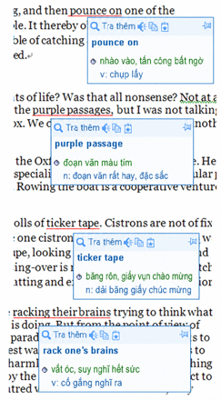

> **Ghi chú biên tập về phần mềm và hình:** Những so sánh thị phần, đánh giá giọng đọc và lỗi thuộc phiên bản mà tác giả dùng trong quá khứ, chưa phải đánh giá sản phẩm hiện hành. Ảnh gốc được giữ để đối chiếu và vẫn chờ Việt hóa riêng. Tên các loại từ điển Anh-Hán mô tả lựa chọn của nguồn, không phải yêu cầu người Việt học qua tiếng Trung.

Khi học tiếng Anh, một nỗi khổ thường gặp là “biết từng từ nhưng ghép lại không hiểu”. Còn đáng sợ hơn là “tưởng đã hiểu nhưng thực ra chưa hiểu”. Tôi hay nói “không biết chưa đáng sợ, đáng sợ là không biết mình không biết”, chính là tình huống này. Chẳng hạn “purple passage”: ai cũng biết “purple”, ai cũng biết “passage”. Không có một từ điển tra bằng chuột “thông minh” như PowerWord, với điều kiện đọc văn bản điện tử chứ không phải bản in, đa số có thể tự đánh lừa mình mà không biết đó là một cụm nghĩa “đoạn văn dùng lời lẽ hoa mỹ”, không phải “đoạn văn màu tím”.

Tôi nhớ lần đầu bị tính năng này của PowerWord làm chấn động là nhiều năm trước, khi vô tình đưa chuột qua một bài. Tôi biết “birds of prey” thực ra là “chim ăn thịt, chim săn mồi”, không phải “chim bị săn bắt” như từng tự nghĩ. Đó chính là đoạn trích đầu mục này. Sau này dùng làm ví dụ quan trọng khi dạy, tôi thấy đa số học sinh giống mình ngày trước. Khoảnh khắc ấy da đầu tê rần, sống lưng lạnh toát; từ đó tôi có thói quen thường rà chuột qua bài đã đọc, và những năm sau hưởng lợi vô kể.

## 5. Biến Word thành công cụ học tiếng Anh hữu ích

1. Chức năng tra từ bằng chuột của MS Word 2007
2. Bảng từ điển của MS Word 2007
3. Từ điển đồng nghĩa và gần nghĩa (*Thesaurus*) của MS Word 2007
4. Trợ lý tiếng Anh của MS Word 2007
5. Thiết lập chức năng đọc từ cho MS Word 2007
6. Dùng Word 2007 tạo danh sách từ vựng riêng từ bài đọc
7. Phụ lục: những macro tôi thường dùng

Theo tác giả, thời thắt nút dây để ghi nhớ, con người chưa khác nhiều so với động vật khác; chỉ khi có chữ viết, con người mới có thứ gọi là “kiến thức” có thể truyền qua các thế hệ, sửa đổi và tích lũy. Vì vậy, công cụ viết vô cùng quan trọng với loài người. Bút lông, bút lông ngỗng, bút chì, bút máy, bút bi, cho đến các bộ gõ và phần mềm xử lý văn bản ngày nay, trong đó có MS Word: mỗi thay đổi của công cụ viết đều đi cùng bước tiến lớn của con người, theo ông.

Với học sinh Trung Quốc, MS Word không chỉ là công cụ xử lý văn bản mà còn là công cụ học rất mạnh, tác giả nhận xét.

> **Ghi chú biên tập về bối cảnh:** Toàn bộ mục 5 mô tả Word 2007, dịch vụ tra Anh-Hán và macro VBA trong môi trường Windows của nguồn. [Office 2007 đã hết hỗ trợ ngày 10/10/2017](https://learn.microsoft.com/en-us/lifecycle/announcements/office-2007-end-of-support). Các tên menu được dịch sang tiếng Việt, kèm tên lệnh tiếng Anh khi cần đối chiếu; không có nghĩa giao diện Word 2007 gốc đã có bản Việt hóa như vậy. Hình chụp giao diện gốc vẫn chờ xử lý media. Không coi các bước này đã được chạy thành công trên Word hiện hành, macOS hay Word trên web. [UNESCO mô tả truyền thống truyền khẩu cũng truyền kiến thức, giá trị và ký ức cộng đồng](https://ich.unesco.org/en/oral-traditions-and-expressions-00053); lời khẳng định chỉ có chữ viết mới tạo được tri thức là cách nhấn mạnh của tác giả.

### 5.1. Chức năng tra từ bằng chuột của MS Word 2007

Theo hướng dẫn của tác giả, từ phiên bản 2007, MS Word tích hợp chức năng tra từ bằng chuột, dùng bản Anh-Hán của *The American Heritage Dictionary*, giải nghĩa chi tiết và nhiều ví dụ. Với cách cài đặt mặc định, chức năng này chưa bật, nên người dùng phải bật thủ công: trong menu chuột phải chọn “Dịch” (*Translate*), rồi chọn “Tiếng Trung (Trung Quốc)”.

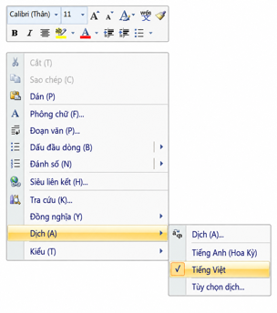

Sau đó chỉ cần đưa chuột đến một từ tiếng Anh và dừng lại, sẽ thấy phần giải nghĩa bằng tiếng Trung:

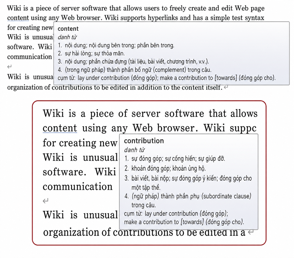

### 5.2. Bảng từ điển của MS Word 2007

Theo mô tả của nguồn, Word mặc định có thao tác “Alt + chuột trái”: giữ Alt rồi nhấp trái vào bất kỳ từ tiếng Anh nào, kết quả tra từ sẽ hiện ở thanh bên. Tác giả nói thao tác ấy cũng tương đương nhấp phải vào từ, rồi chọn “Dịch” → “Dịch” trong menu:

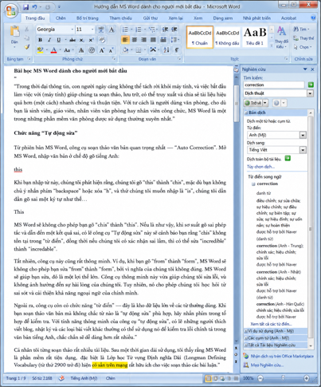

Nếu cài MS Office bản tiếng Trung, người dùng có thể cần bật thêm thiết lập để nhấp đúp chuột trái tự chọn cả từ tiếng Anh trong văn bản: “Tùy chọn Word” → “Nâng cao” → “Khi chọn, tự động chọn cả từ (W)”.

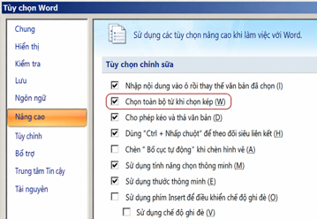

Từ điển này tra hai chiều Anh-Hán và Hán-Anh. Chọn một từ tiếng Trung trong tài liệu rồi dùng “Alt + chuột trái” ở vùng đã chọn, phía bên phải sẽ hiện phần giải nghĩa tiếng Anh của từ ấy, theo hướng dẫn gốc.

### 5.3. Từ điển đồng nghĩa và gần nghĩa của MS Word 2007

Nhấp phải vào một từ tiếng Anh sẽ thấy menu “Từ đồng nghĩa” (*Synonyms*). Chọn một mục con có thể thay từ trong tài liệu bằng từ đồng nghĩa đó:

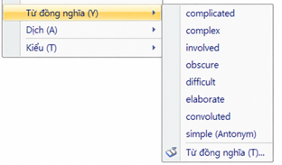

Muốn xem đầy đủ hơn nội dung từ điển đồng nghĩa và gần nghĩa, hãy đưa con trỏ đến một từ rồi nhấn “Shift + F7”; thanh bên phải sẽ hiện nội dung chi tiết của *Thesaurus*, theo nguồn.

Word còn có một hộp thoại tra từ đồng nghĩa và gần nghĩa rất tiện, nhưng vì mặc định không gán phím tắt để mở nên nhiều người chưa từng thấy:

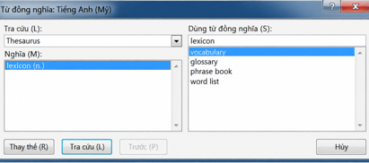

Cách gán phím tắt cho hộp thoại này theo Word 2007 trong nguồn:

* “Tùy chọn Word” → “Tùy chỉnh” → “Tùy chỉnh phím tắt”.
* Trong hộp thoại “Tùy chỉnh bàn phím”, ở “Chỉ định lệnh” → “Thể loại (C)”, chọn “Tất cả lệnh”.
* Ở “Lệnh (O)”, chọn `ToolsThesaurus`.
* Nhấp trái vào ô dưới “Nhấn phím tắt mới (N)”, nhấn đồng thời “Ctrl+Shift+F7”, rồi bấm nút “Chỉ định” ở góc dưới trái và đóng hộp thoại. Tất nhiên người đọc có thể chọn tổ hợp phím theo sở thích.

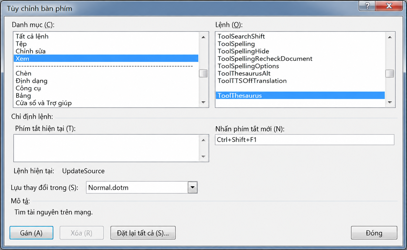

> **Ghi chú biên tập khi luyện viết:** Từ nằm trong Thesaurus không phải lúc nào cũng thay thế được trong cùng câu. Hãy kiểm tra nghĩa, sắc thái, từ loại, mẫu ngữ pháp và cách kết hợp trước khi thay.

### 5.4. Trợ lý tiếng Anh của MS Word 2007

Có lẽ người đọc đã nhận thấy công cụ từ điển tốt nhất ở thanh bên phải, theo tác giả, là “Trợ lý tiếng Anh”, thay vì “Từ điển song ngữ” do lệnh “Dịch” mở ra. Trợ lý này có gần như mọi thứ hữu ích: giải nghĩa tiếng Trung, tương đương từ điển Anh-Hán; giải nghĩa tiếng Anh, tương đương từ điển Anh-Anh; kết hợp thường dùng, tương đương từ điển kết hợp từ; và từ đồng nghĩa, tương đương Thesaurus. Làm sao mở trực tiếp công cụ ấy?

Cách rất đơn giản, giống phần gán phím tắt cho hộp thoại đồng nghĩa ở trên. Lần này gán cho lệnh `EngWritingAssistant`. Tác giả thường dùng “Alt+X”, tổ hợp mà ông nói chưa được định nghĩa trong MS Word.

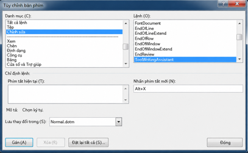

Ngoài ra, trợ lý tiếng Anh này phải có mạng mới dùng được, vì thực chất gửi truy vấn đến máy chủ Microsoft rồi nhận kết quả. Địa chỉ dịch vụ được nguồn ghi là:

> http://office.microsoft.com/Research/query.asmx

Người biết lập trình có thể xem mục “Basci Query Option” ở đó, tác giả gợi ý.

Trên máy một số người, Office có thể chưa cài dịch vụ trợ lý tiếng Anh, nên phải thêm thủ công. Theo hướng dẫn gốc, tại vị trí bất kỳ trong tài liệu dùng “Alt + chuột phải” để mở bảng công cụ bên phải, rồi bấm “Tùy chọn tra cứu” ở đáy bảng:

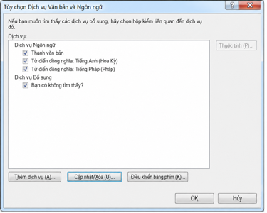

Bấm “Thêm dịch vụ (A)” ở góc dưới trái để mở hộp thoại sau:

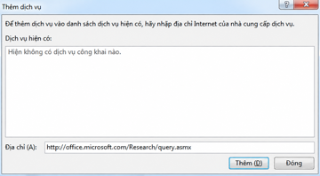

Sau đó nhập “http://office.microsoft.com/Research/query.asmx” vào ô sau “Địa chỉ (A)” ở đáy, rồi bấm “Thêm”:

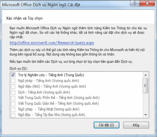

Bấm “Cài đặt (I)” trong hộp thoại là xong, theo nguồn.

> **Ghi chú biên tập về thao tác cũ:** Nguồn ghi “Alt + chuột phải” tại đây nhưng mục 5.2 ghi “Alt + chuột trái”; hai mô tả được giữ để thấy rõ khác biệt, chưa coi cả hai đều đúng trên mọi phiên bản. “Basci Query Option” cũng là cách viết trong nguồn. Địa chỉ dịch vụ được giữ làm tham chiếu lịch sử, chưa xác minh còn hoạt động. “Alt+X” không phải tổ hợp trống nói chung: [Microsoft hướng dẫn dùng Alt+X để chuyển mã Unicode thành ký tự](https://support.microsoft.com/en-us/word/insert-ascii-or-unicode-character-codes-in-word); cần kiểm tra lệnh đang được gán trước khi đổi phím tắt.

### 5.5. Thiết lập chức năng đọc từ cho MS Word 2007

Bước này phức tạp hơn một chút vì phải thêm macro cho Word. Theo nguồn, trước tiên đóng mọi tài liệu trong Word rồi nhấn “Alt+F11” để mở trình soạn VBA. Trong menu “Công cụ (T)” chọn “Tham chiếu (R)”; trong hộp thoại mở ra, tìm “Microsoft Speech Object Library” và đánh dấu ô phía trước:

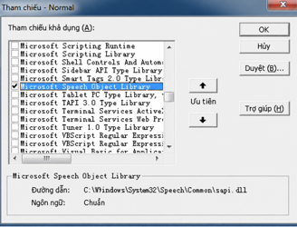

Sau đó, ở bảng Project bên trái của trình soạn VBA, nhấp đúp chọn “Normal → Microsoft Word Objects → ThisDocument”, rồi nhập đoạn VBA sau vào vùng soạn chính:

```vba
Sub SpeakText()
    On Error Resume Next
    Set speech = New SpVoice
    Selection.MoveLeft Unit:=wdWord, Count:=1
    Selection.MoveRight Unit:=wdWord, Count:=1, Extend:=wdExtend
    If Len(Selection.Text) > 1 Then
        speech.Speak Trim(Selection.Text), SVSFlagsAsync + SVSFPurgeBeforeSpeak
    End If
    Selection.MoveRight Unit:=wdWord, Count:=1
    Do
        DoEvents
    Loop Until speech.WaitUntilDone(10)
    Set speech = Nothing
End Sub
```

Nhấn “CTRL+S” để lưu, đóng trình soạn VBA, rồi gán phím tắt cho macro. Lựa chọn cá nhân của tác giả là “CTRL+SHIFT+S”.

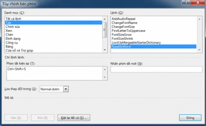

Theo tác giả, viết macro cho Word rất đơn giản, code VBA cũng tương đối dễ đọc. Ở phần cuối mục này, ông đính kèm những macro mình thường dùng.

> **Ghi chú biên tập về phạm vi code:** Đây là code gốc sử dụng thư viện giọng nói Windows và thao tác lựa chọn trong Word, không phải chức năng của Enjoy. Bản dịch giữ logic để tham khảo, chưa kiểm thử trên Word hiện hành. Phím “Ctrl+Shift+S” cũng có thể đã gán cho lệnh khác; không nên coi lựa chọn cá nhân này là phím mặc định để đọc từ.

### 5.6. Dùng Word 2007 tạo danh sách từ vựng từ bài đọc

MS Word còn có chức năng hữu ích là “Chọn văn bản có định dạng tương tự (S)” (*Select Text with Similar Formatting*). Khi đọc một bài tiếng Anh, ta có thể đánh dấu từ mới, rồi dùng chức năng này để sao chép riêng phần đã đánh dấu.

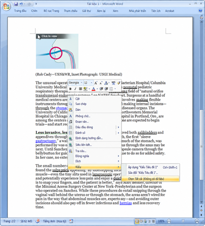

Sau khi chọn, nhấn “Ctrl+C”:

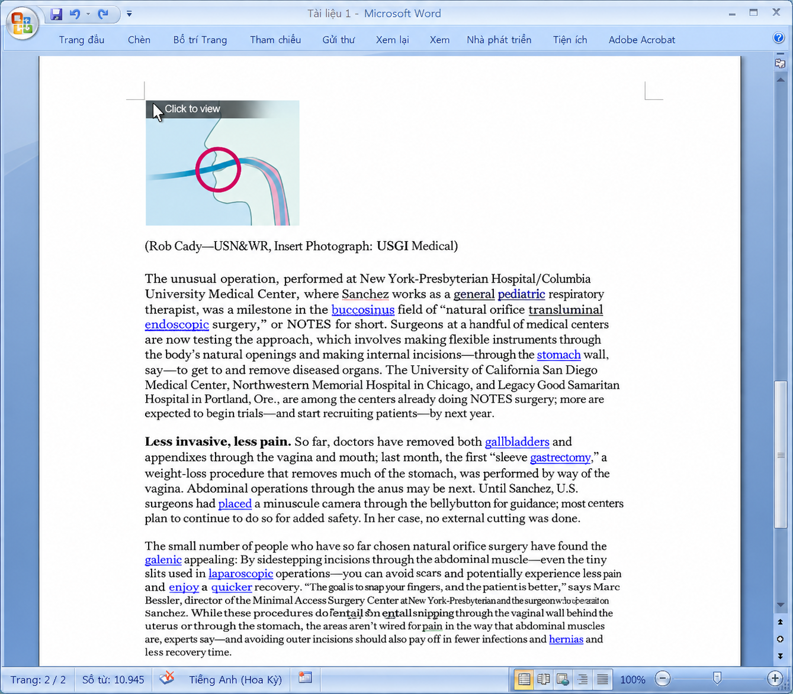

Tìm một chỗ khác và nhấn “Ctrl+V”, ta có danh sách sau:

* neonatal
* burgeoning
* endoscopic
* snaking
* gallbladders
* jabbed
* sales pitch
* laparoscopic
* lickety-split

Cũng có thể gán phím tắt cho lệnh này bằng cách đã nêu ở trên. Tên lệnh là `SelectSimilarFormatting`; tác giả thường gán “Alt+S”.

Nên dùng định dạng nào để đánh dấu trong khi đọc? Chữ đậm và chữ nghiêng có thể không tốt vì bài gốc có sẵn những phần như thế. Tô nền cũng không tốt, theo trải nghiệm của tác giả: không rõ vì sao chức năng chọn định dạng tương tự của Word lại không hỗ trợ kiểu ấy. Ông thường dùng gạch chân đôi, như hình trên. Lần này không phải tự gán phím vì Word đã có phím mặc định “Ctrl+Shift+D” cho gạch chân đôi.

Để xóa mọi dấu đã đánh, nhấp trái vào một từ được gạch chân đôi, nhấn “Alt+S” vừa gán, rồi nhấn “Ctrl+Shift+D”, theo hướng dẫn gốc.

> **Ghi chú biên tập cho người Việt:** Ý tưởng có thể giữ lại là tự thu thập từ hoặc cụm chưa chắc trong bài đang đọc. Với mỗi mục, lưu thêm câu gốc, nghĩa tiếng Việt phù hợp, phát âm và một câu tự viết sẽ giúp lần ôn sau có ngữ cảnh. Khả năng chọn định dạng, tô nền và các phím tắt cần kiểm tra ở phiên bản đang dùng, không suy từ Word 2007 ra mọi môi trường.

### 5.7. Phụ lục

Dưới đây là code những macro tác giả thường dùng. Chú thích tiếng Trung trong code được chuyển sang tiếng Anh; tên lệnh, thông báo và logic giữ nguyên.

```vba
'Install Merriam-Webster Collegiate Dictionary before using this macro.
Sub LookUpMerriamWebsterDictionary()
'MWDictionary Macro
     Selection.MoveLeft Unit:=wdWord, Count:=1
     Selection.MoveRight Unit:=wdWord, Count:=1, Extend:=wdExtend
     Selection.Copy
     Selection.MoveRight Unit:=wdWord, Count:=1
     If Tasks.Exists("Merriam-Webster") = True Then
        With Tasks("Merriam-Webster")
            .Activate
            .WindowState = wdWindowStateNormal
        End With
         SendKeys "%ep{ENTER}", 1
     Else
        Response = MsgBox("Task Merriam-Webster doesn't exist! Run the application before use this Macro, please.", vbExclamation, "WARNING!")
    End If
End Sub

Sub SpeakTheWord()
    On Error Resume Next
    Set speech = New SpVoice
    Selection.MoveLeft Unit:=wdWord, Count:=1
    Selection.MoveRight Unit:=wdWord, Count:=1, Extend:=wdExtend
    If Len(Selection.Text) > 1 Then 'speak selection
        speech.Speak Trim(Selection.Text), _
        SVSFlagsAsync + SVSFPurgeBeforeSpeak
    End If
    Selection.MoveRight Unit:=wdWord, Count:=1
    Do
        DoEvents
    Loop Until speech.WaitUntilDone(10)
    Set speech = Nothing
End Sub

' Add double quotation marks around the selected text.
Sub AddDoubleQuotationMarks()
    Selection.InsertBefore ("“")
    Selection.InsertAfter ("”")
    Selection.MoveRight Unit:=wdWord, Count:=1
End Sub

' Set the font of the selected text.
Sub ChangeFontNameTo()
    Selection.Font.Name = "Georgia"
End Sub

' Set the font size of the selected text.
Sub ChangeFontSizeTo()
    Selection.Font.Size = 28
End Sub

' Increase the font size of the selected text.
Sub FontSizeGrow()
    Selection.Font.Grow
End Sub

' Decrease the font size of the selected text.
Sub FontSizeShrink()
    Selection.Font.Shrink
End Sub

' Capitalize the first letter of the word at the cursor.
Sub FirstLetterToUppercase()
    Selection.MoveLeft Unit:=wdWord, Count:=1
    Selection.MoveRight Unit:=wdCharacter, Count:=1, Extend:=wdExtend
    Selection.Text = UCase(Selection.Text)
    Selection.MoveRight Unit:=wdWord, Count:=1
End Sub
```

## 6. Về từ điển Merriam-Webster

Ở Mỹ có nhiều loại từ điển mang tên Webster, chẳng hạn Random House có *Random House Webster Unabridged Dictionary*. Khi học sinh Trung Quốc thường nhắc “từ điển Webster”, họ muốn nói đến *Merriam-Webster Collegiate Dictionary and Thesaurus*, theo nguồn.


Uy tín của Merriam-Webster cơ bản không cần nghi ngờ, tác giả nhận xét. Thực ra có nhiều từ điển uy tín tương đương, như Oxford, Cambridge, thậm chí của Microsoft. Nhưng điều học sinh Trung Quốc thường được nghe, rằng “từ vựng GRE chủ yếu dựa trên từ điển Merriam-Webster Collegiate của Mỹ; thống kê so sánh cho thấy phần lớn cách dùng cụm từ trong câu hỏi trái nghĩa GRE là nguyên văn từ Merriam-Webster”, về cơ bản là lời sai truyền nhau, theo ông. Trước hết, câu hỏi loại suy và trái nghĩa GRE ngày trước, kèm lời tác giả nói bài GRE ở thời điểm viết đã bỏ các câu hỏi thuần túy về từ vựng, gần như không hỏi “cách dùng cụm từ”. Thứ hai, khi thiết kế bài thi, ETS về cơ bản không dùng nguyên văn từ một từ điển nào, theo ông. Ông khẳng định GRE chưa bao giờ chỉ lấy một từ điển làm nguồn tham chiếu duy nhất.

> **Ghi chú biên tập về GRE hiện hành:** Lời tác giả về việc bỏ câu hỏi thuần túy từ vựng không có nghĩa bài thi không còn đánh giá nghĩa từ. [ETS hiện liệt kê Reading Comprehension, Text Completion và Sentence Equivalence](https://www.ets.org/gre/test-takers/general-test/prepare/content/verbal-reasoning.html); hai dạng sau yêu cầu chọn từ hoặc cụm để hoàn chỉnh ý theo ngữ cảnh. Phần lịch sử và nhận định về nguồn ra đề ở trên không thay thế mô tả chính thức của bài thi.

Theo mô tả của tác giả lúc viết, trên mạng có thể tìm hai phiên bản điện tử Merriam-Webster: 2.5 và 3.0. Cá nhân tôi cho rằng 3.0 không có cải tiến thực sự có ý nghĩa, còn 2.5 lại dễ dùng hơn. Trên eMule thường có nhiều bản khoảng 50 MB; đừng dùng, tác giả khuyên. Trước hết, ổ cứng đã lớn, không đáng tiết kiệm vài trăm MB. Thứ hai, bản 50 MB nhỏ vì đã bỏ một tính năng quan trọng nhất: giọng đọc người thật. Tác giả đề nghị cài bằng cách chép toàn bộ tệp trên CD vào một thư mục ổ cứng, rồi cài từ đó; nếu không, mỗi lần muốn nghe người thật đọc lại phải để CD trong ổ.

Giọng người thật của bản điện tử Merriam-Webster là giọng được làm tốt nhất trong mọi từ điển điện tử mà cá nhân tôi tìm thấy lúc ấy, theo tác giả: rõ nhất, âm lượng ổn định nhất, còn độ chính xác thì khỏi nói. Phiên âm thường được xem là một điểm khó khi học tiếng Anh, nhưng có từ điển điện tử với giọng người thật rồi thì theo ông không biết phiên âm cũng không sao. Ngoài ra, quá nhiều từ điển Anh-Hán bản in ở Trung Quốc ghi phiên âm sai khắp nơi, gây hại việc học. Ví dụ “recognize”, phần “co” thường bị đọc thành [ki]:

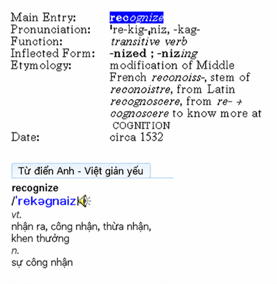

Hay “fortunate”, nhiều từ điển Anh-Hán thêm nguyên âm /ə/, tức thêm cả một âm tiết, theo lời phê bình của tác giả:

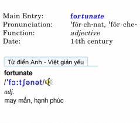

> **Ghi chú biên tập về phiên âm và phiên bản:** Các đánh giá “tốt nhất”, so sánh 2.5/3.0 và cách cài CD phản ánh sản phẩm tác giả dùng, không xác nhận bản tải từ eMule là nguồn hợp lệ hoặc còn phù hợp. Nội dung hướng dẫn được giữ để đối chiếu, chưa thực hiện cài đặt. Với “recognize” và “fortunate”, cần đọc đúng quy ước ký hiệu và nghe từng biến thể của mục từ. [Merriam-Webster có hệ ký hiệu phát âm riêng](https://www.merriam-webster.com/assets/mw/static/pdf/help/guide-to-pronunciation.pdf), không đồng nhất với IPA. [Mục “fortunate” hiện có cả dạng có và không có schwa giữa](https://www.merriam-webster.com/dictionary/fortunate); bản thân hình “fortunate” ở trên cũng thể hiện lựa chọn có schwa. Không lấy lời phê bình ấy làm quy tắc rằng mọi cách có /ə/ đều sai, hoặc suy số âm tiết từ số chữ cái. Giọng mẫu và hiểu phiên âm có thể bổ trợ nhau.

Theo hướng dẫn của tác giả, sau khi tra một từ trong Merriam-Webster, nếu mục từ có chữ xanh thì nhấp đúp từ xanh để nghe phát âm chuẩn.

Merriam-Webster còn hỗ trợ nhiều cách tìm mà tác giả cho rằng từ điển khác không làm được. Giữ nguyên nhãn tiếng Anh để đối chiếu giao diện, kèm nghĩa tiếng Việt:

* Entry word is…: mục từ là…
* Defining text contains…: phần định nghĩa chứa…
* Rhymes with…: có vần với…
* Forms a crossword of…: tạo thành từ khớp mẫu ô chữ…
* Is a cryptogram of…: là dạng mã hóa thay chữ của…
* Is a jumble of…: là cách xáo trộn chữ cái của…
* Homophones are…: các từ đồng âm là…
* Etymology includes…: từ nguyên có…
* Date is…: mốc thời gian là…
* Verbal illustration contains…: ví dụ bằng lời chứa…
* Author quoted is…: tác giả được trích là…
* Function label is…: nhãn chức năng, từ loại là…
* Synonymy paragraph contains…: đoạn phân tích đồng nghĩa chứa…
* Usage paragraph contains…: đoạn giải thích cách dùng chứa…
* Usage note contains…: ghi chú cách dùng chứa…

Trong *Advanced Searches*, tìm nâng cao, còn có thể dùng “và (AND), hoặc (OR), không (NOT)” để tạo biểu thức tìm phức tạp. Trong *Browse*, duyệt, có thể tìm “Entry Word starts with”, mục từ bắt đầu bằng, và “Entry Word ends with”, mục từ kết thúc bằng…

Merriam-Webster còn có nhiều hình minh họa, chẳng hạn từ “sloth”, con lười:


Bấm biểu tượng mắt nhỏ sẽ thấy:


Cuối cùng, điểm hay nhất của Merriam-Webster theo tác giả là *Spelling Help*, trợ giúp chính tả. Một khó khăn thường gặp khi tra từ tiếng Anh là chỉ biết âm mà chưa biết viết nên không tìm được. Có tính năng này thì tiện hơn nhiều. Chẳng hạn nhập “corisbondant”, một chuỗi rõ ràng không phải từ; Spelling Help sẽ dựa vào âm có thể tương ứng để đề nghị vài từ. Thông thường tìm được từ cần, trong ví dụ là “correspondent”. PowerWord có chức năng tương tự nhưng theo tác giả chưa hoàn thiện bằng. Nhập “corisbondant” ở PowerWord sẽ nhận thông báo: “Xin lỗi! Không có giải nghĩa mục từ này ở dữ liệu cục bộ. Bạn có thể chọn: tra trên mạng, xem từ có chính tả gần giống, thêm vào từ điển người dùng.”


## 7. Collins Cobuild: Lexicon on CD-ROM

Từ điển tiếng Anh Collins là một cuốn người học tiếng Anh phải có, theo lời giới thiệu của tác giả.

Lưu ý: tác giả đề nghị bản điện tử thứ ba, không phải bản thứ năm mới nhất khi ông viết. Ông phê bình bản thứ năm gần như chẳng có gì ngoài giao diện màu mè hơn, nhiều chức năng thiết thực ở bản thứ ba bị cắt. Có những phần mềm nâng cấp xong lại kém trước; ví dụ nhiều vô kể. Office lên 2007 thì nội dung từ điển tích hợp lại không thể “chọn tất cả”; PowerWord sau bản 2005 bỏ mất tính năng ông thấy hữu ích nhất là tìm toàn văn; còn bản Merriam-Webster 2.5, theo cách so sánh ghi trong nguồn, chẳng thấy cải tiến so với 3.0 ở đâu… Longman bản mới cải tiến khá rõ, nhưng tác giả ít cần vì Word đã có gần đủ các chức năng hữu ích ấy.


> **Ghi chú biên tập về so sánh phiên bản:** Đây là đánh giá lịch sử của tác giả, không phải danh sách phần mềm bắt buộc cài hôm nay. Câu so sánh Merriam-Webster trong đoạn này ghi 2.5 so với 3.0, trong khi mục 6 nói 3.0 không cải tiến có ý nghĩa so với 2.5; giữ sự không nhất quán ấy để không tự sửa ý nguồn. Hình và thao tác CD-ROM chưa được kiểm thử như sản phẩm hiện hành.

Cách giải nghĩa của Collins phù hợp nhất với người học tiếng Anh, tác giả nhận xét. Ví dụ nghĩa thứ sáu của “plug” như sau:

> **6 plug plugs plugging plugged**

> *If someone plugs a commercial product, especially a book or a film, they praise it in order to encourage people to buy it or see it because they have an interest in it doing well.* <br />

> We did not want people on the show who are purely interested in **plugging** a book or film.

> **VB**<br />
*= promote*

Tiện nói thêm, tác giả cho rằng muốn biết từ điển giải nghĩa đầy đủ không, thường chỉ cần xem “plug”: nếu có nghĩa “động từ: quảng cáo xen vào; danh từ: mẩu quảng cáo” thì phạm vi nghĩa của từ điển khá đầy đủ.


Longman từng nhờ thiết kế *Defining Vocabulary*, bộ từ dùng để viết định nghĩa, gồm 2.200 từ mà trở thành người dẫn đầu từ điển cho người học, theo nguồn. Oxford làm theo rồi có *Oxford 3000*. Còn Collins về bản chất đi thêm một bước, theo tác giả: kiểu câu đơn giản “if … , …” được thiết kế rất khéo, phù hợp nhất để giải thích cho người học ngôn ngữ thứ hai. Collins cũng có bộ từ nền tảng dùng định nghĩa, mà tác giả gọi là *Most Frequently Used Vocabulary*, chia từ mức 1 đến 5.

Collins cũng là từ điển duy nhất trên thị trường có sẵn kho ngữ liệu tra được, tác giả khẳng định. Khi tra từng từ, ngoài ví dụ trong định nghĩa, ở tab *Full text*, toàn văn, có *Examples*, ví dụ; thường có hàng chục, thậm chí hàng trăm câu. Từ đang tra được tô đỏ, trước câu ghi thuộc loại UK written, văn viết Anh; UK spoken, lời nói Anh; US written, văn viết Mỹ; hay US spoken, lời nói Mỹ. Dưới *Example* có các biểu tượng:

* “D”: giải nghĩa từ điển (*Dictionary*).
* “T”: mục từ đồng nghĩa và gần nghĩa (*Thesaurus*).
* “U”: ghi chú cách dùng (*Usage*).
* “G”: giải thích ngữ pháp (*Grammar*), một “chức năng bí mật” của Collins mà tác giả sẽ nói cụ thể ngay sau.
* “W”: kho câu ví dụ (*WordBank*).


WordBank là kho ngữ liệu câu ví dụ của Collins. Tác giả nói từ điển này chứa phần hữu dụng gồm 5 tỷ từ của kho ấy. Trên website Collins còn có [công cụ tra trực tuyến](http://www.collins.co.uk/Corpus/CorpusSearch.aspx), nhưng ông cho rằng nó chẳng có ích mấy với đa số người không chuyên.

Điều thú vị nhất là bản Collins thứ ba có một nội dung chưa công bố: toàn văn điện tử của *Collins Cobuild English Grammar*. Bản dịch tiếng Trung do Thương Vụ Ấn Thư Quán xuất bản; đây cũng là một trong những sách ngữ pháp tôi đánh giá cao nhất. Tôi phát hiện hoàn toàn tình cờ: có lần gõ nhầm phím mà lại tìm được kho báu.

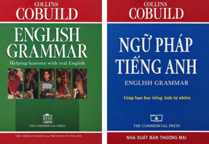

Theo hướng dẫn của tác giả, nhập “1.1” trong ô tìm của Collins rồi nhấn Enter sẽ thấy chương 1, mục 1. Sau đó dùng biểu tượng “A←” và “→Z” trên thanh công cụ để lật trước hoặc sau. Nếu có sách in và muốn xem bản điện tử, chỉ cần nhập số chương, mục tương ứng rồi Enter. Tác giả tiếc rằng chức năng tốt thế đã bị bỏ ở bản thứ năm.


> **Ghi chú biên tập về cách chọn từ điển:** Có nghĩa quảng cáo của “plug” không đủ chứng minh toàn bộ từ điển đầy đủ. Những nhận định “phù hợp nhất”, “duy nhất” và số lượng ngữ liệu cần gắn với phiên bản và cách tính cụ thể. [Pearson mô tả defining vocabulary của Longman gồm 2.000 từ](https://www.pearson.fr/catalog/?cat_id=334), chưa rõ cơ sở đếm 2.200 trong nguồn. [Oxford 3000 là danh sách từ ưu tiên cho người học và cũng được dùng trong định nghĩa](https://www.oxfordlearnersdictionaries.com/about/oxford3000); thông tin này không chứng minh câu chuyện “làm theo” mà tác giả nêu. Chưa xác minh được 5 tỷ từ nằm trong bản CD-ROM; không lấy quy mô corpus hiện nay thay cho dữ liệu lịch sử. Bộ từ dùng để viết định nghĩa, danh sách từ quan trọng cho người học, nhãn tần suất và tổng kho ngữ liệu cũng là các khái niệm khác nhau; không dùng thay cho nhau. Khi luyện cho người Việt, hãy xem định nghĩa mình hiểu được đến đâu, ví dụ có đúng ngữ cảnh không, và có hỗ trợ kiểm tra cách dùng hay không.

## 8. Oxford Collocation Dictionary

*Oxford Collocation Dictionary for Students of English* là cuốn từ điển có ý nghĩa mở ra một thời kỳ mới, tác giả nhận xét. Phần mềm *Oxford Phrasebuilder Genie* chứa hai từ điển quan trọng: *Oxford Advanced Learner's Dictionary*, Từ điển Oxford nâng cao cho người học, và cuốn từ điển kết hợp từ Oxford mà tác giả nói lúc ấy gần như chưa tìm thấy lựa chọn thay thế. Ở các hiệu sách Trung Quốc, tôi chỉ thấy bản gốc bán trên tầng bốn của Nhà sách Ngoại văn Vương Phủ Tỉnh, Bắc Kinh, giá khoảng 380 nhân dân tệ, gồm sách in và CD-ROM; tầng một bán “bản in chụp” rẻ hơn, chỉ vài chục tệ. Năm 2009, cuốn từ điển mà tôi xem là tuyệt vời ấy cuối cùng có bản thứ hai:


Theo nguồn, từ điển có 15.000 mục kết hợp từ. Chẳng hạn tra “house”, ta thấy danh từ ấy thường làm tân ngữ cho các động từ “live in, occupy, share, buy, rent, sell…” trong nhóm VERB+HOUSE:


Có cuốn từ điển này, theo tác giả, ta không còn nhất thiết dựa vào giáo viên nước ngoài để học tiếng Anh; ông còn phê bình rằng thực ra chưa bao giờ có thể dựa được hoặc tin cậy vào họ. Muốn diễn đạt gì thì tra. Trong cách dùng ngôn ngữ “tự nhiên như người bản ngữ”, kết hợp từ mới là yếu tố then chốt hơn, theo ông. Phát âm, ngữ pháp cũng quan trọng, nhưng không bằng kết hợp từ. Hãy thử hình dung:

> I hate purple passage with no essential content. (Tôi ghét những bài văn ngoài hào nhoáng mà bên trong rỗng tuếch. “Passage” kết hợp với “purple”, hay nói “passage” được “purple” bổ nghĩa, tạo thành cụm chỉ đoạn văn dùng lời lẽ hoa mỹ.)

Tác giả nói câu này có vài lỗi ngữ pháp: “purple passage” nên là “purple passages”, số nhiều; “content” cũng nên thành “contents”, số nhiều. Nhưng ngay cả có lỗi ngữ pháp và người nước ngoài đọc câu ấy bằng giọng chưa chuẩn, người bản ngữ đối thoại vẫn có thể hiểu hết ngay và giao tiếp trôi chảy, theo ông. Đó là tác dụng của kết hợp từ.

> **Ghi chú biên tập về câu mẫu:** [Cambridge xác nhận “content” là danh từ không đếm được khi chỉ nội dung, ý tưởng trong bài viết, phim hoặc bài nói](https://dictionary.cambridge.org/us/grammar/british-grammar/content-or-contents); không bắt buộc đổi thành “contents”. Với danh từ đếm được “passage”, trong câu khái quát này có thể dùng “purple passages”. Lời đánh giá giáo viên nước ngoài và thứ bậc giữa các kỹ năng là quan điểm mạnh của tác giả, không phải kết luận chung; việc người nghe có hiểu còn phụ thuộc ngữ cảnh. Không học theo bản sửa sai “content → contents” như một quy tắc ngữ pháp.

Theo tác giả, giao diện bản thứ hai thân thiện và dễ dùng hơn: khi tra có thể nhấp đúp trái vào một từ để mở hộp nhỏ có nghĩa và giọng người thật. Đây là cuốn từ điển duy nhất cá nhân tôi thấy đáng cầm bản in lên lật khi rảnh; bản điện tử cũng vậy.

> **Ghi chú biên tập về thông tin mua và phiên bản:** Địa điểm, giá 380 nhân dân tệ, bản in chụp và mô tả phần mềm là thông tin lịch sử của nguồn, chưa phải báo giá, nơi bán hay hướng dẫn cài đặt cho Việt Nam hôm nay. Tên ấn phẩm trong nguyên tác ghi *Collocation* số ít; tên cần đối chiếu khi tra nhà xuất bản là *Oxford Collocations Dictionary for Students of English*.

## 9. WordNet và WordWeb

[WordNet](http://en.wikipedia.org/wiki/WordNet) là cơ sở dữ liệu từ vựng tiếng Anh (*English lexical database*) do giáo sư tâm lý học George A. Miller ở Đại học Princeton bắt đầu lãnh đạo phát triển và duy trì năm 1985. Theo số liệu nguồn nêu cho năm 2006, cơ sở dữ liệu lớn hơn 12 MB, có 150.000 từ, tổng cộng 115.000 tập đồng nghĩa và 207.000 mục nghĩa. Từ trong cơ sở dữ liệu chủ yếu thuộc bốn nhóm: danh từ, động từ, tính từ và trạng từ. Tác giả mô tả cấu trúc chính là cơ sở dữ liệu quan hệ được tổ chức theo nghĩa từ, thay vì theo bản thân từ.

Theo tường thuật của tác giả, khi dự án khởi động năm 1985, nó nhận tài trợ 3 triệu USD. Phần lớn sự nghiệp sau đó của giáo sư Miller gắn với WordNet. Khoảng năm 1998, một nhóm giáo sư và sinh viên Đại học Brown dùng WordNet tạo một *disambiguator*, công cụ giải quyết sự mơ hồ khi phân tích ngữ nghĩa. Nhóm do Jeff Stibel đứng đầu mời Miller làm cố vấn hội đồng quản trị và lập công cụ tìm kiếm Simpli. Năm 2000, theo nguồn, NetZero mua Simpli với giá 23,5 triệu USD. Năm 2003, một công ty khác được xây dựng dựa trên WordNet là Applied Semantics, năm 1998 còn mang tên Oingo, được Google mua với giá 102 triệu USD. Tác giả nối tiếp câu chuyện rằng từ đó Google có hoạt động quảng cáo AdSense mà họ dựa vào để tồn tại ngày nay.

> **Ghi chú biên tập về lịch sử và dữ liệu:** Mốc năm, tiền tài trợ và giá mua là số liệu tác giả thuật lại, chưa được tất cả nguồn chính thức xác nhận trong bản biên tập này. “Ngày nay” ở câu cuối chỉ thời điểm nguồn được viết. Tên “AdSence” trong nguyên tác được sửa thành “AdSense”; [thông cáo Google xác nhận việc mua Applied Semantics năm 2003](https://googlepress.blogspot.com/2004/04/google-acquires-applied-semantics.html), nhưng không tự chứng minh WordNet tạo nên toàn bộ hoạt động AdSense. Phần giải thích kỹ thuật và thống kê theo phiên bản được đối chiếu riêng bên dưới.

Dưới đây là mô tả ngắn về cấu trúc cơ sở dữ liệu mà nguồn trích từ Wikipedia. Giữ phần English để đối chiếu các quan hệ nghĩa:

* Nouns
  * hypernyms: Y is a hypernym of X if every X is a (kind of) Y (canine is a hypernym of dog) (từ bao quát hơn, hay từ thượng nghĩa)
  * hyponyms: Y is a hyponym of X if every Y is a (kind of) X (dog is a hyponym of canine) (từ cụ thể hơn, hay từ hạ nghĩa)
  * coordinate terms: Y is a coordinate term of X if X and Y share a hypernym (wolf is a coordinate term of dog, and dog is a coordinate term of wolf)
  * holonym: Y is a holonym of X if X is a part of Y (building is a holonym of window)
  * meronym: Y is a meronym of X if Y is a part of X (window is a meronym of building)
* Verbs
  * hypernym: the verb Y is a hypernym of the verb X if the activity X is a (kind of) Y (to perceive is an hypernym of to listen)
  * troponym: the verb Y is a troponym of the verb X if the activity Y is doing X in some manner (to lisp is a troponym of to talk)
  * entailment: the verb Y is entailed by X if by doing X you must be doing Y (to sleep is entailed by to snore)
  * coordinate terms: those verbs sharing a common hypernym (to lisp and to yell)
* Adjectives
  * related nouns
  * similar to
  * participle of verb
* Adverbs
  * root adjectives

> **Diễn giải của bản Việt hóa:** Trong các ví dụ trên, *canine* bao quát *dog*; *dog* và *wolf* là các mục cùng cấp. *Holonym* chỉ toàn thể có chứa bộ phận đang xét, như tòa nhà đối với cửa sổ; *meronym* chỉ bộ phận thuộc toàn thể, như cửa sổ đối với tòa nhà. Với động từ, *troponym* mô tả một cách thực hiện cụ thể; *entailment* là quan hệ kéo theo, như ngáy kéo theo đang ngủ trong ví dụ nguồn. Các dòng tính từ nêu quan hệ với danh từ, tính từ tương tự và phân từ của động từ; dòng trạng từ nêu tính từ gốc.

Với người học tiếng Anh, cơ sở dữ liệu này không dễ hiểu ngay bằng trực giác, theo tác giả. Nó không phải *dictionary* hoặc *thesaurus* theo nghĩa truyền thống; nói chính xác theo cách ông mô tả, đó là cơ sở dữ liệu khổng lồ liên kết các nghĩa, ban đầu làm cho nhận diện ngữ nghĩa tiếng Anh tự động.

Trên mạng còn có [*Thinkmap® Visual Thesaurus*](http://www.visualthesaurus.com/), giao diện rất đẹp và bắt mắt, cũng dựa trên WordNet.


Tuy nhiên, ngoài vẻ đẹp và sự bắt mắt, cá nhân tác giả cho rằng TVT không thực dụng với đa số người học tiếng Anh: bất tiện và kém hiệu quả.

> **Ghi chú biên tập về cấu trúc và việc học:** Một tập đồng nghĩa, *synset*, nhóm các từ trong một nghĩa hoặc ngữ cảnh, không cho phép thay nhau trong mọi câu. “Quan hệ” trong lời tác giả không phải xác nhận dữ liệu được triển khai bằng hệ quản trị SQL; [FAQ Princeton mô tả các tệp dữ liệu ASCII và quan hệ nghĩa của synset](https://wordnet.princeton.edu/frequently-asked-questions/). [Thống kê WordNet 3.0](https://wordnet.princeton.edu/documentation/wnstats7wn) ghi 155.287 chuỗi theo từ loại, 117.659 synset và 206.941 cặp từ-nghĩa, có lưu ý cách đếm giữa các từ loại; không dùng các số làm tròn của nguồn như thống kê không gắn phiên bản. [Trang Princeton thông báo hiện không tiếp tục phát triển WordNet](https://wordnet.princeton.edu/), dù dữ liệu vẫn tải được. Tiêu đề nguồn có “WordWeb” nhưng phần thân không có hướng dẫn riêng cho WordWeb; bản dịch không tự bổ sung như thể có trong nguyên tác. Sơ đồ quan hệ có thể giúp tìm hiểu nghĩa, nhưng vẫn cần đọc định nghĩa và câu ví dụ để dùng từ.

## 10. Không phải lượng từ vựng, vốn khái niệm mới là chỗ nghẽn

Rồi có ngày học sinh nhận ra “lượng từ vựng” thực ra là thứ sơ cấp nhất, theo tác giả. Khi đọc không hiểu, trở ngại lớn hơn là “vốn khái niệm”. Người không biết *double blind test*, thử nghiệm mù đôi, không phải vì chưa biết ba từ “double”, “blind”, “test”, mà vì chưa hiểu khái niệm ấy chỉ gì. Một chương sách giới thiệu nó có thể dài hơn vài nghìn chữ; phải đọc hiểu số chữ ấy mới thật sự nắm đó là gì, vì sao dựa vào nó, việc dựa vào nó có giới hạn nào, v.v. Tương tự, người gặp [*unintended consequences*](http://en.wikipedia.org/wiki/Unintended_consequence), hệ quả ngoài dự định, nếu không biết xuất xứ, ý nghĩa và những ví dụ thường được nhắc trong đời sống hoặc học thuật, chưa chắc hiểu trọn văn bản chỉ vì biết riêng “unintended” và “consequences”.

Tư duy ở mức cao dựa vào hiểu, tổ chức, mở rộng, áp dụng, hiểu lại, tổ chức lại, tiếp tục mở rộng và vận dụng các khái niệm, chứ không phải bản thân từ ngữ, tác giả lập luận. Hai người biết lượng từ ngang nhau có thể khác rất lớn về vốn khái niệm. Không chỉ lượng khái niệm, mức hiểu từng khái niệm của mỗi người cũng khác nhau đủ kiểu. Khác biệt lớn đến một mức nào đó thì dù dùng cùng ngôn ngữ vẫn hoàn toàn không giao tiếp được, theo ông. Cha mẹ và con, giáo viên và học sinh, tác giả và độc giả, lãnh đạo và cấp dưới, người miền Nam và miền Bắc, học giả và công chúng đều có thể rơi vào tình huống ấy.

Người không biết khái niệm thử nghiệm mù đôi có thể bị thầy thuốc kém chẩn đoán sai mà không biết; người không biết hệ quả ngoài dự định thì khó bỏ thói tự cho mình đúng, cứ vì “tôi có ý tốt” mà làm việc xấu từ ý tốt, theo những ví dụ của tác giả.

* Gặp người khác giới không hiểu “tình yêu” và “hôn nhân” không phải một, tác giả khuyên nên kính trọng nhưng giữ khoảng cách; nếu không, một đời khổ sở “đang chờ bạn không xa”…
* Gặp người không phân biệt “chính phủ” và “quốc gia”, ông khuyên đừng vội trao đổi, nếu không có thể thấy phiền phức liên miên, tai họa vô tận…
* Người không biết “mục tiêu” và “kế hoạch” khác nhau sẽ không biết mình có thể vì “bám cứng kế hoạch” (*Stick to the plan*) mà cuối cùng không đạt mục tiêu…
* Người chưa phân biệt khoảng cách giữa “khoa học”, “phổ biến khoa học” và “người viết phổ biến khoa học” sẽ chửi qua chửi lại, bằng cách theo lời tác giả còn kém khoa học hơn người đàn bà chửi đổng…
* Người không biết “đi học” và “học tập” khác nhau, có người vì có bằng tiến sĩ mà coi thường người tốt nghiệp trung cấp; ngược lại, có người vì chỉ có bằng trung cấp mà ghét người có tiến sĩ…
* Người không phân biệt “một người” với “quan điểm của người ấy” có thể hoặc mê tín quyền uy, hoặc coi chính mình là quyền uy tuyệt đối…
* Người không biết khác biệt giữa “Action”, hành động, và “Reaction”, phản ứng, có khi cả đời làm nô lệ cho hoàn cảnh xung quanh mà hoàn toàn không ý thức được…
* Nhiều học sinh ghét môn lịch sử, theo tác giả thực ra chỉ vì chưa hiểu khác biệt quan trọng giữa “lịch sử” và “sách lịch sử”…

Đó là lý do ta thường nghe người ta tả người không hiểu chuyện rằng “Ôi, người này hoàn toàn chẳng có khái niệm gì!”. Câu ấy cũng tả được người suy luận lộn xộn. Cuối cùng, theo tác giả, chỉ những người phân biệt và định nghĩa rõ khái niệm mới suy nghĩ rõ, rồi thay đổi cả thế giới:

* Galileo hiểu “chuyển động” và “môi trường của chuyển động” là hai khái niệm cần xử lý riêng; chỉ điều ấy đã đóng góp lớn cho khoa học hiện đại 2.
* Washington và nhóm của ông hiểu ba quyền có thể tách nhau, từ đó tạo nên nước Mỹ ngày nay.
* Đặng Tiểu Bình hiểu “chính trị” và “kinh tế” có thể tách nhau, từ đó tạo nên Trung Quốc ngày nay.
* Có lập trình viên hiểu “nội dung” và “hình thức trình bày” có thể tách nhau, từ đó “css” tách khỏi “html”, cả Internet thay đổi…

> **Ghi chú biên tập về các ví dụ đánh giá và lịch sử:** Tám nhận xét về con người và bốn ví dụ lịch sử trên là cách tác giả nhấn mạnh việc phân biệt khái niệm; không dùng chúng để kết luận về một người, giới, trình độ học vấn hoặc quan hệ chỉ từ một dấu hiệu. Biết thuật ngữ thử nghiệm cũng không đủ để tự xác định chẩn đoán y khoa đúng sai. Các biến đổi khoa học, chính trị và công nghệ có nhiều nguyên nhân, không được giải thích đầy đủ bằng một cá nhân “nghĩ ra sự tách biệt”. Số “2” sau câu Galileo có trong nguồn nhưng không có nội dung chú thích tương ứng ở chương này; không tự bịa thêm nguồn cho nó.

Có vẻ đã lạc đề, nhưng theo tác giả thực ra không phải. Đây cũng không phải cố gây sốc mà là sự thật rất rõ: hiểu rõ từng khái niệm từng gặp, dù tiếng Trung hay tiếng Anh, là cách sống tiết kiệm thời gian và hiệu quả nhất. Hãy chú ý thói quen ấy không chỉ ảnh hưởng việc học mà cả quá trình sống. Con người, suy cho cùng, là động vật phải dựa vào suy nghĩ để quyết định. Mỗi quyết định và phán đoán đều cần xử lý hiệu quả các khái niệm đủ loại đã lưu trong đầu, với quan hệ phức tạp giữa chúng.

Vì vậy, tôi thường nhắc học sinh nên tra bách khoa thường xuyên, vì đó là công cụ cơ bản nhất để người bình thường xây dựng hệ thống khái niệm. Gặp khái niệm chưa hiểu rõ thì tra rồi ghi chú, đó là thói quen tốt cho cả đời. Tác giả chỉ giới thiệu cho học sinh một bách khoa: [Wikipedia](http://en.wikipedia.org).

Nhiều người thường lo về độ uy tín của Wikipedia. Theo tường thuật của tác giả, năm 2005, *Nature*, tạp chí khoa học mà ông gọi là uy tín nhất thế giới, đã kiểm tra và so sánh kỹ nội dung Wikipedia với *Encyclopaedia Britannica*, xét hơn một trăm chỉ tiêu, cuối cùng kết luận độ chính xác ngang nhau; ở một số mặt Wikipedia thậm chí hơn.

> **Ghi chú biên tập về sử dụng bách khoa:** [Nature mô tả khảo sát năm 2005 gửi 50 cặp bài khoa học và nhận 42 phản hồi dùng được](https://blogs.nature.com/blog/comparing_wikipedia_and_britan_1/); trung bình gần bốn lỗi mỗi bài Wikipedia và gần ba ở Britannica. Đây không phải kiểm chứng mọi bài hoặc mọi chủ đề trên hai bách khoa. [Trang bài gốc cũng ghi nhận phản đối của Britannica và trả lời của Nature năm 2006](https://www.nature.com/articles/438900a). Với người Việt, có thể bắt đầu bằng bài tiếng Việt để nắm ý rồi đối chiếu thuật ngữ tiếng Anh và tài liệu được dẫn; xem nguồn, ngày cập nhật, phạm vi và chỗ còn tranh luận trước khi dùng một nhận định. Vốn từ và vốn khái niệm hỗ trợ nhau, không cần coi một bên hoàn toàn không quan trọng.

## 11. Có nhất thiết phải dùng từ điển Anh-Anh?

Nhiều giáo viên nhấn mạnh với học sinh: “Muốn học tốt tiếng Anh, nhất định phải dùng từ điển Anh-Anh.” Cá nhân tôi không đồng tình với lời khuyên ấy. Thực tế nhiều học sinh nghe rồi làm theo, cuối cùng “chưa ra trận đã ngã”: phần giải nghĩa tra được lại có thêm nhiều từ mới, nên vừa quyết tâm bắt đầu lại chưa lâu đã bỏ cuộc.

Theo tác giả, người học ngôn ngữ thứ hai có thể cả đời không cần bỏ từ điển Anh-Hán. Khá nhiều khái niệm tồn tại tương ứng ở mọi ngôn ngữ, ông lập luận. Ví dụ “apple”, “cockroach”, “fool”, “rock”, “ticket”. Merriam-Webster giải nghĩa các từ ấy như sau:

* **apple**: the fleshy usually rounded and red, yellow, or green edible pome fruit of a tree
* **cockroach**: any of an order or suborder (Blattodea syn. Blattaria) of chiefly nocturnal insects including some that are domestic pests
* **fool**: a person lacking in judgment or prudence
* **rock**: a concreted mass of stony material; also: broken pieces of such masses
* **ticket**: a document that serves as a certificate, license, or permit

Cách giải thích trên hiểu nhanh hơn, hay các nghĩa dưới đây nhanh hơn? Giữ năm nghĩa tiếng Trung làm đối tượng so sánh của nguồn, kèm cách đọc và tiếng Việt:

* apple: *píngguǒ*, táo.
* cockroach: *zhāngláng*, gián.
* fool: *shǎguā*, kẻ ngốc.
* rock: *yánshí*, đá.
* ticket: *piào*, vé.

Cách sau không chỉ hiểu nhanh hơn mà nhớ cũng nhanh hơn, theo tác giả. Tóm lại, làm thế hiệu quả hơn, sao phải bỏ cách hiệu quả?

Đúng là có từ tồn tại ở một ngôn ngữ mà không tồn tại ở ngôn ngữ khác, tác giả nói, chẳng hạn “hooligan”. Khi ấy, giải pháp cũng không chỉ là xem từ điển Anh-Anh. Merriam-Webster giải thích:

> **hooligan**: RUFFIAN, HOODLUM

Nhiều học sinh có thể không biết cả hai từ; lại tra từng từ, dù nhấp đúp trái thì cũng không phiền lắm:

> **RUFFIAN**: a brutal person : BULLY
> **HOODLUM**: THUG; especially: one who commits acts of violence

Ở đây lại có một từ chưa biết:

> **THUG**: a brutal ruffian or assassin : GANGSTER, KILLER

Giờ cơ bản biết các từ rồi, nhưng rốt cuộc từ đang tra nghĩa gì, ai hiểu rõ được, tác giả hỏi.

Chẳng bằng dùng PowerWord, trỏ chuột một cái:

> **hooligan**: [tiếng lóng] *āfēi*, *wúlài*, *xiǎo liúmáng*: những cách gọi tiếng Trung chỉ hạng du đãng, vô lại, lưu manh.

Nếu chưa thỏa mãn và muốn biết “hooligan” rốt cuộc từ đâu ra, [cứ thử tra Wikipedia](http://en.wikipedia.org/wiki/Hooliganism):

> *Etymology*

> There are several theories about the origin of the word hooliganism. The Compact Oxford English Dictionary states that word may originate from the surname of a fictional rowdy Irish family in a music hall song of the 1890s. Clarence Rooks, in his 1899 book, Hooligan Nights, claimed that the word came from Patrick Hoolihan (or Hooligan), an Irish bouncer and thief who lived in the London borough of Southwark. Another writer, Earnest Weekley, wrote in his 1912 book Romance of Words, “The original hooligans were a spirited Irish family of that name whose proceedings enlivened the drab monotony of life in Southwark about fourteen years ago”. There have also been references made to a 19th century rural Irish family with the surname Houlihan who were known for their wild lifestyle. Another theory is that the term came from a street gang in Islington named Hooley. Yet another theory is that the term is based on an Irish word, houlie, which means a wild, spirited party.

Ồ, hóa ra người ta cũng chưa rõ. Trong tình huống ấy, cần tra từ nguyên hoặc tìm bách khoa; nhiều khi đã ra ngoài việc của từ điển, theo tác giả.

Một ví dụ điển hình nữa là *déjà vu* trong tiếng Pháp. Tác giả nói tiếng Anh không có nghĩa ấy nên phải mượn nguyên từ; trong tiếng Trung ông cũng chưa tìm được từ tương ứng hoàn toàn chính xác.

> **Ghi chú biên tập về từ và khái niệm:** Thiếu một từ đơn tương đương không chứng minh người nói ngôn ngữ khác thiếu khái niệm hoặc không thể diễn đạt bằng một cụm. *Déjà vu* có thể được giải thích bằng tiếng Việt là cảm giác như đã trải qua tình huống đang xảy ra. Các nghĩa tiếng Trung và đoạn English về từ nguyên được giữ để đối chiếu nguồn; các giả thuyết trong đoạn trích không tự trở thành sự thật đã chốt về xuất xứ từ. Với người Việt, có thể dùng nghĩa tiếng Việt phù hợp rồi kiểm tra lại ngữ cảnh, thay vì học qua tiếng Trung.

Người ta hay nói phải dùng từ điển Anh-Anh mới hiểu chính xác nghĩa từ. Theo tác giả, gốc rễ của lời ấy chỉ là nhận đúng vấn đề nhưng chọn sai giải pháp, vô lý như chẩn đoán bệnh nhân bị huyết khối não rồi lại phẫu thuật cắt cụt chi.

Đúng là đôi khi chỉ xem nghĩa tiếng Trung không xác định được nghĩa chính xác. Chẳng hạn “different”, “diverse”, “divergent”, “distinct”, “various” đều được dịch là “khác nhau”, nhưng khi nào dùng từ nào, khác biệt là gì, dùng thế nào? Theo tác giả, giải pháp không phải tra từ điển Anh-Anh mà là tra từ điển cách dùng, đồng nghĩa và kết hợp từ; những loại ấy thường có bản Anh-Hán hoặc song giải Anh-Hán.

Ví dụ PowerWord có *Từ điển Oxford Anh-Hán song giải mới*; tra “different” cho kết quả như sau:

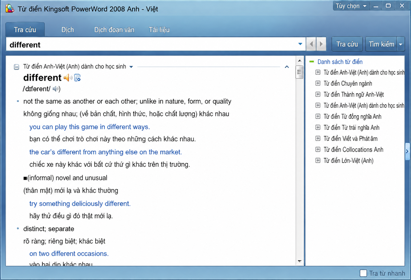

Trong *Đại từ điển Anh-Hán tổng hợp hiện đại* có mục “Từ tham khảo”, thực ra tương đương từ điển đồng nghĩa, như hình:

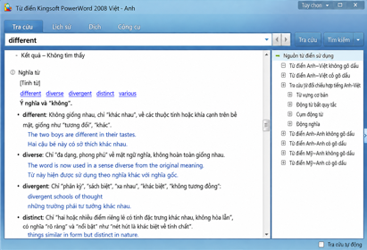

Còn kết quả tra từ điển kết hợp từ Oxford như sau:


Cá nhân tôi cho rằng từ điển kết hợp từ quan trọng nhất, vì khác biệt quan trọng giữa từ với từ thực ra thể hiện qua cách kết hợp khác nhau. Hãy nhớ lại khác biệt giữa hai từ tiếng Trung *biān* và *zhī*, đã được giải thích ở các chương trước, thể hiện qua những từ đi kèm ra sao.

Ngoài ra, cần nhắc học sinh đừng quá mê tín từ điển. Biên soạn từ điển của bất kỳ ngôn ngữ nào, ở một nghĩa nào đó, đều là việc “bất đắc dĩ”, theo tác giả, vì nhiều từ căn bản không thể giải thích hết bằng từ khác. Một ví dụ ngược để minh họa: *Đại từ điển Hán ngữ hiện đại* giải thích *qīngxiù* (thanh tú) là “đẹp mà không dung tục”. Với tư cách người dùng tiếng Trung làm tiếng mẹ đẻ, bạn nghĩ lời ấy có giúp một người Mỹ học tiếng Trung hiểu không, khi người ấy nghe giáo viên bảo “muốn học tốt tiếng Trung thì phải dùng từ điển Hán-Hán, không được dùng Hán-Anh”? Gặp người nước ngoài chưa hiểu “thanh tú”, ta thường không bảo họ tra từ điển mà đưa ví dụ: “Đúng rồi, người kia trông khá thanh tú đấy…”.

Khi đọc ngày càng rộng và sâu, cuối cùng ta sẽ gặp tác giả không chỉ chọn từ kỹ mà còn muốn dùng theo cách mới. Chỉ dựa vào từ điển chắc chắn không đủ để đọc họ, tác giả nhận xét.

Vì thế, theo tác giả, mong chỉ nhờ dùng từ điển Anh-Anh mà nâng trình độ là rất ngây thơ. Nhiều lúc dùng bản Anh-Hán hoặc song giải Anh-Hán mới thực sự hiệu quả. Thực ra Anh-Anh, Anh-Hán hay song giải thì sao cũng được: phải tra mới có ích. Tra loại nào cũng có thu hoạch; đối chiếu nhiều từ điển sẽ có thu hoạch bất ngờ; tra rồi ghi chép cẩn thận sẽ có lợi cả đời. Không tra thì vô dụng. Tác giả cho rằng đại đa số người chưa giỏi không phải vì công cụ kém mà vì không biết dùng, thậm chí chỉ sở hữu mà chẳng bao giờ sử dụng.

> **Ghi chú biên tập cho người Việt:** Bản Anh-Hán ở đây là lựa chọn theo tiếng mẹ đẻ của tác giả. Người Việt có thể kết hợp từ điển Anh-Việt, từ điển Anh-Anh dành cho người học và tài liệu về cách dùng, đồng nghĩa, kết hợp từ tùy nhu cầu. Không cần đặt một loại lên trên mọi loại khác. Một nghĩa tiếng Việt ngắn giúp nắm ý ban đầu, nhưng không luôn bao quát đủ các nghĩa, sắc thái và mẫu câu. Sau khi tra, thử chọn nghĩa cho câu đang đọc, nghe phát âm, ghi cả cụm và tự đặt câu; nếu hai nguồn khác nhau, xem chúng có đang nói cùng từ loại, nghĩa và ngữ cảnh không.

| [< Chương 4: Đọc thành tiếng](./chapter4.md) | [Chương 6: Ngữ pháp >](./chapter6.md) |
| ------------------------------- | ------------------------------- |
