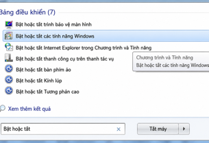
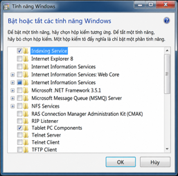
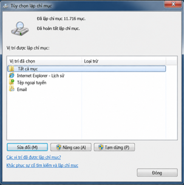
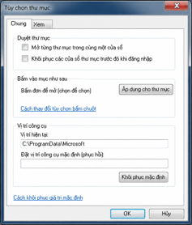
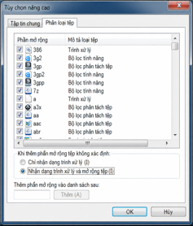
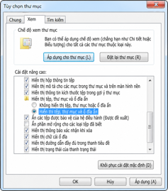
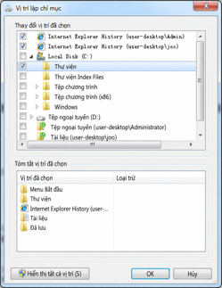

# Chương 7. Đọc kỹ

## 1. Học không nghiêm túc thì chắc chắn chịu thiệt

Sống có thể không thật thà, nhưng học mà không nghiêm túc thì rất không đáng, tác giả nói. Về điểm này, tôi có phần may mắn.

Cha mẹ tôi chưa bao giờ tiếc tiền mua sách, nên gần như từ lúc biết nhớ, khoản chi chính của tôi đã là sách, cho đến tận khi viết những dòng này. Khi tôi tám hoặc chín tuổi, cùng việc cha được minh oan và thực hiện chính sách khôi phục quyền lợi, mẹ chuyển công tác: không còn làm thú y mà sang thư viện một trường đại học. Nhà vì thế tiết kiệm được rất nhiều tiền mua sách. Lớn lên từ nhỏ giữa thư viện thực sự là điều may mắn nhất đời tôi.

Về thái độ đọc, tôi luôn biết ơn mẹ. Hồi rất nhỏ, có lần đang ngồi lật sách lung tung, mẹ thấy và hỏi: “Con đang xem gì thế?”

“Sách chứ gì ạ”, tôi trả lời hờ hững.

“Lật thế thì con hiểu được gì?”, mẹ hỏi như bâng quơ.

Tôi nói: “Loại sách này… lật qua thôi là được…”.

Mẹ dừng một chút, bước tới lấy cuốn sách khỏi tay tôi, ném lên bàn rồi nói từng tiếng: “Sách mà lật qua là được thì đọc làm gì? Phí thời gian.”

Tôi sững lại nhưng nhanh chóng hiểu ý mẹ. Câu ấy khắc ngay vào đầu, chưa bao giờ quên. Đọc thì phải đọc sách hay; sách hay không thể chỉ lật qua. Vì vậy bao năm nay, bất kể đọc gì, hễ xác định là sách đáng đọc, tôi sẽ đọc kỹ, thường là kỹ nhiều lần. Sau này tôi cũng hay nói với học sinh: sách hay để đọc chứ không phải để lật; đọc kỹ, hoặc gọi văn vẻ hơn là “nghiên cứu khi đọc”.

> **Ghi chú biên tập về bối cảnh và phương pháp:** Câu chuyện gia đình và việc minh oan thuộc trải nghiệm của tác giả tại Trung Quốc, không chuyển thành hoàn cảnh Việt Nam. Lời mẹ nhấn mạnh chọn sách và chú tâm; không có nghĩa mọi lần xem lướt mục lục, tìm thông tin hoặc thử một cuốn sách đều vô ích. “Đọc kỹ” trong chương này là cố hiểu nghĩa, cấu trúc và quan hệ ý, rồi kiểm tra lại điều mình hiểu.

## 2. Sách hay nhất định phải đọc chậm

Đọc nhất định phải chậm, theo tác giả, vì chỉ đọc chậm mới có thể thưởng thức kỹ. Đọc khác với đi gấp cho kịp đường: với người đang vội, gần như chỉ đích đến mới là tất cả; nấn ná với cảnh ven đường hoặc vướng vào chuyện dọc đường có thể khiến không tới đích, thậm chí lạc lối. Đọc lại không vậy. Nếu thật giống đi cho tới nơi, chẳng phải mở sách đọc thẳng câu cuối là tốt nhất sao?

Với một số người, sách hay quan trọng như oxy. Tôi từng thấy sách hay khó tìm. Đến lúc viết vẫn nhớ rõ cảm giác chán nản tột độ hai mươi năm trước, khi biết nhà văn vĩ đại George Orwell viết *Animal Farm*, *Trại súc vật*, nhưng tìm khắp không ra vì khi ấy sách bị cấm, theo lời kể của tác giả. Chớp mắt hai mươi năm qua, Internet thay đổi mọi thứ. Chỉ cần đọc hiểu tiếng Anh, sách hay tìm được trên mạng đã nhiều đến mức không thể đọc hết.

Thậm chí chẳng cần học khóa nào, tìm sách hay mà cố đọc là cách học tiếng Anh tốt nhất, nhanh nhất, thấy hiệu quả rõ nhất tôi nghĩ ra được, tác giả nói. Đặc biệt ở thời điểm audiobook phong phú như vậy, vì ông tin chắc đọc thành tiếng là phương thức căn bản nhất để có mọi năng lực ngôn ngữ.

Bạn bè thường tưởng tôi đọc rất nhanh, thực ra tôi đọc chậm. Tôi chưa bao giờ “đọc rộng”, vì cho rằng sách chỉ cần lật qua thì không đáng đọc. Tôi luôn thấy “đọc rộng” chỉ có một công dụng: phán đoán sơ chất lượng cuốn đang cầm. Từ sau tuổi hai mươi, ngay khi đọc tiểu thuyết tôi cũng thích không bỏ sót chữ nào. Gặp tác giả chọn lời kỹ, quá trình càng thú vị. Tuy tự viết không thích quá trau chuốt, thưởng thức sự dụng công của người khác dễ làm tôi tưởng mình cũng tinh tế như vậy. Biết rõ là ảo tưởng, nhưng cũng biết nó vui và vô hại.

Tôi đọc chậm và thích chậm vì hoàn cảnh lúc ấy cho cơ hội “đào chuyện đến cùng”. Tôi luôn cảm thán “Google + Wikipedia + English = Almost Everything”. Thấy tác giả nhắc một tác phẩm hoặc người viết khác họ kính trọng, có thể tra ngay rồi lao vào tìm cho đến tận đáy, thật đã. Thấy George Cooper nhắc Hyman Minsky trong *The Origin of Financial Crises: Central Banks, Credit Bubbles, and the Efficient Market Fallacy (Vintage)*, tôi chạy ngay sang Gigapedia tra và nhanh chóng tìm thấy *John Maynard Keynes* của Minsky. Theo tác giả, cuốn vốn đã hết in ấy được McGraw-Hill tái bản tháng 4/2008 nhờ George Cooper cùng những người khác nhắc đến. Đào thêm chuyện trước sau, đã ba đến năm giờ trôi qua mà vẫn say mê.

Một lý do quan trọng khác khiến đọc chậm là tôi ghi chú dài dòng. Nhiều năm kinh nghiệm khiến tôi không còn tin trí nhớ của mình. Người xưa nói “trí nhớ tốt không bằng ngòi bút cùn”; Tiếu Lai thì nói “ghi chú nhất định dùng Google”. Trích nguyên văn không còn tốn sức, nhờ Copy/Paste tuyệt vời; nhưng viết bình luận, có khi viết hẳn một bài, thêm từ khóa phân loại để sau này tìm lại, khá tốn thời gian. Theo tác giả, thời gian ấy đáng bỏ: người không ghi chú không hiểu lý do hợp lý của công sức này, như người không làm nên việc chẳng bao giờ hiểu phải quan tâm cả việc lớn lẫn nhỏ.

Sách hay đọc một lần chưa đủ. Ngạc nhiên lớn nhất thường đến từ phát hiện “tình cờ” khi đọc lại. Đọc kích thích nghĩ, nghĩ thay đổi chất lượng đọc; hai bên hỗ trợ, sinh ra nhau mà không bao giờ chống nhau, theo tác giả. Trong quá trình ấy gần như cảm thấy rõ dopamine tiết ra; chẳng trách người Trung Quốc xưa nói “trong sách có người đẹp nhan sắc như ngọc”, còn người nước ngoài nói “Reading is better than sex”.

> **Ghi chú biên tập về cách áp dụng:** Tác giả dùng “đọc rộng” gần với lật hoặc xem lướt trong đoạn này. Không nên đồng nhất mọi hình thức đọc rộng với đọc qua loa; mục tiêu đọc, độ khó và mức hiểu cần được xét riêng. Các từ “tốt nhất”, “nhanh nhất”, “mọi năng lực” và ý chỉ cần một cách học là niềm tin của ông, không phải bảo đảm kết quả. Cảm giác thích thú không phải phép đo dopamine. Những mốc “hai mươi năm trước”, “ngày nay”, kho Gigapedia và câu chuyện tái bản là bối cảnh khi nguồn được viết, không xác nhận tình trạng truy cập hoặc quyền tải sách hiện hành. Người Việt có thể chọn đoạn vừa sức, tra và ghi câu mình cần, rồi đọc lại; không bắt buộc dùng sản phẩm Google để ghi chú.

## 3. Vì sao người ta ghét đọc kỹ?

Theo tác giả, ý định và thứ tự ban đầu của người thiết kế giáo dục khi rèn khả năng đọc có lẽ như sau:

1. Trước tiên biết chữ, và biết đủ nhiều chữ. Ông cho rằng 3.000 chữ Hán thông dụng rõ ràng không đủ với người theo đuổi tri thức.
2. Có vốn từ đủ lớn.
3. Học thêm những khái niệm phức tạp hơn; mỗi khái niệm quan trọng cần nhiều trang giải thích.
4. Đồng thời học cách vận dụng logic cơ bản để hiểu và tổ chức hiệu quả hơn các khái niệm đã biết cùng thông tin liên quan.
5. Qua đọc kỹ liên tục, tiếp thu thêm khái niệm và tư tưởng.
6. Qua đọc rộng nhiều, mở rộng và bổ sung vốn khái niệm, tư tưởng.
7. Qua thực hành, hiểu lại khái niệm quan trọng và sửa cách hiểu tư tưởng quan trọng.
8. Đọc kỹ và đọc rộng bổ sung, luân phiên phối hợp…

Nhưng vì nhiều lý do, quan trọng nhất theo tác giả là giáo dục vốn quá khó đến mức khó thành công, mắt xích nào trong quy trình cũng có thể sai.

Trước hết, nhiều người thực ra chưa biết đủ chữ; với người liên tục theo đuổi tri thức, chỉ nhận ra mà không biết dùng khá khó xử. Thứ hai, nhiều người chưa có vốn từ đủ, nhất là từ có vẻ đơn giản nhưng có thể tạo bẫy logic như “tất cả”, “bất kỳ”, “không phải… thì là…”. Đáng sợ hơn không phải chỉ một khâu sai, mà khâu nào cũng ít nhiều thiếu sót.

Nhiều lúc, theo tác giả, cả thế giới quan méo mó chỉ bắt rễ từ thiếu hoặc hiểu sai một, hai khái niệm như “thử nghiệm mù đôi” hoặc “hội chứng Stockholm”. Logic thực ra khá đơn giản mà nhiều người cả đời không hiểu; ông cho rằng sợ sai rồi lo bị trừng phạt đáng sợ là căn nguyên duy nhất khiến đa số cuối cùng không nắm được tư duy logic. Giáo dục đôi khi phải dựa vào cưỡng ép, khiến sợ hãi chiếm tâm trí nhiều người đến mức họ mãi không thoát bóng nó.

Vì vậy, ở một nghĩa nào đó, theo tác giả, nhiều người chưa bao giờ đủ năng lực đọc kỹ: biết chữ chưa nhiều, từ vựng chưa lớn, khái niệm chưa phong phú, logic chưa chặt. Nói một câu là chưa đủ tư cách đọc kỹ. Nhưng người ta luôn giả định năng lực tự tăng theo tuổi; giả định không đứng vững ấy dần trông tự nhiên đến cực độ. Ai tốt nghiệp cũng nghĩ mình biết đủ chữ, đủ từ, đủ khái niệm, có logic đủ mạnh và chặt. Đáng ngại nhất là tự cho rằng không cần đọc kỹ nữa: đó là việc học sinh tiểu học, trung học bị ép mới chịu làm; đọc rộng mới xứng tuổi mình, theo lời phê bình của ông.

Họ giống nhà đầu tư làm bừa trên thị trường chứng khoán: thỉnh thoảng nhờ may kiếm được chút, thậm chí rất nhiều, càng nghĩ thành công không ngẫu nhiên. Trong đầu nghĩ “tôi có lai lịch, đi giữa muôn người cảm giác ấy càng mạnh…”. Nhưng đủ thời gian thì leo càng cao ngã càng đau, theo tác giả. Tác dụng lớn nhất của việc con người ngày càng sống lâu là khiến một số ảo tưởng cuối cùng phải đối diện thực tế; đến sau cú ngã lại không còn cơ hội làm lại.

Khả năng đọc rộng của người đi tuần tự, vững vàng đến bước cuối khác một trời một vực với thứ đa số tưởng là đọc rộng, theo ông. Người trước tuy đọc rộng nhưng đủ sức không bỏ thông tin quan trọng nào, thường còn đọc được ý ngoài lời. Người sau thật sự chỉ qua loa, chưa bao giờ có thông tin đầy đủ; từ những mảnh đầy lỗ hổng, họ tạo ảo tưởng riêng mà không biết.

Tác giả cho rằng sau một độ tuổi nhất định, muốn rèn lại khả năng đọc kỹ gần như không thể, vì quá nhiều mẫu sai đã thành nếp, những hiểu biết sai chằng chịt chẳng biết gỡ từ đâu. Tiếc thay.

> **Ghi chú biên tập về năng lực học:** Danh sách tám bước là cách tác giả hình dung quá trình, không phải thang mà mọi người phải hoàn thành cứng theo thứ tự. Mốc 3.000 chữ là ví dụ chữ Hán, không phải số từ hoặc chữ người Việt phải đạt. Không dùng “chưa đủ tư cách”, tuổi hoặc trình độ để loại ai khỏi việc rèn đọc; có thể bắt đầu với văn bản phù hợp và phản hồi cụ thể. Lời quy sợ sai thành căn nguyên duy nhất, liên hệ một khái niệm với cả thế giới quan và kết luận gần như không thể học lại khi lớn tuổi chưa có bằng chứng đủ trong đoạn. “Hội chứng Stockholm” cũng không nên dùng như nhãn chẩn đoán người đọc; các ví dụ ở đây phục vụ lập luận của nguồn.

## 4. Vì sao tưởng đã hiểu hết mà vẫn làm sai câu hỏi?

Sau khi tốt nghiệp phổ thông, theo bối cảnh tác giả, người ta không phải thi môn tiếng mẹ đẻ nữa. Nhiều người bắt đầu tưởng khả năng ngôn ngữ đã đủ tốt, không biết chỉ vì không thi nên khuyết điểm chưa lộ. Lên đại học, không còn thi tiếng mẹ đẻ nhưng phải thi tiếng Anh, vẫn là ngôn ngữ, chỉ khác là ngoại ngữ, họ gặp nỗi bực rất lớn:

> Vì sao bài này tôi hiểu hết rồi mà câu hỏi vẫn làm không đúng?!

Tôi dạy đọc TOEFL nhiều năm. Lúc đầu cũng lạ: nếu hiểu rồi, sao học sinh làm sai câu hỏi trực tiếp thế? Tôi mất khoảng hai hoặc ba năm mới hiểu hẳn cái gọi là “đọc hiểu rồi” chỉ là ảo tưởng của những thí sinh làm sai, tác giả kể.

Ảo tưởng ấy nảy sinh thế nào? Tôi xem nhiều tài liệu ngoài lĩnh vực tiếng Anh, cuối cùng tìm được câu trả lời trong tài liệu tâm lý học.

Hóa ra não người có một chức năng đặc biệt và mạnh gọi là “nhận diện mẫu”, nguồn ghi tiếng Anh là “Pattern Recognization”. Chẳng hạn ta nhận ra nhanh một người trong ảnh chụp đông người dù họ trong ảnh khác hiện tại, như trẻ hơn 20 tuổi. Lúc ấy ta dùng khả năng nhận diện mẫu.

Con người dựa vào khả năng ấy nhiều đến mức, theo tác giả, nó còn có một biến thể xử lý mơ hồ gọi là “ghép mẫu”. Khi xử lý thông tin rời rạc, ta không tự chủ mà ghép theo mẫu đã gặp, luôn theo cách mình tưởng có ý nghĩa.

Đôi khi ta vô thức dùng chức năng này. Ví dụ nằm trên giường nhìn trần nhà; một lúc sau, khả năng nhận diện mẫu tự khởi động. Vài đốm và đường vân vốn không liên quan, không có nghĩa bắt đầu thành có nghĩa: bạn như nhìn thấy mặt người hoặc hình gì khác…

Chú thích English của ảnh gốc: “Devil's face in the smoke. A famous photo on 9-11 attack.” Nghĩa là khuôn mặt quỷ trong khói, một ảnh nổi tiếng về vụ tấn công ngày 11/9.

Theo mô tả của tác giả, ảnh trên chụp tại hiện trường vụ khủng bố ngày 11/9/2001 ở Mỹ, sau đó lan truyền rộng trên mạng. Trong khói phủ kín trời sau khi tòa tháp đôi bị đâm, người ta thấy một gương mặt Satan “sống động như thật”.

Vấn đề, theo tác giả, là nếu một người chưa từng thấy hình Satan ở đâu, vào lúc nào, thì khói có giống đến mức nào, thậm chí hoàn toàn giống Satan, giả sử Satan thật sự tồn tại, họ vẫn không thể nhận ra. Vì trước đó họ chưa từng thấy Satan!

Cách giải thích hợp lý theo ông là người ta đã thấy hình Satan ở nhiều nơi: kịch, phim, hoạt hình, tranh minh họa, v.v. Khi thấy khói vốn không mang ý nghĩa ấy, họ nhanh chóng gọi lại mẫu, *pattern*, đã lưu trong não để “hiểu” thứ đang nhìn. Vì vậy họ “thấy” gương mặt Satan thực ra không có.

Theo tác giả, điều này giải thích vì sao nhiều học sinh làm sai vẫn tin mình hiểu. Ông nói các câu hỏi thật sự rất trực tiếp, nếu hiểu bài thì không thể sai. Thực ra họ chỉ hiểu vài phần, còn phần khác không hiểu. Những phần hiểu giống các đốm vô nghĩa trên trần; sau khi vô thức bật “ghép mẫu”, chúng thành mẫu có vẻ có nghĩa, gọi lại những mẫu đã lưu trước đó. Các mẫu ấy lại không liên quan đến nội dung thật của bài, thậm chí trái ngược. Họ “thấy mình hiểu bài”, nhưng thật ra đang thấy “một thứ quỷ mới biết là gì”; trong tình huống ấy sao có thể làm đúng câu hỏi, tác giả hỏi.

> **Ghi chú biên tập về hiện tượng và kết luận:** Cách viết thông dụng là *pattern recognition*, không phải “Pattern Recognization” trong nguồn. Nhìn thấy khuôn mặt trong hình ngẫu nhiên thường được gọi là *pareidolia*. Mô tả ảnh không xác nhận có một gương mặt hoặc dấu hiệu siêu nhiên thật trong khói. Năm trong nguồn có lỗi “2001nm”, bản dịch chuẩn hóa thành 2001. Phép ví của tác giả giúp nhắc người đọc kiểm tra điều mình suy ra, nhưng không chứng minh mọi câu trả lời sai đều do cùng một cơ chế, hoặc hiểu bài là chắc chắn không thể làm sai. Còn cần đọc kỹ yêu cầu, lựa chọn, thời gian và căn cứ trong văn bản; tự tin cũng không phải bằng chứng đã hiểu đầy đủ.

## 5. Cách đọc kỹ

Đọc văn bản có một chút phương pháp; đọc bài thi TOEFL, IELTS, SAT, GRE hoặc GMAT càng vậy. Nhưng yên tâm, tác giả nói, cách thực sự hiệu quả luôn rất đơn giản. Phần sau hơi trừu tượng, có lẽ chính nó cũng là một bài luyện đọc tốt…

Khi đọc câu đầu, ký hiệu S1, chỉ có một nhiệm vụ: câu này nói gì? “What does S1 mean?”, ý của câu được ký hiệu M1. Đôi khi đó không phải việc đơn giản. Cần hai chỗ dựa: 1) kiến thức ngữ pháp; 2) hệ thống khái niệm. Vậy mà nhiều người tưởng chỉ cần từ vựng là đủ.

Khi đọc câu thứ hai, S2, có thêm một nhiệm vụ: không chỉ hiểu M2 mà còn phải hiểu quan hệ giữa M1 và M2, ký hiệu R1&2. Theo tác giả, thật đáng ngạc nhiên là nhiều người chưa bao giờ làm điều ấy.

Quan hệ giữa M1 và M2 đại thể chia hai loại:

1. M1 được M2 hỗ trợ. Khi ấy, M2 thường giải thích M1 theo một hoặc phối hợp ba góc: What?, cái gì, qua ví dụ hoặc trình bày; Why?, tại sao, qua nhân quả, so sánh, phân loại, mục đích; How?, như thế nào, qua cách thức, phương tiện, các bước.
2. M1 và M2 cùng hỗ trợ một câu khác. Khi ấy, quan hệ giữa M1 và M2 có thể là ngang hàng, tăng tiến hoặc tương phản.

Theo tác giả, biết M1, M2 và R1~2 nghĩa là toàn bộ việc đọc hiểu thực sự đã xong.

Nhưng khi thi, thí sinh thường gặp:

1. Chưa biết M1, đã biết M2 và R1~2.
2. Đã biết M1, chưa biết M2, đã biết R1~2.
3. Đã biết M1, M2, chưa biết R1~2.

Chẳng khác toán đơn giản, như “x+y=z”, tác giả ví: một phương trình có ba biến, biết hai thì dễ suy ra giá trị biến thứ ba. Cả ba đã biết thì chẳng còn là bài thi.

Cần biết, trong bài kiểm tra đọc hiểu được thiết kế chặt chẽ, khoa học, không xuất hiện một phương trình ba biến mà hai biến chưa biết, tác giả khẳng định. Đó không còn là kiểm tra mà là làm khó. Đây là lý do ông luôn khuyên thí sinh đừng vội tin “đề mô phỏng”: mọi câu hỏi không do ETS chính thức phát hành mà ông từng nghiên cứu, nói chung đều thiếu chặt chẽ, thiếu khoa học, bất kể tác giả và nhà xuất bản uy tín đến đâu. Không tin thì ai cũng có thể dùng lý lẽ đơn giản vừa nói để tự xét, ông đề nghị.

Quan hệ giữa các đoạn cũng vậy. Không chỉ tóm được ý đoạn đầu, MP1, rồi đoạn hai, MP2, mà cuối cùng còn phải làm rõ quan hệ hai đoạn, RP1~2. Theo tác giả, việc này còn nhiều người nhất quyết không làm hơn nữa. Sau đó lại là giải phương trình…

Lý lẽ đã rõ. Đôi lúc tôi ngạc nhiên không hiểu sao chỉ dùng nhận thức đơn giản ấy mà thành người được gọi là giáo viên. Phần tiếp là các bước luyện thường ngày:

1. Cố gắng làm rõ nghĩa chính xác của từng câu. Dùng mọi cách có thể: tra từ điển, sách ngữ pháp, thậm chí Google. Theo tác giả, tự tay làm hiệu quả hơn không biết bao lần so với bỏ tiền cho người khác làm hộ, như đăng ký lớp rồi nghe giảng.
2. Hiểu quan hệ giữa các câu và các đoạn. Với đoạn còn có nhiệm vụ khác là khái quát ý.
3. Tự tổng hợp từ vựng. Theo tác giả, đọc xong một bài rồi tự tổ chức vốn từ hiệu quả hơn học sách từ vựng rất nhiều, nhưng tiếc là đa số không tin.
4. Đọc lại vài lần. Càng đọc có thể càng thấy những điều lần đầu chưa chú ý.
5. Thuật lại bài. Có thể kể lại bằng nói hoặc viết thực ra cần nhiều khả năng tổng hợp: ghi nhớ, logic, diễn đạt lại, tổ chức lại, hiểu lại, v.v.
6. Tạo thói quen ôn sau một số ngày.

Tác giả nói thực ra bất kể kỳ thi nào, lấy đề thật rồi xử lý khoảng 50 bài như vậy là cơ bản thắng khắp nơi.

Vì theo ông đa số học tiếng Anh chỉ để ứng phó kỳ thi, phần trên dùng bài thi làm ví dụ. Thực ra đọc bất kỳ văn bản nào cũng có thể thưởng thức kỹ như vậy, chỉ khác trọng tâm theo thể loại. Đọc thơ thưởng thức ý cảnh, tản văn thưởng thức tâm trạng, tiểu thuyết thưởng thức tình tiết, báo thưởng thức thực tế. Đọc để học còn phải nghĩ ngoài đọc và thưởng thức: vì sao tác giả viết thế, hay ở đâu, dở ở đâu, nếu mình viết thì làm sao tốt hơn, v.v.

> **Ghi chú biên tập về mô hình và cách luyện:** S1/S2, M1/M2 và R1&2 hay R1~2 là các ký hiệu tác giả dùng; hai cách viết R cùng chỉ quan hệ đang xét. Phép ví phương trình là mô hình hướng dẫn, không phải quy luật toán bảo đảm mọi câu hỏi đọc hiểu luôn chỉ thiếu một biến hoặc chỉ có hai loại quan hệ. Nhận xét về tất cả đề ngoài ETS và kết quả sau khoảng 50 bài là đánh giá của ông, không phải bảo đảm điểm số. Khi luyện cho người Việt, có thể ghi ngắn ý từng câu bằng tiếng Việt, chỉ rõ câu sau bổ sung, giải thích hay phản bác câu trước, rồi dùng chính câu chữ trong bài kiểm tra kết luận của mình. Thuật lại và ôn cách quãng nên đi cùng kiểm tra độ đúng, không chỉ lặp lại điều đã hiểu nhầm.

## 6. Đọc nhanh thường không đáng tin

Những huyền thoại đọc nhanh đủ kiểu trên thị trường đều không đáng tin, theo tác giả. Tôi không tin lý thuyết đổi cách mắt chuyển động để tăng tốc đọc, vì chỗ nghẽn căn bản không ở đầu vào mà ở hiểu. Tôi cũng tuyệt đối không tin một khóa bổ trợ có thể giải quyết đọc nhanh; tôi tin tốc độ đọc hiểu chỉ tăng nhờ tích lũy.

Theo tác giả, các lý thuyết đọc nhanh cùng có một điểm yếu: giả định mọi văn bản đều có định dạng cố định, thực tế tuyệt đối không thể. Chỉ dữ liệu có định dạng mới xử lý hàng loạt được, lập trình viên nào cũng biết, ông nói. Nhưng tri thức không thể có một khuôn cố định: cái đơn giản, cái phức tạp, cái chính vì đơn giản mà khó hiểu và vận dụng; chúng liên quan, phụ thuộc nhau phức tạp. Muốn dùng một mẫu đơn giản xử lý mọi dữ liệu là mơ tưởng ngu muội, theo ông.

Tích lũy lượng đọc là cách duy nhất tăng tốc độ đọc hiểu, tác giả khẳng định. Người đọc nhiều thì đọc nhanh, dù người ta dường như thích tin chiều ngược: vì đọc nhanh nên mới đọc nhiều.

Hãy quan sát đời sống, tác giả đề nghị. Người chỉ học hết cấp hai rồi thôi đọc rất chậm, chưa bàn có hiểu không, cũng rất tiết kiệm: một tạp chí giá vài đồng đọc được mấy tháng. So với họ, sinh viên đọc nhanh hơn nhiều; có thể lật hết một tạp chí trong lúc đi metro rồi kể phần hay cho bạn. Vì sao khác lớn vậy? Theo ông, vì chênh lệch lượng đọc tích lũy thật đáng kinh ngạc.

Kết quả khảo sát mà tác giả quy cho nhà tâm lý học Blachowicz có thể giúp giải thích rõ hơn:

> Một học sinh lớp năm, nếu tự đọc được 10 phút mỗi ngày, sẽ đọc nhiều hơn trẻ không tự đọc 622.000 từ mỗi năm…

Tác giả nói dữ liệu ấy cho biết một trẻ lớp năm đọc khoảng 170 từ tiếng Anh mỗi phút. Thực tế, theo ông, học sinh Trung Quốc khi đọc tiếng Trung có thể đạt khoảng từ 200 chữ mỗi phút trở lên, vì chữ Hán đơn âm tiết còn từ tiếng Anh thường không chỉ một âm tiết.

Nếu tính 200 chữ/phút, không kể tiểu học, chỉ ba năm cấp hai, trung bình mỗi trẻ đọc khoảng 15.000 chữ/ngày, tương đương chỉ 75 phút. Nói cách khác, tác giả suy ra một học sinh bình thường trong ba năm cấp hai đọc tổng hơn 16 triệu chữ; giả sử mỗi sách trung bình 200.000 chữ thì tương đương 80 cuốn.

Đến cấp ba, lượng đọc của trẻ thích sách tăng ngoài tưởng tượng thông thường, tác giả nói. Tốc độ tự nhiên tăng gấp hai đến ba lần; vì hiểu tốt hơn nhiều, thường chẳng cần “đọc nhanh” mà dùng đọc lướt để lấy thêm thông tin. Chẳng hạn tác giả một bài đưa ba ví dụ, ba đoạn, để chứng minh một ý; người hiểu có thể lướt ví dụ đầu, bỏ hai ví dụ sau rồi sang mục tiếp. Khi ấy tốc độ trông nhanh hơn người khác rất nhiều. Vì thế, tác giả cho rằng học sinh đã tích lũy nhiều ở cấp hai thường có tốc độ đọc cấp ba tăng khoảng mười lần. Tính như vậy, trong cả ba năm cấp ba, trẻ thích đọc thường tích lũy hơn 100 triệu chữ, theo ước tính ông gọi là thận trọng.

Giống phi công hoặc tài xế khi khoe tay lái sẽ “rất khách quan” nhấn mạnh số năm hoặc quãng đường lái, người tích lũy đọc càng nhiều thì hiểu càng tốt, tốc độ càng cao, càng dễ đọc thêm, tạo vòng tốt, theo tác giả.

Vì vậy, theo ông, khả năng đọc nhanh thực sự có ích và ý nghĩa có được nhờ tích lũy, không nhờ lý thuyết mới lạ thiếu tin cậy hoặc lớp học moi tiền.

> **Ghi chú biên tập về số liệu:** Phép tính 622.000 ÷ (10 × 365) xấp xỉ 170,4 từ/phút, nhưng phép chia không tự chứng minh nghiên cứu đo tốc độ ấy. Tương tự, 200 × 75 × 365 × 3 = 16.425.000 chữ chỉ là kết quả nếu giữ các giả định thời gian và tốc độ mỗi ngày; không phải lượng đọc đo ở mọi trẻ. Cần phân biệt 200.000 chữ Hán với 200.000 từ tiếng Anh hoặc tiếng Việt. Các bước tăng gấp hai, ba rồi mười lần và hơn 100 triệu chữ chưa thành kết luận thực nghiệm chỉ từ các phép tính này. Trình độ học vấn không đủ để suy tốc độ hoặc chất lượng đọc của một cá nhân.

> **Ghi chú biên tập về đọc nhanh:** Bỏ bớt ví dụ là đọc lướt có chọn lọc, không tương đương đọc đầy đủ mọi nội dung nhanh hơn mà vẫn giữ nguyên độ hiểu. Việc có nên bỏ phụ thuộc mục tiêu và quan hệ giữa các ví dụ; ví dụ sau có thể chứa giới hạn hoặc phản bác ví dụ trước. Chú ý, vốn từ, kiến thức nền, nhận diện từ và mức quen văn bản cũng liên quan đến đọc; không cần coi chỉ một yếu tố là nguyên nhân duy nhất.

## 7. Gieo cho mình một hạt giống đọc sách

Thường nghe người ta nói “tôi rất thích tiếng Anh”, nhưng hiếm nghe “ngôn từ đẹp quá!”. Theo tác giả, nhiều người thích tiếng Anh mà không thích tiếng mẹ đẻ chỉ chứng tỏ chưa hiểu ý nghĩa của ngôn từ, là người thực dụng hời hợt. Họ chỉ thấy “giỏi tiếng Anh thì lương cao, nhiều cơ hội”; nếu không, vì sao chẳng thích tiếng Việt hoặc tiếng Myanmar, ông hỏi. Ông cho rằng đa số đều muốn thứ mình chưa xứng đáng; đó là bản chất và căn nguyên cuối cùng không hạnh phúc. Họ gọi hành vi khó hiểu ấy là “theo đuổi”, gắn với từ ấy tình cảm đậm và đặc biệt. Sự thích tiếng Anh của người thực dụng hời hợt, theo tác giả, chán như người không hiểu kỹ thuật lại thích công cụ.

Tiếng Anh chỉ là một dạng ngôn ngữ, chữ viết; xét điểm ấy, nó không tốt hơn, cao cấp hơn hoặc đẹp hơn các ngôn ngữ khác, tác giả nói. Cho tiếng mẹ đẻ của mình đẹp nhất thế gian là ý nghĩ ngây thơ nhất, ông không buồn thêm “một trong những”. Tôi nhớ lần đầu nhận ra sự ngây thơ ấy là lúc học trung học: sách giáo khoa có *Buổi học cuối cùng*, Daudet viết đầy cảm xúc “Tiếng Pháp là ngôn ngữ đẹp nhất thế giới!”. Ở một đất nước khác, nơi theo nguồn dùng tiếng Hán có nhiều người nói nhất Trái Đất, giáo viên tiếng Trung xúc động, phần nào tránh nặng nói nhẹ, kể lòng yêu nước của Daudet rồi lặp đi lặp lại câu mà tác giả chê là ngu xuẩn, mang chủ nghĩa dân tộc hẹp hòi ấy. Còn cảnh nào vô lý hơn, ông hỏi. Tất nhiên, ông nói thêm, cảm xúc “chủ nghĩa dân chủ hẹp hòi”, đúng cách gọi ở câu cuối nguồn, của Daudet trong thời đặc biệt ấy, nhìn theo nghĩa khác có lẽ lại nên được hiểu là “anh hùng”…

> **Ghi chú biên tập về bối cảnh và lời đánh giá:** Việc tác giả lấy tiếng Việt, tiếng Myanmar làm đối chiếu phản ánh góc nhìn của nguồn, không phải định giá các ngôn ngữ hoặc động cơ người học Việt. Học vì công việc có thể là mục tiêu cụ thể, không tự chứng minh hời hợt. Trong *Buổi học cuối cùng*, nhận định về tiếng Pháp là lời thầy Hamel do người kể thuật lại; xem [bản in Daudet năm 1880](https://fr.wikisource.org/wiki/Page:Daudet_-_Contes_du_lundi,_Lemerre,_1880.djvu/18). Không dùng lời nhân vật văn học để xếp hạng ngôn ngữ. Câu cuối nguồn đổi từ “chủ nghĩa dân tộc” sang “chủ nghĩa dân chủ”; bản dịch giữ sai khác để đối chiếu, không sửa ngầm. Số người dùng một ngôn ngữ còn tùy cách đếm tiếng mẹ đẻ hay cả ngôn ngữ thứ hai.

Bất kỳ ngôn ngữ, chữ viết nào cũng có nét riêng vốn có, có cội nguồn vẻ đẹp riêng. Nhưng suy cho cùng, ngôn ngữ và chữ viết được dùng để biểu đạt, ghi lại và trao đổi tư tưởng. Nếu có thứ gì thực sự đẹp, hoặc đẹp hơn, thì đó là tư tưởng chứ không phải bản thân ngôn ngữ, chữ viết. Một tư tưởng đẹp được biểu đạt bằng ngôn ngữ nào cũng đẹp: diễn đạt bằng ngôn ngữ này thì ánh sáng tỏa bốn phía, diễn đạt bằng ngôn ngữ khác thì bốn phía tỏa ánh sáng. Trong phim [V for Vendetta](http://en.wikipedia.org/wiki/V_for_Vendetta_(film)), nhân vật chính V trúng vô số phát đạn mà chưa chết, chậm rãi tiến về phía Creedy. Súng của Creedy đã hết đạn, hắn tuyệt vọng hét lên: “Why won't you die?!” V bình thản nói: “Beneath this mask there is more than flesh. Beneath this mask there is an idea, Mr. Creedy. And ideas are bulletproof.”

Tôi nhớ lần đầu cảm nhận sâu sắc lợi ích của việc biết thêm một ngôn ngữ là khi cuối cùng cũng đọc được [Animal Farm](http://en.wikipedia.org/wiki/Animal_Farm). Nhiều năm trước, cuốn sách này từng bị cấm trong nước, theo lời tác giả về bối cảnh Trung Quốc. Tôi thường thấy nó được nhắc đến trong bài viết của những người tài giỏi, nhưng tìm khắp nơi vẫn không thấy, khổ sở vô cùng. Cuối cùng, một ngày nọ, tôi kiếm được bản *Animal Farm* song ngữ Anh - Pháp và đọc một mạch hết sách. Tất nhiên, lúc ấy tôi không hiểu tiếng Pháp, còn tiếng Anh thì phải tra từ điển liên tục mới đọc được. Cái gọi là “một mạch” ấy kéo dài khoảng hai tuần; thực ra, cuốn sách chỉ là một tập sách mỏng. *Animal Farm* được ca ngợi là một trong những tiểu thuyết vĩ đại nhất thế kỷ XX. Tác giả George Orwell ([nguyên bản viết nhầm Geroge Orwell](http://en.wikipedia.org/wiki/George_Orwell)) dùng ngòi bút không khoan nhượng kể một câu chuyện ngụ ngôn khiến người ta rợn tóc gáy.

> Ở nước Anh có một trang trại như thế này. Chủ trang trại thường say rượu, cũng không biết đối xử tử tế với các con vật. Một hôm, khi chủ vắng nhà, một con lợn già tập hợp mọi con vật vào nhà kho họp. Nó run rẩy trèo lên bục, nói với những con vật bên dưới: “I had a dream…”. Chưa nói hết thì chủ trang trại về; các con vật sợ hãi, vội giải tán. Hôm sau, con lợn già qua đời. Nhưng bài nói hôm ấy vẫn in sâu, bám chặt trong đầu các con vật, dù phần lớn chẳng hiểu rõ nó đã nói gì… Về sau, một ngày nọ, hai con lợn, vốn là loài thông minh nhất trong đám vật nuôi, một con tên Snowball, con kia tên Napoleon, dẫn mọi con vật nổi dậy, đuổi chủ đi, chiếm trang trại và lập Animal Republic… Trang trại còn nhiều con vật khác: những con vịt ai nói gì cũng gật đầu tán thành; những con gà mái vô tư dâng trứng; những con chó đóng vai cảnh sát; con ngựa Boxer kém thông minh nhưng chăm chỉ tận tụy, nhất nhất nghe theo kẻ đứng đầu; cô ngựa cái nhỏ Mollie chỉ thích những dải ruy băng sặc sỡ; con lừa già Benjamin bất mãn với đời, chẳng coi gì ra gì; và con quạ Moses nói những điều khó nghe… Animal Republic có bảy điều răn, điều cuối cùng là “All animals are equal.”

> **Ghi chú biên tập về cốt truyện:** Đoạn trên giữ cách tác giả kể lại, không phải bản tóm tắt chính xác mọi sự kiện. Trong [nguyên tác *Animal Farm*, chương I-II và IX](https://gutenberg.net.au/ebooks01/0100011h.html), Jones đang ngủ và bị tiếng hát đánh thức; Old Major chết sau ba đêm, không phải hôm sau. Trang trại được đổi tên thành *Animal Farm* sau cuộc nổi dậy; đến chương IX mới tuyên bố thành nước cộng hòa. Lời tác giả về việc tìm sách và kiểm duyệt được giữ trong bối cảnh trải nghiệm tại Trung Quốc, không chuyển thành khẳng định về Việt Nam.

Một ngày rất lâu sau khi đọc cuốn sách này, tôi chợt nhận ra: biết thêm một ngôn ngữ cũng như có thêm một khoảng trời. Với tôi, tiếng Anh không còn đơn giản chỉ là thứ phải “học”; tôi muốn dùng nó để có được tự do, dù chỉ là tự do tinh thần. Mà có gì quý hơn tự do tinh thần nữa đâu?

Theo một nghĩa nào đó, tôi vẫn biết ơn người đã cấm *Animal Farm*, hay “những người” mà tôi sẽ chẳng bao giờ biết là ai. Nếu họ không dựng nên chướng ngại tưởng như không thể vượt qua ấy, có lẽ tôi sẽ chẳng bao giờ có được cảm nhận đặc biệt này. Sau đó nữa, một ngày, tôi nghe tiến sĩ [Randy Pausch](http://en.wikipedia.org/wiki/Randy_Pausch) nói trong “The Last Lecture”: “The brick walls are there for a reason. They're not there to keep us out. The brick walls are there to give us a chance to show how badly we want something…”. Ngay khoảnh khắc ấy, nước mắt tôi trào ra.

> **Ghi chú biên tập về lời trích:** [Bản chép lời chính thức của Carnegie Mellon, trang 8](https://www.cs.cmu.edu/~pausch/Randy/pauschlastlecturetranscript.pdf) có ý về bức tường như cơ hội thể hiện mình mong muốn điều gì đến mức nào, trong câu chuyện Pausch bị Walt Disney Imagineering từ chối. Câu tiếng Anh được giữ theo bản sách, có chỗ rút gọn so với transcript; không gọi đây là bản chép từng chữ của bài nói.

## 8. Chỉ con người mới giỏi đọc

> **Ghi chú biên tập trước khi đọc:** Phần này giữ lập luận và các khẳng định của nguyên tác về chữ viết, gene và học tập. Một số khẳng định khoa học, lịch sử không chính xác hoặc quá tuyệt đối; các ghi chú phía dưới phân biệt lời tác giả với bằng chứng đối chiếu. Khả năng đọc không phải thước đo giá trị của một con người.

Chính nhờ có chữ viết mà con người có sự khác biệt về bản chất với các loài khác. Đọc có ý nghĩa phi thường đối với bất kỳ con người bình thường nào. Những loài ngoài con người chỉ có thể dựa vào phương thức lạc hậu nhất nhưng vẫn được gọi là kỳ diệu để tích lũy kinh nghiệm: di truyền qua gene. Terry Burnham và Jay Phelan đề cập trong cuốn *MEAN GENE* rằng chim gõ kiến có thể dùng thuật toán tối ưu theo bản năng để kiếm thức ăn, trong khi một tiến sĩ toán học của MIT gặp cùng bài toán chưa chắc đã giải được nhanh. Vậy cái đầu nhỏ của chim gõ kiến, chưa từng qua giáo dục đại học, tìm ra kết quả bằng cách nào? Câu trả lời là: di truyền qua gene.

Tất nhiên, con người cũng có thể tích lũy kinh nghiệm qua di truyền. Một em bé chưa từng thấy rắn nhưng hễ thấy rắn sẽ khóc ré lên; em bé cũng chưa từng thấy súng, nhưng lại không sợ thứ đáng sợ hơn rắn không biết bao nhiêu lần ấy. Tổ tiên loài người qua bao đời đã bị rắn cắn không biết bao nhiêu lần; còn từ khi con người nhận ra sự nguy hiểm của súng đến nay chưa đầy hai trăm năm, chưa kịp hình thành nỗi sợ “bẩm sinh” có thể di truyền qua gene.

> **Ghi chú biên tập về gene, học tập và nỗi sợ:** Các đoạn trên đã đánh đồng di truyền sinh học với học tập. Động vật còn học qua trải nghiệm và quan sát: [thí nghiệm của Alem và cộng sự, PLOS Biology, 2016](https://journals.plos.org/plosbiology/article?id=10.1371/journal.pbio.1002564) cho thấy ong nghệ có thể học kéo dây và truyền kỹ năng qua nhiều lượt cá thể học. [Nghiên cứu của Hoehl và cộng sự, 2017](https://www.frontiersin.org/journals/psychology/articles/10.3389/fpsyg.2017.01710/full) đo phản ứng đồng tử của trẻ sáu tháng khi nhìn ảnh; kết quả không chứng minh mọi trẻ nhìn thấy rắn đều khóc, hay ký ức bị rắn cắn được truyền nguyên vẹn qua gene. Mốc súng “chưa đầy hai trăm năm” cũng sai: [Royal Armouries](https://royalarmouries.org/objects-and-stories/stories/the-hundred-years-war-1337-1453) ghi nhận súng cầm tay trong Chiến tranh Trăm Năm và một người lính bị súng giết ở Agincourt năm 1415. Tên sách đúng là [*Mean Genes*](https://www.penguinrandomhouse.com/books/21452/mean-genes-by-terence-burnham-and-jay-phelan/), số nhiều; ví dụ chim gõ kiến/MIT ở đây là điều tác giả dẫn lại, bản biên tập chưa xác minh được đoạn đó trong sách.

Sự xuất hiện của chữ viết phân biệt con người với các động vật khác. Nhờ chữ viết, việc tích lũy kinh nghiệm của con người không còn chỉ dựa vào di truyền qua gene. Con người bắt đầu dùng chữ viết để ghi lại và tích lũy thông tin, thu nhận kiến thức, truyền đạt kinh nghiệm… Bùng nổ thông tin đưa chúng ta vào thời đại tiến bộ đáng kinh ngạc nhất trong lịch sử nhân loại. Cách nói “mỗi ngày, mỗi tháng đều đổi mới” đã không đủ; nói “mỗi phút, mỗi giây đều đổi mới” cũng chẳng quá lời.

Sau khi cuối cùng có chữ viết, con người không lập tức nhận được mọi lợi ích đáng có. Việc truyền bá và tích lũy tri thức không bỗng chốc trở nên quá dễ dàng. Từ thắt nút dây ghi việc đến khắc đá ca tụng công đức, từ dùng hết thẻ tre để ghi tội đến những cuộc bàn luận của người đội khăn nho sĩ, từ ghi sử trên giấy Tuyên đến cất bản đồ bằng da, vật mang chữ viết chưa bao giờ dễ bảo quản, dễ truyền bá. Tiểu thuyết *Tây du ký* kể sinh động một câu chuyện như vậy: trong thời đại việc truyền bá chữ viết vô cùng khó khăn, tìm kiếm tri thức vất vả đến nhường nào.

Thế nhưng ngày nay, sự thuận tiện trong truyền bá chữ viết cũng đã đạt đến mức chưa từng có. Có thể nói Internet đã thay đổi tất cả. Chương trình xử lý văn bản, phần mềm blog (*blog engine*), tiểu blog như Twitter và công cụ tìm kiếm khiến việc viết, ghi lại kinh nghiệm và kiến thức, truyền bá, chia sẻ, tìm kiếm trở nên dễ dàng chưa từng thấy. Bất kỳ ai chỉ cần có chút hiểu biết thông thường đều có thể “xuất bản” bản ghi bằng chữ về những điều mình “trải nghiệm”, “thử và sai”, “quan sát”. Đằng sau giao diện đơn giản, gọn gàng của công cụ tìm kiếm là một lượng thông tin gần như ở quy mô vũ trụ; dùng từ “biển thông tin” đã không đủ. Tinh thần chia sẻ tri thức được phát huy mạnh mẽ chưa từng có; sản phẩm trực tiếp nhất, cũng có ý nghĩa lớn nhất, là bách khoa toàn thư miễn phí Wikipedia. Ngày nay, chỉ cần đủ năng lực đọc, bất kỳ ai cũng có thể tiếp cận những kiến thức “cấp tiến sĩ” mà trước kia khó có được.

Trong thời đại như vậy, “đọc” vượt qua nhiều giới hạn của việc cá nhân tự “trải nghiệm” hay đơn thuần “thử và sai”. “Trải nghiệm” thường bị giới hạn ở chính mình, còn “thử và sai” bị giới hạn bởi những gì mình đã trải qua. Nhưng nhờ “đọc”, chúng ta biết được “trải nghiệm” và kết quả “thử và sai” của người khác, tức điều gọi là “kinh nghiệm”. Ta có thể vượt qua thời gian, không gian, chưa kể chủng tộc và biên giới quốc gia. Công cụ dịch văn bản ngày càng tiến bộ, còn số người nắm được hai hay nhiều ngôn ngữ cũng không ngừng tăng.

Điều kiện để “đọc” là kinh nghiệm của người đi trước đã được ghi bằng chữ phải tồn tại. Chữ viết khiến việc tích lũy kinh nghiệm nhanh chóng trở nên khả thi. “Nỗi sợ rắn, loài bò sát” có thể cần hàng trăm thế hệ mới biến thành “tri thức bẩm sinh” qua di truyền ký ức; nhưng khi đã có chữ viết, chỉ trong một thế hệ, con người có thể tích lũy và thu nhận tri thức được tích góp suốt hàng trăm, hàng nghìn năm. Người hiện đại chỉ cần trải qua tổng cộng khoảng mười lăm năm tiểu học, trung học và đại học là có cơ hội thu vào đầu mình, ngay trong trường học, toàn bộ tri thức của những người khổng lồ lịch sử như Copernicus, Galileo, Newton, Darwin, Mendeleev, thậm chí Einstein.

> **Ghi chú biên tập về giới hạn của phép so sánh:** Không có bằng chứng trong các nguồn đối chiếu ở trên cho cơ chế “di truyền ký ức” hay số thế hệ cố định mà đoạn này nêu. Mười lăm năm là con số khái quát của tác giả, không phải thời lượng chuẩn cho mọi hệ giáo dục. Học một phần thành quả khoa học qua sách không đồng nghĩa có toàn bộ tri thức, kỹ năng thực nghiệm hoặc năng lực sáng tạo của những nhà khoa học được kể tên. Việc tiếp cận tài liệu nghiên cứu cũng không tự tương đương với hoàn thành đào tạo tiến sĩ.

Chữ viết quá quan trọng. Nhưng một sự thật khác cũng rất rõ: tổng cộng khoảng mười lăm năm tiểu học, trung học và đại học dường như không thể, và cũng chưa “giáo dục” ra thêm một Copernicus, một Galileo, một Newton, một Darwin, một Mendeleev, hay thậm chí một Einstein khác. Hiển nhiên còn phải có phương pháp thu nhận tri thức quan trọng hơn. Việc sử dụng và truyền dạy phương pháp ấy khó đến mức ngay cả hệ thống “giáo dục chính quy”, được những người ưu tú qua bao thế hệ nối tiếp nhau dốc tâm sức thiết kế, cũng thường kết thúc trong thất bại.

Khi học được ngôn ngữ thứ hai, thậm chí nhiều ngôn ngữ hơn, ta có thêm một khoảng trời nữa. Theo tác giả, tiếng Anh hiện là ngôn ngữ có kho văn bản nhiều thông tin nhất và chất lượng cao nhất trên Trái Đất; sự xuất hiện của Wikipedia càng củng cố vị thế ấy của tiếng Anh. Dù đôi khi một số sách tiếng Anh có bản dịch tiếng Trung tương ứng, đọc bản dịch có lúc rất đau đầu, rất khó chịu, bởi vì:

1. Chất lượng bản dịch kém;
2. Bản dịch có thể đã bị cắt xén (*censorship*);
3. Bản dịch cũng chắc chắn đến quá muộn…

Có lẽ một số người cho rằng đọc bản dịch tiết kiệm thời gian hơn. Nhưng nhìn từ một góc độ khác, học được ngôn ngữ thứ hai mới là cách thực sự tiết kiệm thời gian và nâng hiệu quả. Học ngôn ngữ thứ hai vốn không khó như những người thất bại tưởng tượng; ngược lại, có thể rất đơn giản. Những người ấy thấy nó “khó đến thế”, thực ra chẳng qua vì họ chưa từng thành công ở việc này. Người làm tốt cũng biết là khó, và thực sự biết khó đến mức nào, nhưng dường như họ không sợ khó. Nghĩ ra cũng đúng: làm việc gì mà chẳng khó? Sợ thì có ích gì?

> **Ghi chú biên tập cho người học Việt:** Nhận định xếp hạng kho tri thức và chất lượng ngôn ngữ ở trên là lời đánh giá của tác giả, không phải kết quả đo lường được cung cấp trong chương. Đoạn về bản dịch nói đến tiếng Trung trong bối cảnh nguyên tác. Khi dùng bản dịch tiếng Việt, hãy xét từng bản dịch, người dịch, nguồn và mức đầy đủ; không mặc định mọi bản dịch đều kém hoặc bị cắt. Có thể đọc bản Việt để hiểu vấn đề rồi đối chiếu bản Anh để học cách biểu đạt. Khó khăn khi học ngôn ngữ không tự chứng minh một người thiếu cố gắng hay là “người thất bại”.

## 9. Xây một thư viện riêng như giáo sư Umberto Eco, hoặc còn tốt hơn

Từ xưa, muốn đọc sách thì gia cảnh phải đủ khá giả. Nghĩ xem, quanh năm không phải xuống ruộng làm mà vẫn có cơm ăn, đó có phải điều người bình thường có được không? Đọc thơ cổ, ta thấy Mã Chí Viễn, khoảng 1250-1324, than: “Dây leo khô, cây già, quạ chiều; cầu nhỏ, nước chảy, nhà người; đường xưa, gió tây, ngựa gầy; chiều buông, người đoạn trường nơi chân trời.” Nghe thật thê lương. Nhưng nghĩ kỹ, gầy hay không thì ông vẫn có một con ngựa, ngày nay bao nhiêu người có xe riêng? Có một tiểu đồng đi theo, ngày nay bao nhiêu người thuê nổi trợ lý riêng? Còn phải mang theo bút, mực, giấy, nghiên, bốn báu vật thư phòng. Thứ gì mới đủ đắt để gọi là “báu vật”? Giá thành của chúng có lẽ còn cao hơn chiếc máy tính xách tay mà tối đa một phần ba số người ngày nay có thể mang theo. Nhiều gia đình không giàu có; nếu vô tình sinh ra một người ham đọc, của cải dành dụm qua nhiều thế hệ có khi bị người ấy “phá” hết. Mã Chí Viễn không thuận đường quan lộ rồi ẩn cư ở Hàng Châu.

Sử sách thường nói Chu Vĩnh Niên, 1730-1791, đời Thanh, xuất thân nghèo khó. Tôi không nghĩ vậy. Ông mê sách đến mức hễ thấy sách là phải có, đó không phải thói quen mà người nghèo dễ nuôi được. Sử sách còn nói ông làm quan thanh bần, điều này khá đáng tin, vì để mua sách ông sẵn sàng cầm cố cả áo chống rét. Chu Vĩnh Niên đủ may mắn, bốn mươi mốt tuổi mới đỗ tiến sĩ; hai năm sau thăng làm Thứ cát sĩ Hàn Lâm viện, rồi có cơ hội giúp Kỷ Quân biên soạn *Tứ khố toàn thư*. Dù cả đời không đại phú đại quý, ông chưa từng thiếu lương thực tinh thần…

Vào cuối thế kỷ XVII và đầu thế kỷ XVIII, có một triết gia Pháp là [Pierre Daniel Huet](http://en.wikipedia.org/wiki/Pierre_Daniel_Huet), được xem là một trong những người uyên bác nhất thời đại, *erudite*. Tương truyền để không phí thời gian, ông thuê một người hầu biết chữ, luôn mang sách theo. Hễ rảnh, như khi ăn, đi vệ sinh, hoặc ngồi chờ ở phòng khách của ai đó, ông lại bảo người ấy đọc sách cho nghe. Tôi đoán người hầu này cũng uyên bác hơn phần lớn mọi người. Khoảng hai trăm năm sau, đa số mới có cơ hội và khả năng mua máy nghe MP3 cầm tay để nghe audiobook đã mua. Vì vậy khi mới hai mươi tuổi, Huet đã được xem là học giả triển vọng nhất thời.

Giáo sư [Umberto Eco](http://en.wikipedia.org/wiki/Umberto_Eco), một học giả Ý, có lẽ là một trong những người uyên bác nhất thế giới. Nhân tiện, ông còn là người hâm mộ James Bond. Điều thật đáng nể là ông có thư viện riêng đến ba mươi nghìn cuốn. Với sự uyên bác của ông, việc chọn sách hẳn cũng rất tốt, nên đó là ba mươi nghìn cuốn tinh tuyển. Ông rất không thích người hỏi: “Umberto Eco, trong ngần ấy sách ông đã đọc bao nhiêu cuốn?”. Theo ông, giữ sách không phải để khoe địa vị; sâu hơn nữa, những cuốn chưa đọc quan trọng hơn và có giá trị không thể ước lượng so với những cuốn đã đọc.

Với phần lớn mọi người, đọc sách về bản chất là một thú vui rất tốn kém. Nếu tính cả thời gian và công sức, tác giả ví nó còn tốn hơn ma túy. Mặt khác, ma túy làm giảm tuổi thọ nghiêm trọng, còn đọc sách nhìn chung không gây tác dụng như vậy, nên tổng chi phí của việc đọc theo phép ví ấy càng cao hơn nhiều. Chỉ riêng giá của ba mươi nghìn cuốn sách đã có thể không dưới một triệu đô la Mỹ…

Nhưng Internet đã thay đổi tất cả. Phần sau trình bày cách xây thư viện điện tử riêng. Chỉ cần một máy tính, chi phí khi nguồn được viết là hai hoặc ba nghìn tệ, cùng kết nối Internet, bạn có thể có một thư viện cá nhân dung lượng gần như không giới hạn: chiếm ít chỗ, ít tiền, chi phí thấp, hiệu quả cao. Vì là sách điện tử, bạn còn có thể tìm toàn văn, lợi ích mà Mã Chí Viễn, Chu Vĩnh Niên hay Pierre Daniel Huet khó tưởng tượng và trải nghiệm. Nhờ vậy, ngày nay ta có cơ hội xây một thư viện khổng lồ, không thể đọc hết nhưng có thể tra cứu bất cứ lúc nào.

> **Ghi chú biên tập về bối cảnh, chi phí và quyền sử dụng:** Các nhận định về giàu nghèo, nghiện chất và giá sách là phép so sánh có tính tu từ của tác giả, không phải kết luận kinh tế hay y tế. Ý tưởng “thư viện của những cuốn chưa đọc” gắn với Eco, nhưng số lượng ba mươi nghìn và cách diễn giải trong chương cần được xem là bối cảnh nguồn. Chi phí máy tính, phần mềm và hướng dẫn Windows ở dưới thuộc thời Windows Vista/7; không suy ra chúng còn phù hợp với thiết bị hiện nay. Thư viện điện tử nên gồm sách tự mua, sách được cấp phép, tài liệu công cộng hoặc tài liệu do người dùng có quyền lưu giữ. Không tải hoặc chia sẻ bản sao xâm phạm bản quyền.

Từ Windows Vista, Windows có sẵn một dịch vụ lập chỉ mục được tác giả đánh giá là tương đối hoàn thiện, hiệu năng tốt và dễ dùng. Trên Windows 7 mới ra mắt lúc đó, tác giả cho rằng dịch vụ còn đáp ứng tốt hơn, nhất là khi chỉ để tìm sách điện tử của chính mình.

Vì PDF là định dạng ebook phổ biến, tác giả khuyên tải và cài Acrobat Reader trên máy tính. Trước hết, cần chắc rằng Windows đã bật “Indexing Service”: vào “Control Panel” > “Programs” > “Programs and Features” > “Turn Windows features on or off”.

Một cách khác là nhấn phím Windows rồi gõ “turn Windows features on or off”. Theo hướng dẫn gốc, chỉ cần nhập “turn Windows features” là Start menu đã hiện liên kết tương ứng:

Theo màn hình Windows 7 gốc, mặc định mục “Indexing Service” chưa được chọn. Hãy chọn nó rồi nhấn “OK”.

> **Ghi chú biên tập về Windows hiện nay:** Toàn bộ đường dẫn, ảnh chụp và các bước từ đây đến cuối phần này là hướng dẫn lịch sử cho Windows Vista/7. `Indexing Service` là thành phần cũ, đã được Windows Search thay thế và không còn là hướng dẫn phù hợp cho Windows hiện nay. Nếu dùng Windows mới, hãy cấu hình Windows Search cho đúng thư mục sách của mình và chỉ bật lập chỉ mục nội dung khi cần. Không cần bật dịch vụ cũ, hiện tệp ẩn hay bỏ phân biệt dấu như hướng dẫn gốc.

Tiếp theo, cấu hình “Indexing Options”. Trong Control Panel, tìm và mở “Indexing Options”; hộp thoại cùng tên sẽ xuất hiện:

Nhấn “Advanced” để xem tùy chọn nâng cao. Bản gốc đề xuất: 1) bỏ chọn “Treat similar words with diacritics as different words”, vì tác giả chỉ lập chỉ mục ebook tiếng Anh và không muốn máy coi “resume” và “resumè” là hai từ khác nhau; 2) nhấn “Select new location” để đổi nơi lưu cơ sở dữ liệu chỉ mục. Ảnh dưới được chụp trong máy ảo nên hiện “C:\eLibrary Index Files”. Tác giả thực tế dùng một ổ đĩa riêng, hoặc ít nhất một phân vùng riêng, gồm ba thư mục: “x:\eLibrary” cho ebook PDF, HTML, DOC, RTF, TXT và các định dạng tương tự; “x:\eLibrary Index Files” cho tệp chỉ mục; và “Audios and Videos” cho audiobook cùng bài giảng video.

> **Lưu ý:** Cài đặt phân biệt dấu tùy thuộc ngôn ngữ và nhu cầu tìm kiếm của bạn. Tài liệu PDF quét ảnh không tự trở thành có thể tìm toàn văn chỉ vì đã lập chỉ mục; tệp cần có lớp văn bản hoặc được OCR, và khả năng lập chỉ mục còn phụ thuộc định dạng, bộ lọc cùng quyền truy cập.

Sau đó cấu hình loại tệp cần lập chỉ mục. Theo bản gốc, mặc định mọi định dạng đã đăng ký trong Windows đều được lập chỉ mục, nhưng thư viện này chỉ cần một số loại trong một thư mục, gồm `doc`, `docs`, `rtf`, `txt`, `html` và `pdf`.

Ở mục “How should this file be indexed?”, chọn “Index Properties and File Contents” để có thể tìm toàn văn trong thư viện sau này.

Tiếp theo là chọn “Indexed Locations”. Bản gốc yêu cầu đổi tùy chọn hiển thị thư mục trước: mở “Computer” từ Start menu, nhấn `Alt` để hiện thanh menu, chọn “Tools” > “Folder Options”, rồi trong thẻ “View”, tìm “Hidden files and folders” và chọn “Show hidden files, folders, and drives”. Đây chỉ là mô tả lại giao diện Windows 7 trong ảnh, không phải khuyến nghị cho hệ điều hành hiện nay.

Quay lại hộp thoại “Indexing Options”, nhấn “Modify”, rồi chọn thư mục “eLibrary” trong hộp thoại “Indexed Locations”.

Với cấu hình ấy, Windows 7 sẽ lập chỉ mục nội dung cho ebook trong “eLibrary” khi máy rảnh. Khi thêm ebook mới vào thư mục, chỉ mục được cập nhật tự động.

Khi cần tìm trong thư viện, dùng “Windows Explorer” mở thư mục chứa ebook rồi nhập từ khóa vào ô tìm kiếm ở góc trên bên phải. Theo bản gốc, một cách nhanh hơn là nhấn phím Windows rồi nhập trực tiếp chuỗi muốn tìm.

> **Chú thích ảnh 57-63:** Đây là ảnh chụp giao diện Windows 7 bằng tiếng Trung, được giữ lại như tư liệu lịch sử. Các đoạn ngay trước mỗi ảnh đã chuyển toàn bộ thao tác và nhãn giao diện liên quan sang tiếng Việt.

### 9.1. Dễ dàng tìm ebook

Khoảng hai mươi năm trước, cách gần như duy nhất để tiếp cận nhiều thông tin hữu ích là đến thư viện; trong bối cảnh tác giả, thư viện còn là đặc quyền của thành phố lớn. Internet đã thay đổi rất nhiều. Theo một nghĩa nào đó, tài liệu điện tử đã vượt xa báo in về tốc độ lưu thông, đặc biệt trong môi trường tiếng Anh.

Sau đây là năm cách tìm kiếm tác giả từng dùng. Hãy xem chúng như tư liệu lịch sử và chỉ tiếp cận bản sao mà bạn có quyền dùng. Một kết quả tìm kiếm, định dạng tệp hay liên kết lưu trữ không tự tạo ra quyền tải xuống hoặc chia sẻ. Ưu tiên trang chính thức của tác giả, nhà xuất bản, thư viện được cấp phép, tác phẩm phạm vi công cộng hoặc giấy phép mở.

#### 1. Tìm trực tiếp tên sách hoặc tên tác giả trên Google

Một số tác giả hoặc đơn vị giữ quyền có thể công bố hợp pháp toàn văn. Tác giả lấy ví dụ *[Free to Choose](http://www.freetochoose.net/)* của Milton Friedman, cùng loạt 15 tập do PBS thực hiện, và cho biết trang cá nhân của Richard Dawkins từng cung cấp tải xuống cho phần lớn tác phẩm của ông. Hãy kiểm tra trạng thái, phạm vi cấp phép và điều khoản hiện tại của từng nguồn trước khi sử dụng.

#### 2. Chỉ định định dạng tệp trong Google Search

Tác giả kể các định dạng ebook thường gặp: `chm`, `pdf`, `djvu`. `chm` không cần trình đọc riêng trong bối cảnh Windows cũ, `pdf` cần Adobe Reader, còn `djvu` có trình đọc riêng. Nhiều tệp trên Internet cũng được nén thành `rar`, `zip` hoặc định dạng khác; WinRAR hoặc 7-Zip là ví dụ về phần mềm giải nén.

Khi tìm, tác giả đề xuất nhập tên tác giả hoặc tên sách rồi thêm `filetype:pdf`, ví dụ:

> Tipping Point filetype:pdf

Có thể thử các định dạng `chm`, `pdf`, `djvu`, `doc`, `rtf`, `txt`, `rar`, `zip`.

> **Ghi chú về quyền:** Cú pháp `filetype:` chỉ lọc kết quả tìm kiếm. Nó không xác nhận một bản PDF, tệp nén hay bản quét được phép tải, đọc hoặc chia sẻ.

#### 3. Kiểm tra bản có thể xem trực tiếp trên Google Books

Tác giả đánh giá Google Books rất hữu ích và dẫn địa chỉ `http://books.google.com/`. Một số sách có thể đọc trực tuyến; với sách khác, dịch vụ có thể chỉ cung cấp xem trước hoặc tìm trong phạm vi họ cho phép. Mức truy cập phụ thuộc quyền của từng cuốn sách.

#### 4. Tự tạo một công cụ tìm kiếm chuyên biệt

Tác giả từng đánh giá Google Custom Search Engine, [Google CSE](http://www.google.com/cse/), rất mạnh và đã tạo một CSE để tìm ebook tại `http://is.gd/6nUgW`. Đây là liên kết lịch sử trong nguyên tác, không được kiểm chứng là còn hoạt động, an toàn hay phù hợp để dùng hiện nay.

#### 5. Tìm tác giả và tên sách trên Wikipedia

Wikipedia thường có nhiều thông tin liên quan. Tác giả càng nổi tiếng và sách càng phổ biến, thông tin liên quan thường càng nhiều; từ đó có thể lần theo các nguồn chính thức hoặc thư viện hợp pháp khác.

## 10. Cách sưu tầm sách hay

Nếu sách hay nhiều mênh mông như biển, tác giả ví sách dở còn mênh mông như không gian. Chu Vĩnh Niên thấy sách là muốn có vì thời của ông làm sách khó, truyền sách cũng khó. Bây giờ thì khác: xuất bản ngày càng dễ, lan truyền ngày càng tiện. Mọi người thường gọi đây là thời đại bùng nổ thông tin, nhưng tác giả không hoàn toàn đồng ý. Nếu thông tin hữu ích thật sự bùng nổ thì thật đáng mừng, vì nó vừa dễ tìm vừa dễ dùng. Theo tác giả, thứ bùng nổ có lẽ thường là thông tin rác. Internet, theo một nghĩa nào đó, chủ yếu làm thông tin lưu chuyển nhanh hơn; dù có đóng góp rõ rệt cho việc tạo thông tin hữu ích, hiệu quả ấy vẫn có giới hạn. Vì vậy, thông tin rác và vô ích hưởng lợi nhiều hơn từ tốc độ truyền bá, còn thông tin có giá trị lại khó tìm và sàng lọc hơn bao giờ hết.

Do đó, dành thời gian chọn sách không hề là lãng phí thời gian, mà còn là một cách nâng chất lượng sống. Tác giả hoài nghi nhiều kỹ thuật quản lý thời gian và chỉ tin rằng “dùng phương pháp đúng để làm việc đúng” mới không phụ thời gian. Đọc sách cần thời gian, và thời gian là một phần đời sống; khi tỉnh táo, ai muốn lãng phí nó vô ích?

Có thể bắt đầu từ tác giả: mua sách của những người giỏi và cố hiểu quan điểm của họ. Khi muốn biết một ngành, hãy xem những người nổi tiếng trong ngành đó đã viết gì. Người nổi tiếng nhất chưa chắc là tác giả hay nhất, nhưng nhìn chung có thể là một điểm xuất phát đáng tin hơn. Khi học kinh tế vĩ mô, cuốn giáo trình đầu tiên tác giả đọc là *International Economics: Theory and Policy* do các giáo sư MIT Paul Krugman và Maurice Obstfeld cùng viết. Sách xuất bản lần đầu năm 1998, đến năm 2008 đã có bản thứ tám; cùng năm đó Paul Krugman nhận Giải Nobel Khoa học Kinh tế. Sách của những tác giả như vậy tạo cảm giác yên tâm hơn, dù vẫn nên giữ thái độ hoài nghi hợp lý. Sau đó, khi muốn học tâm lý học nghiêm túc, tác giả chọn cuốn đầu tiên là *What You Can Change and What You Can't: The Complete Guide to Successful Self-Improvement* của giáo sư tâm lý Martin E. P. Seligman, Đại học Pennsylvania.

Đôi khi ta cần tìm hiểu một lĩnh vực hoàn toàn mới và gần như không biết ai đáng đọc. Khi đó có thể nhìn vào các lần tái bản. Tác giả thường chỉ mua sách từ bản thứ hai trở đi. Khoảng năm 1997, ở tuổi hai mươi lăm hoặc hai mươi sáu, tác giả nhận ra mình thiếu năng lực tư duy logic nên đến thư viện tìm câu trả lời. Bắt đầu với từ “thinking”, ông phát hiện nhiều tựa sách có cụm “critical thinking”, một cụm từ mà trước đó ông còn chưa biết. Giữa nhiều cuốn có cụm này, ông chọn *Beyond Feelings: A Guide to Critical Thinking* của Vincent Ruggiero: bản đầu ra khoảng năm hoặc sáu năm trước đó và đã tái bản bốn lần; đến năm 2007 sách có bản thứ tám. Tác giả nói không hề phóng đại khi xem cuốn sách là điểm khởi đầu cho một lần tái sinh của mình. Đến nay, ông vẫn thỉnh thoảng mở lại, rồi từ đó lần theo để tìm thêm nhiều sách hay.

Cũng bằng cách ấy, tác giả tìm thấy giáo sư Joseph M. Williams. Khi cần, ông tìm được *Style: Ten Lessons In Clarity and Grace*, xuất bản lần đầu năm 1981 và đã có bản thứ sáu vào năm 2000, sau đó có bản thứ chín năm 2006. Ông mua thêm nhiều sách của Williams: *Style: Toward Clarity and Grace*, *The Craft of Argument* và *The Craft of Research*.

Một nơi đáng khai thác khác là mục “Tài liệu tham khảo” của sách hay. Theo tác giả, các tác giả nước ngoài thường liệt kê rõ nguồn gốc và cơ sở cho ý tưởng của mình ở phần này. Những cuốn được người giỏi trích dẫn thường đáng tìm đọc, và những tác giả của tài liệu được trích dẫn cũng thường là người có chuyên môn sâu. Sách được nhắc đến hoặc đánh giá cao ngay trong nội dung của sách hay cũng có thể là manh mối đáng theo dõi.

Trong vài năm gần đây, tác giả thêm hai tiêu chí: ưu tiên sách có bản điện tử và audiobook. Điểm mạnh của ebook là có thể tìm kiếm bất cứ lúc nào. Audiobook có thể tiết kiệm thời gian vì có thể nghe khi đi bộ, đi xe hoặc trong lúc không thể đọc; một cuốn dày khi đọc toàn văn thường chỉ mất mười đến hai mươi giờ, nên có thể nghe lặp lại trong một hoặc hai tuần.

> **Ghi chú biên tập cho người học Việt:** Các tên sách, số lần tái bản, giải thưởng và nhận định trong mục này phản ánh thời điểm nguyên tác. Hãy kiểm tra ấn bản mới, uy tín nhà xuất bản, thư viện hoặc giấy phép trước khi mua, mượn hay tải. Đừng chỉ dựa vào danh tiếng, số lần tái bản hoặc một danh mục tham khảo để kết luận sách phù hợp với mục tiêu học tiếng Anh của mình.

| [< Chương 6: Ngữ pháp](./chapter6.md) | [Chương 8: Lời nhắn >](./chapter8.md) |
| ------------------------------- | ------------------------------- |
