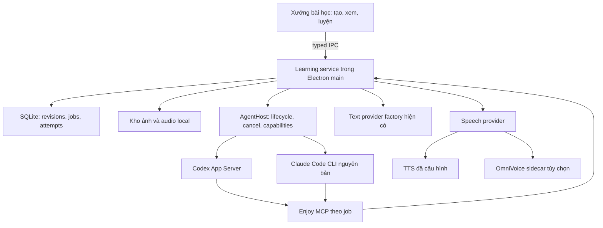
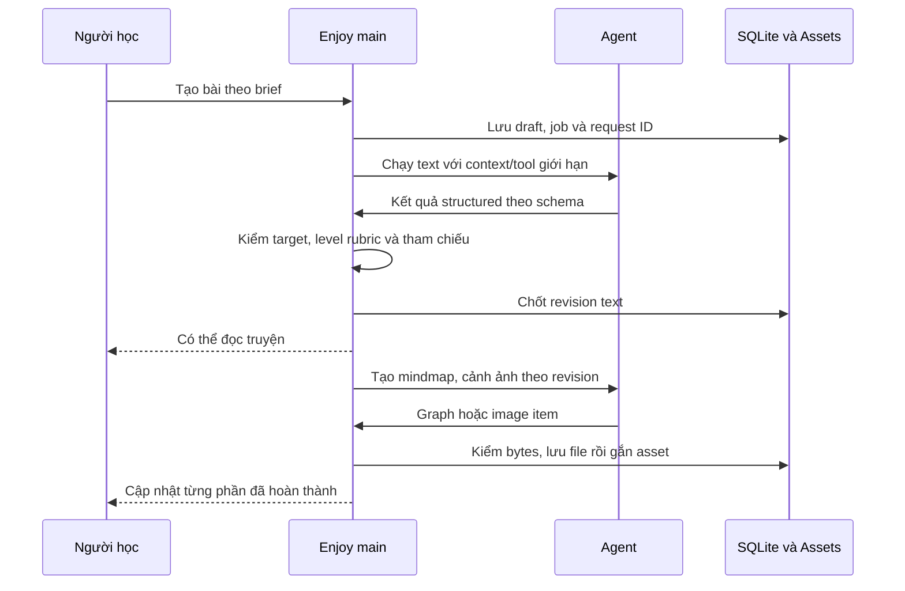
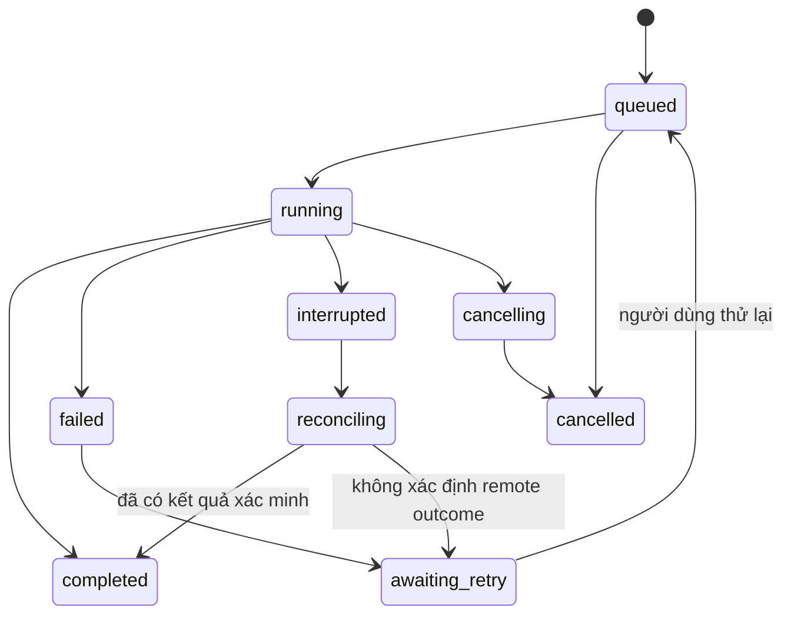

# Xưởng bài học AI trong Enjoy - Plan

## Goal Capsule

Tạo bài học ngay trong Enjoy từ level, chủ đề hoặc từ khóa: câu chuyện, mindmap từ liên quan, ảnh minh họa, audio và bài luyện liên kết với nhau.

- Quyết định người dùng: thao tác chủ yếu trong Enjoy; khai thác Codex và Claude Code, ưu tiên năng lực tạo ảnh của Codex; nghiên cứu OmniVoice MLX nếu khả thi.
- Nền tảng: Electron app hiện tại trong `enjoy/`, local-first cho nội dung sinh mới. Không chuyển thành web app và không cần server mới để lưu bài học.
- Phạm vi thực hiện của tài liệu: kế hoạch, chưa triển khai. Các đơn vị bên dưới chỉ bắt đầu khi người dùng yêu cầu triển khai.
- Quyền ưu tiên: yêu cầu người dùng, quy tắc repository, Product Contract, rồi chi tiết triển khai.
- Cổng bắt đầu: U1 xác minh contract/runtime và cách xác thực của agent. Không gọi một nhánh tích hợp là hoàn thành nếu chỉ qua mock.
- OmniVoice là phần tùy chọn có cổng riêng về model/runtime, chất lượng và quyền sử dụng. Việc nhánh này chưa đủ điều kiện không ngăn phần story, mindmap và Codex image.
- Bảo toàn các sửa đổi YouTube chưa commit. Không tự commit, push, mở PR, merge hay phát hành trong lượt lập kế hoạch này.

---

## Product Contract

### Summary

Thêm mục **Xưởng bài học** vào thanh điều hướng. Người dùng nhập chủ đề hoặc từ khóa, chọn mức A1-C2 và độ dài, rồi bấm **Tạo bài học**. Một bài học dùng chung nội dung cho đọc, xem ảnh, nghe, xem mindmap và luyện tập; có thể tạo riêng một mindmap từ một từ hoặc chủ đề.

Kết nối AI đặt trong phần cài đặt một lần. Màn hình học hiển thị kết quả và tiến độ dễ hiểu; thông tin MCP, model, số liệu sử dụng và log đã lọc nằm trong phần nâng cao. Credential và bearer token không được gửi tới renderer.

### Problem Frame

App đã có player, từ điển, ghi âm, chat và TTS. Để tạo nội dung mới theo chủ đề hoặc tập từ tự chọn, người học vẫn phải tự ghép công cụ để có bài luyện vừa sức. Bản này tập trung vào nhu cầu đó; nhập context trực tiếp từ Stories, Documents, Videos hoặc Vocabulary là hướng nối tiếp. Stories hiện nhập nội dung từ URL và theo server API; `extractStory` là trích từ, chưa phải sáng tác câu chuyện.

Thiếu một đơn vị bài học giữ ổn định tập từ đang học và liên kết text với hình, audio, bài tập. Thiếu job bền vững nên không nên ghép pipeline dài trong React hooks. Tài liệu nghiên cứu chi tiết ở [báo cáo nghiên cứu](../research/2026-09-06-enjoy-learning-studio.md).

### Requirements

**Tạo và học nội dung**

- R1. Luồng chính chạy trong Enjoy, không yêu cầu người học soạn prompt hoặc chuyển sang terminal để tạo từng bài.
- R2. Tạo câu chuyện tiếng Anh theo level A1-C2 từ chủ đề, từ khóa hoặc cả hai; glossary/giải thích có tiếng Việt. Level được hiển thị là mức gợi ý, không phải chứng nhận CEFR.
- R3. Nhận 1-12 từ/cụm từ mục tiêu; nếu chỉ nhập chủ đề thì đề xuất mặc định 6 từ có thể sửa. Mọi target đã chốt phải có trong truyện, được dùng đúng nghĩa và có ví dụ. Từ vượt level phải được giải thích và đánh dấu, không âm thầm bỏ đi.
- R4. Tạo mindmap độc lập từ một từ/chủ đề hoặc từ bài học; node có nghĩa, từ loại khi phù hợp, câu ví dụ và kiểu quan hệ. Bấm node để nghe, xem ví dụ, chọn làm target cho bài học.
- R5. Tạo ảnh bằng capability Codex đã kiểm chứng; gắn từng ảnh với cảnh của truyện. Có chế độ ẩn chữ để kể lại theo ảnh, tạo lại riêng ảnh và giữ bản cũ.
- R6. Tạo audio từ đúng revision text đã chốt; nghe toàn bài hoặc từng đoạn, đổi tốc độ phát, ghi âm và nghe lại. Giọng đọc đang cấu hình được dùng khi người dùng chọn; OmniVoice local là lựa chọn thử nghiệm riêng.
- R7. Một bài luyện dùng lại target IDs qua chọn nghĩa, điền từ, xếp câu và kể lại có gợi ý. Đáp án cố định phải chấm được có quy tắc; câu nói tự do không bị chấm sai chỉ vì khác câu mẫu.

**Độ tin cậy và tích hợp**

- R8. Bài học, mindmap, ảnh, audio đã hoàn thành và lượt luyện được lưu local theo profile, mở lại sau quit/restart; không dùng CacheObjects làm kho chính.
- R9. Hiển thị tiến độ theo công đoạn, hủy, thử lại riêng phần lỗi, giữ phần đã xong. Đổi text tạo revision mới và không gắn nhầm audio/ảnh/bài tập của revision cũ.
- R10. Codex và Claude có adapter/capability riêng. MCP dùng công cụ có schema và giới hạn theo job; không lấy token của gói thuê bao để gọi API khác. Không tự chuyển sang provider trả phí khi một provider lỗi.
- R11. Agent không được truy cập credential, database hoặc MCP cá nhân ngoài bài học. Main process kiểm quyền, schema, revision và asset; renderer chỉ nhận dữ liệu cần hiển thị.
- R12. Giao diện dùng Noto Sans, thành phần UI và i18n hiện có; bàn phím, focus, light/dark và cửa sổ hẹp hoạt động. Graph có chế độ danh sách tương đương.

### Key Flows

**F1. Tạo bài theo chủ đề.** Mở Xưởng bài học, chọn A2, nhập “đi cà phê với đồng nghiệp”, chỉnh 6 target, chọn ảnh/audio rồi tạo. App lưu brief, chạy text và validator, hiển thị truyện ngay khi đạt hợp đồng. Mindmap, ảnh và audio có trạng thái riêng; không chặn đọc nếu audio đang chờ.

**F2. Tạo mindmap độc lập.** Nhập `bank`; app yêu cầu chọn nghĩa ngân hàng hoặc bờ sông trước khi mở rộng. Nếu là một chủ đề rõ như `travel`, tạo các nhánh theo tình huống, hành động, đồ vật, cụm từ. Người dùng chọn node rồi bấm “Tạo câu chuyện từ các từ này”.

**F3. Học một bài.** Đọc hoặc xem cảnh, nghe đoạn, thử bài có đáp án, ẩn chữ và kể lại. Lưu đáp án/lượt ghi âm; có mục “Luyện lại từ vừa sai”. Chưa thêm thuật toán lộ trình tự động hoặc điểm CEFR.

**F4. Thử lại và đổi nội dung.** Ảnh lỗi thì bấm tạo lại ảnh, không tạo lại truyện. Sửa truyện tạo revision kế tiếp; giao diện ghi rõ tài nguyên nào đang thuộc bản trước và cần tạo lại. Hết quota hiển thị nhà cung cấp và lựa chọn thử lại, không phát sinh API fallback tự động.

### Acceptance Examples

- AE1, R2-R3: chọn A2 với `order`, `menu`, `coffee`, `colleague`, `prefer`, `bill`; truyện có đủ sáu mục hoặc biến thể hình thái hợp lệ, glossary gắn đúng câu và không bỏ target khi model trả thiếu.
- AE2, R4: mindmap `bank` ở nghĩa ngân hàng không gộp “river bank” như từ đồng nghĩa; cạnh synonym/antonym/word-family/collocation được phân biệt. Không bịa antonym cho từ không có đối nghĩa phù hợp.
- AE3, R5-R9: truyện xong, ảnh 1 xong, ảnh 2 lỗi; quit/restart vẫn thấy text và ảnh 1, chỉ thử lại ảnh 2 theo yêu cầu.
- AE4, R7: đáp án `Coffee, please.` được chấp nhận theo quy tắc normalize khi có khác biệt viết hoa/dấu câu; hệ thống không bỏ dấu tiếng Việt hoặc xóa dấu nháy có nghĩa. Bài nói tự do hiển thị gợi ý, không lấy equality với câu mẫu làm điểm.
- AE5, R10-R11: fixture user config có một MCP ngoài Enjoy; job học không thấy/call được MCP đó. Token job A không đọc hoặc ghi bài của job B.
- AE6, R6-R9: sửa câu ở revision 2 giữ audio revision 1 ở bản cũ; phát revision 2 không tự dùng audio cũ. Hủy lúc local TTS tính toán dừng đúng sidecar mà app sở hữu.

### Scope Boundaries

**Bản đầu:** tạo bài trong Enjoy, hai agent text connectors, Codex image, mindmap độc lập/liên kết bài, audio hiện có, luyện cố định và kể lại, local persistence, khả năng khôi phục và kiểm quyền. Nghiệm thu toàn bộ bản đầu yêu cầu cả hai native text connectors và Codex image đạt; một milestone thiếu capability không được gắn nhãn hoàn tất core. Khi sử dụng, chỉ cần một text backend đã kiểm chứng để tạo truyện và glossary; luyện cố định mở khi U9 có mặt. Ảnh/audio là lựa chọn riêng trên từng bài, không bắt buộc người học kết nối cả hai agent. Capability chưa vượt U1 bị khóa kèm lý do cụ thể.

**Nhánh thử nghiệm có điều kiện:** OmniVoice trên Apple Silicon. Chuẩn bị adapter và phép thử; chỉ tải/chạy model khi phạm vi sử dụng cho phép và người dùng chọn cài. Bản phát hành thương mại chưa bao gồm weights hoặc tự tải model nếu chưa giải quyết license.

**Deferred to Follow-Up Work:** camera realtime, voice cloning, podcast nhiều người nói, chấm phát âm mới, lộ trình thích ứng, cloud sync/chia sẻ public, editor truyện tranh tự do, marketplace prompt, export PDF. Không mở các hướng này chỉ vì video có nhắc tới.

---

## Planning Contract

### Key Technical Decisions

- KTD1. **Enjoy là giao diện chính** (session-settled: user-directed, chọn “Chủ yếu tạo ngay trong Enjoy” thay cho thao tác chính từ Codex/Claude hoặc luồng kết hợp ngang nhau). Agent chạy dưới sự điều phối của app; kết nối bên ngoài qua MCP là khả năng bổ sung.
- KTD2. **Domain local mới.** Dùng các entity bài học, revision, graph, asset và job/attempt trong bảng Data and Tool Contracts; không nhét vào remote `StoryType`. Tham chiếu schema và DB wiring ở `enjoy/src/main/db/index.ts`, giữ remote `/stories` hoạt động.
- KTD3. **Một application service.** UI qua typed IPC và agent qua MCP đều gọi cùng validation/storage service trong main. Tool agent chỉ đọc context hoặc gửi kết quả của job đã được tạo; không để tool tự gọi lại AgentHost và sinh vòng lặp agent vô hạn.
- KTD4. **Codex App Server trực tiếp; Claude native CLI.** Giữ event typed, cancel, auth và artifact fidelity. Claude dùng binary nguyên bản, JSONL và JSON schema; không đưa ACP vào bản đầu chỉ để đồng nhất hai transport. Bài học từ Buzz là lifecycle/catalog, không phải sao chép relay. [Nguồn kiến trúc và điều kiện](../research/2026-09-06-enjoy-learning-studio.md#3-học-gì-từ-buzz).
- Tham chiếu bổ sung 2026-09-07: [Buzz và Obsidian Agent Client](../research/2026-09-07-native-cli-client-patterns.md). U4 dùng provider registry, phân loại lỗi auth rõ ràng và event/session abstraction; lựa chọn transport phải qua capability tests với phiên CLI hiện có.
- KTD5. **Tái dùng xác thực CLI, giới hạn thực thi theo job.** Theo điều chỉnh của người dùng ngày 2026-09-07, mặc định giữ phiên đăng nhập Codex CLI và Claude CLI hiện có. CLI tự đọc/refresh credential trong profile của người dùng; Enjoy không đọc/copy token và không yêu cầu login riêng. Workspace và MCP capability vẫn riêng từng job. Auth status cần đúng HOME, USER và biến đường dẫn profile đang có; không truyền API-key/token environment. Chỉ dẫn đăng nhập chính thức khi CLI xác nhận cần đăng nhập, không suy ra từ lỗi probe. Phải kiểm effective tools/settings, không tin config overlay là allowlist. API-key mode là cấu hình riêng, có nhãn usage, không phải fallback ngầm.
- KTD6. **MCP loopback có phạm vi job.** Main sở hữu Streamable HTTP endpoint trên `127.0.0.1`, cổng ngẫu nhiên, bearer capability ngắn hạn, Host/Origin validation, giới hạn body/concurrency. Không expose ra LAN. Dùng SDK protocol thay vì tự viết JSON-RPC. `dynamicTools` Codex-only là phương án dự phòng nếu MCP không đáp ứng, cần ghi ADR trước khi đổi.
- KTD7. **Agent và model text không cùng một abstraction.** `createChatModel`/`jsonCommand` tiếp tục phục vụ text/JSON bằng API hoặc local model đã cấu hình. `AgentBackend` riêng cho Codex/Claude. Cả hai trả về cùng `LessonDraft` schema; cùng bộ validator quyết định hợp lệ.
- KTD8. **Revision bất biến, job có checkpoint.** Text đã chốt là nguồn chung cho graph, scene prompts, TTS và exercise. Asset có revision/section/node ID, checksum, MIME, engine/model/prompt version. Kết quả cũ vẫn mở được; tạo lại không ghi đè file của bản cũ.
- KTD9. **Mindmap là dữ liệu có thể sửa.** Schema riêng, node ID và typed edges, renderer dùng React Flow với layout xác định và danh sách accessible. Không lưu mindmap chỉ dưới dạng ảnh do AI tạo. [React Flow](https://reactflow.dev/learn/tutorials/mind-map-app-with-react-flow).
- KTD10. **Level là mục tiêu có rubric.** A1-C2 được kiểm bằng cấu trúc, ngữ pháp, độ rõ, target coverage và bộ mẫu; độ dài chỉ là tham số UX. Chưa có lexicon CEFR được cấp phép cho mọi từ, nên không báo phần trăm từ ngoài level như một phép đo chuẩn. [CEFR](https://www.coe.int/en/web/common-european-framework-reference-languages/level-descriptions).
- KTD11. **TTS độc lập, một owner audio.** Tách phần provider dispatch có thể tái sử dụng khỏi OpenAI-only builder. Audio của bài học mới do `GeneratedAsset` sở hữu, không tạo thêm record `Speech` cho cùng audio. Giữ storage và semantics của Speech hiện tại cho nội dung cũ; tái sử dụng player/recorder qua media URL. Audio bản đầu theo đoạn/câu và duration thực tế; không hứa word timestamps từ OmniVoice. OmniVoice đặt sau cổng riêng, vì model card/runtime và license cần xác minh exact pair. [Bằng chứng OmniVoice](../research/2026-09-06-enjoy-learning-studio.md#5-omnivoice-mlx).

### Assumptions

Mục tiêu đầu tiên là người lớn học English với giải thích tiếng Việt trên desktop hiện có. Pilot tập trung A2-B1 và tình huống hằng ngày; schema vẫn hỗ trợ A1-C2, từng mức cần qua rubric/corpus trước khi hiển thị là đã kiểm thử. Người dùng chọn level ban đầu, không tổ chức placement test trong bản đầu. Mặc định bài ngắn, một giọng đọc, một đến bốn cảnh; UI cho chọn độ dài nhưng không tự tăng số ảnh hoặc gửi yêu cầu tạo audio ngoài lựa chọn đã chốt.

Local-first nghĩa là nội dung hoàn tất nằm trong profile đang mở. Không đồng nghĩa model cloud chạy offline hoặc bỏ toàn bộ cơ chế login của app. Route mới cần local-profile guard cho phiên đã mở thư viện và còn dữ liệu cục bộ; hết hạn server session không được xóa bài. Truy cập profile khác phải qua lifecycle hiện có.

### High-Level Technical Design

MCP không enqueue lại tác vụ sinh đang chạy. Host tạo job; agent chỉ nhận schema, brief và tool được phép hoàn tất đúng công đoạn. Phần ảnh từ native Codex item được main import, không yêu cầu model tự chọn đường dẫn database.

Mỗi công đoạn có trạng thái riêng. Parent job tổng hợp `completed`, `partial` hoặc trạng thái đang chạy. Kết nối mất không tự có nghĩa đã hủy. Không tự phát lại request có thể đã tính phí; trước hết đối chiếu provider item/session và asset checkpoint.

### Data and Tool Contracts

| Đối tượng | Nội dung và invariant |
|---|---|
| `LearningLesson` | ID local, profile ID, title, active revision, ngày tạo; không yêu cầu URL server. |
| `LessonRevision` | Brief, level, targets theo sense, text sections, glossary, exercise spec, validation/provenance; phần text đã chốt bất biến. |
| `LearningMap` / `LearningMapRevision` | Map identity độc lập hoặc liên kết lesson revision; graph content bất biến theo version, layout lưu riêng. Node IDs ổn định trong từng lineage, sửa content tạo version mới. |
| `AssetSlot` | Một scene image hoặc section/node narration của đúng content revision; giữ `selectedAssetId` và source content hash. |
| `GeneratedAsset` | Một variant bất biến, một slot, owns file riêng theo asset UUID và metadata image/audio: hash, MIME, size, duration, provider/provenance. Không chia sẻ file vật lý giữa asset records trong bản đầu; không tạo Speech record song song. |
| `GenerationJob` | Parent có profile/resource ID và request dedupe key; tổng hợp trạng thái các stage. |
| `GenerationStage` | Công đoạn logic text/map/scene/section, expected revision, slot, active attempt ID và commit checkpoint. |
| `StageAttempt` | Mỗi invocation provider một identity bất biến; ordinal, provider session/item IDs, trạng thái/outcome, timestamps và error code. Retry tạo attempt mới, không xóa bằng chứng attempt trước; không lưu credentials. |
| `PracticeAttempt` | Revision và question/target IDs, loại bài, câu trả lời, kết quả có quy tắc hoặc trạng thái chưa chấm; không trộn với pronunciation score. |

Tool surface bản đầu: `enjoy.get_job_context`, `enjoy.get_lesson_revision`, `enjoy.submit_lesson_draft`, `enjoy.submit_mindmap`, `enjoy.submit_exercises`, `enjoy.get_job_status`. Mọi read/write giới hạn theo capability do main cấp; write bắt buộc expected revision, active stage/attempt ID và idempotency key. Lỗi schema/revision trả lỗi có cấu trúc. Không có generic SQL, shell, đọc file tùy ý, lấy settings hay ghi đè tài nguyên ngoài job. Ảnh/audio trả asset ID và metadata nhỏ, không đẩy binary lớn qua MCP.

**Kênh kết quả và commit.** Native Codex/Claude gửi candidate text/map/exercise qua MCP submit; final prose chỉ là lời dẫn, không parse thêm để commit. API text trả structured result trực tiếp; ảnh Codex chỉ nhận từ native image item. Tất cả được chuẩn hóa thành `StageCandidateEnvelope` gồm schema version, job/stage/attempt IDs, expected revision và payload hash trước một validate/commit service duy nhất. U1 phải chứng minh từng kênh này. Schema bài tập canonical nằm ở U2; U5 sinh definitions, U9 render/chấm theo cùng schema. Mỗi lượt repair có attempt/provenance riêng, tối đa hai lượt và kiểm cancel trước khi gọi lại.

**Profile lifecycle.** Mỗi job giữ `ProfileContext` bất biến gồm profile ID, connection identity và asset root. Không đọc lại global `settings.user` khi callback hoàn tất. Switch/logout/reset phải ngừng nhận job, thu hồi capabilities, cancel đúng child process, chờ transaction/file publish kết thúc và ghi checkpoint, rồi mới disconnect DB hoặc xóa thư mục. Callback cũ bị từ chối trước khi truy cập connection mới. Session server hết hạn không đồng nghĩa logout hoặc xóa local profile.

**Integrity và storage.** Source đang tắt SQLite foreign keys, vì vậy không dựa vào cascade tự động và không đổi PRAGMA toàn app trong tính năng này. Learning service là writer duy nhất, kiểm reference/profile/revision trong transaction, dùng unique indexes cho identity/dedupe và xóa quan hệ theo thứ tự rõ ràng. Recovery kiểm record/file mồ côi trước cleanup. Kho `learning-assets` nằm trong profile; mỗi variant sở hữu một file, không dedupe bytes giữa các revision trong bản đầu. Theo dõi dung lượng, kiểm dung lượng trống trước generation/import, xử lý disk-full không mất bản đã lưu; cho người dùng xóa revision/variant cũ có xác nhận và số dung lượng thu hồi. Không tự xóa lịch sử còn được tham chiếu; GC chỉ xóa staging hoặc file đã xác minh không còn record tham chiếu.

| Thao tác | Quy tắc version và tài nguyên |
|---|---|
| Sửa text, target sense, scene hoặc exercise source | Tạo LessonRevision mới; ảnh/audio/attempts cũ chỉ ở lịch sử, không tự gắn sang bản mới. |
| Tạo lại ảnh/audio, giữ nguyên source | Tạo variant mới trong cùng slot; người học chọn variant, bản cũ còn mở được. |
| Sửa nghĩa, ví dụ hoặc cạnh của map | Tạo LearningMapRevision; node audio gắn version và content hash mới. Đổi vị trí node chỉ sửa layout. |
| Chọn node để tạo truyện | Snapshot node ID, map version, sense và ví dụ vào brief; không giữ live pointer bị đổi theo map. |
| Retry hoặc nhận kết quả muộn | Retry riêng stage lỗi với attempt mới; chỉ active attempt + expected revision được commit. Unknown remote outcome phải reconcile hoặc để người dùng chủ động retry với lưu ý có thể tính phí lần nữa. |

**Ranh giới tiến trình và dữ liệu.** Learning IPC chỉ chấp nhận main-window webContents, main frame và app origin đã pin; từ chối popup, subframe, frame đã điều hướng hoặc profile context cũ trước khi gọi service. U1 chứng minh policy native không cho agent đọc config/DB/credential ngoài workspace hoặc dùng shell/MCP ngoài scope. Capability ít nhất 128 bit, server giữ hash, bind profile/job/stage/tool/revision, thu hồi khi job kết thúc, cancel, process exit hoặc profile switch. Không đưa token vào argv/URL/log; U1 chốt bootstrap mà native transport hỗ trợ qua pipe hoặc private config mode 0600 ngoài tool-readable workspace, hạn chế environment và cleanup khi crash. Nếu không chứng minh được isolation thì capability đó không vượt gate.

Log chỉ nhận event fields trong allowlist đã loại secrets, auth URL/code, raw process payload và nội dung bài học; không lưu stdout/stderr nguyên bản. Diagnostics local có giới hạn dung lượng/thời gian, export do người dùng chủ động và được xem trước. Threat model bảo vệ profile/service khỏi model và renderer ngoài scope; không tuyên bố chống được tiến trình độc hại có toàn quyền cùng OS account.

| Công đoạn | Payload tối thiểu được gửi tới engine đã chọn |
|---|---|
| Text/map/exercise | Brief, targets/senses và đoạn revision cần thiết; không gửi toàn bộ thư viện hoặc lịch sử. |
| Ảnh Codex | Scene, mô tả nhân vật và context ngắn đã chốt. |
| Cloud TTS | Text của đoạn cần đọc và cấu hình giọng; không gửi recording. |
| Local OmniVoice | Text đến sidecar trên máy; download model là thao tác riêng. |

Connection UI nói rõ engine cloud/local và đường usage trước lần dùng đầu. Không hứa provider không lưu dữ liệu nếu chưa có bằng chứng; link chính sách provider hiện hành. Recording và attempts giữ local trong phạm vi này. Test payload allowlist và secret canaries trước mọi log/renderer/export sink.

### Quality and UX Defaults

- Story mặc định khoảng 150-250 từ cho bài A2; các mức/độ dài khác có preset riêng, tối đa 1.200 từ cho một bài trong bản đầu. Đây là lựa chọn sản phẩm, không phải quy định CEFR. Topic tối đa 500 ký tự, mỗi target tối đa 80 ký tự.
- Parser giữ multiword phrase, phân biệt sense, dùng word boundary/lemma có kiểm soát. `art` không được tính là đã xuất hiện chỉ vì có `artist`. Target khó ở A1 cần gloss và flag, không sửa target để qua test. Nếu tập target làm rubric hoặc độ tự nhiên không đạt, giữ draft, đề nghị giảm/chia target thành nhiều bài và chờ người dùng chọn; không tự bỏ từ.
- Schema pass trước, deterministic coverage/answer/reference checks sau, rồi một lượt kiểm nội dung theo rubric. Tối đa hai lượt sửa tự động; còn thiếu thì giữ draft và chỉ ra mục chưa đạt. Model tự gắn nhãn A2 không đủ để pass. Tra cứu dictionary hiện có để kiểm sense/quan hệ khi có dữ liệu và lưu nguồn; chỉ assertion có bằng chứng mới mang nhãn đã kiểm. Quan hệ chưa đủ bằng chứng bị ẩn khỏi graph mặc định hoặc gắn rõ là gợi ý chưa xác minh khi người dùng mở; không gọi model tự đánh giá là xác minh độc lập. Nội dung đã qua pipeline vẫn là AI draft đã kiểm theo rubric, không bảo đảm tuyệt đối về sư phạm.
- Mindmap mặc định 12-20 nodes, tối đa 40 visible nodes. Mở rộng một nhánh theo yêu cầu; không tự crawl quan hệ vô hạn. Người học có thể sửa nghĩa/loại cạnh và xóa node, các tham chiếu liên quan được kiểm lại.
- Image briefs lấy từ scene và entity description dùng chung, tạo tối đa bốn ảnh được chọn. Nhãn/câu bài học render bằng UI; không phụ thuộc chữ trong bitmap. Ảnh là minh họa do AI tạo, người học có thể báo hình sai hoặc tạo lại cảnh.
- Form có ba lựa chọn đầu vào chính; advanced settings thu gọn. Màn hình kết quả có các tab Câu chuyện, Mindmap, Luyện tập và player dùng chung. Chỉ một CTA chính “Tiếp tục học”, hạn chế biến trang thành dashboard kỹ thuật.

### UI State Contract

Trang Xưởng mở bằng thư viện local: bài đang tạo đứng trong nhóm riêng, bài đã lưu và mindmap độc lập có bộ lọc; empty state có hai CTA tạo bài hoặc tạo mindmap. Draft form được giữ khi đi tới Cài đặt rồi quay lại.

- Trước generation, target đa nghĩa mở bước chọn nghĩa bằng định nghĩa và ví dụ; chỉ hiện với từ cần phân giải. Chốt sense IDs vào brief, dùng chung cho truyện, glossary, graph và bài tập.
- Preflight từng engine: thiếu CLI/login/capability có CTA “Kết nối trong Cài đặt”; thiếu text backend thì khóa tạo, thiếu ảnh/audio thì cho người dùng bỏ chọn phần đó. Không tự bỏ lựa chọn hoặc đổi provider. Khi quay lại, probe cập nhật khả năng và giữ nguyên brief.
- “Sửa bài” tạo draft editable; “Hủy” trở về bản đang học, “Lưu thành bản mới” validate rồi chuyển active revision với hành vi đã ghi ngay trên nút/mô tả. Dừng player của bản trước khi chuyển. Có revision selector để mở lại lịch sử, nhãn bản nguồn trên tài nguyên cũ và CTA tạo lại phần còn thiếu. Không cần hộp xác nhận thứ hai cho thao tác lưu có thể đảo ngược.
- Tabs có semantics/name và heading đúng; form có label và lỗi gắn field. Live region polite báo hoàn tất từng công đoạn, lỗi cần hành động dùng alert; không đọc lại mỗi token hoặc giành focus khi asset về. Tạo xong giữ focus ở trạng thái có nút “Mở bài”; mở bài đặt focus heading. Retry giữ focus nút/trạng thái tương ứng; xóa node chuyển tới node/list item lân cận; đổi revision đặt focus heading phiên bản. Graph/list có cùng thông tin và hành động.

| Trạng thái | Nội dung và hành động |
|---|---|
| queued/running | Hiển thị công đoạn đang chờ/chạy, phần đã lưu dùng được; có Hủy, chưa có Retry. |
| cancelling | “Đang dừng”; khóa Hủy/Retry cho tới khi local process và commit gate dừng. Không nói remote đã hủy nếu chưa có xác nhận. |
| interrupted/reconciling | “Đang kiểm tra kết quả trước khi thử lại”; giữ nội dung đã có, không phát lại request. |
| failed | Lý do cụ thể; sửa input/kết nối hoặc chuyển sang awaiting_retry khi điều kiện hợp lệ. |
| awaiting_retry | “Thử lại phần này”; nếu remote outcome chưa rõ, nêu khả năng đã tính phí và cần lựa chọn retry chủ động. |
| cancelled | Phần hoàn tất còn dùng được; Retry tạo attempt mới khi người dùng yêu cầu. |
| completed | Mở/tiếp tục học; tạo lại là thao tác mới có variant riêng. |
| parent partial | Nêu phần đã có và phần còn thiếu, mỗi phần theo state/CTA ở trên; không gắn toàn bài là hoàn tất. |

U6/U7/U9/U11 dùng bảng này làm oracle cho E2E về sense, settings roundtrip, save/cancel revision, screen reader semantics và focus trong cập nhật bất đồng bộ.

### Delivery Order

| Giai đoạn | Đơn vị | Kết quả có thể xem và nghiệm thu |
|---|---|---|
| P0: chứng minh tích hợp | U1 | Native Codex nhận text/ảnh, Claude text/MCP, isolation/auth/cancel được kiểm với exact versions. |
| P1: lát cắt dùng được | U2-U6 | Nhập brief trong Enjoy, tạo và lưu truyện, ảnh, tiến độ, restart và xem lại local. |
| P2: vòng học hoàn chỉnh | U7-U9 | Mindmap, audio, bài tập và kể lại cùng target set. |
| P3: local TTS thử nghiệm | U10 | OmniVoice chỉ khi gate model/runtime, chất lượng và phạm vi sử dụng pass. |
| Chốt bản desktop | U11 | Packaged app qua nghiệm thu thực; công bố rõ capability nào đã pass. |

U1 quyết định bằng chứng trước khi đầu tư toàn bộ giao diện connector. U4 có hai adapter giao độc lập; U5 bắt đầu khi U2-U3 và ít nhất một text backend đạt, phần ảnh U6 cần Codex image riêng. U7 graph và U8 narration có thể triển khai độc lập sau contracts; nghiệm thu nghe node của R4 cần cả U7 và U8; U9 cần cả hai phần text/asset semantics ổn định. Chưa đưa ước lượng ngày thành cam kết trước U1.

---

## Implementation Units

| Unit | Trọng tâm | Đường dẫn chính | Phụ thuộc |
|---|---|---|---|
| U1 | Compatibility và live feasibility | `enjoy/docs/agent-compatibility.md` | Không |
| U2 | Local domain và migration | `enjoy/src/main/db/models/learning-lesson.ts` | U1 contracts |
| U3 | Jobs, MCP, IPC | `enjoy/src/main/learning/` | U2 |
| U4 | Agent adapters và connection UI | `enjoy/src/main/agents/` | U1, U3 |
| U5 | Structured lesson generation | `enjoy/src/commands/generate-lesson.command.ts` | U2-U3 + một text backend đạt |
| U6 | Studio và image artifacts | `enjoy/src/renderer/pages/learning-studio.tsx` | U3-U5 |
| U7 | Mindmap standalone và lesson | `enjoy/src/renderer/components/mindmaps/` | U2-U5 |
| U8 | Narration | `enjoy/src/main/learning/narration-service.ts` | U2-U5 |
| U9 | Controlled practice và retelling | `enjoy/src/renderer/components/learning/practice/` | U5-U8 |
| U10 | OmniVoice experimental | `enjoy/src/main/speech/local-mlx-provider.ts` | U8, OmniVoice gates |
| U11 | Nghiệm thu và đóng gói | `enjoy/e2e/learning-studio.spec.ts` | U6-U9; U10 nếu bật |

Các file chưa có dưới đây là file dự kiến tạo, không phải khẳng định đã tồn tại. Chọn timestamp migration theo convention Umzug lúc triển khai; không sửa migration đã chạy.

### U1. Chứng minh native agent và khóa compatibility contract

**Goal / Requirements:** chốt đường đi R1, R5, R10-R11 trước khi xây hệ thống đầy đủ; theo KTD4-KTD6.

**Dependencies:** không.

**Files:** mới fixture harness `enjoy/scripts/fixtures/agent-spike/`, `enjoy/docs/agent-compatibility.md`, `enjoy/scripts/check-agent-protocol.mjs`, `enjoy/e2e/agent-native-smoke.spec.ts`, `enjoy/src/types/agent-backend.ts`.

**Approach:** vertical spike gồm MCP fixture có một Enjoy submit tool, process adapters tối thiểu và auth/cancel fixture; không phụ thuộc U3-U4 chưa tồn tại. Giữ type contracts và transcript đã lọc làm đầu vào U3-U4, bỏ glue thử nghiệm sau khi thay bằng production adapters. Kiểm exact Codex/Claude version, schema/events, auth flow, config isolation, JSON result, image item và cancel. Dùng fixture home cho kiểm không đăng nhập; native acceptance giữ auth profile hiện có và dùng workspace do Enjoy sở hữu ngoài repo người dùng. Contract capabilities phân biệt supported, unavailable, unknown; ảnh được kiểm qua request thực nhỏ trên tài khoản được người dùng chọn khi bắt đầu triển khai. Claude native giữ nguyên auth, không biến SDK login thành route dùng subscription.

**Test scenarios:** binary thiếu/không tương thích báo lý do; MCP lạ trong config không lọt vào job; malformed JSONL không làm chết host; cancel, process exit và quota thành event có thể hiểu; Codex trả ảnh thật có bytes hợp lệ; Claude trả structured text và gọi đúng Enjoy tool. Không có credential trong logs/artifacts.

**Verification:** lưu compatibility matrix với exact versions và bằng chứng file/event đã loại secrets. Có schema nhưng chưa chạy ảnh thì đánh dấu chưa đạt. Nếu native route không hỗ trợ điều kiện đã chọn, dừng nhánh đó và đưa lựa chọn API rõ ràng, không tự thay.

### U2. Local lesson domain và persistence

**Goal / Requirements:** R2-R4, R8-R9; KTD2, KTD8.

**Dependencies:** U1 định dạng domain/event đã chốt.

**Files:** mới `enjoy/src/types/learning.ts`, `enjoy/src/lib/learning-schemas.ts`, model files `learning-lesson.ts`, `lesson-revision.ts`, `learning-map.ts`, `learning-map-revision.ts`, `asset-slot.ts`, `generated-asset.ts`, `generation-job.ts`, `generation-stage.ts`, `stage-attempt.ts`, `practice-attempt.ts` trong `enjoy/src/main/db/models/`; migration mới trong `enjoy/src/main/db/migrations/`; cập nhật model exports và `enjoy/src/main/db/index.ts`; mới `enjoy/scripts/check-learning-storage.mjs`.

**Approach / Patterns:** theo Sequelize/Umzug hiện có; transaction cho revision và references, immutable text revision, profile isolation. File bytes ngoài DB, DB giữ metadata và tham chiếu. U2 sở hữu cả exercise schema trong `learning-schemas.ts`. Xóa bài xử lý slot, owned asset và attempts đúng profile bằng service transaction; không sửa hoặc tạo Speech records cho learning audio. Kiểm dangling references và index uniqueness với SQLite thật, không coi FK declarations là enforcement.

**Test scenarios:** migrate từ database fixture phiên bản hiện tại; migration chạy lại an toàn; save rồi mở lại; đồng thời tạo revision dùng expected-version; lỗi file/DB không tạo record hoàn tất giả; xóa revision không xóa asset còn được tham chiếu; đổi profile không đọc bài của profile trước.

**Verification:** fixture SQLite thật giữ toàn bộ bundle qua close/open, migration không thay dữ liệu Stories/YouTube/settings cũ.

### U3. Job service, IPC và Enjoy MCP

**Goal / Requirements:** R8-R11; KTD3, KTD6, KTD8.

**Dependencies:** U2.

**Files:** mới `enjoy/src/main/learning/service.ts`, `job-runner.ts`, `mcp-server.ts`, `tool-registry.ts`, `asset-store.ts`; mới handler `enjoy/src/main/db/handlers/learning-handler.ts`; cập nhật `enjoy/src/main.ts`, `enjoy/src/main/window.ts`, `enjoy/src/main/settings.ts`, `enjoy/src/renderer/context/app-settings-provider.tsx`, DB handler exports, `enjoy/src/preload.ts`, `enjoy/src/types/enjoy-app.d.ts`, `enjoy/package.json`; mới `enjoy/scripts/check-learning-jobs.mjs`, `check-learning-mcp.mjs`.

**Approach:** cùng service cho IPC/MCP. Mỗi active stage/attempt một capability trong job scope, một writer/lease, stage checkpoints và giới hạn một generation đang hoạt động cho mỗi lesson. Main chuẩn hóa event, validate sender IPC và resource scope. Token không xuất hiện trong renderer, query URL hoặc log. Server chỉ khởi động khi có agent job và đóng khi không còn job.

**Test scenarios:** covers AE3/AE5; mất kết nối, restart giữa từng stage, duplicate submit, stale revision, hủy rồi late result; token hết hạn/sai job/Origin lạ bị từ chối; tool gọi chéo profile hoặc yêu cầu SQL/file arbitrary bị từ chối; nội dung topic mang prompt injection không mở thêm tools. IPC và MCP cho cùng một draft phải cùng kết quả validation/storage.

**Verification:** server thật qua MCP initialize/list/call, SQLite thật, sockets đóng và không tạo request trả phí trùng khi recover. Renderer có thể đổi route mà job vẫn có trạng thái. Test switch/logout/reset ở mọi checkpoint, stale callback không được ghi vào profile mới; replay capability đã revoke và dual submission channel không commit lần hai.

### U4. Codex và Claude connectors

**Goal / Requirements:** R1, R5, R9-R11; KTD1, KTD4-KTD7.

**Dependencies:** U1, U3.

**Files:** mới `enjoy/src/main/agents/agent-host.ts`, `codex-backend.ts`, `claude-code-backend.ts`, `process-manager.ts`, `capabilities.ts`; mới `enjoy/src/renderer/components/preferences/agent-connections.tsx`; cập nhật preferences registry, preload/types; mở rộng `enjoy/scripts/check-agent-protocol.mjs`, `enjoy/e2e/agent-native-smoke.spec.ts`.

**Approach:** discovery chỉ đề xuất binary; người dùng xác nhận executable canonical tuyệt đối ngoài job folder, nguồn cài và identity. Không dựa vào PATH của dev shell khi packaged. Theo dõi realpath, version, hash hoặc signing identity; kiểm identity trước spawn, binary thay đổi thì về unknown và re-probe, thay nguồn/path cần xác nhận lại. Capability fingerprint gồm binary/protocol/model và account scope không chứa credential; đổi cấu hình/auth hoặc gặp unsupported event thì vô hiệu bằng chứng cũ, khóa capability và dẫn về kết nối. Spawn bằng executable path và argv, không shell interpolation. Main giữ pipes, partial JSONL buffer, request/response IDs, approvals, timeout và process group ownership. Codex dùng app-server với auth profile hiện có; Claude dùng nguyên bản CLI print/stream-json với auth profile hiện có và config/tool policy đã chứng minh ở U1. ProcessManager hiện ép home riêng phải được điều chỉnh trước khi nối runtime. Không lấy kết quả fixture home riêng làm bằng chứng scope của profile hiện có. Chỉ load Enjoy context, không load project/user hooks, plugins, MCP tùy ý. Permission ngoài phạm vi bị từ chối và giải thích trong app, không dùng bypass-permissions.

**Test scenarios:** login hủy/hết hạn, thiếu CLI, path có dấu/khoảng trắng, event split qua nhiều chunks, process crash, permission prompt, quota exhausted, profile switch trong khi job chạy; unknown event bị bỏ qua có log sạch; model text không có image capability không được hiện là image engine.

**Verification:** thao tác connect và tạo nội dung từ packaged app; không chỉnh cấu hình global, không copy credentials. Hiển thị đúng engine và usage source; phát sinh API mode chỉ khi người dùng chọn cấu hình đó.

### U5. Tạo câu chuyện có level và từ khóa

**Goal / Requirements:** R2-R3, R7, R9; KTD7-KTD10.

**Dependencies:** U2-U3 và ít nhất một text backend đã qua probe, có thể là một adapter U4 hoặc API mode do người dùng chọn; không chờ adapter còn lại.

**Files:** mới `enjoy/src/commands/generate-lesson.command.ts`, `enjoy/src/lib/learning-validator.ts`, `enjoy/src/lib/cefr-rubrics.ts`, `enjoy/src/main/learning/generation-service.ts`; cập nhật `enjoy/src/lib/ai-providers.ts`; mới `enjoy/scripts/check-lesson-generation.mjs`, `enjoy/e2e/fixtures/learning-evaluation.json`.

**Approach / Patterns:** reuse `jsonCommand` khi provider API được chọn, adapter structured contract khi native agent được chọn. Chốt brief/target IDs trước generation. Draft trả text sections, glossary, scenes và candidate exercise definitions; validator chạy trong main. Không sửa command extract hiện có.

**Test scenarios:** covers AE1; topic-only/keywords-only/both, input rỗng/dài quá mức, duplicate target, multiword phrases, từ đa nghĩa, `art` so với `artist`, inflection hợp lệ, target nâng cao ở A1, invalid JSON/schema, refusal, thiếu keyword sau hai lượt sửa; không lưu invalid draft là ready. Bài generated English không vô tình dịch toàn bộ sang Vietnamese khi UI là Vietnamese.

**Verification:** bộ mẫu 30 brief gồm sáu level và năm chủ đề; kiểm tự động coverage/schema và đọc mẫu theo rubric. Lưu kết quả rõ là chất lượng nội dung thử nghiệm, không tuyên bố CEFR certification.

### U6. Giao diện Xưởng bài học và ảnh Codex

**Goal / Requirements:** R1, R5, R8-R9, R12; KTD1, KTD8.

**Dependencies:** U3-U5 cho studio; Codex image adapter U4 phải đạt riêng để nghiệm thu ảnh.

**Files:** mới `enjoy/src/renderer/pages/learning-studio.tsx`, `learning-lesson.tsx`, components trong `enjoy/src/renderer/components/learning/`, `enjoy/src/main/learning/image-service.ts`; cập nhật `enjoy/src/renderer/router.tsx`, `enjoy/src/renderer/components/layouts/sidebar.tsx`, `enjoy/src/main.ts`, `enjoy/src/main/utils.ts`, localization en/vi; mới `enjoy/scripts/check-learning-assets.mjs`, `enjoy/e2e/learning-studio.spec.ts`.

**Approach:** form ngắn, preview, gallery local, tiến độ từng phần, image-first retelling. Parse native image item theo schema version. Main kiểm signature/MIME/size/dimensions và approved output roots, từ chối symlink/path traversal; import bằng file staging và atomic publish, sau đó DB attachment. Không tải URL do model tùy ý gửi. Mở file bằng cơ chế no-follow và kiểm identity để tránh path swap; cập nhật đồng bộ protocol resolver trong main.ts và `enjoyUrlToPath` cho allowlist `learning-assets`, canonical path phải nằm trong profile root. Reuse text/lookup UI qua props local, không gọi remote Story API ngầm.

**Test scenarios:** covers AE3; savedPath thiếu nhưng bytes hợp lệ; savedPath ngoài scope/symlink; base64 hỏng, MIME giả, ảnh quá lớn; disk full và crash giữa file/DB; ảnh lỗi không làm mất truyện; sửa scene chỉ tạo ảnh mới của đúng revision; renderer escape output, không thực thi HTML từ model; offline open, bàn phím, graph/list focus, light/dark và cửa sổ 900px.

**Verification:** bấm tạo từ Enjoy, nhận ảnh Codex thật, render, quit/reopen và mất mạng vẫn thấy ảnh đã lưu. UI không báo hoàn tất chỉ vì agent nói “đã tạo ảnh”.

### U7. Mindmap từ và chủ đề

**Goal / Requirements:** phần graph của R4, R8-R9, R12; KTD2, KTD9.

**Dependencies:** U2-U5.

**Files:** mới `enjoy/src/commands/generate-mindmap.command.ts`, `enjoy/src/lib/mindmap-schema.ts`, `enjoy/src/renderer/components/mindmaps/`, `enjoy/src/renderer/pages/learning-mindmap.tsx`; cập nhật router và `enjoy/package.json`; mới `enjoy/scripts/check-mindmap.mjs`, `enjoy/e2e/mindmap.spec.ts`.

**Approach:** root word phải xác định sense khi đa nghĩa; topic root không cần từ loại. Quan hệ gồm category, synonym, antonym, word-family, collocation, situation, related-concept; related-concept không bị trình bày như synonym. Lưu graph content tách layout; dùng node IDs ổn định, mở rộng từng nhánh có giới hạn. Audio node thuộc U8 integration, không đánh dấu đầy đủ R4 chỉ bằng U7 graph.

**Test scenarios:** covers AE2; standalone map không có lesson; root topic, duplicate nodes, edges trỏ ID không tồn tại, tự nối và vòng lặp layout; quá 40 nodes, sửa/xóa node, expand branch không ghi đè sửa thủ công; map saved reopen; chọn nodes -> brief mới giữ sense và level; keyboard list truy cập cùng thông tin.

**Verification:** tạo thật hai map từ đa nghĩa và hai map chủ đề; quan hệ được kiểm bằng ví dụ/dictionary khi có, không giả rằng embedding similarity chứng minh synonym. Dữ liệu không biến mất khi layout đổi.

### U8. Audio theo revision và luyện nghe nói

**Goal / Requirements:** R6, phần nghe node của R4, R8-R9; KTD8, KTD11.

**Dependencies:** U2-U5 cho narration, U7 cho nghe node khi nghiệm thu R4.

**Files:** mới `enjoy/src/main/learning/narration-service.ts`, `enjoy/src/main/speech/provider.ts`; cập nhật `enjoy/src/main/db/models/speech.ts`, `enjoy/src/main/db/handlers/speeches-handler.ts`, `enjoy/src/lib/speech-models.ts`, preload/types; components player/recorder trong `enjoy/src/renderer/components/learning/`; mới `enjoy/scripts/check-learning-narration.mjs`, mở rộng `enjoy/scripts/check-ai-speech.mjs`.

**Approach:** split text theo câu/đoạn dưới giới hạn provider, lưu thứ tự và duration sau khi giải mã audio. GeneratedAsset là owner duy nhất cho learning audio; AssetSlot tham chiếu section của lesson revision hoặc node của map revision kèm content hash. Provider adapter chỉ trả bytes/format và metadata, không tự tạo Speech record; source cũ tiếp tục dùng Speech storage hiện hữu. Reuse recording/player thực hiện nghe, pause và replay. Gắn đoạn với text nguồn, chưa tạo word alignment giả.

**Test scenarios:** covers AE6; text dài hơn 4096 ký tự, câu dài bất thường, đoạn thứ hai fail, giữ thứ tự khi hoàn thành đảo; không tính các đoạn thiếu là audio đầy đủ; provider trả bytes rỗng/sai format; profile switch, mic denied, cancel; sửa text và xóa lesson cleanup đúng owned assets/recording; đổi tốc độ phát không sửa file gốc.

**Verification:** narration thật từ provider người dùng chọn, nghe được toàn bài và từng đoạn; audio/recording local sống qua restart; lỗi paid quota không chuyển engine ngầm.

### U9. Bài tập và kể lại cùng bộ từ

**Goal / Requirements:** R3, R7-R9, R12.

**Dependencies:** U5-U8.

**Files:** dùng exercise schema canonical trong `enjoy/src/lib/learning-schemas.ts` của U2; mới `enjoy/src/lib/practice-grading.ts`, `enjoy/src/renderer/components/learning/practice/`; bổ sung service/handler cho PracticeAttempt; mới `enjoy/scripts/check-learning-practice.mjs`, `enjoy/e2e/learning-practice.spec.ts`.

**Approach:** giữ target IDs qua ba loại bài cố định và một prompt kể lại. Chấm fixed-answer có accepted variants và feedback giải thích; tối thiểu hai lượt gặp lại mỗi target trong phần practice, hoặc báo chưa đủ. Bài tự do lưu text/recording và câu mẫu, không thêm pronunciation scoring mới. “Luyện lại từ vừa sai” lọc theo attempts đã lưu, không cần scheduler mới.

**Test scenarios:** covers AE4; nhiều đáp án hợp lệ, distractor trùng đáp án, câu xếp có hơn một thứ tự đúng; normalized equality theo loại bài; exercise trỏ target ngoài bài bị từ chối; refresh/restart giữ attempt; đổi revision không đổi điểm cũ; ảnh unavailable vẫn có gợi ý text tương đương.

**Verification:** một bài đi đủ đọc/nghe/chọn/điền/xếp/kể, và lỗi của target cụ thể dẫn về đúng bài luyện lại. Không đánh đồng hoàn thành với đã thành thạo.

### U10. OmniVoice local thử nghiệm có điều kiện

**Goal / Requirements:** nhánh tùy chọn R6, R9-R11; KTD11.

**Dependencies:** U8; xác minh phạm vi dùng weights/tokenizer, exact model/runtime pair. Chưa pass thì chỉ giữ thiết kế/provider boundary và trạng thái unavailable, không tải weights hoặc ghi là đã tích hợp.

**Files:** mới `enjoy/src/main/speech/local-mlx-provider.ts`, `local-mlx-manager.ts`, `enjoy/resources/local-tts/manifest.json`, `enjoy/docs/local-tts.md`, `enjoy/scripts/check-local-tts.mjs`, `enjoy/e2e/local-tts.spec.ts`; cập nhật TTS settings, provider registry và `enjoy/forge.config.js` nếu đóng gói runtime.

**Approach:** Python native sidecar do main sở hữu, tải model opt-in với dung lượng/tiến độ/checksum, manifest pin immutable revision và dependency tương thích. Không dùng Python hệ thống làm yêu cầu cho bản consumer. Request WAV và explicit language, một inference tại một thời điểm. Parent dùng private IPC tới wrapper; không expose raw `mlx-audio` management/file endpoints cho renderer/LAN. Cancel có thể terminate sidecar và đánh đổi cold reload; app quit/update thu hồi đúng process. Không voice cloning trong unit này.

**Test scenarios:** Mac arm64/macOS support và Intel unsupported, exact requested checkpoint versus compatible variant không bị đổi âm thầm; tải thiếu/disk full/hash sai/offline; English/VI có dấu, số và tên riêng; chunk voice consistency; OOM/thermal, idle unload, cancel trong load/inference, orphan process; format WAV không bị ghi `.mp3`. Không tuyên bố streaming hoặc word timings.

**Verification:** trước production cần packaged/runtime signing và benchmark Mac thật; lưu cold/warm latency, peak RAM, disk và audio mẫu. Chất lượng 4-bit phải được so với checkpoint tham chiếu trước khi chọn default. Quyền phát hành phải giải quyết riêng với giấy phép pretrained/tokenizer; metadata Apache không đủ.

### U11. Nghiệm thu toàn tuyến và bản đóng gói

**Goal / Requirements:** R1-R12, các AE áp dụng; hoàn thành core U2-U9 và báo riêng U10.

**Dependencies:** U6-U9; U10 chỉ khi được bật.

**Files:** `enjoy/e2e/learning-studio.spec.ts`, `mindmap.spec.ts`, `learning-practice.spec.ts`, `agent-native-smoke.spec.ts`; cập nhật `enjoy/scripts/check-packaged-app.mjs`, `enjoy/docs/agent-compatibility.md`; mới `enjoy/docs/learning-studio-acceptance.md`.

**Approach:** feature-flag rollout trên app desktop hiện tại. Chạy corpus và kiểm mẫu bằng mắt/tai; test native app bằng accounts/profile thử được người dùng cho dùng khi triển khai. Ghi pass/fail/chưa kiểm theo engine, khả năng ảnh, TTS, platform. Giữ signing hook hiện có và xử lý Keychain/login bằng flow OS hợp lệ.

**Test scenarios:** full lesson và standalone map; restart mọi stage; offline reopen sau generation; token/session expiry; user cancel; profile separation; font/IPA/tiếng Việt; keyboard/light/dark; Stories URL import, YouTube custom channels, recording và player không regression.

**Verification:** artifact thật, file thật, SQLite thật, native UI và signed package. Mock chỉ dùng test lỗi hoặc phát triển UI. Loại mã thử bỏ dở, process/socket/temp file; bảo toàn thay đổi ngoài phạm vi.

---

## Verification Contract

| Cổng | Đơn vị | Bằng chứng cần có |
|---|---|---|
| Type/schema | U2-U10 | Typecheck workspace Enjoy; targeted scripts mới, existing AI/speech/localization checks liên quan pass. |
| Persistence/lifecycle | U2-U3, U8 | SQLite fixture thật, restart, profile switch, cancel và stale result không gây trùng hoặc mất dữ liệu. |
| Protocol/auth | U1, U4 | Exact binary schema, scoped tool catalog, login flow, permission request, partial JSONL, native one-turn và quota handling. |
| Learning quality | U5, U7, U9 | 30 brief A1-C2, keyword/reference coverage 100% cho bản ready; mọi fixed exercise có đáp án xác định; kiểm nội dung mẫu theo rubric, lưu sai lệch. |
| Image | U6 | Ảnh thật tạo từ Codex trong Enjoy, bytes hợp lệ, preview đúng scene, reopen offline và regenerate đúng revision. |
| Audio | U8, U10 | Nghe mẫu, thứ tự chunk/duration, pause/replay/recording; OmniVoice có số đo Mac và license gate riêng. |
| Desktop QA | U11 | Giao diện native, light/dark, keyboard, cửa sổ hẹp; signed package và packaged DB/dictionaries checks pass. |

Lệnh kiểm đang có: workspace `enjoy exec tsc --noEmit`; `enjoy/scripts/check-localization.mjs`, `check-ai-speech.mjs`, `check-packaged-app.mjs`. Kiểm các script AI hiện tại phù hợp với file bị sửa, không nâng cả dependency graph để làm việc này. Build bằng môi trường Node đã được dự án kiểm chứng và kiểm artifact sau package, không coi log kết thúc là đủ.

Pilot nhỏ trước khi mở rộng: người học A2-B1 làm một bài theo cách hiện tại và một bài trong Xưởng, ghi thời gian thao tác, hoàn thành vòng luyện và dùng lại target sau khoảng nghỉ một ngày. Đây là dữ liệu định hướng sản phẩm, chưa phải nghiên cứu hiệu quả học tập; chỉ mở rộng sau khi vấn đề cản trở học hoặc nội dung sai nghiêm trọng đã được xử lý. Không biến việc thu thập pilot thành nền tảng analytics/cloud mới.

Metrics sau khi dùng thử: thời gian từ brief đến nội dung đọc được, tỷ lệ tạo bài/ảnh/audio thành công theo engine, tỷ lệ phải sửa output, chi phí khi provider có báo, tỷ lệ hoàn thành bài, và kết quả luyện lại cùng target. Chưa đặt lời hứa “học nhanh hơn X lần” hoặc “thành thạo trong ba tháng”.

---

## Definition of Done

1. Người dùng tạo câu chuyện theo level/topic/keywords và mindmap độc lập ngay trong Enjoy.
2. Codex và Claude text connectors qua cổng runtime/auth; Codex image chạy thật từ app. Thiếu một capability bắt buộc thì toàn bộ core chưa đạt DoD; milestone vẫn có thể dùng các capability đã đạt dưới feature flag, với báo cáo thiếu rõ ràng.
3. Text, target set, mindmap, ảnh, audio và exercise gắn đúng revision; không mất dữ liệu khi restart và không dùng CacheObjects làm kho bền vững.
4. Hủy/thử lại từng phần hoạt động, không gọi lại provider hoặc tạo bản trùng mà người dùng không biết.
5. Native tool catalog, credential boundary, profile isolation và asset validation được kiểm thực.
6. Bài học thực đi hết đọc, nghe, xem, luyện cố định và kể lại; mở lại offline nội dung đã có.
7. Existing Stories, YouTube, player, recording, dictionaries và typography không regression.
8. Core U2-U9 có signed package và acceptance report; U10 ghi riêng là chưa bật, thử nghiệm đạt hoặc đủ điều kiện phát hành, kèm bằng chứng tương ứng. Không gọi “đã thêm OmniVoice” chỉ vì có adapter trống.
9. Không còn mã thử bỏ dở hoặc process/socket/temp file của thử nghiệm. Thay đổi ngoài phạm vi được giữ nguyên; commit/PR/merge chỉ theo yêu cầu triển khai/phát hành của người dùng.
