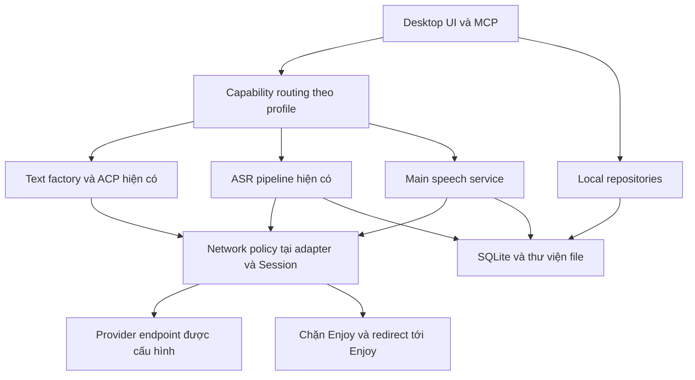

# Loại bỏ phụ thuộc backend Enjoy - Plan

## Goal Capsule

Chuyển Enjoy thành ứng dụng học tập dùng dữ liệu local và các provider đã tích hợp. Không còn request tới `enjoy.bot` hoặc bất kỳ subdomain của nó trong desktop, portal và tài nguyên được sản phẩm tự tải. Bỏ cả việc gọi backend Enjoy qua một base URL khác, không chỉ chặn tên miền mặc định.

Đây là kế hoạch đề xuất, chưa phải thay đổi đã triển khai. Quyền của lượt lập kế hoạch chỉ gồm đọc code, nghiên cứu và viết tài liệu. Không activate goal, sửa ứng dụng đang dùng, gọi inference trả phí, migrate dữ liệu thật, commit, push hoặc deploy. Khi triển khai được yêu cầu, quyền thực hiện tiếp tục tuân theo chỉ dẫn của user và AGENTS.md.

Nghiệm thu gồm hai kết quả độc lập: không còn phụ thuộc backend Enjoy và các chức năng thay thế hoạt động thật. Chặn request nhưng để chức năng hỏng không đạt. Một provider thiếu credential hoặc một bề mặt mạng chưa quan sát được phải ghi rõ chưa kiểm, không chuyển thành PASS.

---

## Product Contract

### Tóm tắt và vấn đề

Ứng dụng đã có local profile, SQLite, thư viện file và nhiều adapter AI. Tuy nhiên, client backend và nhiều đường gọi cũ vẫn tồn tại. Một số đã được local-mode guard; một số còn reachable từ Stories, Vocabulary, Conversations và speech. Chỉ thay default AI hoặc xóa URL constants không giải quyết được toàn bộ phụ thuộc.

Phương án đề xuất là giữ các luồng học cá nhân, chuyển việc lưu trữ và cấu hình về local, cho inference đi qua provider phù hợp, rồi gỡ các tính năng thuần dịch vụ Enjoy không có backend thay thế. Phần này bao gồm desktop và các request API còn lại trong portal/README để kết quả không bị giới hạn ở một cửa sổ ứng dụng.

### Requirements

**Mạng và provider**

- R1. Không có request HTTP, HTTPS, WebSocket hoặc điều hướng được sản phẩm phát sinh tới `enjoy.bot` và subdomain, kể cả redirect, tài nguyên nhúng, URL cũ và cấu hình override.
- R2. Mọi tác vụ AI còn được cung cấp sử dụng adapter đã tích hợp và được chọn theo capability; không gọi Enjoy proxy, không fallback âm thầm sang Enjoy hoặc provider khác.
- R3. Duy trì chat, tra từ, dịch, phân tích, tạo nội dung học, ASR, TTS và đánh giá phát âm với hợp đồng kết quả tương ứng; ASR không được dùng để giả lập điểm phát âm.

**Dữ liệu và trải nghiệm**

- R4. Profile, thư viện, lịch sử chat, Stories, Vocabulary, ghi chú, lịch ôn và kết quả học cá nhân mới tạo hoặc đã có local/import từ export được hỗ trợ tồn tại local, mở lại được sau full restart và khi offline.
- R5. Giữ nguyên ID profile, dữ liệu đã có local hoặc trong export được hỗ trợ, provider hợp lệ, model override, prompt tùy chỉnh và provenance của nội dung cũ. Migration có phiên bản, lặp lại an toàn và phục hồi được. Record chỉ có trên server giữ reference/provenance nếu local đã lưu phần đó và hiển thị thiếu dữ liệu, không hứa khôi phục nội dung chưa có.
- R6. Khi chưa có provider phù hợp, UI chỉ rõ cấu hình còn thiếu; tác vụ local và nội dung đã lưu vẫn dùng được. Không tự chọn một dịch vụ có chi phí chỉ vì dịch vụ đó có key.
- R7. Loại bỏ luồng phụ thuộc tài khoản, balance, billing, thông báo và cộng đồng Enjoy khỏi sản phẩm này theo phương án phạm vi dưới đây; không giả số liệu hoặc giả thành công sync.

**Nghiệm thu**

- R8. Kiểm cả desktop đóng gói, portal, tài nguyên/build, deep link và dữ liệu legacy. Bằng chứng bao phủ Chromium, main-process networking, SDK và subprocess do ứng dụng khởi chạy.
- R9. Không đưa credential, token, transcript riêng tư hoặc signed URL vào log/evidence. Báo cáo phân biệt code có adapter, cấu hình khả dụng và inference live đã nghiệm thu.

### Phạm vi sản phẩm đề xuất

Giữ và hoàn thiện: học bằng media/document/story, chat, từ vựng và ôn tập, Learning Studio, thu âm, ASR/TTS, đánh giá phát âm, từ điển local, import từ file và URL nguồn hợp lệ.

Thay bằng local: đăng nhập thành chọn profile; sync cá nhân thành lưu SQLite/file; preset và IPA thành dữ liệu bundled; story/meaning/star cá nhân thành bản ghi local; thông báo tiến trình thành sự kiện job local. Việc bỏ sync phải thể hiện đúng trong UI, không đổi nhãn thành “đã đồng bộ”.

Ngừng kết nối: Enjoy login/OAuth/device code, ví/nạp tiền/balance/transactions, bảng xếp hạng cộng đồng, follow/feed/chat room và khóa học/enrollment chỉ tồn tại trên server Enjoy. Các route cũ còn có thể được mở phải trả trạng thái chức năng đã ngừng kết nối hoặc đi tới nội dung local có mapping hợp lệ. Không giả rằng provider LLM thay thế được các dịch vụ này.

Đây là lựa chọn sản phẩm được đề xuất trong kế hoạch, chưa phải quyết định user đã duyệt riêng. Nếu cần giữ cộng đồng, khóa học cloud hoặc sync nhiều thiết bị với đầy đủ ngữ nghĩa cũ, phải bổ sung backend và một kế hoạch riêng. Không tự dựng backend mới trong phạm vi này.

Dữ liệu chỉ có trên server Enjoy không thể tự khôi phục khi đồng thời cấm mọi request Enjoy. Kế hoạch chỉ migrate dữ liệu đã có local hoặc file export do user cung cấp. Không tự chạy một lượt tải cuối từ server và không xóa dữ liệu trên tài khoản cũ.

### Luồng nghiệm thu tiêu biểu

- AE1. Mở bản mới bằng profile cũ: vẫn đúng thư viện và tên profile, không có đăng nhập/telemetry/config request Enjoy; khởi động lại offline vẫn đọc được dữ liệu.
- AE2. Một conversation cũ dùng EnjoyAI: đọc toàn bộ lịch sử bình thường; khi gửi mới, app yêu cầu chọn provider hợp lệ và chỉ ghi binding mới sau lựa chọn. Không đổi nội dung hoặc provenance của message cũ.
- AE3. Thêm bài đọc từ file hoặc website nguồn hợp lệ, trích từ vựng bằng provider được chọn, lưu từ và ôn tập; mọi dữ liệu còn nguyên sau restart, không cần server story/meaning.
- AE4. Chọn ASR/TTS/phát âm đã cấu hình: request chỉ tới endpoint hợp lệ của adapter; kết quả thật được lưu và phát lại. Sai key, timeout, hủy hoặc thiếu capability không tạo kết quả giả và không phát sinh Enjoy fallback.
- AE5. Mở dữ liệu chứa ảnh/audio Enjoy cũ: bản local có sẵn vẫn dùng được; phần chỉ còn URL cloud hiển thị thiếu tài nguyên cùng thao tác nhập lại. Không tự tải URL cũ.
- AE6. Mở portal và README mới: không gọi API thống kê Enjoy, kể cả thông qua badge bên thứ ba; thông tin cộng đồng thiếu nguồn được bỏ, không thay bằng số do AI sinh.

---

## Hiện trạng và ma trận thay thế

Đối chiếu trực tiếp working tree ngày 2026-09-09, nhánh `codex/learning-studio` có nhiều thay đổi từ các phần việc trước. Đây là inventory tĩnh, không phải một lượt xác minh tài khoản hay bắt traffic mới.

Trong bảng hiện trạng, đường dẫn bắt đầu bằng `lib/`, `main/` hoặc `renderer/` được tính từ `enjoy/src/`.

| Nhóm | Hiện trạng trong code | Đích thay thế | Khoảng trống cần làm |
|---|---|---|---|
| Chat và text commands | `lib/chat-model.ts`, `lib/ai-providers.ts`: OpenAI, Gemini, DeepSeek, OpenRouter, Ollama, LM Studio, Codex ACP, Claude ACP | Giữ factory và adapter hiện có | Gỡ EnjoyAI; xử lý default, task override và binding trong từng entity |
| Lookup/dịch/phân tích | `renderer/hooks/use-ai-command.tsx` đã gọi provider nhưng còn remote cache; `extractStory` vẫn gọi backend | Provider text + cache local | Trích từ story, schema validation và persistence local |
| Learning Studio | `main/learning/native-generation.ts`: Codex/Claude tạo text; ảnh dùng Codex | Giữ native generation và MCP hiện tại | Dùng chung trạng thái capability; không hứa mọi LLM có thể tạo ảnh hoặc lesson qua API này |
| ASR | `main/learning-asr/providers.ts`: Cloudflare Worker được cấu hình, MAI qua OpenRouter, OpenAI trực tiếp | Giữ ba adapter và pipeline alignment/coverage | Gỡ `enjoy_azure`, `enjoy_cloudflare`, legacy token và AI worker Enjoy; thống nhất UI |
| ASR local | Echogarden còn nhánh local trong legacy transcription | Giữ chức năng local đang có | Chỉ quảng bá khả năng đã kiểm; không mặc định coi tương đương pipeline ASR dài |
| TTS | OpenAI trực tiếp đã có; EnjoyAI proxy còn ở renderer/main; Azure còn lấy token từ Enjoy | OpenAI trực tiếp và Azure Speech SDK được cấu hình trực tiếp | Bổ sung auth Azure riêng và dùng chung main-process speech service |
| Đánh giá phát âm | `use-pronunciation-assessments.tsx` bắt buộc EnjoyAI key rồi xin token Azure | Azure Speech SDK trực tiếp | Chưa có cấu hình Azure Speech độc lập; cần giữ điểm, phoneme, word result, cancel và lỗi đúng nghĩa |
| Stories/Vocabulary | Page còn `mineStories`, `storyMeanings`, `mineMeanings`, star/unstar backend | SQLite theo profile; extraction qua provider text | Chưa có local model/repository tương ứng; lịch ôn đang ở localStorage |
| Profile/sync/upload | Local profile đã có; đa số model và storage đã guard | SQLite, thư viện file, sự kiện local | Gỡ client và hook cloud, xử lý URL/flag legacy và import/export cá nhân |
| Preset/config/telemetry | Local mode guard nhiều config nhưng Conversations còn gọi ba config; client và ahoy vẫn được tạo/configure | Preset/IPA/catalog bundled; discovery trực tiếp theo provider | Bỏ bootstrap từ Enjoy, config overrides và backend telemetry |
| Từ điển/tài nguyên | Từ điển mới local; tám URL `dl.enjoy.bot` còn trong metadata legacy | Từ điển bundled, nhận diện bản đã cài bằng hash | Giữ nhận diện offline; bỏ URL tải legacy và các đường tải gián tiếp |
| Portal/README | `Slogan.vue`, `Comments.vue`, badge Shields.io gọi API Enjoy | Nội dung tĩnh có nguồn; không hiện stats nếu không có nguồn độc lập | Bỏ request, số đếm và enrichment cloud; sửa tài liệu hướng dẫn |

Các nhánh có guard không được tính là đã xóa phụ thuộc: `LOCAL_PROFILE_MODE=true` mới là một nhánh thực thi, trong khi defaults, exports, settings và route cũ vẫn có thể tạo lại đường gọi.

---

## Planning Contract

### Key Technical Decisions

- KTD1. Mở rộng registry và factory hiện có, không xây một framework provider mới. Mỗi capability có selection riêng: text, transcription, synthesis, pronunciation assessment, native lesson/image. State phân biệt chưa cấu hình, sẵn sàng theo cấu hình, lỗi cấu hình và đang chạy; không coi có adapter hoặc key là đã live-pass.
- KTD2. Loại bỏ EnjoyAI ở executable routing. Các identifier cũ chỉ được tồn tại trong migration/parser, fixture kiểm hồi quy và provenance của dữ liệu lịch sử. Không đổi `WEB_API_URL` sang một proxy khác để giữ nguyên backend client.
- KTD3. Giữ binding hợp lệ hiện có. Binding legacy/không còn hỗ trợ chuyển sang trạng thái cần lựa chọn. Model, voice và capability được validate cùng provider, không copy nguyên model EnjoyAI sang nhà cung cấp mới. Snapshot metadata cũ để đọc lại; không rewrite nội dung message/speech đã tạo.
- KTD4. Làm chủ policy mạng tại các điểm xuất request của ứng dụng. Chặn hostname Enjoy sau URL parsing/normalization, cả redirect và external navigation. Bao phủ Chromium Session cùng các Node/SDK adapter; không coi chặn `fetch` trong renderer là đủ. Credential gắn với provider origin đã chọn, không được chuyển tiếp qua redirect khác origin hoặc sang dịch vụ khác.
- KTD5. TTS và pronunciation dùng service main process, nhận dữ liệu tác vụ qua IPC có kiểm profile/job ownership. Credential mới không phải đi qua renderer. Azure Speech SDK đã tích hợp sẽ dùng credential/resource riêng do user cấu hình; không suy ra OpenRouter MAI key hoặc cấu hình Azure cũ có thể dùng cho Speech. SDK chính thức có phương thức dùng subscription key và region. [Microsoft SpeechConfig](https://github.com/microsoft/cognitive-services-speech-sdk-js/blob/master/src/sdk/SpeechConfig.ts)
- KTD6. Giữ nguyên yêu cầu chất lượng ASR hiện tại: transcription, word alignment, coverage, seam repair, cancel và publish sau validation. Việc bỏ Enjoy không được giảm gate chất lượng hoặc sửa transcript chỉ để hết lỗi.
- KTD7. Dữ liệu cá nhân dùng local repository/IPC. Tận dụng SQLite và library hiện có; thêm model Story/Meaning/Review khi thiếu. Learning Studio và Vocabulary trao đổi qua adapter repository, không nhân đôi hai kho từ vựng không có mapping.
- KTD8. Hoàn tất chức năng thay thế trước khi gỡ client cuối cùng. Defense-in-depth vẫn giữ sau khi migration xong để URL từ import, saved settings hoặc nội dung nhúng không tái tạo request cấm.

Electron tách Chromium networking và Node networking. `Session.webRequest` chỉ là một phần của giải pháp, và mỗi event chỉ dùng listener gắn cuối. Vì classifier hiện đã có policy riêng, implementation phải hợp nhất/combine policy mà không ghi đè sandbox classifier. Các API dùng phải được đối chiếu với Electron 34 thực cài, không copy API mới từ tài liệu latest. [Electron net](https://www.electronjs.org/docs/latest/api/net), [Electron WebRequest](https://www.electronjs.org/docs/latest/api/web-request)

### Kiến trúc đích

Ở mỗi tác vụ, selection hợp lệ dẫn tới adapter tương ứng; selection legacy hoặc thiếu credential dẫn tới hướng dẫn cấu hình. Kết quả chỉ được commit vào repository của profile/job còn hiệu lực. Cancel, đổi profile hoặc lỗi validation phải kết thúc job mà không ghi nhầm kết quả. Các entry point UI và MCP dùng cùng contract.

### Giả định và giới hạn

Phạm vi “hết request” được hiểu rộng cho các sản phẩm do repo này tạo ra, gồm portal và README tự tải badge. Không bao gồm sửa website của bên thứ ba, truy vết nội bộ hạ tầng của nhà cung cấp, hay ngăn user tự mở website bên ngoài ứng dụng.

Provider và proxy tùy chỉnh vẫn được giữ nếu hợp lệ và không dùng Enjoy. Dịch vụ từ xa có thể có hạ tầng nội bộ không quan sát được; kế hoạch chỉ khẳng định các request phát sinh từ sản phẩm và subprocess thuộc luồng tác vụ đã kiểm. Mỗi lớp networking chưa có evidence là một gap, không được bỏ khỏi phạm vi báo cáo.

Không đổi hệ thống Keychain toàn ứng dụng trong nhiệm vụ này. Dùng cơ chế credential hiện có khi phù hợp; credential Azure mới phải được lưu an toàn theo profile. Không mua dịch vụ hoặc tự trích key từ hệ thống khác. Không đặt default provider trả phí bằng một bảng ưu tiên tùy ý.

---

## Lộ trình

| Giai đoạn | Công việc | Điều kiện kết thúc |
|---|---|---|
| 1. Chốt đường mạng và baseline | U1 | Inventory có owner cho từng bề mặt; kiểm chứng công cụ phát hiện request |
| 2. Provider và cấu hình | U2, U3 | Không còn default/fallback Enjoy; profile cũ mở an toàn |
| 3. Luồng học bằng chữ | U4, U5 | Chat, extraction, Stories và Vocabulary chạy local/provider |
| 4. Luồng âm thanh | U6, U7, U8 | ASR, TTS, narration và phát âm có replacement thật |
| 5. Dữ liệu và phần cloud cũ | U9 | Không sync/upload ngầm; tài nguyên cũ xử lý đúng; gỡ tính năng cloud đã nêu |
| 6. Toàn monorepo | U10 | Portal, badge, tài liệu và build không dẫn tới Enjoy |
| 7. Gỡ client và nghiệm thu | U11 | Static, migration, packaged runtime và live provider gates đạt phạm vi đã công bố |

Đường găng là policy/cấu hình, dữ liệu Stories/Vocabulary, Azure Speech độc lập và nghiệm thu trên app đóng gói. U4-U6 có thể làm song song sau contract U2; U7-U8 cùng một owner cho speech service; U9 không tranh chấp schema với U5. Bắt đầu 1-2 worker, parent giữ integration và nghiệm thu. Không chia worker theo số file hoặc cho nhiều người cùng sửa registry/settings.

---

## Implementation Units

Các đường dẫn test ghi “mới” là artifact sẽ tạo khi triển khai. Không giả định chúng đã tồn tại hay đã PASS.

Tên `check-*.mjs` rút gọn trong các unit đều thuộc `enjoy/scripts/`. Khi nhiều file renderer được liệt kê sau một đường dẫn đầy đủ trong cùng thư mục, chúng dùng cùng tiền tố đó.

| Unit | Nội dung | File chính | Phụ thuộc |
|---|---|---|---|
| U1 | Baseline và network policy | `main/window.ts`, `main/proxy-agent.ts` | Không |
| U2 | Selection và migration provider | `lib/ai-providers.ts`, `db/models/user-setting.ts` | U1 |
| U3 | Local bootstrap và config | `app-settings-provider.tsx`, `pages/conversations.tsx` | U2 |
| U4 | Text commands | `use-ai-command.tsx`, `lib/chat-model.ts` | U2 |
| U5 | Stories/Vocabulary local | `pages/story.tsx`, `pages/vocabulary.tsx`, DB/IPC mới | U2, U4 |
| U6 | ASR thống nhất | `use-transcribe.tsx`, `main/learning-asr/` | U2 |
| U7 | TTS/narration trực tiếp | `main/speech/provider.ts`, `use-speech.tsx` | U2 |
| U8 | Pronunciation trực tiếp | `main/azure-speech-sdk.ts`, assessment hook/handler | U7 |
| U9 | Bỏ sync và cloud surfaces | `main/storage.ts`, model hooks, router | U3, U5, U6, U7, U8 |
| U10 | Portal, docs, build | `1000h-portal/`, `README.md`, distribution | U1; hợp nhất sau U9 |
| U11 | Gỡ client, kiểm toàn tuyến | `api/client.ts`, e2e và packaged checks | U1-U10 |

### U1. Lập baseline và thiết lập policy không gọi Enjoy

**Mục tiêu/trace:** R1, R8, R9; KTD4. **Phụ thuộc:** không.

**File:** `enjoy/src/main/window.ts`, `enjoy/src/main/proxy-agent.ts`, `enjoy/src/main/downloader.ts`, `enjoy/src/main/learning-asr/music-classifier.ts`, `enjoy/e2e/helpers/local-app.ts`; mới: `enjoy/src/lib/network-policy.ts`, `enjoy/scripts/check-no-enjoy-network.mjs`, `enjoy/e2e/no-enjoy-network.spec.ts`, `enjoy/docs/enjoy-backend-inventory.md`.

**Cách làm:** inventory từ URL literals, backend method/caller, provider endpoint, settings/env, resource URL, deep link và subprocess. Ghi reachable/guarded/dead với chứng cứ. Test policy trước khi đổi chức năng. Cài policy trước load trang, bootstrap request hoặc tạo SDK client. Chặn exact hostname và suffix có ranh giới; normalize chữ hoa/trailing dot; validate redirect trước khi tiếp tục. Không ghi đè listener classifier. Chặn external open và custom protocol hướng tới domain cấm.

Policy và facade ghi receipt trước egress với `blockedAttemptCount` và `legacyBackendOperationCount`, phân theo transport, callsite/operation và hostname đã chuẩn hóa. Không ghi query, body, header hay credential. Bộ đếm này độc lập với outgoing network trace để phát hiện caller bị chặn nhưng chưa được gỡ; không gọi dữ liệu suy đoán từ DNS là số lần ứng dụng định gọi.

**Kiểm tra:** root/subdomain qua HTTP/WS; URL có userinfo hoặc hostname tương tự nhưng không phải Enjoy; encoded nested badge URL ở inventory; redirect từ host khác; BrowserView/session mới; Node fetch/axios/SDK; downloader và subprocess. Có positive control endpoint được phép và negative control xác nhận listener/capture thực sự hoạt động. Không gửi request kiểm thử tới Enjoy thật.

**Nghiệm thu:** mọi transport có owner và test path; diagnostic đã che dữ liệu nhạy cảm. Giai đoạn này có thể phát hiện các request bị chặn từ callsite chưa migrate, không coi đó là hoàn tất U11.

### U2. Bỏ Enjoy khỏi selection, default và binding cũ

**Mục tiêu/trace:** R2, R5, R6; KTD1-KTD3. **Phụ thuộc:** U1.

**File:** `enjoy/src/lib/ai-providers.ts`, `enjoy/src/lib/speech-models.ts`, `enjoy/src/lib/learning-asr-models.ts`, `enjoy/src/types/enums.ts`, `enjoy/src/main/db/models/user-setting.ts`, `enjoy/src/renderer/context/ai-settings-provider.tsx`, `enjoy/src/constants/gpt-presets.ts`, `enjoy/src/main/db/models/conversation.ts`, `enjoy/src/main/db/models/document.ts`, form/create paths; tests `check-ai-providers.mjs`, `check-ai-migration.mjs`; mới `enjoy/e2e/provider-migration.spec.ts`.

**Cách làm:** kiểm global GPT/STT/TTS, per-task model, preset, chat/member/conversation/document binding, base URL cũ và config renderer/main. Giữ lựa chọn hợp lệ. Legacy selection có trạng thái needs-selection; không dùng hàm normalize để biến âm thầm thành Cloudflare. Bản ghi lịch sử giữ engine/model gốc, cấu hình cho lần chạy tiếp theo dùng binding riêng. Migration idempotent, có backup và version; không xóa credential/profile cũ trong lượt này.

**Kiểm tra:** profile mới chưa key; profile có nhiều provider; custom model/base URL; từng legacy enum; preset/custom prompt; reload/restart; hủy lựa chọn; config lỗi; chuyển profile giữa migration/job; migration chạy hai lần; khôi phục backup. Đảm bảo UI/main cùng thấy một lựa chọn và không ghi key qua IPC/log.

**Nghiệm thu:** không creator nào sinh binding Enjoy mới; record cũ đọc được và lần chạy mới chỉ dùng selection hợp lệ được user chọn.

### U3. Bootstrap, preset và cấu hình hoàn toàn local

**Mục tiêu/trace:** R1, R4, R6, R7; KTD2. **Phụ thuộc:** U2.

**File:** `enjoy/src/main.ts`, `enjoy/src/main/settings.ts`, `enjoy/src/main/window.ts`, `enjoy/src/preload.ts`, `enjoy/src/renderer/app.tsx`, `enjoy/src/renderer/context/app-settings-provider.tsx`, `enjoy/src/renderer/pages/conversations.tsx`, `enjoy/src/renderer/cables/`, `enjoy/src/renderer/components/preferences/api-url-settings.tsx`; tests `check-local-profile.mjs`, `check-local-cloud-boundary.mjs`, `enjoy/e2e/local-bootstrap.spec.ts`.

**Cách làm:** tách bootstrap khỏi `webApi`, `apiUrl`, cable và ahoy backend; không tạo client khi khởi động. Trong giai đoạn chuyển đổi, type/facade tương thích cho caller chưa migrate chỉ trả lỗi chức năng chưa sẵn sàng, không mở mạng và không trả dữ liệu giả. U4-U9 lần lượt thay caller; U11 mới xóa toàn bộ Client/export/facade. Bundle preset/IPA; giữ custom preset. Gỡ config fetch và Bugsnag key fetch Enjoy. Không cần login token để mở profile. API/WS URL overrides cũ không còn tác dụng. Discovery model hợp lệ vẫn gọi provider theo cấu hình, không lẫn vào backend config.

**Kiểm tra:** fresh/legacy profile mở online và offline; không provider vẫn dùng library; mở Conversations không có ba request config; deep link `postId` cũ có trạng thái rõ; đổi tên/chuyển profile/restart không mất ID; idle/reconnect không khởi động lại telemetry/cable.

**Nghiệm thu:** bootstrap và config local không tạo backend request hoặc backend client; không có lỗi ngầm chỉ được catch rồi bỏ qua.

### U4. Hoàn tất provider cho chat và text commands

**Mục tiêu/trace:** R2, R3, R4; KTD1, KTD7. **Phụ thuộc:** U2.

**File:** `enjoy/src/renderer/hooks/use-ai-command.tsx`, `enjoy/src/lib/local-ai-services.ts`, `enjoy/src/lib/chat-model.ts`, `enjoy/src/lib/acp-chat-model.ts`, `enjoy/src/commands/`, chat/conversation hooks; tests `check-ai-runtime.mjs`, `check-acp-text-service.mjs`, `check-local-ai-services.mjs`; mới `enjoy/e2e/provider-text-workflows.spec.ts`.

**Cách làm:** thay `extractVocabularyFromStory` bằng command qua factory hiện có với schema kiểm kết quả. Bỏ remote lookup/translation persistence; cache local phải tách theo profile, ngôn ngữ, context và cấu hình/version cần thiết. Không tự thay prompt user đã tùy chỉnh. Duy trì stream, cancel, task model override và lỗi ACP.

**Kiểm tra:** lookup/dịch/analysis/refine/suggestion/extraction; JSON lỗi; stream đứt; cancel; cache hit/restart; đổi language/model/profile; ACP unavailable; key/quota lỗi. Context từ trang là dữ liệu, không có quyền đổi endpoint, credential hoặc tool policy.

**Nghiệm thu:** mỗi command có kết quả và persistence đúng với provider được chọn; remote best-effort wrapper không còn che callsite Enjoy.

### U5. Stories, Vocabulary và lịch ôn local

**Mục tiêu/trace:** R4-R6; AE3, AE5; KTD7. **Phụ thuộc:** U2, U4.

**File:** `enjoy/src/renderer/pages/stories.tsx`, `story.tsx`, `story-preview.tsx`, `vocabulary.tsx`, `renderer/components/stories/`, `renderer/components/meanings/`, `main/db/`, `preload.ts`; mới model/repository/handler Story, Meaning, Review theo conventions hiện có, migration DB tương ứng, `enjoy/scripts/check-local-study-data.mjs`, `enjoy/e2e/local-stories-vocabulary.spec.ts`.

**Cách làm:** local CRUD, pagination/search, story-meaning relation, star cá nhân và review schedule. Tận dụng Readability/import đang có; không gửi cả bài lên backend Enjoy. Migrate local cache/export có schema hỗ trợ và mapping ID; gắn review state với đúng profile và meaning. localStorage cũ không đủ chứng cứ ownership thì bảo toàn và yêu cầu lựa chọn khi import, không tự gán sang mọi profile. Server-only ID được giữ làm provenance, không dùng để fetch.

**Kiểm tra:** import file/URL, HTML có resource Enjoy, lưu/trích từ/đánh dấu/ôn tập/xóa local; nhiều trang không trùng/mất item; nhiều profile; restart/offline; duplicate import; orphan reference; cache thiếu; review legacy không rõ owner; import thất bại giữa chừng phải rollback.

**Nghiệm thu:** Stories/Vocabulary là chức năng dùng được hoàn chỉnh, không biến thành màn hình trống chỉ vì đã ngắt API. Dữ liệu không có bản local được báo đúng là chưa có.

### U6. Đưa toàn bộ transcription về các adapter ASR hiện có

**Mục tiêu/trace:** R2, R3, R6; AE4; KTD6. **Phụ thuộc:** U2.

**File:** `enjoy/src/renderer/hooks/use-transcribe.tsx`, `enjoy/src/renderer/components/chats/chat-form.tsx`, STT settings, `enjoy/src/main/learning-asr/`, `enjoy/src/main/mai-transcribe/`, `enjoy/src/main/cloudflare-transcribe/`; tests `check-learning-asr-providers.mjs`, `check-learning-asr-pipeline.mjs`, `check-learning-asr-seams.mjs`, `check-learning-asr-speech-coverage.mjs`; mới `enjoy/e2e/provider-asr-live.spec.ts`.

**Cách làm:** thay đường `AI_WORKER_ENDPOINT/audio/transcriptions`, speech token Azure Enjoy và legacy selector. Dùng Cloudflare Worker được cấu hình, MAI/OpenRouter hoặc OpenAI theo selection. Giữ local engine khi khả năng hiện có phù hợp. Không thay checkpoint identity, word alignment hoặc source provenance thiếu migration rõ ràng.

**Kiểm tra:** clip ngắn, hội thoại, nhiều đoạn và video khoảng 12 phút; nhạc đầu/silence/missing word; model trả text-only; timeout/quota/malformed result; cancel đang inference; resume đúng provider/model/source, không dùng cache sai binding. Media và chat phải chọn cùng nghĩa của engine.

**Nghiệm thu:** fresh live ASR trên các adapter được quảng bá, timeline qua validation và phát từng đoạn đúng; không giảm chuẩn ASR hiện tại. Lỗi chất lượng baseline chưa giải quyết vẫn ghi là gap, không che bằng migration mạng.

### U7. TTS và Learning narration đi trực tiếp

**Mục tiêu/trace:** R2, R3, R5, R6; AE4; KTD5. **Phụ thuộc:** U2.

**File:** `enjoy/src/renderer/hooks/use-speech.tsx`, `enjoy/src/main/db/models/speech.ts`, `enjoy/src/main/speech/provider.ts`, `enjoy/src/main/learning/speech-configuration.ts`, speech settings/IPC; tests `check-ai-speech.mjs`, `check-learning-speech-configuration.mjs`, `check-learning-narration.mjs`, `enjoy/e2e/learning-configured-speech.spec.ts`.

**Cách làm:** hợp nhất các entry point TTS về main service, dùng OpenAI direct hoặc Azure Speech direct. Bổ sung cấu hình Speech riêng và lifecycle/cancel. Xóa generate/consume/revoke Enjoy speech token. Learning Azure hiện trả unavailable phải trở thành implementation thật trước khi UI nhận là hỗ trợ. Dùng contract model/voice/audio hiện có.

**Kiểm tra:** văn bản ngắn/dài, nhiều đoạn narration, sai voice/model, key thiếu, cancel, regenerate, chọn bản audio cũ, playback/restart/offline. File có bytes nhưng decode lỗi phải bị từ chối. Nghe kiểm nội dung audio thật, không dùng tone/mocked transport để chứng minh synthesis.

**Nghiệm thu:** cùng selection cho conversation/document/lesson và UI preview; narration Azure không còn khoảng trống renderer/main; audio lưu đúng source/revision.

### U8. Đánh giá phát âm không qua token Enjoy

**Mục tiêu/trace:** R2, R3, R6; AE4; KTD5. **Phụ thuộc:** U7.

**File:** `enjoy/src/main/azure-speech-sdk.ts`, `enjoy/src/renderer/hooks/use-pronunciation-assessments.tsx`, `enjoy/src/main/db/handlers/pronunciation-assessments-handler.ts`, assessment model/form, speech settings; mới `enjoy/scripts/check-direct-pronunciation.mjs`, `enjoy/e2e/direct-pronunciation.spec.ts`.

**Cách làm:** dùng Azure Speech auth trực tiếp của U7. Tách metadata tokenId backend cũ khỏi kết quả mới; giữ kết quả lịch sử đọc được. Duy trì assessment có reference và các chế độ UI đang cung cấp. Chỉ hiển thị score/phoneme mà provider thực trả, không suy ra từ ASR hoặc LLM. Thiếu Speech config chỉ chặn assessment, không chặn ghi âm cơ bản.

**Kiểm tra:** audio hợp lệ với reference, không reference nếu UI hỗ trợ, silence/no-match, phát âm sai, lỗi auth/region, cancel/timeout, đổi profile; persisted schema và word/phoneme display; ghi âm vật lý và đánh giá live từ sample đã xác định.

**Nghiệm thu:** không EnjoyAI key/token dependency; có kết quả Azure thật và đúng schema. Chưa có resource/key phù hợp là blocker của live assessment, không được ghi nhận là thay thế xong.

### U9. Gỡ sync/upload và xử lý tài nguyên/tính năng cloud cũ

**Mục tiêu/trace:** R1, R4, R5, R7; AE1, AE5; KTD7-KTD8. **Phụ thuộc:** U3, U5-U8.

**File:** `enjoy/src/main/storage.ts`, `enjoy/src/main/db/models/` cho Audio/Video/Recording/Document/Segment/Note/Transcription/PronunciationAssessment, `enjoy/src/renderer/router.tsx`, legacy login/posts/course/billing components, `enjoy/src/main/local-profile.ts`, local-browser-storage, asset renderers; tests `check-local-cloud-boundary.mjs`, `check-library-profile-regressions.mjs`, `check-local-browser-storage.mjs`; mới `enjoy/e2e/legacy-cloud-assets.spec.ts`.

**Cách làm:** bỏ network side effect của model hooks và sync timers, giữ local create/update/delete behavior. Giữ syncedAt/uploadedAt lịch sử dưới dạng legacy metadata, không dùng kích hoạt retry. Resource resolver ưu tiên file local; URL Enjoy không có file thành missing-resource, có hành động nhập lại/tạo lại theo nguồn còn có. Giữ original URL/provenance khi export mà không fetch. Gỡ cloud surfaces theo phạm vi đã nêu và bỏ callback/deep-link còn sống.

**Kiểm tra:** CRUD local không upload/delete remote; profile switch/move library/restart; file đã tải có hash khớp; source chỉ có URL; avatar/cover/Markdown/HTML/audio/video chứa Enjoy; imported settings; stale cache/service worker/session storage; deep link cũ; offline và reconnect. Không xóa browser data ngoài partition/profile thuộc app.

**Nghiệm thu:** dữ liệu local giữ nguyên, không có giả trạng thái sync, không retry cloud ngầm; import/export cá nhân hoạt động trên phần dữ liệu đã hỗ trợ, phần không thể khôi phục có thông báo rõ.

### U10. Portal, tài liệu, từ điển và distribution

**Mục tiêu/trace:** R1, R7, R8; AE6. **Phụ thuộc:** U1; hợp nhất hành vi/tài liệu sau U9.

**File:** `1000h-portal/components/Slogan.vue`, `Comments.vue`, `1000h-portal/utils/distribution-links.ts`, `README.md`, `1000-hours/enjoy-app/`, `1000-hours/index.md`, `enjoy/src/constants/legacy-dicts.ts`, `enjoy/src/main/dict.ts`, `enjoy/src/constants/distribution.ts`, build scripts; tests `enjoy/scripts/check-distribution.mjs`, `check-bilingual-dictionaries.mjs`; mới `scripts/check-no-enjoy-references.mjs`, `1000h-portal/tests/no-enjoy-network.spec.ts`.

**Cách làm:** bỏ API badges/stats và Shields dynamic badge. Giữ testimonial nội dung tĩnh có nguồn hiện có, bỏ phần số liệu/name/avatar enrichment từ Enjoy. Không dựng số liệu thay thế. Distribution dùng cấu hình GitHub hiện có, không trỏ tới release chưa có thật. Nhận diện từ điển đã cài bằng hash/id, không cần download URL cũ. Tài liệu mới hướng dẫn local/provider; tài liệu lịch sử vẫn có thể nhắc domain dưới dạng văn bản không tự fetch.

**Kiểm tra:** portal mount/SSR/hydration, image và iframe; README badge URL encode; override update/docs/download sang Enjoy bị từ chối; build từ cache tài nguyên rỗng không tải Enjoy; từ điển cũ vẫn nhận diện offline. Nếu chưa có release thay thế, UI không cung cấp link tải cũ hoặc link giả.

**Nghiệm thu:** static site/desktop package tạo ra không có active resource hoặc service endpoint Enjoy. Việc publish site/release là bước riêng theo quyền user cấp, không ngầm deploy từ việc sửa tài liệu.

### U11. Gỡ client backend và chứng minh toàn tuyến

**Mục tiêu/trace:** R1-R9; AE1-AE6; KTD8. **Phụ thuộc:** U1-U10.

**File:** `enjoy/src/api/client.ts` và exports, `enjoy/src/constants/index.ts`, shared types/preload, dependency declarations/lockfile thuộc phạm vi; `enjoy/scripts/check-no-enjoy-network.mjs`, `enjoy/e2e/no-enjoy-network.spec.ts`, các E2E của U2-U10, `enjoy/scripts/check-packaged-app.mjs`; mới `enjoy/docs/provider-independence-acceptance.md`.

**Cách làm:** xóa backend Client và các caller còn sót sau khi replacement hoàn thành. Gỡ dependency thực sự không còn consumer, không dọn unrelated dependency. Static check có allowlist hẹp cho migration/provenance/test/docs lịch sử; không exclude cả thư mục để làm pass. Đối chiếu bundle với source manifest hiện tại. Chạy ma trận bên dưới trên package cuối và portal local build.

**Kiểm tra:** toàn bộ route, bootstrap, idle/reconnect/restart, data migration, core workflows, provider failures và network transports. Normal flow phải có `blockedAttemptCount = 0`, `legacyBackendOperationCount = 0` và số request Enjoy thoát mạng bằng 0. Negative-control suite riêng chủ động tạo request/operation cấm, xác nhận bộ đếm tương ứng lớn hơn 0 và không có egress, không cộng lẫn vào normal-flow receipt.

**Nghiệm thu:** independent review đối chiếu evidence và các gap; mọi lỗi do thay đổi được sửa, không dùng test mock hoặc test bỏ qua để nhận live PASS. Source/package fingerprint không đổi giữa chạy test và bàn giao.

---

## Verification Contract

| Gate | Bằng chứng bắt buộc | Tiêu chí |
|---|---|---|
| G1. Static/source/bundle | Inventory U1, reference check, import graph và bundle scan | Không active Enjoy endpoint/client/fallback; mọi literal còn lại có lý do cụ thể |
| G2. Migration | Fixture profile cũ/mới/multi-profile, backup và row/file comparison | Không mất dữ liệu/binding hợp lệ; idempotent; không gọi mạng; rollback thử trên bản sao |
| G3. Contracts | Các test paths nêu tại U2-U9 | Capability, schema, cancel, lỗi, storage đúng; regression hiện có không bị làm yếu |
| G4. Packaged desktop | E2E route/workflow matrix, receipt pre-egress policy/facade và traffic observation từng transport | Hai bộ đếm attempt/operation cấm bằng 0 và 0 outgoing Enjoy requests ở normal flows; không runtime error bị bỏ qua |
| G5. Live provider | Receipt từng capability/provider được cung cấp trong bản phát hành | Có inference thật, output kiểm chất lượng, model/endpoint provenance, persistence và restart |
| G6. Portal/build | Browser network trace, SSR/build output, fresh-resource build | Không API/badge/asset/download Enjoy; không stats giả; không link phát hành hỏng |
| G7. Bàn giao | Exact source/package manifest, evidence index, review độc lập | Báo PASS/FAIL/chưa kiểm theo phạm vi; không tự install/deploy/commit ngoài quyền |

G4 cần ít nhất một lượt khởi động sạch online, một lượt legacy profile, 10 phút idle, một vòng offline/reconnect và full restart, cộng từng route còn được expose. Không dùng “0 DNS” riêng lẻ làm bằng chứng vì cache kết nối/DNS có thể che request. Quan sát Chromium và Node/SDK riêng; subprocess cần positive/negative controls tương ứng. Nếu harness không thấy được một lớp, G4 chưa đủ điều kiện PASS cho lớp đó.

G5 chia theo khả năng thực hiện, không lấy tích Descartes mọi provider với mọi tính năng. Mỗi text adapter còn quảng bá cần test contract và một tác vụ live tiêu biểu; command schema/stream được kiểm bằng scenario phù hợp. Ba adapter ASR cần audio thật ngắn và dài theo chính sách hiện có. OpenAI và Azure TTS cần phát audio thật; Azure assessment cần score/phoneme thật. Native Codex/Claude giữ ma trận lesson/MCP/cancel, ảnh chỉ kiểm provider hiện hỗ trợ. Provider chưa có credential được ghi chưa kiểm, không được báo toàn bộ ma trận PASS.

Build và checks dùng Yarn/runtime đúng cấu hình repo. Kiểm TypeScript/lint phần thay đổi, package/native dependencies và các script đã nêu. Không chạy lại inference có chi phí chỉ để tăng số test; chỉ lặp khi code, package hoặc giả thuyết lỗi liên quan thay đổi. Không dùng số liệu cũ làm receipt cho package mới.

---

## Rủi ro, rollout và phục hồi

Rủi ro lớn nhất là mất ngữ nghĩa dữ liệu khi chuyển server-owned story/meaning sang local, và lựa chọn provider cũ nằm sâu trong entity. Backup phải giữ SQLite cùng WAL/SHM nhất quán bằng cơ chế snapshot phù hợp, file thư viện và pointer profile. Không copy riêng file SQLite đang mở rồi coi đó là backup hợp lệ. Khôi phục app/DB cũ chỉ thực hiện bằng thao tác phục hồi có chủ đích; app mới không tự bật lại Enjoy để “cứu” lỗi migration.

Azure Speech cần capability và credential riêng. MAI qua OpenRouter không chứng minh Speech resource của user đã sẵn sàng. Chính sách thiếu cấu hình đã xác định nên implementation vẫn tiến hành được; live gate tương ứng cần cấu hình thật trước nghiệm thu cuối.

Giữ nguyên bề mặt tài liệu và media của người dùng. Khi tài nguyên không có local, báo thiếu, cho nhập lại hoặc tạo output mới với provenance mới. Không tự thay bản ghi cũ bằng nội dung AI có vẻ tương đương.

Triển khai đầu tiên trên disposable profiles, rồi bản sao profile cũ. Chỉ thay ứng dụng đang dùng hoặc migrate thư viện thật khi đã có quyền phù hợp và bản build cụ thể đã qua gate. Portal/release deployment cần được cấp quyền riêng; việc sửa code local không chứng minh website đang public đã thay đổi.

Các chi tiết để kiểm trong implementation gồm SDK version thực cài, live quyền từng provider, schema export legacy có thật và khả năng quan sát subprocess trên OS đích. Chúng không được dùng để hạ chuẩn outcome; phần nào chưa đáp ứng phải giữ gap tương ứng.

---

## Definition of Done

- Toàn bộ U1-U11 đáp ứng verification của mình; G1-G7 có evidence phù hợp và scope rõ.
- Desktop không còn backend Client, default EnjoyAI, Enjoy speech token, legacy worker request, sync/upload cloud hay config/cable/telemetry Enjoy đang chạy.
- Các luồng học cá nhân được thay thế hoạt động, Stories/Vocabulary có persistence local, profile cũ không mất dữ liệu hoặc custom settings.
- Provider thiếu cấu hình có trạng thái đúng; các capability được công bố đã thay thế đều có nghiệm thu thật. Không nhận “hoàn tất toàn bộ” khi live gate bắt buộc còn chưa kiểm.
- Portal/README/build không phát sinh request Enjoy trực tiếp hoặc gián tiếp trong các bề mặt thuộc repo đã thay đổi.
- Static literal được giữ chỉ cho migration, provenance, policy, fixture hoặc tài liệu lịch sử không tự tải. Guard mạng là lớp bảo vệ bổ sung, không che callsite bị bỏ sót.
- Diff chỉ gồm phần việc đã giao; code thử nghiệm/nhánh bỏ dở của nhiệm vụ được dọn, giữ failed evidence cần truy vết và không xóa công việc người khác.
- Báo cáo cuối phân biệt source đã sửa, package đã kiểm, bản đang cài và website đã deploy. Không suy diễn trạng thái giữa các lớp này.
