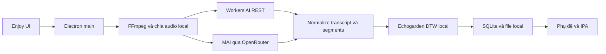

# Khả thi của Cloudflare Workers AI trong Enjoy

Ngày kiểm tra: **08/09/2026**. Phạm vi: Enjoy trên source hiện tại, tiếp nối nghiên cứu bỏ phụ thuộc tài khoản Enjoy và bản tích hợp MAI Transcribe 2. Đây là **nghiên cứu source và tài liệu chính thức**, chưa phải benchmark inference Cloudflare hoặc triển khai.

## Quyết định đề xuất

**Nên bổ sung Workers AI như một provider tùy chọn. Ưu tiên thử Whisper Large V3 Turbo cho video và audio; giữ MAI đang hoạt động làm đối chứng.** Với app cá nhân, gọi REST từ Electron main là đường ngắn nhất, chưa cần tạo Worker riêng. Khi phục vụ nhiều người dùng bằng một tài khoản AI của sản phẩm, thêm Worker để xác thực và kiểm soát chi phí.

Giá rẻ không chứng minh chất lượng chép lời, tiếng Việt, độ trễ hoặc độ chính xác timing. Chưa có kết quả Cloudflare thật trong đợt này để thay mặc định MAI. [Bản MAI vừa nghiệm thu](2026-09-08-mai-transcribe-integration.md) là baseline hoạt động trên video 5:23.

| Nhu cầu của Enjoy | Ứng viên | Mức khả thi và quyết định |
| --- | --- | --- |
| Chép lời video YouTube/audio | `@cf/openai/whisper-large-v3-turbo` | **Cao, ưu tiên POC đầu tiên.** Nhận transcript/segments, normalize rồi căn DTW local như hiện tại. Chưa kết luận chất lượng ngang MAI |
| Chép lời có phân biệt người nói | `@cf/deepgram/nova-3` | **Khả thi có điều kiện.** Có tùy chọn diarization, filler words và utterances; giá cao hơn Whisper và MAI, chỉ đáng dùng khi cần các khả năng đó |
| Dịch, giải thích từ, hội thoại text | Qwen3 30B A3B; GPT-OSS 20B | **Cao về kết nối API; chất lượng chưa kiểm.** Benchmark prompt Anh-Việt của app trước khi chọn mặc định |
| Bài học JSON và study map | Các LLM trên, thêm SEA-LION làm đối chứng tiếng Việt | **Trung bình.** Phải đi qua schema/semantic validator và cơ chế tạo bài của Enjoy; đổi base URL không thay được toàn bộ agent runtime |
| TTS tiếng Anh | `@cf/deepgram/aura-2-en`; `@cf/myshell-ai/melotts` | **Khả thi.** Aura có nhiều voice; Melo là đối chứng chi phí thấp. Cần adapter audio và catalog đúng khả năng |
| TTS tiếng Việt | Chưa chọn | **Chưa đủ bằng chứng thay provider hiện tại.** Các TTS catalog đã đọc chưa xác nhận voice Việt phù hợp |
| Tìm kiếm nghĩa trong transcript, ghi chú, bài học | `@cf/qwen/qwen3-embedding-0.6b` hoặc `@cf/baai/bge-m3` | **Khả thi, giai đoạn sau.** Cần xây index/retrieval; embedding không tự trở thành tính năng RAG |
| Ảnh minh họa từ vựng | `@cf/black-forest-labs/flux-1-schnell` | **Khả thi, chưa ưu tiên.** Cần kiểm đúng nghĩa, bố cục và asset pipeline của bài học |
| Hội thoại giọng nói trực tiếp | Deepgram Flux + LLM + Aura | **Khả thi nhưng là phần việc riêng.** Cần streaming microphone, phát audio, ngắt lời và quản lý phiên |
| Chấm phát âm chi tiết | Chưa có model tương đương được xác minh | **Không dùng để thay trực tiếp.** ASR confidence và DTW timing không phải điểm Accuracy/Fluency/Prosody/phoneme |

Nguồn model: [Whisper](https://developers.cloudflare.com/workers-ai/models/whisper-large-v3-turbo/), [Nova 3](https://developers.cloudflare.com/workers-ai/models/nova-3/), [Qwen3](https://developers.cloudflare.com/workers-ai/models/qwen3-30b-a3b-fp8/), [GPT-OSS 20B](https://developers.cloudflare.com/workers-ai/models/gpt-oss-20b/), [SEA-LION](https://developers.cloudflare.com/workers-ai/models/gemma-sea-lion-v4-27b-it/), [Aura 2 EN](https://developers.cloudflare.com/workers-ai/models/aura-2-en/), [Melo](https://developers.cloudflare.com/workers-ai/models/melotts/), [Qwen embedding](https://developers.cloudflare.com/workers-ai/models/qwen3-embedding-0.6b/), [BGE-M3](https://developers.cloudflare.com/workers-ai/models/bge-m3/), [FLUX Schnell](https://developers.cloudflare.com/workers-ai/models/flux-1-schnell/), [voice agent](https://developers.cloudflare.com/agents/examples/voice-agent/).

## Kết nối Cloudflare hiện tại chưa phải tài khoản riêng

Source đã có tùy chọn **Cloudflare AI qua Enjoy**, nhưng nó gọi `https://ai-worker.enjoy.bot/audio/transcriptions` từ renderer với `user.accessToken`, nhận `text/vtt` và ghi model cố định `@cf/openai/whisper`. Vì vậy chọn mục này không chứng minh đang dùng Cloudflare account của user và vẫn phụ thuộc backend Enjoy. [Endpoint](../../../enjoy/src/constants/index.ts:33), [request và parser](../../../enjoy/src/renderer/hooks/use-transcribe.tsx:461).

| Điểm tích hợp trong source | Có thể dùng lại | Phần cần làm |
| --- | --- | --- |
| [MAI main service/IPC](../../../enjoy/src/main/mai-transcribe/ipc.ts:18) | Guard file, owner, abort, progress và kiểm payload | Tách adapter Cloudflare trực tiếp; thêm Account ID/token, provider ID và model đúng |
| [DTW sau ASR](../../../enjoy/src/renderer/hooks/use-transcribe.tsx:148) | Căn segments thành timeline phục vụ phụ đề/IPA | Giữ pipeline; không đưa JSON của provider thẳng vào SQLite |
| [Chat factory](../../../enjoy/src/lib/chat-model.ts:281) và [JSON command](../../../enjoy/src/commands/json.command.ts:22) | OpenAI-compatible transport và Zod validation | Thêm catalog/request policy; xử lý schema, streaming và params theo model |
| [SpeechProvider](../../../enjoy/src/main/speech/provider.ts:32) | Audio bytes, MIME, timeout/cancel, narration asset flow | Thêm engine Cloudflare, TTS adapter và voice capabilities; kiểm cả TTS thường lẫn narration |
| [Learning native generation](../../../enjoy/src/main/learning/native-generation.ts:277) | Job, revision, hash và schema/semantic validation | Hiện dùng Codex/Claude; cần remote runner đi qua cùng application boundary |
| [Image asset stage](../../../enjoy/src/main/learning/native-assets.ts:194) | Import, MIME/dimensions, source hash và publish | Tách ImageProvider khỏi Codex native trước khi gọi FLUX |
| [Pronunciation types](../../../enjoy/src/types/pronunciation-assessment.d.ts:1) | Contract Azure đầy đủ đang được UI sử dụng | Chưa có Workers AI adapter/model trả contract tương đương |

Embeddings/retrieval chưa có subsystem trong source app đã audit. Các tên vector database trong dependency lock không chứng minh app đang có RAG. Chi tiết và nguồn code nằm trong [audit source](../../../enjoy/tmp/cloudflare-workers-ai-research/codebase-audit.md).

## Ba thành phần cần phân biệt

| Thành phần | Vai trò | Áp dụng vào Enjoy |
| --- | --- | --- |
| **Workers AI** | Chạy inference các model trong catalog | Có thể gọi trực tiếp bằng REST; không bắt buộc deploy Worker |
| **Cloudflare Worker** | Chạy code API của mình | Hữu ích khi cần dùng chung provider credential, auth, quota và ghi nhận usage |
| **AI Gateway** | Quan sát và điều phối request tới AI provider | Có thể bổ sung cho OpenRouter/Workers AI; không tự chuyển MAI thành model Cloudflare |

REST Workers AI cần Account ID và API token của tài khoản Cloudflare. Hướng dẫn hiện tại yêu cầu quyền Workers AI Read/Edit; chọn phạm vi đúng account thay vì Global API Key. [REST API](https://developers.cloudflare.com/workers-ai/get-started/rest-api/).

Endpoint OpenAI-compatible có tài liệu cho chat và embeddings, kèm ví dụ Responses cho GPT-OSS. **Không suy ra ASR, TTS và ảnh cũng dùng nguyên OpenAI endpoint/payload.** Những phần này cần adapter theo schema model-native. [OpenAI compatibility](https://developers.cloudflare.com/workers-ai/configuration/open-ai-compatibility/).

## Kiến trúc phù hợp

Đây là **thiết kế đề xuất**, chưa phải đường Cloudflare trực tiếp đã có trong app. Không đưa FFmpeg, whisper.cpp, Echogarden native hay toàn bộ SQLite của desktop lên Worker trong POC này. Workers dùng isolate với giới hạn bộ nhớ 128 MB và mức hỗ trợ Node.js riêng; không phải một máy chủ Node đầy đủ để chuyển nguyên package Electron sang. Giới hạn CPU không đồng nghĩa giới hạn thời lượng audio hoặc thời gian chờ inference. [Runtime Node](https://developers.cloudflare.com/workers/runtime-apis/nodejs/), [Workers limits](https://developers.cloudflare.com/workers/platform/limits/).

Với app cá nhân: giữ token trong lớp credential của main process, IPC chỉ nhận yêu cầu chức năng. Với sản phẩm nhiều user: `Enjoy → Worker có auth/quota → env.AI.run()`, giữ token dùng chung phía server; lưu usage theo user và tách retry có giới hạn khỏi hành động tính phí mới. Không nhúng token tài khoản chung vào bundle.

Chat factory hiện có consumer trong renderer. Nếu giữ yêu cầu token Cloudflare chỉ ở main, cần thêm đường gọi chat/stream qua IPC hoặc transport main tương ứng; chỉ thêm provider vào catalog và đổi `baseURL` chưa đạt boundary này. Đây là phần việc tích hợp cần tính, dù API bên ngoài tương thích OpenAI.

SQLite/file tiếp tục là nguồn dữ liệu chính. Vectorize và R2 chỉ thêm khi thật sự cần tìm kiếm cloud hoặc sync. Workers AI không thay profile, thư viện, thanh toán, catalog nội dung hay quyền truy cập của Enjoy.

## Các ràng buộc có thể làm tích hợp thất bại

**Audio dài và format.** Model card Whisper có transcript, segments và VTT. Điều đó chưa chứng minh timestamps đủ cho karaoke hoặc có cây token/phone. Cần giữ DTW và kiểm offsets trên mọi chunk. Tài liệu chunking của Cloudflare minh họa cắt `ArrayBuffer` theo byte; phân tích code cho thấy cách đó không tái tạo container/header mỗi đoạn và không đảm bảo frame boundary cho file nén. Không sao chép cách cắt đó vào Enjoy. Chia audio đã decode hoặc tạo từng file audio hợp lệ rồi cộng offset. [Whisper schema](https://developers.cloudflare.com/workers-ai/models/whisper-large-v3-turbo/), [tutorial và code chunking](https://developers.cloudflare.com/workers-ai/guides/tutorials/build-a-workers-ai-whisper-with-chunking/).

Chưa xác minh hard cap duration/payload của tài khoản Cloudflare thực tế. Mốc 60 giây đang dùng cho MAI là policy riêng đã test của app, **không phải giới hạn được chứng minh cho Workers AI**. POC cần thử cả 30/60 giây, video 5:23 và video dài hơn; kiểm không mất từ tại biên.

**JSON và streaming.** Trang JSON Mode nói schema có thể không được đáp ứng và hiện không hỗ trợ streaming. Trong khi đó model card Qwen3/GPT-OSS liệt kê `response_format` trong schema streaming. Đây là chỗ tài liệu chưa đủ nhất quán để hứa parity. Giai đoạn đầu dùng non-streaming cho output có schema, validate trước khi lưu; chat streaming kiểm riêng. Không để reasoning hoặc JSON bị cắt lọt vào nội dung bài học. [JSON Mode](https://developers.cloudflare.com/workers-ai/features/json-mode/), [Qwen3 schema](https://developers.cloudflare.com/workers-ai/models/qwen3-30b-a3b-fp8/).

**TTS Việt và speech đánh giá.** Catalog hiện có Aura 1, Aura 2 EN/ES và Melo. Upstream Melo công bố EN/ES/FR/ZH/JA/KO, không liệt kê Việt. Không bật `vi` chỉ vì input là string. Các model ASR/TTS đã đọc không có contract điểm phát âm chi tiết mà Enjoy cần. [Catalog](https://developers.cloudflare.com/workers-ai/models/), [Melo upstream](https://github.com/myshell-ai/MeloTTS).

**Rate limit, quota và độ trễ.** Workers AI có hạn mức riêng theo task/model, không dùng chung một con số cho mọi endpoint. Inference gọi khi chạy Wrangler local vẫn tính quota cloud. Cần queue nhỏ, timeout, hủy và backoff cho 429; không retry lỗi 400 hoặc cấu hình sai một cách mù quáng. Chưa đo latency từ máy của user, không suy ra mạng edge đồng nghĩa inference luôn ở gần hoặc luôn nhanh hơn MAI. [Workers AI limits](https://developers.cloudflare.com/workers-ai/platform/limits/).

**Dữ liệu và log.** Cloudflare công bố không dùng Customer Content để huấn luyện/cải thiện dịch vụ nếu chưa có consent; điều này không biến inference thành offline. AI Gateway bật log mặc định, gồm request/response. Nếu bổ sung Gateway, đề xuất giữ metadata và tắt payload bằng `cf-aig-collect-log-payload: false`; cache phải tách theo user và tham số model. [Data usage](https://developers.cloudflare.com/workers-ai/platform/data-usage/), [Gateway logging](https://developers.cloudflare.com/ai-gateway/observability/logging/).

## Chi phí có ý nghĩa với dự án

Các số sau là **ước tính theo giá công bố**, chưa trừ quota miễn phí, chưa cộng retry/overlap, thuế, lưu trữ hoặc phí nền tảng. Không phải hóa đơn đã đo.

| Chép lời 100 giờ audio | Chi phí inference ước tính |
| --- | ---: |
| Workers AI Whisper Large V3 Turbo | **3,08 USD** |
| OpenRouter MAI Transcribe 2 hiện dùng | **10,00 USD** |
| Workers AI Nova 3 qua HTTP | **31,20 USD** |
| Workers AI Nova 3 qua WebSocket | **55,20 USD** |

Whisper có chênh lệch làm tròn giữa model card `$0.00051/min` và bảng tổng `$0.0005/min`; phép tính dùng `46.63 neurons/min × $0.011/1000 = $0.00051293/min`. MAI công bố `$0.10/hour`. Không suy ra Nova đắt hơn đồng nghĩa kém phù hợp nếu mục tiêu cần diarization hoặc realtime. [Workers AI pricing](https://developers.cloudflare.com/workers-ai/platform/pricing/), [Whisper card](https://developers.cloudflare.com/workers-ai/models/whisper-large-v3-turbo/), [Nova transport pricing](https://developers.cloudflare.com/workers-ai/models/nova-3/), [MAI pricing](https://openrouter.ai/microsoft/mai-transcribe-2).

Quota Workers AI là **10.000 neurons/ngày dùng chung**, reset 00:00 UTC. Nếu chỉ chạy Whisper và không có overhead, tương đương khoảng **214 phút/ngày**. Vì quota theo ngày, 100 giờ rải đều 30 ngày có thể nằm trong mức miễn phí, còn xử lý dồn không có kết quả tương tự. Free plan hết quota sẽ bị chặn; vượt quota cần Paid. [Quota](https://developers.cloudflare.com/workers-ai/platform/pricing/).

Workers Paid tối thiểu **5 USD/tháng/account**, không phải mỗi model. Nếu tài khoản đã trả gói này cho dự án khác thì không cộng lại như phí mới. Nếu mở Paid chỉ cho Enjoy, cần tính khoản nền này trước khi nói tiết kiệm. [Workers pricing](https://developers.cloudflare.com/workers/platform/pricing/).

| Tác vụ giả định | Ước tính trước quota |
| --- | ---: |
| Qwen3: 1.000 lượt, mỗi lượt 2.000 input + 500 output tokens | 0,2695 USD |
| GPT-OSS 20B: cùng số tokens | 0,55 USD |
| Aura 2 EN: 100.000 ký tự | 3,00 USD |
| Melo: 60 phút audio theo đơn giá làm tròn | Khoảng 0,012 USD |
| Qwen embedding hoặc BGE-M3: 1 triệu input tokens | 0,012 USD, chưa gồm vector index |

Qwen dùng rate tổng hợp `$0.051/M input`, `$0.335/M output`; model card làm tròn output thành `$0.34`. Các model reasoning có thể tiêu thụ thêm output tokens; đây không phải dự toán cho một bài học hoàn chỉnh. [Qwen](https://developers.cloudflare.com/workers-ai/models/qwen3-30b-a3b-fp8/), [GPT-OSS](https://developers.cloudflare.com/workers-ai/models/gpt-oss-20b/), [Aura](https://developers.cloudflare.com/workers-ai/models/aura-2-en/), [Melo](https://developers.cloudflare.com/workers-ai/models/melotts/), [BGE-M3](https://developers.cloudflare.com/workers-ai/models/bge-m3/).

Vectorize tính thêm lưu trữ và queried dimensions, nên giá embedding không đại diện tổng chi phí RAG. AI Gateway có core analytics/cache/rate limit miễn phí, nhưng Unified Billing có phí nạp credit 5% và một số tính năng tính phí riêng; không gọi cả Gateway là miễn phí tuyệt đối. [Vectorize pricing](https://developers.cloudflare.com/vectorize/platform/pricing/), [Gateway pricing](https://developers.cloudflare.com/ai-gateway/reference/pricing/).

Với một user, chênh lệch Whisper và MAI khoảng **6,92 USD/100 giờ** trước các khoản trên. Lợi ích tích hợp nên gồm thêm lựa chọn provider và giảm phụ thuộc, không chỉ dựa vào khoản tiết kiệm này.

## POC cần làm trước khi tích hợp chính thức

1. **Whisper trực tiếp:** dùng credential Workers AI của đúng account qua main process; không cần Worker deploy. Chạy corpus đã có (JFK, hội thoại, Việt, im lặng), video TED 5:23 đang dùng và một video 30-60 phút. Đo WER/CER, filler/tên riêng, chunk boundary, timing, p50/p95, tỷ lệ lỗi và usage thật.
2. **Luồng app đóng gói:** thêm provider tùy chọn, giữ MAI và local. Kiểm import YouTube, hoàn thành transcript, SQLite, IPA, seek và playback sau phút thứ 5; hủy giữa request/DTW, đổi profile, hết quota và retry. Không lấy HTTP 200 hoặc compile làm nghiệm thu.
3. **LLM nhỏ:** so Qwen3, GPT-OSS và SEA-LION với baseline hiện có trên dịch ngữ cảnh, giải thích từ và JSON bài học. Đánh giá tiếng Việt, schema đầy đủ, độ đúng nội dung và token/cost; chưa đổi toàn bộ Learning Studio sang Workers AI.
4. **TTS riêng:** nghe thực tế từ đơn/câu/bài đọc tiếng Anh, kiểm pronunciation, pause, tốc độ và không thêm nội dung. TTS Việt giữ provider khác cho đến khi có model/corpus được nghiệm thu.
5. **Chỉ mở rộng sau kết quả:** Worker broker cho nhiều user, embeddings/retrieval, Gateway và voice realtime. Mỗi phần có acceptance và chi phí riêng.

Gate tối thiểu: không cắt mất audio/transcript; parser và lỗi quota được xử lý; UI giữ phụ đề/IPA/seek; không ghi kết quả sau hủy; không dùng ASR confidence làm điểm phát âm; chất lượng so với baseline phải được đo. Ngưỡng chất lượng/latency cụ thể cần chốt theo corpus trước benchmark, không chọn sau khi thấy kết quả.

## Bằng chứng và phần chưa kiểm

- Đã đối chiếu source Enjoy hiện tại và tài liệu chính thức của Cloudflare/OpenRouter.
- Đã tính lại bảng giá bằng `Decimal`: [cost-estimates.json](../../../enjoy/tmp/cloudflare-workers-ai-research/cost-estimates.json).
- Snapshot nguồn có URL, thời điểm và SHA-256: [manifest](../../../enjoy/tmp/cloudflare-workers-ai-research/sources/manifest.json), [nguồn bổ sung](../../../enjoy/tmp/cloudflare-workers-ai-research/sources/manifest-additional.json). Một URL Gateway cũ trả HTML được đánh dấu loại khỏi evidence.
- **Chưa kiểm:** quyền/quota Cloudflare account, inference thật, latency từ Việt Nam, chất lượng model, cost receipt và app E2E với Workers AI.
- Không sửa ứng dụng, không đổi provider/default/key, không gửi audio tới Cloudflare và không deploy trong đợt nghiên cứu này.
