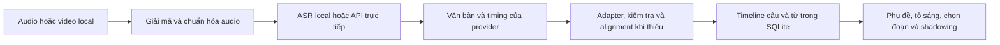
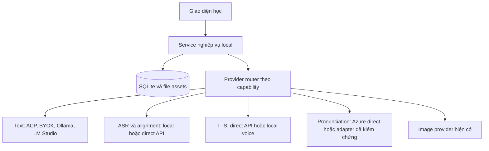

# Thay toàn bộ phụ thuộc Enjoy API

Ngày nghiên cứu: **08/09/2026**. Phạm vi: source hiện tại của ứng dụng trên nhánh `codex/learning-studio`, gồm các thay đổi local chưa commit. Đây là báo cáo nghiên cứu và đề xuất migration, chưa phải bản triển khai thay provider. **Đã bổ sung kiểm thử paid API và local runtime cùng ngày** tại [báo cáo live](2026-09-08-live-tests.md).

## 1. Kết luận và hướng chọn

**Có thể bỏ tài khoản Enjoy mà vẫn giữ phần lớn chức năng học. Tuy nhiên, không có một API hay một local model thay được toàn bộ Enjoy backend.** Cần thay theo chức năng: chép lời, căn thời gian, đọc văn bản, chấm phát âm, sinh nội dung và lưu dữ liệu. Các API tài khoản, thanh toán, cộng đồng và kho nội dung là backend nghiệp vụ, không phải model AI.

Đề xuất cho phiên bản đang dùng:

| Chức năng | Hướng ưu tiên | Lý do |
|---|---|---|
| Chép lời audio/video | **whisper.cpp qua Echogarden**; có API trực tiếp khi người dùng chọn | Tận dụng integration local đã có. Cần kiểm chứng timestamp trước khi mặc định cho shadowing |
| ASR cloud sau live test | **MAI Transcribe 2 qua OpenRouter + DTW** | Word timing và 2 speaker đã kiểm; OpenAI `whisper-1` direct vẫn là đường BYOK có sẵn nhưng chưa test bằng credential direct |
| Cloud speech thống nhất và chấm phát âm | **Azure Speech trực tiếp bằng resource riêng** | Giữ gần nhất cấu trúc kết quả SDK mà UI phát âm đang đọc |
| Đọc văn bản, tạo audio bài học | **Grok TTS qua OpenRouter cho EN/VI** | Audio và content roundtrip đã pass; cần thêm adapter/voice catalog. Kokoro cloud đã thử, local chưa có weights |
| Chat, dịch, giải thích, bài học | **Codex/Claude ACP hiện có**, hoặc direct API; **Ollama/LM Studio** khi cần offline | Có thể dùng lại provider factory. ACP chạy CLI trên máy nhưng inference không mặc nhiên offline |
| Từ vựng, ghi chú, lịch sử, transcript | **SQLite và file local làm nguồn chính** | Không cần thay bằng một dịch vụ AI khác |
| Stories và kho nội dung Enjoy | **Thư viện local/import và pipeline sinh nội dung** | LLM tạo nội dung mới, không khôi phục catalog, user data hay quyền truy cập của Enjoy |

Bảng trên là ưu tiên ban đầu theo mức phù hợp với source. Sau kiểm thử live, hướng cloud được bổ sung là **MAI Transcribe 2 qua OpenRouter + Echogarden DTW**, và **Grok TTS cho EN/VI**. Local whisper.cpp đã chạy offline thật. Không dùng corpus nhỏ để tuyên bố model tốt nhất; kết quả và các failure nằm ở [báo cáo live](2026-09-08-live-tests.md).

## 2. Bằng chứng và giới hạn của báo cáo

Ba loại thông tin được tách biệt:

- **Contract trong code:** type, parser và các field consumer sử dụng. Có thể xác định từ source hiện tại.
- **Capability được nhà cung cấp công bố:** đối chiếu tài liệu chính thức ngày 08/09/2026, có liên kết ở từng phần và [danh mục nguồn](2026-09-08-sources.md).
- **Phản hồi live:** lượt bổ sung đã gọi 20 model ASR, 18 model TTS cùng LLM/image qua OpenRouter, và chạy local Whisper/DTW. Receipts được lưu riêng trong `evidence/`. Không gọi Enjoy bằng tài khoản cũ hoặc Azure/Speechace trực tiếp. JSON minh họa trong phần source audit này vẫn là synthetic, không đổi nguồn gốc thành response live.

Ảnh của người dùng cho thấy lựa chọn **Azure AI (qua Enjoy)**. Ảnh không chứng minh Azure có lỗi hay tài khoản còn quota. Source cho biết đây là một nhánh phụ thuộc Enjoy để điều phối/quyền truy cập, cần phân biệt với Azure trực tiếp.

Báo cáo này thay cơ sở lựa chọn của [nghiên cứu AI ngày 06/09](../ai-modernization/research-enjoy-ai-modernization.md) cho yêu cầu mới: **không còn tài khoản Enjoy**. Kết quả kiểm thử cũ không được dùng làm bằng chứng runtime của thay thế mới.

## 3. Enjoy API đang trả về những loại dữ liệu nào?

Rà soát `Client` có **70 method API, tương ứng 69 cặp HTTP method + route template**. Hai method consume/revoke speech token dùng chung một route. Con số này không bao gồm proxy OpenAI, storage worker và URL tải file nằm ngoài `Client`.

| Nhóm | Dữ liệu app cần nhận | Có thể thay bằng gì? |
|---|---|---|
| Auth/profile | User identity, token, tên/avatar, trạng thái tài khoản | Profile local hiện có; bỏ nhu cầu token Enjoy |
| Runtime config | Danh sách model/voice, cấu hình GPT/TTS/IPA, kênh nội dung và preset | Catalog local có version và discovery trực tiếp từng provider |
| Transcript lưu/chia sẻ qua Enjoy | Bản ghi `TranscriptionType`, state và `result` có transcript/timeline | Lưu/query local; đây không phải request tạo Azure STT |
| Speech token | `{id, token, region}`; source không khai báo expiry hay quota trong response | Azure resource riêng; token broker của chính app nếu cần |
| TTS qua proxy | Audio bytes; nhánh SDK còn có kết quả/event riêng | OpenAI/Azure direct hoặc local TTS |
| Chấm phát âm | Kết quả tổng thể, từng từ/âm vị, timing và loại lỗi | Azure direct; Speechace cần adapter khác; local cần sản phẩm đánh giá riêng |
| Chat/AI command | Text, JSON do prompt yêu cầu, metadata usage theo adapter | ACP/direct LLM/local LLM + schema validation |
| Dịch/cache/lookup | Nghĩa từ trong ngữ cảnh, lựa chọn nghĩa, bản dịch, ID/cache metadata | LLM + từ điển + SQLite; phải giữ hình dạng dữ liệu nghiệp vụ |
| Stories/vocabulary | Bản ghi nội dung, từ/nghĩa, quan hệ user, phân trang và trạng thái | Local repositories/import/generation, không chỉ đổi model |
| Upload/storage | Consumer upload đọc `data.success`; download lấy bytes theo key, URL được app dựng | File local; chỉ thêm object storage riêng nếu cần sync |
| Social/payment/course | Theo dõi, bài đăng, giao dịch, subscription, course/curriculum | Không cần cho core học local; giữ ẩn hoặc thiết kế backend riêng khi có nhu cầu |

**Lưu ý serialization:** `Client` trả `response.data` sau khi đổi tên key sâu sang camelCase. Nó không trả nguyên `AxiosResponse`. Request cũng dùng snake_case ở nhiều method. Adapter mới không được giữ nguyên lớp bọc của provider rồi đưa thẳng cho consumer cũ. Xem [client.ts](../../../enjoy/src/api/client.ts:69).

Chi tiết từng method, response khai báo, consumer và mức độ còn reachable được tách thành [phụ lục endpoint](2026-09-08-endpoint-inventory.md).

## 4. Local mode hiện tại chưa đồng nghĩa đã loại hết Enjoy

Source đã đặt local profile mode và chặn nhiều đường background sync/upload. Nhưng renderer vẫn tạo `webApi` từ `apiUrl`, chỉ không gắn token của cloud user. Các lời gọi còn reachable không tự trở thành local vì không có Authorization.

Các chỗ cần xử lý trong migration:

1. **Lựa chọn speech vẫn có Enjoy.** Form trong ảnh có thể dẫn người dùng vào dịch vụ không còn credential hợp lệ; cần sửa danh sách provider, default và cấu hình đã lưu.
2. **Stories, Vocabulary và lookup transcript cloud vẫn có consumer.** Cần thay nguồn dữ liệu hoặc thay UX cho rõ chức năng khả dụng.
3. **Conversation presets và metadata chia sẻ còn tham chiếu cloud.** Preset cần catalog local, không phụ thuộc request khởi tạo tới Enjoy.
4. **EnjoyAI proxy vẫn tồn tại.** Engine `enjoyai` dựng `${apiUrl}/api/ai`; thay cấu hình chat chưa chắc thay cả TTS và STT.
5. **Storage và download tách khỏi API account.** File đã cache có thể dùng được; asset/model chỉ có URL Enjoy vẫn là phụ thuộc mạng. Từ điển bilingual hiện đã được bundle và kiểm checksum khi build; 8 URL dictionary Enjoy cũ là metadata legacy, không phải bằng chứng build hiện tại còn tải chúng.
6. **Tên tool `enjoy.*` trong MCP của Learning Studio không phải Enjoy cloud.** Cần phân loại theo transport/destination, không xóa chỉ vì có chuỗi `enjoy`.
7. **Health check và telemetry cần kiểm riêng.** Advanced settings còn probe `/up`; Ahoy vẫn được cấu hình bằng `apiUrl` trong local mode. Chưa có capture để kết luận Ahoy có tự gửi request trong phiên app. Bugsnag bootstrap đã có local guard.

Các mục này là kết luận static từ call graph, chưa phải capture network của phiên app hiện tại. Phụ lục endpoint ghi đường dẫn source để thực hiện audit và nghiệm thu sau.

## 5. Phần chép lời trong ảnh cần giữ những gì?

**Luồng trong ảnh thực ra lấy token từ Enjoy rồi gửi âm thanh trực tiếp tới Azure SDK.** Nó không POST audio tới `/api/transcriptions`. Đường đó dùng để tìm/lưu transcript chia sẻ. Tách đúng hai việc này giúp thay token broker mà vẫn giữ recognizer và alignment hiện có.

Luồng hiện tại theo source:

1. Form lấy `language`, `service`, `text` và `isolate`; mặc định STT còn là Enjoy Azure.
2. Audio/video được chuyển thành WAV 16 kHz.
3. App gọi `POST /api/speech/tokens` với `purpose=transcribe`, `target_id`, `target_type`; nhận `{id, token, region}`. Nhánh này dùng bearer từ cloud session user, khác nhánh pronunciation/TTS dùng EnjoyAI key.
4. `SpeechConfig.fromAuthorizationToken(token, region)` tạo recognizer gửi WAV trực tiếp Azure, yêu cầu Detailed JSON và word timestamps.
5. App nối `DisplayText`, dùng `NBest[].Words` lấy mốc đầu/cuối làm segment seed. Raw word list của Azure không được lưu nguyên vào DB.
6. **Echogarden DTW vẫn chạy để căn từ/phone**, sau đó dựng sentence timeline, preprocess và lưu SQLite.

Nguồn: [token request và recognizer](../../../enjoy/src/renderer/hooks/use-transcribe.tsx:402), [normalization Azure](../../../enjoy/src/renderer/hooks/use-transcribe.tsx:470), [alignment chung](../../../enjoy/src/renderer/hooks/use-transcribe.tsx:123).

Một chuỗi text là chưa đủ cho giao diện luyện nghe. App cần biết **câu nào đang phát, từ nào ứng với đoạn âm thanh nào, và timing dùng đơn vị gì**. Khi thay ASR, cần giữ cả các bước sau kết quả model.



| Thành phần | Dùng để làm gì? | Nếu provider mới không có |
|---|---|---|
| Transcript nguyên văn | Hiển thị nội dung khớp audio | Không dùng summary hoặc bản đã sửa câu thay transcript |
| Language/locale | Tokenization, voice, xử lý nội dung | Cho người dùng chọn hoặc lưu kết quả nhận diện có nguồn |
| Thời điểm bắt đầu/kết thúc câu | Phát lại câu, chuyển câu, phụ đề | Căn lại với audio; không chia đều theo độ dài text |
| Thời điểm bắt đầu/kết thúc từ | Tô sáng từ và chọn đoạn chính xác | Forced alignment local hoặc hạ capability rõ ràng |
| Cấu trúc sentence -> word -> token -> phone | Consumer đi qua cây timeline, dựng cả IPA caption | Giữ Echogarden alignment và chuẩn hóa cấu trúc trước khi lưu |
| Trạng thái job, lỗi, retry | Không kẹt ở “Đang chuẩn bị âm thanh” | Job local bền vững; không giả lập ID Enjoy |
| Raw result/provider/model | Chẩn đoán, đổi adapter, tái xử lý | Lưu có version và tách khỏi DTO dành cho UI |
| Speaker/confidence | Phân vai, hỗ trợ kiểm tra ASR nếu có | Optional; không biến confidence thành điểm phát âm |

Timestamps phải quy về một đơn vị canonical, ví dụ giây. Azure SDK có offset/duration theo tick 100 ns, Azure Fast API dùng milliseconds, Deepgram dùng seconds, AssemblyAI dùng milliseconds. Cần adapter theo từng API, không theo tên hãng chung. Công thức điển hình: `start = offsetMs / 1000`, `end = (offsetMs + durationMs) / 1000`; Azure tick chia `10_000_000`.

### Hai loại response không được lẫn

- **Response token Enjoy:** chỉ `{id, token, region}` cho bước Azure trong ảnh. API tìm transcript là đường khác, trả bản ghi nghiệp vụ đã lưu.
- **Raw result Azure hoặc ASR khác:** văn bản, câu/từ và timing theo schema provider.

Việc thay Enjoy cần lưu bản ghi local sau normalize/alignment. Không gửi request Azure Fast rồi kỳ vọng nhận đúng `TranscriptionType` của app. Raw ASR có thể chỉ trả text nếu alignment phía sau tạo được cấu trúc đầy đủ; word timestamps từ provider không phải điều kiện duy nhất để một phương án thay thế khả thi.

Contract chính xác của flow hiện tại, JSON minh họa và các nhánh normalize nằm ở [phụ lục speech](2026-09-08-speech-contracts.md). Các ví dụ đó là dữ liệu tổng hợp theo source, không phải response live.

## 6. API trực tiếp thay chép lời

| Phương án | Output và mapping cần thiết | Mức phù hợp với Enjoy | Giới hạn/việc còn thiếu |
|---|---|---|---|
| **OpenAI `whisper-1`** | `verbose_json`, words có `word/start/end`, segments có text và timing | Ưu tiên nếu đã dùng OpenAI BYOK; giữ đường code sẵn | Chia file theo giới hạn API, kiểm tra đầy đủ word coverage và lưu timeline |
| **Azure Speech SDK trực tiếp** | Giữ Detailed JSON `DisplayText`, `NBest`, `Words`, tick offsets của flow đang có | Ít đổi phần speech nhất khi chuyển từ Azure qua Enjoy | Thay token Enjoy bằng credential Azure riêng; giữ Echogarden DTW, thêm setting và credential service |
| **Azure Fast Transcription** | `combinedPhrases[].text`; `phrases[].text/words`; offset và duration ms | Tốt khi muốn cùng hệ Azure với pronunciation | Adapter mới; không phải schema Azure SDK cũ; key/resource/region riêng |
| **Deepgram Nova** | `results.channels[].alternatives[].transcript/words`, word/start/end/confidence; punctuated_word khi có | Tốt cho transcript có timing, hỗ trợ gửi bytes trực tiếp | Chưa tích hợp trong app; xử lý channels/paragraphs/speakers và cấu hình formatting |
| **AssemblyAI** | Job ID/status/error; text, words và endpoint sentences | Hợp file dài và job bất đồng bộ | Cần upload/poll/cancel/resume mapping, milliseconds sang seconds; không tái sử dụng job ID Enjoy |
| **Gemini `gemini-3.5-transcribe`** | Interactions output và word annotations, mode verbatim | Ứng viên mới cần thử trên corpus thật | Adapter Interactions riêng; không dùng nhánh OpenAI-compatible text để suy ra speech support |
| **OpenAI `gpt-transcribe`** | Text và context/language hints; timestamp cần xác minh riêng | Có đường model trong code nhưng chưa chọn làm timestamp mặc định | Tài liệu guide/reference chưa đủ thống nhất cho word timing; cần probe đúng payload hoặc local alignment |

Nguồn: [OpenAI guide](https://developers.openai.com/api/docs/guides/speech-to-text), [Azure Fast](https://learn.microsoft.com/en-us/azure/ai-services/speech-service/fast-transcription-create), [Deepgram](https://developers.deepgram.com/docs/pre-recorded-audio), [AssemblyAI](https://www.assemblyai.com/docs/pre-recorded-audio/api-reference/transcripts/get), [Gemini transcription](https://ai.google.dev/gemini-api/docs/transcribe).

Với Gemini, cấu hình ưu tiên cho shadowing là **verbatim + word timestamps**. Smart mode có thể bỏ filler/lặp và sửa diễn đạt; không phù hợp làm nội dung karaoke. Tài liệu hiện cũng cấm ghép custom vocabulary với timestamps/diarization. Đây là ràng buộc request cần encode vào capability map, không chỉ ghi trong hướng dẫn.

### Điểm cần sửa trong kết luận OpenAI trước đây

Guide hiện ghi timestamp granularities chỉ hỗ trợ `whisper-1`. API reference có liệt kê `gpt-transcribe` nhưng phần timestamp mô tả generic và sample vẫn dùng Whisper. **Không đủ bằng chứng để khẳng định `gpt-transcribe` thay `whisper-1` mà giữ nguyên word timing.** Ưu tiên đường đã có contract rõ; model mới chỉ được bật capability sau thử nghiệm thực hoặc dùng alignment riêng. [Guide](https://developers.openai.com/api/docs/guides/speech-to-text), [API reference](https://developers.openai.com/api/reference/python/resources/audio/subresources/transcriptions/methods/create).

## 7. Local model thay chép lời và căn thời gian

| Lựa chọn | Trả về/cung cấp gì? | Phù hợp ở đâu? | Quyết định |
|---|---|---|---|
| **Echogarden + whisper.cpp** | Transcript, timeline; có nhận dạng và alignment qua các engine | Đường local đã có trong repo; whisper.cpp hỗ trợ Apple Silicon/Metal | **MVP ưu tiên**, benchmark một model nhỏ và một model chất lượng cao |
| **faster-whisper** | Segments và words khi bật `word_timestamps=True` | Python/CTranslate2; hữu ích trên CPU hoặc máy có NVIDIA | Adapter process/service mới; không coi benchmark CUDA là số đo trên Mac |
| **WhisperX** | ASR + forced alignment, có thể thêm diarization | Khi cần đối chiếu chất lượng alignment tốt hơn | Không chọn mặc định ngay; nhiều dependency và timing có thể thiếu cho số/ký hiệu |
| **Qwen3-ASR + ForcedAligner** | ASR 0.6B/1.7B; model aligner 0.6B riêng tạo timing | Ứng viên đối chứng hiện đại cho speech | Thử nghiệm sau MVP. ASR có tiếng Việt; aligner công bố 11 ngôn ngữ có Anh nhưng không có Việt |
| **Parakeet TDT 0.6B v2** | Transcript tiếng Anh và character/word/segment timestamps | Corpus tiếng Anh, runtime NeMo riêng | Ứng viên benchmark; chưa có integration hoặc bằng chứng đóng gói Electron/Mac |
| **Transcript do người dùng nhập + alignment** | Không nhận dạng lại nội dung; căn text đã có vào audio | Phụ đề chuẩn, bài đọc đã biết, transcript được sửa tay | Nên giữ. Text biết trước không loại bỏ nhu cầu căn thời gian |

Nguồn: [Echogarden](https://github.com/echogarden-project/echogarden), [whisper.cpp](https://github.com/ggml-org/whisper.cpp), [faster-whisper](https://github.com/SYSTRAN/faster-whisper), [WhisperX](https://github.com/m-bain/whisperX), [Qwen3-ASR](https://github.com/QwenLM/Qwen3-ASR), [Parakeet](https://huggingface.co/nvidia/parakeet-tdt-0.6b-v2).

**Chọn model để đo, chưa chốt model mặc định:** `small.en` cho tiếng Anh và `large-v3-turbo` làm đối chứng chất lượng trong cùng runtime. Nếu audio có tiếng Việt/code-switching, dùng model đa ngôn ngữ. Tài liệu whisper.cpp ghi word timestamp là experimental; nhận được số thời gian không đồng nghĩa đủ chính xác cho luyện phát âm.

Không cần cài cùng lúc tất cả model. Tải đúng runtime/model đã chọn, có checksum/version, rồi đo thời gian, RAM và độ khớp từ trên chính máy sử dụng. Các con số RAM trong README là hướng dẫn của upstream, không phải mức RAM tổng của app đã đóng gói.

### Thiết kế output adapter đề xuất

Đây là DTO đề xuất cho lớp mới, không khẳng định trùng type đang lưu:

```ts
type SpeechTranscript = {
  schemaVersion: 1;
  provider: string;
  model: string;
  providerSchemaVersion: string;
  rawArtifactRef?: string;
  language: string;
  text: string;
  durationSeconds: number;
  segments: Array<{
    id: string;
    text: string;
    start: number;
    end: number;
    words: Array<{
      text: string;
      start: number;
      end: number;
      confidence?: number;
      speakerId?: string;
    }>;
  }>;
  timingSource: "provider" | "forced_alignment";
  warnings: string[];
};
```

DTO này là kết quả ASR và timing đề xuất, chưa có tầng token/phone mà IPA caption cần. Phải đi tiếp qua alignment để tạo cây `TimelineEntry` hiện hữu trước khi UI dùng. Không bỏ DTW chỉ vì provider mới trả `words`, và không đổi toàn bộ data model để giống JSON của một hãng.

Validator bắt buộc kiểm tra số hữu hạn, `0 <= start <= end`, không vượt duration ngoài tolerance đo được, child nằm trong parent, văn bản được phủ bởi words và offsets của chunk được cộng đúng. Với từ không align được, trả warning/đường sửa; không tự điền timing giả. Giữ dấu câu, contractions, số, từ lặp và khoảng lặng khi normalize.

## 8. Chấm phát âm: phần không thể thay bằng ASR đơn thuần

**Giữ Azure nhưng gọi trực tiếp là phương án gần nhất với tính năng hiện tại.** App đang dùng Azure Speech SDK cho kết quả chi tiết; Enjoy nằm trong đường cấp quyền và một số đường lưu/sync. Bỏ account Enjoy không yêu cầu bỏ Azure.

| Nhu cầu | Azure direct | Speechace | Local ASR/alignment |
|---|---|---|---|
| Transcript và thời gian từ | Có, theo SDK/config | Có dữ liệu đánh giá theo API | Có nếu engine/adapter hỗ trợ |
| Accuracy/Fluency/Completeness/Prosody | Contract Azure phù hợp nhất với UI đang có | Có hệ điểm và fluency riêng, không cùng thang/semantics | Không có tương đương được xác minh |
| Điểm word/syllable/phoneme | JSON chi tiết theo locale/config | Nhà cung cấp công bố đánh giá các cấp này | Alignment không phải điểm chất lượng phát âm |
| Mispronunciation/omission/insertion | Phụ thuộc config và mode | Cần map theo schema/version cụ thể | Có thể so text để tìm thiếu/thừa từ, nhưng không suy ra lỗi âm vị |
| Offline | Không | Không | Có sau khi có đủ model, nhưng mất equivalence đánh giá |

Azure prosody chỉ có `en-US` theo tài liệu hiện tại. Audio trên 30 giây cần continuous mode; `EnableMiscue` không được hỗ trợ như single-shot, cần so kết quả với reference để xác định thiếu/thừa. Nên giữ bài chấm từng câu ngắn trước khi mở rộng bài đọc dài. [Azure assessment](https://learn.microsoft.com/en-us/azure/ai-services/speech-service/how-to-pronunciation-assessment).

Speechace là ứng viên dự phòng, không phải drop-in replacement. Repository chính chủ xác nhận điểm phoneme/syllable/word/sentence và fluency, nhưng đợt này chưa xác minh đầy đủ response schema của phiên bản API hiện hành. Cần sample tài khoản thật và mapping trước khi ước lượng parity. [Speechace samples](https://github.com/speechace/speechace-api-samples).

Nếu mục tiêu là hoàn toàn offline, nên có mode **luyện đọc và đối chiếu bản chép lời**, hiển thị rõ không có chấm âm vị. Xây hệ local GOP/phoneme classifier và hiệu chỉnh với giám khảo là một dự án riêng. Không chuyển ASR confidence, edit distance hay điểm LLM đọc transcript thành `PronScore`.

## 9. TTS: trả audio thật và nối đúng mọi màn hình

| Lựa chọn | Input/output | Phần cần thêm |
|---|---|---|
| **OpenAI trực tiếp** | Text/model/voice -> audio bytes; dùng `gpt-4o-mini-tts` với format phù hợp | Giữ cache, lưu file, kiểm tra MIME/bytes; thay mọi cấu hình Enjoy còn sót |
| **Azure trực tiếp** | Text/SSML + voice -> SDK result/audio; voice catalog từ Azure | Resource riêng và credential boundary chung main process; không phụ thuộc Enjoy token |
| **Kokoro-82M local** | Text + voice -> waveform/chunk | Đóng gói runtime, WAV encoder, voice catalog, adapter SpeechProvider và cache |
| **Piper local** | Text + voice model -> audio | Cần voice đúng ngôn ngữ và integration; upstream hiện hành là `OHF-Voice/piper1-gpl` |
| **Qwen3-TTS local** | Text/voice/instruction -> waveform và sample rate | Runtime/model lớn hơn Kokoro; benchmark trước; danh sách công bố chưa có tiếng Việt |

Nguồn: [OpenAI TTS](https://developers.openai.com/api/docs/guides/text-to-speech), [Azure TTS](https://learn.microsoft.com/en-us/azure/ai-services/speech-service/rest-text-to-speech), [Kokoro](https://huggingface.co/hexgrad/Kokoro-82M), [Piper](https://github.com/OHF-Voice/piper1-gpl), [Qwen3-TTS](https://github.com/QwenLM/Qwen3-TTS).

Kokoro là ứng viên đầu tiên cho **đọc tiếng Anh local**, dựa vào kích thước 82M và scope tính năng. Đây chưa phải kết luận giọng tốt nhất. Không suy ra hỗ trợ đọc tiếng Việt từ việc model hiểu hoặc phonemizer xử lý được ký tự Việt. Giọng cho phần nghĩa tiếng Việt cần kiểm tra riêng.

TTS không mặc định trả word alignment. Nếu cần karaoke cho audio tổng hợp, lấy event boundary chính xác của provider khi có, hoặc căn lại text với file tạo ra. Không dùng thời lượng ước tính từ số ký tự.

Trong code hiện tại có hai bề mặt: `use-speech` phục vụ UI cũ và `main/speech/provider` phục vụ Learning Studio. Chỉ thêm Kokoro vào một dropdown là chưa đủ. Cấu hình Azure của Learning Studio còn trả `null` vì token brokering thuộc renderer; cần nối main-process credential service trước khi công bố Azure direct hoạt động toàn app. Xem [speech-configuration.ts](../../../enjoy/src/main/learning/speech-configuration.ts:67).

Các license phải được ghi theo đúng component: Kokoro weights Apache-2.0, Piper hiện hành GPL-3.0, Echogarden có điều kiện theo thành phần tải/nạp. Đây là dữ liệu để chọn cách phân phối, không gộp tất cả thành “model miễn phí không ràng buộc”.

## 10. Chat, dịch, lookup, IPA và sinh nội dung

### Text generation

Provider factory hiện có EnjoyAI, OpenAI, Gemini, DeepSeek, OpenRouter, Ollama, LM Studio và ACP Codex/Claude. Phần text không cần viết lại từ đầu; cần bỏ phụ thuộc config/credential Enjoy và kiểm tra các default đã lưu. Xem [ai-providers.ts](../../../enjoy/src/lib/ai-providers.ts:189).

**ACP phù hợp khi tiếp tục dùng đăng nhập CLI hiện có**, nhưng “CLI local” không đồng nghĩa model chạy offline. Cũng không nên xem quyền dùng text/image của ACP là quyền gọi Azure Speech hay OpenAI Audio. Mỗi modality phải có provider/capability riêng.

Với offline, thử **Qwen3-8B qua Ollama hoặc LM Studio** làm baseline cho dịch/giải thích Anh-Việt. Chọn quantization theo RAM, đo chất lượng và latency với prompt thật của Enjoy. Model text đa ngôn ngữ không thay được ASR, TTS hoặc pronunciation. [Qwen3-8B](https://huggingface.co/Qwen/Qwen3-8B).

Ollama có structured outputs; LM Studio có các endpoint tương thích OpenAI. Adapter vẫn cần parse output, validate schema và retry có giới hạn. JSON hợp cú pháp không chứng minh bản dịch đúng ngữ cảnh hoặc phù hợp CEFR. [Ollama](https://docs.ollama.com/capabilities/structured-outputs), [LM Studio](https://lmstudio.ai/docs/developer/openai-compat), [OpenAI schema output](https://developers.openai.com/api/docs/guides/structured-outputs).

### Từ điển và IPA

- Giữ từ điển offline đã import và bilingual dictionary đang có. Bilingual dictionary hiện được bundle với checksum; các URL Enjoy trong legacy metadata cần phân loại theo consumer, không thay hoặc xóa dữ liệu chỉ vì có tên domain cũ.
- **CMUdict** có phát âm tiếng Anh Mỹ dưới dạng ARPAbet. Muốn IPA phải map ký hiệu, trọng âm và variant; không phải nghĩa Anh-Việt và không phải kết quả nghe giọng người học. [CMUdict](https://github.com/cmusphinx/cmudict).
- **Kaikki/Wiktionary** là nguồn dữ liệu lexical có thể import. Coverage nghĩa tiếng Việt/IPA/audio phải kiểm tra từng entry và lưu nguồn, không suy ra đầy đủ từ tên bộ dữ liệu. [Kaikki](https://kaikki.org/dictionary/English/index.html).
- LLM có thể chọn nghĩa theo context và giải thích bằng tiếng Việt; nên giữ provenance và cho sửa. Không dùng LLM để bịa URL file phát âm hoặc ID dictionary/server.

### Những object phải giữ ngoài model

`LookupType`, các bản ghi meaning, translation cache, story/vocabulary và learning revision cần local ID, timestamps và quan hệ ổn định. LLM chỉ cung cấp phần nội dung được schema cho phép. App tạo ID, liên kết profile và lưu transaction. Cache theo word + context + ngôn ngữ + provider/model/schema version để tránh lấy lại kết quả khác cấu hình.

Ảnh minh họa của Learning Studio có đường native asset riêng. Việc bỏ Enjoy không bắt buộc thay đường đó; phải đánh giá destination thật. Model local text không tự cung cấp bitmap và không thay image provider bằng cách trả một URL tưởng tượng.

## 11. Các API không có model thay thế tương đương

| Nhóm endpoint | Cách xử lý đề xuất | Điểm cần giữ |
|---|---|---|
| Profile/session | Local identity | Giữ namespace thư viện hiện có, không đổi user ID gây “mất” dữ liệu |
| Recordings/transcriptions/notes/segments | SQLite + file assets | Quan hệ khóa ngoại, timestamps, revisions, retry và xóa có kiểm soát |
| Cloud Stories | Local stories repository, import file/URL và generation pipeline | Schema body/words/meanings, pagination local, thao tác sửa/lưu |
| `mineMeanings`/vocabulary | Query meanings/vocabulary local | Trạng thái học, nguồn context, deduplicate ổn định |
| Conversation presets | Seed versioned trong app hoặc import JSON | Không bắt buộc network khi mở form |
| Credits/balance/subscription/payment | Bỏ khỏi luồng học local | Không hiển thị số dư Enjoy như quota provider trực tiếp |
| Storage worker | Local asset path + protocol app | URL cloud cũ chỉ là tham chiếu; cần local bytes cho offline |
| Model/dictionary downloads | Manifest nguồn chính chủ + checksum + import thủ công | First-run download cũng nằm trong định nghĩa không phụ thuộc Enjoy |
| Social/rankings/posts/course catalog | Giữ ngoài scope core hoặc backend riêng | Không hứa thay bằng LLM vì đó là dữ liệu/người dùng thật |

Không cần dựng lại toàn bộ backend Enjoy chỉ để chép lời. Nhưng nếu muốn giữ Stories/Vocabulary trong UI thì phải có local repository thực, không chỉ bắt lỗi request rồi trả mảng rỗng.

## 12. Kiến trúc migration đề xuất

Tách **nơi lưu dữ liệu** khỏi **nơi thực thi AI**:



Router cần ít nhất các capability: `transcribe`, `wordTimestamps`, `align`, `synthesize`, `pronunciationAssessment`, `structuredText`, `imageGeneration`. Trạng thái gồm chưa cấu hình, sẵn sàng, thiếu model, mất kết nối, hết quota và không hỗ trợ. Không chuyển âm thầm từ local sang cloud khi lỗi.

Credential direct API đặt ở main process và kho bí mật của hệ điều hành khi triển khai. Renderer chỉ gửi yêu cầu nghiệp vụ; không cần biết Azure token/subscription key. Endpoint phải lưu kèm provider, ngăn lấy key Enjoy gửi sang endpoint mới hoặc key hãng này gửi sang hãng khác.

Chính sách raw thống nhất được đề xuất: lưu JSON model result đã loại credential thành artifact local trong namespace profile, kèm `providerSchemaVersion`; canonical DTO giữ `rawArtifactRef` nếu capture an toàn thành công. Raw artifact có cùng vòng đời với revision transcript và được xóa khi revision bị xóa theo thao tác của người dùng; không ghi raw vào log chung. Không lưu token broker, Authorization header hoặc URL có credential cùng diagnostics. Đối với TTS, file audio đã lưu là artifact kết quả, không nhân đôi waveform vào JSON.

Chỉ bản ghi có raw artifact mới có thể chạy lại normalizer/alignment từ output cũ mà không gọi ASR lại. Bản ghi legacy hoặc không có raw phải dùng canonical data còn đủ, hoặc chạy ASR lại từ audio gốc; không cam kết khôi phục raw đã bị bỏ. Đổi sang model/provider khác vẫn cần inference mới. Job phải hỗ trợ cancel/retry, profile switch và restart. Pending job cloud Enjoy cũ nên đánh dấu cần xử lý lại, không polling vô hạn.

## 13. Chi phí tham khảo và vận hành

Giá niêm yết đọc ngày 08/09/2026, USD, chưa gồm thuế, add-on, upload/storage và retry. Cột 10 giờ là phép tính cho **600 phút audio đầu vào**, không phải hóa đơn hay benchmark.

| ASR | Giá cơ sở công bố | 10 giờ audio | Nguồn |
|---|---:|---:|---|
| OpenAI `whisper-1` | 0.006/phút | 3.60 | [Model pricing](https://developers.openai.com/api/docs/models/whisper-1) |
| OpenAI `gpt-transcribe` | 0.0045/phút | 2.70 | [Model pricing](https://developers.openai.com/api/docs/models/gpt-transcribe) |
| Deepgram Nova-3 prerecorded monolingual PAYG | 0.0043/phút | 2.58 | [Pricing](https://deepgram.com/pricing) |
| Deepgram Nova-3 prerecorded multilingual PAYG | 0.0052/phút | 3.12 | [Pricing](https://deepgram.com/pricing) |
| AssemblyAI Universal-3.5 Pro async | 0.21/giờ | 2.10 | [Pricing](https://www.assemblyai.com/pricing) |
| AssemblyAI Universal-2 async | 0.15/giờ | 1.50 | [Pricing](https://www.assemblyai.com/pricing) |
| Azure | Theo region/tier/mode và tính năng | Chưa chốt | [Pricing](https://azure.microsoft.com/en-us/pricing/details/speech/) |
| Local ASR | Không có phí API mỗi phút | Không quy thành 0 tổng chi phí | Máy, điện, RAM, thời gian xử lý và bảo trì runtime |

Giá rẻ hơn không giải quyết thiếu timing. Nếu cần chạy forced alignment sau ASR cloud, phải cộng chi phí máy và latency của bước đó. TTS tính theo audio/token/character tùy provider, không dùng bảng ASR để ước tính giá đọc bài. Chấm phát âm cần tính số lần người học thử lại, không chỉ thời lượng tài liệu nhập.

Công thức vận hành nên dùng: `chi phí = ASR nhập mới + TTS chưa cache + pronunciation mỗi lần luyện + text/image generation + lưu trữ`. Cache theo hash nội dung/cấu hình giúp tránh phát sinh lại khi mở một bài đã xử lý.

## 14. Lộ trình triển khai có outcome rõ

### Giai đoạn 1: làm luồng hiện tại dùng được mà không cần Enjoy

- Sửa default và migration cấu hình STT/TTS/chat. Enjoy không xuất hiện như provider có thể dùng khi không có account; dữ liệu cũ vẫn giữ nguyên.
- Cho chọn whisper.cpp/Echogarden local hoặc OpenAI direct đã cấu hình. Preflight báo đúng thiếu binary/model/key trước khi tạo job.
- Bỏ cloud transcript lookup khỏi điều kiện bắt buộc mở media. Giữ import transcript và local alignment.
- Xử lý request Stories/Vocabulary/presets còn reachable bằng local repository hoặc trạng thái tính năng rõ ràng.
- Kiểm tra model/dictionary bootstrap không cần tài khoản/host Enjoy.

**Nghiệm thu:** profile không có token Enjoy import audio, tạo transcript có câu/từ, phát/seek/tô sáng, restart còn kết quả; network capture không có request tới Enjoy trong các luồng đã chuyển.

### Giai đoạn 2: giữ speech đầy đủ bằng provider trực tiếp

- Azure direct cho Pronunciation Assessment, TTS và tùy chọn ASR.
- Credential service main process dùng chung cho UI cũ và Learning Studio.
- Chuẩn hóa result và giữ raw payload; chạy audio thật có lỗi phát âm, thiếu/thừa từ.

**Nghiệm thu:** điểm và lỗi render đúng contract, có word/phoneme breakdown, lỗi credential/quota không thành điểm 0; không gọi Enjoy cấp token hay lưu result bắt buộc.

### Giai đoạn 3: bổ sung offline chất lượng cao

- Kokoro local TTS, rồi benchmark Qwen3-ASR/WhisperX/Parakeet nếu baseline chưa đạt.
- Local LLM cho dịch/giải thích; offline từ điển có nguồn dữ liệu rõ.
- Bundle/import runtime và model, có progress/cancel/checksum, mở app khi mất mạng sau cold restart.

**Nghiệm thu:** chặn mạng ngoài, đủ audio/text assets local, các chức năng công bố offline chạy được. Pronunciation không tương đương Azure phải được ghi rõ capability, không chấm điểm giả.

Không đưa lịch giờ/ngày cứng khi chưa đo dependency native, runtime thật và độ thiếu của local Stories/Vocabulary. Phần chấm phát âm offline là dự án khác, không nên gộp vào estimate đổi API.

## 15. Bộ kiểm chứng phải chạy trước khi công bố thay thế xong

| Nhóm | Mẫu/thao tác | Tiêu chí |
|---|---|---|
| Chép lời | Audio Anh chuẩn, người Việt nói Anh, noise, nói nhanh/chậm, silence | WER với transcript chuẩn; không hallucinate chữ trong silence |
| Timing | Đánh dấu thủ công ít nhất một tập word boundary | Đo median/p95 sai lệch; kiểm chứng phát/seek từng từ thật |
| Cấu trúc | Contractions, số, ký hiệu, từ lặp, câu dài, nhiều chunk | Không mất/nhân đôi text, không sai offsets qua chunk |
| File input | Audio/video và định dạng đang hỗ trợ, file dài | Không kẹt job; duration đúng; bytes không bị truncate |
| Phụ đề | Nhập transcript, sửa text rồi align lại | Timing cập nhật và revision không ghi đè sai dữ liệu cũ |
| TTS | Tên riêng, số, IPA không gửi nhầm như lời đọc, đoạn dài | Có audio nghe được, đúng giọng/ngôn ngữ, file/cache tồn tại sau restart |
| Pronunciation | Đọc đúng, sai âm, bỏ từ, thêm từ, không nói | Kết quả/loại lỗi có ý nghĩa; missing metric là unsupported, không điền 0 |
| Hệ thống | Cancel, retry, restart, chuyển profile, timeout/401/429 | Không lưu nhầm profile, không nhân đôi billing/job, lỗi có đường khôi phục |
| Không Enjoy | Chặn/ghi nhận request tới Enjoy ở renderer, main và child process | Zero request trong mọi journey công bố đã chuyển, gồm bootstrap/download |
| Offline | Chuẩn bị model rồi cold start, cắt mạng | Các capability offline hoạt động bằng bytes/model local thật |

Ngưỡng WER, sai lệch timing và latency nên chốt từ corpus học thực tế. Không lấy “API trả 200”, “JSON có words” hoặc test mock pass làm tiêu chí chất lượng speech. Kết quả mới cần chia **pass / fail / chưa kiểm**, kèm provider/model/version và artifact.

## 16. Trạng thái sau đợt nghiên cứu

- **Đã làm:** rà contract và call sites, xác định nhánh còn Enjoy, đối chiếu API/local model chính thức, xây mapping và lộ trình kiểm chứng.
- **Chưa làm:** đổi cấu hình người dùng, sửa code app, đăng ký resource/provider, paid inference, tải model mới, benchmark hoặc build/package lại.
- **Chưa biết chắc:** response live hiện tại của Enjoy; quyền/quota của tài khoản provider trực tiếp; model nào tốt nhất với giọng Anh-Việt của người dùng; toàn bộ runtime packaging của các ứng viên local mới.

Các phụ lục giúp triển khai mà không phải suy lại schema: [endpoint inventory](2026-09-08-endpoint-inventory.md), [speech contracts](2026-09-08-speech-contracts.md), [nguồn chính thức](2026-09-08-sources.md).
