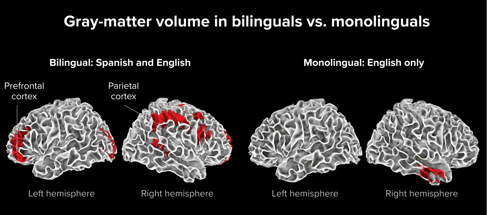

# Đặc quyền thực chất

Rèn thể chất liên tục lâu dài vốn đã là thói quen của rất ít người. Rèn não liên tục còn hiếm hơn, vì học hay tự học đều là hoạt động rèn não. Ngày nay, rèn cơ thể không còn để trồng trọt, săn bắn hay chống cướp mà để khỏe mạnh. Nó cần tự thỏa mãn và tự tạo động lực. Cũng vậy, học, tức rèn não, không nên chỉ để kiếm việc hay đổi tầng lớp mà vì sức khỏe não. Đó cũng phải là nhu cầu tự thỏa mãn và tự thúc đẩy.

Rèn thể chất lâu dài đã thành một **đặc quyền**, trước hết vì cần đủ thời gian. Thời gian của ai cũng hữu hạn. Mô hình kinh tế cá nhân cả đời của phần lớn người là bán thời gian của mình, nên tiền và thời gian, hai nguồn lực loại trừ nhau, thường xung đột: có tiền thì thiếu thời gian, có thời gian thì thiếu tiền. Nhiều người hiểu lợi ích và sự cần thiết của tập luyện, muốn kiên trì, nhưng điều kiện thật sự không cho phép.

Ngoài thời gian dồi dào, tốt nhất tiền cũng không là vấn đề. Nhưng như vậy có tự động luyện tập lâu dài không? Rõ ràng không. Tập luyện cần ý thức chủ động, nên dù tiền và thời gian không thiếu, vẫn ít người làm được. Tự học, học, thậm chí đọc sách là hoạt động rèn não cũng là đặc quyền, vì vẫn cùng nguyên nhân: thiếu thời gian và thiếu chủ động. Kết cục là số người thật sự đọc lâu dài, ngay cả hoạt động rèn não cơ bản nhất, cũng rất ít.

Nói chung, “đặc quyền” vừa khiến người ta ao ước vừa khiến người ta ghét. Theo định nghĩa, đó là quyền chỉ số ít có nên đáng ao ước. Nhưng đa số không có, và lợi ích thêm của số ít có đặc quyền thường xây trên tổn thất của đa số, nên nó đáng ghét, ít nhất là khiến đa số ghét.

Khi xét tự học, học, tập luyện và đọc sách như những đặc quyền, chỉ còn mặt tốt. Chúng không thể làm hại lợi ích của người khác. Thành quả và tích lũy chúng tạo ra không đặt trên tổn thất của ai, vì tất cả xảy ra trong cơ thể mỗi người. Làn da trở thành ranh giới tự nhiên và chắc chắn.

Rèn thể chất không chỉ có hiệu quả rõ mà phản hồi tức thời hơn tưởng tượng. Trước khi đi gym năm 32 tuổi, tôi không nghĩ cơ thể có thể thay đổi nhanh và nhiều. Khi học đại học, cao 172 cm nhưng chỉ nặng 52 kg. Đi gym ba lần mỗi tuần, ba tháng sau cân nặng từ 65 lên 75 kg, nửa năm sau lên 82 kg. Vòng tay, chân, ngực và eo thay đổi thấy bằng mắt, toàn bộ quần áo cũ phải thay.

Khi đó, tôi còn dạy ở New Oriental. Mùa bận là nghỉ hè và nghỉ đông, có đợt liên tiếp hơn 20 ngày hoặc 50 ngày, mỗi ngày giảng bốn tiết, mỗi tiết 150 phút. Ngày thường ngoài ba hoặc bốn tiết cuối tuần, từ thứ Hai đến thứ Sáu khá tự do. Điều đó tạo ra **đặc quyền thời gian**: lúc phần lớn người khác đi làm, tôi nghỉ. Tôi thường đến gym từ 9 đến 11 giờ sáng, cả phòng chỉ có mình là khách, bể bơi như của riêng. Nhìn lại, suy nghĩ về đặc quyền có lẽ bắt đầu âm thầm từ đó.

Phòng tập có nhiều gương, thậm chí một mặt tường là gương. Người tập tạ thỉnh thoảng nhìn gương vì thay đổi thấy được. Rèn não khác: não không nằm ngoài cơ thể nên ta không nhìn thấy, thậm chí không cảm thấy. Khi não thay đổi, cảm giác cũng thay đổi, nhưng não không thể tự chỉ cho ta thấy thay đổi ấy, nên ta không biết đã có thay đổi.

London được nói là thành phố có giao thông phức tạp nhất thế giới: đường nhiều, dày, ngoằn ngoèo, một chiều vô số và ít quy luật, đầy vòng xuyến, ngõ cụt, thêm sông Thames có hơn mười cầu. Số nhà cũng khó đoán, cả vị trí đặt số nhà. Hãy hình dung công việc của tài xế taxi: đưa khách từ bất kỳ nơi nào tới nơi khác, phải phản ứng nhanh và tùy cơ ứng biến. Thời tiết London còn rất xấu và có sương mù ô nhiễm thường xuyên.

Nhà khoa học não bộ Eleanor Maguire tại University College London nghiên cứu sâu tài xế taxi London và công bố năm 2011. Theo bản thảo, tài xế phải học nhiều để được làm và có kinh nghiệm lâu năm có phần sau của hồi hải mã tương đối lớn hơn. Trước khi làm, phần này không lớn hơn người bình thường. Tài xế xe buýt London chạy tuyến cố định, không cần ứng biến hay phản ứng nhanh, nên dù kinh nghiệm bao lâu vẫn có phần sau hồi hải mã tương tự người bình thường. Bản thảo quy sự khác biệt của tài xế taxi London cho độ phức tạp giao thông thành phố.

Người chạy thường xuyên có cơ chân phát triển hơn, nhất là đùi sau và bắp chân. Ít thấy hơn là nhóm cơ lõi gồm cơ bụng và lưng cũng phát triển vì dù chạy chủ yếu nhờ chân, cơ lõi giữ ổn định và nâng hiệu quả. Không thấy bằng mắt là cơ tim phát triển hơn. Vì chạy là aerobic, chức năng tim phổi cũng mạnh hơn.

Tài xế taxi London, do vị trí địa lý đặc biệt, có thêm một hoạt động rèn não và cơ hội rèn phần sau hồi hải mã. Phần “cơ” đó phát triển mà họ không biết. Điều cốt yếu là trước 2011, các tài xế không biết não mình đã thay đổi cấu trúc. Có cách chủ động cảm nhận không? Không có. Chỉ nhờ thiết bị như fMRI, khoa học não bộ mới thấy thay đổi rõ và phản hồi có vẻ tức thời.

Từ đó có thể tưởng tượng người học kỹ năng mới, thậm chí năng lực vượt trội, cũng có cấu trúc não thay đổi mạnh nhờ rèn não lâu dài. Bản thảo nêu ví dụ người chơi piano trưởng thành có nhiều chất trắng hơn ở vài vùng so với người không làm nhạc, và chất trắng nhiều hơn giúp tín hiệu thần kinh truyền nhanh hơn. Nhà toán học làm lâu có nhiều chất xám hơn ở phía phải vỏ não đỉnh dưới. Vận động viên nhảy cầu có vỏ não dày hơn, độ dày được tác giả gắn với tưởng tượng và kiểm soát. Người học ngôn ngữ thứ hai sớm có nhiều chất xám hơn ở vỏ não đỉnh dưới. So với người đơn ngữ, [não người đa ngữ](https://knowablemagazine.org/article/mind/2018/how-second-language-can-boost-brain) được tác giả mô tả có nhiều chất xám hơn, mật độ cao hơn và diện tích chất trắng rộng hơn.

Ngược lại, thiếu tập khiến cơ teo, thiếu hoạt động rèn não cũng có thể dẫn tới thay đổi cấu trúc não theo hướng xấu. Bản thảo cho rằng mức cụ thể khó đo nhưng có thể nghiêm trọng hơn thiếu vận động. Trong *Sự thật về tập trung*, tác giả bàn việc thiết bị luôn trực tuyến như smartphone chiếm hệ dopamine và gây “tổn thương cấu trúc”, gồm mô chất trắng xấu, chất xám teo, vỏ não mỏng và vùng nhận thức tổn thương.

Rèn cơ thể là đặc quyền, nhưng quan trọng hơn là đặc quyền xây trên ý thức chủ động, không chỉ hoàn cảnh thực tế. Nó cần tự theo đuổi, tự tạo dựng và củng cố bằng duy trì lâu dài. Rèn não càng vậy. Khó hơn ở chỗ tập thể chất có kết quả bên ngoài rõ và phản hồi dễ thấy hơn. Hiệu quả rèn não sớm muộn cũng cảm nhận được, nhưng từng thời điểm đều diễn ra âm thầm, nên khởi động và duy trì chủ động khó hơn.

Nhưng rèn não có một lợi thế khổng lồ, dù không thấy được:

> **Hiệu quả của mọi hoạt động rèn não cộng dồn lẫn nhau.**

Cơ thể có nhiều phần khá độc lập: cơ nhị đầu luyện tốt không giúp gì khi tập cơ tứ đầu. Não khác, não là một tổng thể, nhất là vỏ não lưu kiến thức và xây thế giới của bạn. Bên trong não là mạng mọi tế bào não liên kết. Cải thiện từ rèn não ở phần nào cũng hữu ích cho toàn bộ não.

Không có “đảo” trong não. Mọi thứ liên quan nhau. Một suy nghĩ rất nhỏ có thể nhanh chóng tìm thêm liên hệ trong mạng, liên kết những thứ trước đó không liên quan theo cách mới và tổ chức chúng. Chẳng hạn suy nghĩ về đặc quyền. Có những đặc quyền nào không thể làm hại lợi ích của bên thứ ba? Rất nhiều: rèn cơ thể, rèn não, học, tự học, đọc, sáng tạo và sản xuất.

Cuối cùng, ta tự nhiên say mê những đặc quyền này. Ví dụ khi xem series, tôi xem hết một mùa. Với *24*, tôi thật sự xem một mùa trong 24 giờ. Đây là đặc quyền của tôi: có thời gian, không cần ngủ sớm, nếu ngủ muộn cũng không cần dậy sớm, vì cả đời tôi chưa đi làm. **Thời gian luôn là thứ tôi có thể tự quyết.** Không dùng và không dùng tốt đặc quyền ấy thì đáng tiếc. Rèn cơ thể hay rèn não, sao không khiến người ta say mê?

Tự học là đặc quyền hấp dẫn hơn còn vì một lý do khác.

Sau vài năm tập, có hôm vợ tôi cảm thán: “Hay thật, không cần ly hôn rồi tái giá mà đã đổi ngay một người chồng.” Cảm nhận ấy thật, vì thực sự là một người khác, ít nhất có thể xem là tự tạo phiên bản tốt hơn.

Hiệu quả rèn não lâu dài rõ ràng đáng kinh ngạc hơn rèn cơ thể lâu dài. Vòng tay hay ngực không thể tăng vô hạn, vòng eo không thể giảm vô hạn, người lớn chỉ ngày càng thấp. Không gian phát triển thể chất hữu hạn, còn rèn não dường như không có điểm cuối. Người không ngừng học điều mới, nắm kỹ năng mới, giống như tự biến mình thành **động cơ vĩnh cửu**: không còn cần thế giới bên ngoài thúc, khó bị bên ngoài thay đổi, tự nạp năng lượng, tự thúc đẩy, tự tìm hướng và không ngừng nghỉ.

Vì vậy, học ngoại ngữ, hay tiếng Anh, chỉ là mục tiêu hoặc nội dung thực hành lần này. Điều thực sự quan tâm, thứ xây bằng ít nhất một nghìn giờ chú ý trong một năm, là năng lực tự học và nhận thức hoàn toàn mới về tự học cùng quá trình của nó. Không chỉ tiếng Anh, ta có thể dùng cùng năng lực tự học để có mọi năng lực thật sự cần. Không chỉ rèn não mà rèn não toàn diện, thậm chí có cảm giác như thay não. Quan trọng nhất, đây là tạo và đạt đặc quyền quan trọng, quý giá nhất đời người, không chỉ đơn giản là được tôn trọng.

::: info Ghi chú biên tập
Các diễn giải về đặc quyền, thu nhập, tập luyện, AI, điện thoại, não, tài xế taxi London và thay đổi cấu trúc não là lập luận hoặc mô tả của nguồn. Nghiên cứu về taxi London không cho phép dùng kích thước não để chấm năng lực; sức khỏe, thời gian rảnh, thu nhập và điều kiện sống ảnh hưởng thật đến khả năng học và tập. Với người Việt, hãy coi rèn não là thực hành bền bỉ có thể điều chỉnh, không phải thước đo giá trị hay nghĩa vụ phải tối ưu toàn bộ thời gian.
:::
