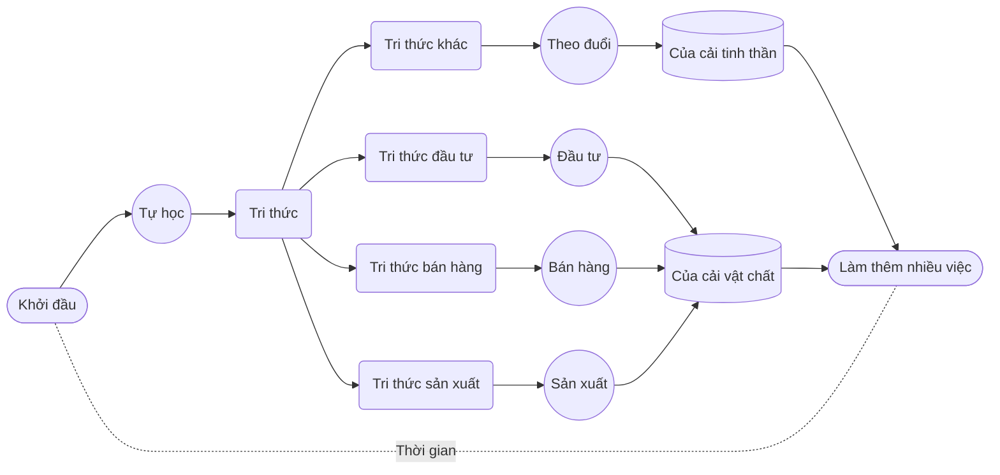

# Tiền là động lực mạnh

Nghe có vẻ buồn cười, nhưng dù nhiều người không muốn thừa nhận, tiền thực sự là nguồn động lực hoặc kích thích bên ngoài mạnh nhất với hầu hết mọi người. Vậy ta không cần tránh nó, hãy nhìn thẳng vào vấn đề.

Trong *Sự thật về của cải*, tôi viết:

> Toàn bộ của cải trong đời, cả vật chất lẫn tinh thần, đều được đào lên từ thời gian của chính mình.

Vì **thời gian là tư liệu sản xuất**, dùng nó làm gì mới đáng giá nhất?

Suy đi tính lại, chỉ có tự học. Học tiếng Anh có vẻ không liên hệ trực tiếp với sản xuất, bán hàng hay đầu tư, vậy học để làm gì? Tạm chưa nói đến kiếm tiền, hãy nói đến tiết kiệm tiền.

Ta từng nhắc rằng, xét theo tỷ lệ, cha mẹ trên khắp thế giới thường dành phần lớn tiền cho con, đặc biệt cho học tập. Hơn 60% tổng thu nhập không hiếm, 80% cũng không lạ.

Khi nói đến **ít nhất 1.000 giờ chú ý trong một năm** để học tiếng Anh, trọng tâm không chỉ là tiếng Anh. Bạn dùng cách đó học bất kỳ ngôn ngữ hoặc kỹ năng nào cũng vậy. Thứ bạn học nhiều hơn, luyện nhiều hơn và hiểu sâu hơn là tự học, là hình thành và rèn năng lực tự học.

Năng lực tự học vốn không cao siêu. Trẻ nhỏ đã có nó khá tự nhiên vì sẵn sàng học thẳng và luyện quyết liệt mọi thứ. Với chỉ dẫn đúng và thực hành phù hợp, năng lực này có thể liên tục được rèn và tăng lên. Trớ trêu là vì nhiều lý do, cái gọi là giáo dục lại thống nhất và thành công trong việc xóa bỏ năng lực tự học của đa số người.

Dù học thẳng và luyện quyết liệt mạnh đến đâu, chỉ thế vẫn chưa đủ. Ta cần dựng một hệ thống tự học hoàn chỉnh trên nền ấy. Đây là việc cha mẹ phải làm cho con, vì không nên và không thể thuê ngoài. Trường học, tổ chức đào tạo và người làm giáo dục thường ít quan tâm, thậm chí không muốn dạy năng lực tự học. Nếu ai cũng tự học được, họ kiếm tiền thế nào? Đây là một sự hợp tác ngầm, giống việc bác sĩ viết đơn thuốc bằng kiểu chữ người khác không đọc được.

Khi có một mức năng lực tự học nhất định, phần lớn tiền cha mẹ chi cho con có thể tiết kiệm. Không chỉ cha mẹ tiết kiệm, con còn nhờ đó có thêm năng lực thật.

Một tác dụng ngược của việc cha mẹ cố kiếm tiền rồi chi hết cho con là con ngày càng kém tự chủ. Mọi năng lực phát triển trong quá trình gặp vấn đề và giải quyết vấn đề. Nhưng trong đa số trường hợp, khi cha mẹ dùng tiền giải quyết mọi chuyện, người gặp và giải quyết vấn đề luôn là cha mẹ chứ không phải con. Những vấn đề lẽ ra con phải đối diện đã được cha mẹ trả tiền để xử lý. Chúng có thực sự được giải quyết hay chỉ được che phủ thì không rõ.

Vấn đề vốn là cơ hội để con có năng lực. Khi cơ hội bị tước đi, vấn đề chưa hề được giải quyết nhưng mọi người tưởng đã xong. Sự tích lũy của vấn đề, hiểu lầm và ảo giác ngày càng lớn, đến cuối cùng không ai cứu được. Đây không phải lời cảnh báo quá mức. Hệ quả thường lộ ra và bùng phát khoảng tuổi 15, rồi rất khó cứu vãn.

Hãy tính một khoản đơn giản. Giả sử một cặp vợ chồng có thu nhập 300.000 nhân dân tệ mỗi năm. Từ tiểu học, trung học cơ sở đến trung học phổ thông là 12 năm. Nếu chi 60% thu nhập cho con, trung bình mỗi năm là 180.000. Khoảng 60% khoản ấy, tức 108.000 mỗi năm, là các lớp phụ đạo ngoài trường, vì giáo dục cơ bản trước tốt nghiệp trung học ở phần lớn nơi có chi phí không cao. Trong 12 năm, tổng là 1.296.000. Nếu con có năng lực tự học thật sự, không cần nói tiết kiệm hết, chỉ cần tiết kiệm 80% cũng là 1.036.800.

Yêu cầu ba giờ mỗi ngày trong “Bắt đầu nhiệm vụ” chắc chắn chặn nhiều người. Đa số chưa từng làm trọn vẹn như vậy nên không biết hiệu quả ra sao, chỉ theo trực giác thấy khó và không thể. Không biết rằng đó chính là gốc rễ của việc học giả và sống giả.

Học tiếng Anh là một mục tiêu, nhưng quan trọng hơn là cha mẹ **tự mình cho con thấy hiệu quả**. Học gì cũng thế. Với cách làm **ít nhất ba giờ mỗi ngày, ít nhất 1.000 giờ chú ý trong một năm**, bạn có thể học nhạc cụ, ca hát, khiêu vũ, thư pháp, cờ, mọi môn thể thao, ngôn ngữ tự nhiên gồm tiếng mẹ đẻ và ngoại ngữ, ngôn ngữ nhân tạo gồm toán lý hóa ở trường hay lập trình ngoài trường. Tất cả đều có thể vượt hơn 90% số người.

Chi phí đầu tư chủ yếu không phải tiền, thậm chí không chỉ là thời gian, mà là chú ý. Đó là chi phí chú ý không cần tiền. Chỉ một người trong hai vợ chồng dành 1.000 giờ chú ý trong một năm là đủ. Đầu tư tiền gần như bằng không, còn lợi ích tiềm năng là 1.036.800, tương đương kiếm hoặc tiết kiệm trong một năm. Với cặp vợ chồng thu nhập 300.000 mỗi năm, không ăn không uống trong ba năm cũng chưa chắc kiếm hoặc để dành được con số ấy. Dù đi làm hay khởi nghiệp, lợi tức đầu tư này thật đáng kinh ngạc.

Lợi tức không chỉ là “làm được một triệu trong một năm”. Bạn trở thành người song ngữ. Bạn, con và cả người bạn đời đều mở mang, tận mắt thấy sự thật và hiệu quả của học thật. Bạn có năng lực tự học thật sự; mọi người cũng vô thức vượt qua cánh cửa lớn nhất, từ chưa biết học thật là gì đến chứng kiến học thật, rồi bước trên con đường có năng lực và thói quen tự học.

Phép tính chưa kết thúc. Nếu con bị ảnh hưởng bởi bạn, và nếu bạn thật sự làm thì các em tất yếu bị ảnh hưởng toàn diện, các em cũng sẽ thành người đa ngữ, ít nhất song ngữ. Nhiều nghiên cứu cho thấy người đa ngữ thường có năng lực suy nghĩ, học, giải quyết vấn đề, tổ chức và quản lý tốt hơn, rủi ro sa sút nhận thức khi về già cũng thấp hơn. Về cấu trúc não, họ thường có chất xám dày hơn và phạm vi chất trắng lớn hơn.

Quan trọng hơn, nhiều khảo sát cho thấy thu nhập suốt đời của người đa ngữ cao hơn người đơn ngữ, ít nhất 30%. Hãy ước tính thu nhập trọn đời của con rồi nhân 30%. Đó là khoản có thể đổi bằng 1.000 giờ chú ý trong một năm. Nếu có nhiều con, hãy tự tính tiếp.

Dùng tiền để kích thích bản thân thường rất hiệu quả. Điều hài hước là “kích thích bằng tiền” thường chỉ là làm một sổ sách tưởng tượng.

Khi muốn vào New Oriental dạy học, tôi phải thi TOEFL và GRE. Lúc ấy tôi chưa hiểu rõ giáo dục hay thi cử như hiện nay, cũng ngây ngô học thuộc từ vựng vì ai cũng nói phải có 20.000 từ. Vậy thì làm. Chẳng phải chỉ là ít nhất ba giờ mỗi ngày sao? Thực ra không cần một năm, ba tháng đã xong.

Tôi kích thích mình thế nào? Vẫn là tính một khoản giả. Hồi đó có tin đồn giáo viên New Oriental lương năm một triệu. Tôi nghĩ không cần nhiều thế, sau thuế 500.000 là đủ. Tính ra, nếu nắm 20.000 từ thì có khả năng nhận 500.000 một năm sau thuế. Mỗi từ trị giá 25 tệ, và là ít nhất 25 tệ mỗi năm. Quy ra từng chữ cái thì mỗi chữ cái cũng mấy tệ.

Tôi lấy vài tờ giấy ghi chú, viết “25 tệ một từ”, dán ở đầu giường, gương, bàn làm việc và tường trước bồn cầu để luôn nhìn thấy. Kiểu tự lừa này thật sự hiệu quả. Từ lúc đó, tôi thấy từ nào cũng đẹp: từ ngắn thì gọn, từ dài thì thanh, nghĩa đặc biệt thì tinh tế, chính tả khó thì độc đáo. Đây không phải cường điệu hay đùa. Mỗi lần ôn cuối ngày giống như đếm tiền. Tôi tự nói: hôm nay xử lý 200 từ, tốt lắm, kiếm được 5.000 rồi.

Não rất kỳ lạ nhưng cũng rất dễ bị thuyết phục. Bạn có thể đánh lừa nó bằng bất cứ cách nào, chỉ cần gắn với điều nó quan tâm nhất, dù liên hệ có gượng ép thế nào nó vẫn tin. Đôi lúc tôi nghĩ não kỳ diệu chính vì nó dễ tin như vậy.

Đừng xem nhẹ cách học thật chỉ gói trong một câu: **ít nhất 1.000 giờ chú ý trong một năm**. Nó giúp bạn có được sự tôn trọng thật. Con người như vậy: việc mình không làm được mà người khác làm được thì chỉ có thể tôn trọng. Người ngoài đã vậy, sự tôn trọng của bạn đời quan trọng hơn vì làm quan hệ vợ chồng thân mật hơn. Sự tôn trọng của con còn quan trọng hơn. Khi cha mẹ giành được bằng hành động, sẽ không còn “nổi loạn” theo nghĩa hời hợt. Nhiều thứ được gọi là nổi loạn chỉ là biểu hiện nhiều hình dạng của việc cha mẹ không còn đáng để con tôn trọng.

**Làm trong một năm để đổi lấy sự tôn trọng của con suốt đời**, có đáng không?

Nếu bạn có một kỹ năng nào đó và dễ dàng vượt hơn 90% số người, bí quyết rất đơn giản: ít nhất 1.000 giờ chú ý trong một năm. Khí chất của bạn sẽ thay đổi. Trước hết là từ thái độ người khác dành cho bạn, sau đó là sự tự tin của bạn. Điều quan trọng là tự tin ấy không thể là tự phụ vì có thành tích nâng đỡ. Không có thành tích, tự tin thật buồn cười. Nhưng khi nhiều kỹ năng cùng có trong bạn, tự tin từ trong ra ngoài là điều tự nhiên. Có khi bạn còn phải cố khiêm tốn để người khác dễ chịu. Gương mặt bình tĩnh, ánh mắt tập trung, động tác thư thái và thái độ điềm tĩnh đều nảy sinh tự nhiên, không thể giả vờ. Thế giới bên ngoài ngày càng ít quan trọng, còn xây dựng vỏ não trở thành việc bạn thích nhất.

Tôi đã nhiều lần trải qua 1.000 giờ chú ý trong một năm. Buồn cười nhất là việc tập thể hình. Người bình thường chi khá nhiều tiền cho phòng tập và huấn luyện viên nhưng dành ít thời gian. Ba buổi mỗi tuần, một năm khoảng 160 buổi, mỗi buổi tính cả di chuyển chỉ 2,5 giờ, tổng khoảng 400 giờ. Chú ý còn ít hơn. Cách của tôi là trả tiền thuê huấn luyện viên, nên phần lớn thời gian vẫn lơ đãng, nghĩ lung tung, dựa vào huấn luyện viên đếm, động viên và trông chừng.

Chỉ cần tập thể hình liên tục hơn hai tháng đã thấy hiệu quả, nửa năm thì rất rõ. Ai cũng thấy quần áo cũ không còn vừa, vòng ngực, tay và chân lớn hơn, vòng eo nhỏ lại, dáng đứng thẳng hơn và mặc đồ khác hẳn. Dù vốn không đẹp, thay đổi hình thể vẫn khiến bạn trông sáng sủa hơn. Nếu đi biển hay ngâm suối nóng cùng đồng nghiệp, bạn nổi bật hẳn. Sự đổi khác trong cách mọi người đối xử khó diễn tả. Vợ tôi từng đùa: “Hay thật, cảm giác chưa cần ly hôn đã có chồng mới.” Đây không phải thứ mua được bằng tiền, vì không thể mua được tôn trọng.

Không chỉ tính sổ, dù là sổ giả, hãy đổi hướng. Khi đi học, có thể bạn cảm thấy mình học vì cha mẹ. Khi lớn hơn, dù học giả vẫn nói là vì mình. Giờ hãy đổi hướng: học vì con, học vì gia đình. Là cha mẹ, có thể lần này bạn sẽ thật sự không dám học giả.

Lý Tiếu Lai tự cười với mình. Tôi đã dùng tiếng Anh rất nhiều năm, đến mức tốc độ đọc tiếng Anh còn nhanh hơn tiếng Trung, vì sách và bài viết đọc mỗi năm đa số đều bằng tiếng Anh. Nhưng nói thì rất kém. Vì sao? Vô thức tôi thấy không cần, cuộc sống không có nhu cầu nói tiếng Anh với ai. Vậy ở tuổi hơn năm mươi, vì sao đột nhiên luyện nói nghiêm túc? Vì con, chỉ vì con.

-----

Hãy liên tục liệt kê các nguồn động lực của riêng bạn:

|      | Tích cực | Tiêu cực |
| ---- | -------- | -------- |
| Vật chất |      |      |
| Tinh thần |      |      |
