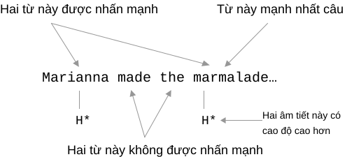

# Nhấn nhẹ và cường độ

Cao độ (*pitch*) và ngắt nghỉ (*break*) không chỉ xuất hiện trong câu mà còn thường hiện diện trong nhiều từ đa âm tiết.

Mọi ngôn ngữ trên Trái Đất đều tương tự ở chỗ đơn vị phát âm cơ bản là **âm tiết**, và cấu tạo âm tiết cũng có cùng nguyên tắc: **mỗi âm tiết có một và chỉ một nguyên âm**.

Trong Quan thoại, đơn vị cơ bản của chữ viết là ký tự. Về bản chất vẫn vậy vì mỗi ký tự có một và chỉ một âm tiết, hay theo thuật ngữ tiếng Trung là một và chỉ một vần. Ví dụ: *a*, *mā*, *màn*, *máng*. Phần lớn hệ chữ châu Á lấy ký tự làm đơn vị cơ bản, gồm Trung, Nhật và Hàn.

Đơn vị cơ bản của tiếng Anh theo chữ viết là từ, nhưng theo âm thanh vẫn là âm tiết. Ví dụ, *ichthyosaur* `ˈɪkθiəˌsɔr` có ba âm tiết `ɪk`, `θiə`, `sɔr`. *serendipity* `ˌsɛrənˈdɪpədi` có năm âm tiết `sɛ`, `rən`, `dɪ`, `pə`, `di`.

So sánh:

> * Một từ tiếng Trung có thể gồm hơn một ký tự. Ví dụ *yì liào zhī wài* có bốn ký tự nên khi nói có độ dài tối thiểu bốn vần.
> * Một từ tiếng Anh có bao nhiêu âm tiết thì độ dài phát âm xấp xỉ bấy nhiêu ký tự tiếng Trung. *ichthyosaur* dài khoảng ba ký tự, còn *serendipity* dài khoảng năm ký tự.
> * Ký tự tiếng Trung có độ dài phát âm khá đồng đều, còn âm tiết tiếng Anh dài ngắn không đều:
>   * Nguyên âm đơn có dài và ngắn, còn nguyên âm đôi trượt từ nguyên âm này sang nguyên âm khác.
>   * Một âm tiết có thể có nhiều phụ âm. Ví dụ cực đoan là *strengths*: nguyên âm lõi chỉ có `ɛ`, đầu có `s` và `tr`, cuối có `ŋ`, `θ`, `s`. Tổng cộng năm phụ âm đều phải được phát rõ, nên một âm tiết tiếng Anh có thể dài hơn rất nhiều một ký tự tiếng Trung.

Tiếng Trung, Nhật và Hàn đều có đặc điểm lấy ký tự làm đơn vị, nên khác tiếng Anh ở điểm này.

Khi tiếp thu ngôn ngữ thứ hai, ta khó tránh mang thói quen tiếng mẹ đẻ sang ngôn ngữ khác. Đây là gốc của giọng hay giọng ngoại quốc. Người quen nói tiếng Trung thường vô thức đọc từ tiếng Anh nhanh hơn vì ghép từ tiếng Anh với một ký tự tiếng Trung, thay vì cách tương ứng đúng:

> Tương ứng không đúng:
>
> * Từ tiếng Anh với ký tự tiếng Trung.
>
> Tương ứng đúng:
>
> * Âm tiết tiếng Anh với ký tự tiếng Trung.
> * Từ tiếng Anh với từ tiếng Trung.

Khi nói, con người có thể chèn lời chửi. Ở Thiên Tân, bạn thường nghe câu *jiè ní mǎ mà*. Theo giọng Thiên Tân, trọng điểm là:

> * Ký tự đầu thuộc thanh bốn nên phải hạ giọng, sau đó ngắt nhẹ.
> * Ký tự hai và ba nối nhanh với nhau.
> * Để ký tự cuối được nói thật nặng, ký tự ba phải kéo dài và ngắt nhẹ trước khi nói mạnh ký tự bốn.

Ký tự đầu *jiè* là “đây”, ký tự cuối *mà* là trợ từ hỏi. Câu hỏi kết thúc bằng *mà* trong giọng Thiên Tân không thể lên giọng. *jiè mà* nghĩa gần “đây là gì”, còn *ní mǎ* là phần chen vào. Cả câu tương đương: “Đây là cái quái gì vậy?”

Bạn có thể từng thấy trong phim Mỹ cao bồi ngậm nửa điếu thuốc nói *absolutely* ˌæbsəˈlutli thành ˌæb fə kɪŋ sə ˈlut li hoặc ˌæb sə fə kɪŋ ˈlut li. Phần chen *fucking* được đặt sau âm tiết một hoặc hai. Ví dụ hơi thô, nhưng giúp hiểu ngay điểm giống và khác tinh tế trong xử lý âm thanh của các ngôn ngữ.

Vì vậy khi người dùng tiếng Trung đọc từ tiếng Anh, và nhìn chung người dùng ngôn ngữ châu Á lấy ký tự làm đơn vị âm tiết đều vậy, cần cố ý thư giãn và chậm lại. Ban đầu, để đọc rõ, cố ý ngắt giữa từng âm tiết cũng không sao. Đó là một từ chứ không phải một ký tự, có rất nhiều “ký tự” ghép lại. Hãy thử lại ichthyosaur ˈɪkθiəˌsɔr và serendipity ˌsɛrənˈdɪpədi.

Còn một khác biệt quan trọng. Mỗi ký tự tiếng Trung, tương đương một âm tiết, có thể mang thanh một, hai, ba, bốn hoặc thanh nhẹ. Mỗi âm tiết tiếng Anh không có thanh cố định. Nhưng trong từ đa âm tiết, một âm tiết thường được nhấn, gọi là trọng âm, và đôi khi có một âm tiết mang trọng âm phụ. Cả ichthyosaur ˈɪkθiəˌsɔr và serendipity ˌsɛrənˈdɪpədi đều có trọng âm chính và phụ.

Nếu trọng âm không ở âm tiết đầu, hãy thử ngắt nhẹ trước âm tiết nhấn, rồi phát âm nó với cao độ cao hơn và dần hạ cao độ ở âm tiết sau. Ví dụ expect: iks...pɛkt, chủ đích kéo s để duy trì luồng khí rồi nâng cao độ ở ˈpɛkt. Với serendipity: ˌsɛrən...ˈdɪpədi, kéo n để giữ rung trong miệng rồi nâng cao độ ở ˈdɪpədi.

Âm tiết trong từ có trọng âm, trọng âm phụ hoặc không nhấn. Tương tự, trong một câu, các từ có loại được nhấn mạnh, loại yếu và loại khác.

Mỗi câu luôn có một hoặc hai từ trọng tâm. Khi nói, người nói nhấn chúng. Đặc điểm của nhấn câu là toàn từ, hoặc âm tiết trọng âm của từ, được nâng cao độ, kèm đường đi lên hay đi xuống rõ, đồng thời nói chậm hơn. Cùng một câu nhưng nhấn từ khác nhau có thể tạo thay đổi nghĩa tinh tế.

Hãy nghe bốn phiên bản của cùng một câu, ví dụ từ [Macquarie University](https://www.mq.edu.au/about/about-the-university/our-faculties/medicine-and-health-sciences/departments-and-centres/department-of-linguistics/our-research/phonetics-and-phonology/speech/phonetics-and-phonology/Intonation-tobi-introduction):

> Marianna made the marmalade...
> 1. <audio src="../audios/marm1.wav" />
> 2. <audio src="../audios/marm2.wav" />
> 3. <audio src="../audios/marm3.wav" />
> 4. <audio src="../audios/marm4.wav" />

Lấy phiên bản đầu làm ví dụ, xem sơ đồ:

Ngoài một số ít từ được nhấn, rất nhiều từ thông dụng được đọc yếu.

Mọi ngôn ngữ đều có hiện tượng này, có thể vì từ quá thường gặp, quá dễ hiểu hoặc tương đối không quan trọng. Khi nói các từ hay âm tiết ấy, người nói phát nhanh hơn, nhẹ hơn, thậm chí lược hoặc gộp chúng. Một người Bắc Kinh có thể phát “bù zhī dào” thành *bù r dào*, trong đó *zhī* bị rút thành *r* gần như không có vần. Ai cũng hiểu, người chưa quen nghe vài lần sẽ quen.

Trong tiếng Anh, hiện tượng đọc yếu từ nhỏ rất phổ biến.

Dưới đây là hai câu đầu của bài nghe TOEFL đầu tiên. Hãy chú ý khác biệt của từ **community** ở lần xuất hiện thứ nhất và thứ hai:

> Community service is an important component of education here at our university. We encourage all students to volunteer for at least one community activity before they graduate.

<audio src="../audios/toefl-sampe-01.mp3" />

Mọi từ được nhấn trong đoạn nghe được in đậm dưới đây, từ không in đậm là từ đọc yếu:

> **Community** **service** is an **important** **component** of **education** **here** at our **university**. We **encourage** **all** **students** to **volunteer** for at **least** **one** community **activity** **before** they **graduate**.

Khi một từ được nhấn hay đọc yếu, độ dài nguyên âm và trọng âm, nếu là từ đa âm tiết, đều đổi theo. Các thay đổi thường gặp:

Khi từ được nhấn:

- Nguyên âm dài được phát rõ, đủ dài, thậm chí dài hơn.
- Nguyên âm đôi đầy và linh hoạt.
- Nguyên âm ngắn nằm ở trọng âm dài hơn.
- Âm tiết trọng âm có thể mang đường ngang, lên hoặc xuống.
- Cao độ âm tiết nhấn có thể là cao, trung hoặc thấp, nhưng thường là cao.

Khi từ được đọc yếu:

- Nguyên âm dài ngắn lại, gần bằng nguyên âm ngắn.
- Âm tiết trọng âm nhẹ như âm không nhấn.
- Nhiều nguyên âm đổi và tiến gần /ə/.
- /ə/ sau các phụ âm nhẹ /s/, /t/, /k/, /f/ có thể bị lược hẳn.
- Cao độ toàn từ thường thấp, nhiều nhất là trung.

Ngay cả khi đọc riêng một từ, độ dài nguyên âm vẫn bị trọng âm tác động. Ví dụ, city có trọng âm ở âm tiết đầu, hai nguyên âm đều là /i/: /ˈsi-ti/. Nhưng khi nhấn đủ âm tiết đầu, bạn sẽ cảm nhận /i/ đầu dài hơn /i/ sau.

Đa số trợ động từ, động từ liên kết, giới từ, liên từ, mạo từ và đại từ có hai cách phát: strong form và weak form. Chúng thường là từ một âm tiết. Trong lời nói tự nhiên, chúng thường đọc bằng weak form. Dưới đây là bảng strong form và weak form thông dụng. Đừng dùng như quy tắc cứng: không phải mọi hư từ luôn đọc yếu, và không phải mọi thực từ luôn được nhấn. Bảng chỉ mô tả hiện tượng.

- a: /eɪ/→/ə/
- am: /æm/→/əm, m/
- an: /æn/→/ən, n/
- and: /ænd/→/ənd, nd, ən, n/
- any: /'eni/→/ni/
- are: /a:/→/ə/
- as: /æs/→/əz/
- at: /æt/→/ət/
- but: /bʌt/→/bət/
- can: /kæn/→/kən, kn, kŋ/
- could: /kud/→/kəd, kd/
- do: /duː/→/du, də, d/
- does: /dʌz/→/dəz, z, s/
- for: /fɔː/→/fə/
- from: /frɔm/→/frəm, frm/
- had: /hæd/→/həd, əd, d/
- has: /hæz/→/həz, əz, z, s/
- have: /hæv/→/həv, əv, v/
- he: /hiː/→/hi, iː, i/
- her: /həː/→/hə, əː, ə/
- him: /him/→/im/
- his: /hiz/→/iz/
- I: /ai/→/aː, ə/
- is: /iz/→/s, z/
- many: /'meni/→/mni/
- me: /miː/→/mi/
- must: /mʌst/→/məst, məs/
- my: /mai/→/mi/
- of: /əv/→/əv, v, ə/
- our: /ɑʊɚ/→/ar/
- shall: /ʃæl/→/ʃəl, ʃl/
- she: /ʃiː/→/ʃi/
- should: /ʃud/→/ʃəd, ʃd, ʃt/
- so: /səʊ/→/sə/
- some: /sʌm/→/səm, sm/
- such: /sʌʧ/→/səʧ/
- than: /ðæn/→/ðən, ðn/
- that: /ðæt/→/ðət/
- the: /ði:/→/ði, ðə/
- them: /ðem/→/ðəm, ðm, əm, m/
- then: /ðen/→/ðən/
- to: /tuː/→/tu, tə/
- us: /us/→/əs/
- was: /wɔz/→/wəz, wə/
- we: /wiː/→/wi/
- were: /wəː/→/wə/
- when: /wen/→/wən/
- will: /wil/→/əl, l/
- would: /wud/→/wəd, əd, d/
- you: /juː/→/ju/

Đến phần này, ta bắt đầu đi sâu vào ngày càng nhiều chi tiết, dù chưa nghiên cứu âm vị thường được xem là nền tảng nhất. Nhưng điều kiện để nhận ra các chi tiết ấy cần được nhắc lại:

> Bạn đã có một khoảng thời gian học thẳng và luyện quyết liệt làm nền.
