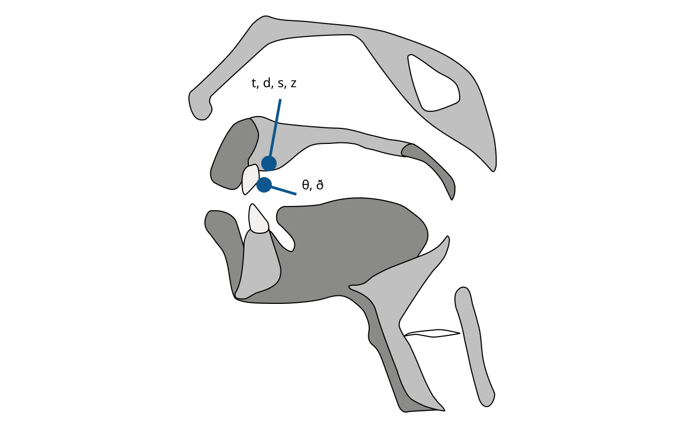

# Nguyên âm và phụ âm

Cuối cùng chúng ta cũng nói đến phần thường được xem là nền tảng. Trình tự giải thích của chúng ta luôn khác, thậm chí có phần trái ngược, với giáo dục ngoại ngữ ở trường. Trình tự ở trường thường là:

> Chữ cái ⭢ Ký hiệu phiên âm ⭢ Âm vị ⭢ Âm tiết ⭢ Từ vựng ⭢ Câu ⭢ Đọc

Trình tự của chúng ta là:

> Mở miệng ⭢ Câu ⭢ Ngắt nghỉ và cao độ ⭢ Nhấn nhẹ và cường độ ⭢ Âm tiết ⭢ Âm vị ⭢ ...

Chúng ta dùng trình tự khác vì **trình tự rất quan trọng**. Trong cờ tướng, hai bên có bàn cờ đối xứng, số quân và cách bố trí tương ứng, các quân đi theo cùng luật. Tốt và binh chỉ tiến, mỗi lần một ô; các quân khác cũng có quy tắc đối xứng. Vậy tại sao vẫn có thắng thua? Trình tự quyết định thắng thua, vì đi quân nào trước và sau mới là gốc. Cách đi từng nước chỉ có ý nghĩa trên nền của trình tự. Mọi việc đều vậy: chỉ khi theo thứ tự tốt hơn thì phương pháp, hiệu quả và chiến lược mới có cơ hội phát huy.

Nghĩ kỹ, nhiều khi **chiến lược chỉ là trình tự**, vì thời gian chỉ đi một chiều và chú ý là nguồn lực hữu hạn, độc quyền. Làm việc luôn có trước sau: làm gì trước, việc gì sau, chú ý điều gì trước, điều gì sau. Trình tự khác thường tạo kết quả và hiệu quả khác. Trong *Sự thật về tập trung*, ta đã thấy các ví dụ khi chỉ đổi thứ tự tập trung đã đổi kết quả.

Trong mọi quá trình học, kể cả tự học, con người có một giới hạn cơ bản: chú ý là đơn nhiệm, đơn luồng. Khi thật sự tập trung, ta chỉ tập trung được một nhiệm vụ, một việc. Não vốn như vậy và không thể thay đổi. Vì thế mọi việc thường cần đi từng bước, nhưng muốn thành công thì thứ tự phải hợp lý.

Ta phải nghiên cứu trình tự, thử sai và so sánh để tìm thứ tự tốt hơn, dùng nghiên cứu để tìm trọng tâm vốn chưa biết. Ví dụ, cao độ và ngắt nghỉ quan trọng đến vậy là thành quả của khoa học máy tính. ToBI, *Tone and Break Index*, là mô hình hay thuật toán do các nhà khoa học máy tính xây dựng để chuyển văn bản thành giọng nói tự nhiên. [Bài báo đầu tiên](https://www.researchgate.net/publication/221492301_ToBI_A_standard_for_labeling_English_prosody) công bố năm 1992. Lĩnh vực dạy ngoại ngữ toàn cầu vẫn chưa kịp hấp thụ đầy đủ thành quả này.

Ngay cả với âm vị, nguyên âm và phụ âm cũng có ưu tiên. Ta học nguyên âm trước, phụ âm sau. Nếu âm tiết là tế bào thì nguyên âm là nhân tế bào. Hơn nữa, dù phụ âm thường bị xem là nguồn gốc của giọng địa phương, lỗi nguyên âm mới ảnh hưởng nhiều nhất đến truyền thông tin trôi chảy. Lỗi phụ âm thường chỉ tạo giọng dễ nhận ra mà không cản giao tiếp.

Ví dụ, Arnold Schwarzenegger có tiếng mẹ đẻ là tiếng Đức. Dù sống ở Hoa Kỳ nhiều năm, từng làm thống đốc, đóng phim và diễn thuyết khắp nơi, ông vẫn có giọng rõ. Ông tự trào rằng giọng mình dày như cơ ngực trong *[Be Useful: Seven Tools for Life](https://www.amazon.com/Be-Useful-Seven-Tools-Life/dp/B0C1HR5D9S/)*, 2023. Nhưng nếu đối chiếu kỹ, nguyên âm của ông đều đúng. Giọng chủ yếu đến từ phụ âm và hoàn toàn không cản biểu đạt hay người nghe hiểu.

Hãy xem nguyên âm trước.

Qua nhiều năm nghiên cứu, hiểu biết về giọng nói và âm vị đã rất hoàn chỉnh. Tất cả nguyên âm từng xuất hiện trong mọi ngôn ngữ trên Trái Đất đều được mô tả chi tiết. Dưới đây là ký hiệu IPA của các nguyên âm ấy. Xem thêm [bảng nguyên âm IPA có âm thanh](https://en.wikipedia.org/wiki/IPA_vowel_chart_with_audio).

Vị trí **trước sau** và **trên dưới** trong biểu đồ, xét theo cảm nhận trực quan nhất, chủ yếu là vị trí cộng hưởng của luồng khí trong khoang miệng. Các học giả xác định chúng bằng cách so sánh lặp lại ảnh X quang lúc con người nói. Những điều như hình dạng môi không cần lo quá nhiều, vì mắt thấy được động tác môi nên não sẽ vô thức xử lý. Điều khó là lưỡi vì không nhìn thấy nên não thường không biết làm gì.

Dưới đây là vị trí cộng hưởng của luồng khí trong khoang miệng khi phát nguyên âm tiếng Anh, tức đã bỏ nguyên âm các ngôn ngữ khác:

Hai biểu đồ chỉ là tư liệu tham khảo, không phải quy tắc bất biến. Ngôn ngữ nào cũng có giọng vùng miền, và tiếng Anh có thể có nhiều giọng vùng nhất. Cùng một nguyên âm có nhiều vị trí cộng hưởng không hoàn toàn giống nhau trên thế giới. Dù vậy, có tham khảo vẫn tốt hơn không có.

Người lớn học ngoại ngữ, ở đây coi mọi người trên sáu tuổi là người lớn trong lĩnh vực này, gặp vấn đề lớn nhất là đã quen cách phát âm âm vị của tiếng mẹ đẻ. Với âm vị tiếng mẹ đẻ không có, họ không chỉ không biết vận động khoang miệng thế nào mà còn không nghe ra khác biệt. Giọng ngoại quốc thực chất là dùng cách phát âm tiếng mẹ đẻ để phát gần đúng âm ngoại ngữ, gồm nguyên âm, phụ âm và ngữ điệu.

Nguyên âm khác nhau cần cách phát âm khác nhau. Âm vị tiếng mẹ đẻ không có phải học như âm mới, không phải sửa cách cũ thành cách mới. Cách cũ không thể xóa vì bạn vẫn cần nói tiếng mẹ đẻ.

Vì thế, cụm “sửa phát âm” gây hiểu lầm, như thể cách cũ là sai và phải xóa. Không phải vậy. **Cách phát âm cũ của bạn không sai.** Quan trọng hơn, khi học ngoại ngữ, bạn chỉ cần học các **cách phát âm mới**, dù âm mới có gần hay không với âm tiếng mẹ đẻ. Khác thì phải học mới.

Bỏ giọng khi người lớn học ngoại ngữ là quá trình tạo liên kết thần kinh mới trong não và củng cố chúng liên tục. Nếu liên kết mới chưa đủ mạnh, lúc nói bạn vô thức kích hoạt lại liên kết gần giống cũ. Cái gọi là khó hơn ở người lớn chỉ là cạnh tranh từ liên kết cũ, không phải vì một cánh cửa nào đóng hẳn theo tuổi.

Não có độ dẻo rất cao nên cả đời vẫn tạo liên kết mới. Tuổi tăng thì liên kết gần giống cũ mạnh hơn, nhưng khó khăn ấy không đáng kể trước việc lặp lại đủ nhiều trong thời gian ngắn. Chỉ cần luyện có chủ đích, cường độ cao trong thời gian ngắn, không có gì không giải quyết được. Nói là năng lực có sẵn trong gen người.

Tiếng Trung không có nguyên âm e, nên học nó không bị can thiệp bởi âm cũ và tạo liên kết mới nhanh. Hai âm ə và u trong tiếng Trung và tiếng Anh gần như không khác.

Tiếng Trung có a, á, ǎ, à, gần với nguyên âm dài ɑː tiếng Anh, nên không cần quá lo âm này.

Nhưng æ cần chú ý. Nó không có dấu nguyên âm dài ː, thường xếp là nguyên âm ngắn, nhưng thực tế dài hơn tương đối. Có thể gọi nó là nguyên âm bán dài. Hãy thử apple và banana, kéo æ dài hơn một chút.

Nguyên âm ngắn ʌ cần chú ý hơn. Người dùng tiếng Trung phải tạo liên kết mới và củng cố bằng lặp lại đủ nhiều trong thời gian ngắn. Thử từ encourage, ɪnˈkʌreɪʤ. Vị trí cộng hưởng của ʌ khá lùi sau nên nghe gần ə. Nó khác a, á, ǎ, à tiếng Trung, vốn có vị trí cộng hưởng ra trước hơn. Trong một số giọng Mỹ, ʌ và ə gần như là một. Tương tự, cần chú ý ɔ vì vị trí cộng hưởng cũng lùi sau.

Còn lại nguyên âm ngắn ɪ và dài iː. Tiếng Trung có īíǐì gần như iː, nhưng ɪ là âm vị cần tạo liên kết mới. Nó không phải bản ngắn của iː, mà nằm giữa e và i, với cộng hưởng hơi lùi sau iː.

Ngoài ɪ và iː, các cặp dài ngắn như ə/əː, u/uː, ɔ/ɔː không đòi hỏi người dùng tiếng Trung lo thêm nhiều, vì hai bản dài ngắn không khác đáng kể.

Tiếp theo là **nguyên âm đôi**. Tiếng Trung không hoàn toàn thiếu nguyên âm đôi. Khi nói “tài lèi le”, phần vần ài trong “tài” gần aɪ tiếng Anh, còn èi trong “lèi” gần eɪ. Nhưng chúng không giống hẳn. Người dùng tiếng Trung cần tạo liên kết thần kinh mới cho các nguyên âm đôi tiếng Anh.

Nguyên âm đôi trượt từ nguyên âm đầu sang nguyên âm sau. Về độ dài chúng tương đương nguyên âm dài. Nhịp giống bộ ba nốt trong một phách, 1-2: nguyên âm đầu chiếm hai phần, nguyên âm sau chiếm một phần. Điểm quan trọng là vị trí cộng hưởng của mọi nguyên âm đôi tương đối lùi về sau.

Tóm lại, chỉnh tinh nguyên âm khá đơn giản: cảm nhận kỹ vị trí cộng hưởng của luồng khí trong khoang miệng khi mình nói, tạo liên kết thần kinh mới rồi củng cố chúng bằng lặp lại đủ nhiều trong thời gian ngắn.

Giờ hãy xem phụ âm.

Đa số phụ âm tiếng Anh không phải vấn đề với người dùng tiếng Trung, như b, p, k, g, m, n, ŋ, ʃ, ʧ, ʤ, r, l, f, v, w, h, j. Chỉ vài phụ âm cần lưu ý thêm.

Điểm **then chốt** khi luyện những phụ âm tiếng Anh khó với người dùng tiếng Trung là **chú ý vị trí khởi đầu của đầu lưỡi**.

Với θ và ð, giáo trình thường yêu cầu kẹp đầu lưỡi giữa răng. Không cần cứng nhắc. Đầu lưỡi không cần đưa ra ngoài răng, chỉ cần đặt đầu lưỡi ngay sau răng trên trước khi phát âm.

Các phụ âm cần tạo liên kết mới là t, d, s, z. Khác biệt giữa chúng với phụ âm đầu tương ứng tiếng Trung khá tinh tế. Khi phát âm đầu tương ứng tiếng Trung, đầu lưỡi thường ở răng trên. Với bốn phụ âm tiếng Anh này, đầu lưỡi cao hơn một chút. Với t và d, đầu lưỡi chạm gờ lợi; với s và z, đầu lưỡi cách gờ lợi rất ít. Hãy chỉnh vị trí khởi đầu và đọc student ˈstudənt, rồi students ˈstudənts.

Một phụ âm tiếng Anh không có âm đầu tương ứng tiếng Trung là ʒ, ví dụ vision ˈvɪʒən. Âm này dùng rất ít, nên thay bằng âm zh tiếng Trung cũng không phải chuyện lớn.

Tài liệu dạy âm vị tiếng Anh tốt nhất trên mạng là ứng dụng [the Sounds of Speech™](https://soundsofspeech.uiowa.edu/) của Đại học Iowa, có trên iOS và Android. Xem [DEMO](https://soundsofspeech.uiowa.edu/assets/../images/sos-video.mp4). Khi tôi viết *Ai cũng có thể dùng tiếng Anh* năm 2010, đây là web miễn phí nên có thể trích ảnh trực tiếp. Giờ nó là ứng dụng trả phí, chỉ vài USD, nên không thể trích dẫn toàn diện như trước.

Đây là hai ảnh chụp cho thấy vị trí đầu lưỡi của θ và ð trong ứng dụng:

Tóm lại, chìa khóa của nguyên âm là **vị trí cộng hưởng luồng khí trong khoang miệng**; chìa khóa của phụ âm là **vị trí khởi đầu của đầu lưỡi**. Nhớ hai điểm này, luôn quan sát mình và lặp lại.

Với chỉnh tinh cấp âm vị, hãy cực kỳ kiên nhẫn. Nó cần thời gian dài và nhiều luyện tập. Nhưng đừng vì thiếu sót hay lỗi cấp âm vị mà dừng. Một mặt luôn để ý, mặt khác vẫn tiến lên. Đừng lặp lại sai lầm của giáo dục ngoại ngữ truyền thống: vì “nền tảng không tốt”, thực chất là âm vị chưa tốt, mà dừng hay bỏ cuộc.

Cần mở rộng lượng “nói điều mình muốn nói” thì cứ mở rộng, cần tăng lượng đọc thì cứ tăng. Không ai chết vì phát sai một vài nguyên âm hay phụ âm. Chỉnh tinh cấp âm vị cần liên tục cải thiện trên nửa năm, nhưng trong thời gian đó còn nhiều việc cần làm.

Một nhắc nhở đặc biệt: **đừng chỉ ra “lỗi phát âm” của người khác ở cấp âm vị**. Điều đó dễ làm người khác khó chịu. Khi tự luyện nhiều bạn sẽ biết đây không phải chuyện biết là làm được. Khi nghe nhiều, bạn cũng biết người nói tiếng Anh trên thế giới rất nhiều, giọng vùng rất nhiều, giọng tiếng Anh ngoại quốc còn nhiều hơn; ở mức cực tinh tế, mỗi người đều khác.

Cuối cùng, có một điểm người dùng tiếng Trung cần lưu ý.

Khi nói tiếng Anh, người dùng tiếng Trung thường **nói quá nhanh**. Người dùng tiếng Trung, Nhật và Hàn đều có vấn đề này vì cùng một nguyên nhân.

Nếu không được nhắc, người dùng tiếng Trung vô thức mang thói quen nguyên âm có độ dài bằng nhau vào tiếng Anh. Trong tiếng Trung, mỗi vần gần tương đương nguyên âm tiếng Anh có độ dài ngang nhau, cùng lắm khác bốn thanh. Vì vậy khi nói tiếng Anh, họ thường đọc mỗi nguyên âm dài bằng nhau, dù là nguyên âm dài hay nguyên âm đôi. Điều này tương đương vô thức nhanh hơn một phách.

Phụ âm đầu tiếng Trung đều là phụ âm đơn, cuối vần không có phụ âm thêm. Tiếng Anh khác. Ví dụ strict strɪkt có s và tr ở đầu, kt ở cuối. Muốn nói rõ, dù ngắn vẫn cần thời lượng. Nhưng vì quen âm tiết đồng đều, một chữ một âm dài bằng nhau, người dùng tiếng Trung lại vô thức nói quá nhanh: nhanh một phách ở nguyên âm, thêm nửa phách ở phụ âm.

Còn một ảo giác: ai trên Trái Đất cũng thấy người nước ngoài nói quá nhanh. Cảm giác nhanh đến từ không hiểu và không nhớ, không phải vì họ thật sự nhanh. Dù nói ngôn ngữ nào, mọi người cũng chia cụm ý, chọn nhấn nhẹ và ngắt nghỉ hợp lý, không chỉ giữa câu mà trong câu, thậm chí trong từ. Nhưng vì ảo giác nhanh do không hiểu hoặc không nhớ, người học hoảng hốt không cảm nhận được ngắt nghỉ; rồi tự nói lại nhanh thêm vài phách.

Vì vậy, khi mới luyện cần có ý thức làm chậm tốc độ nói và ngắt nghỉ rõ, thậm chí cường điệu.

Tóm lại, trong quá trình luyện lặp lại, hãy cố làm được:

* Cần ngắt thì ngắt.
* Âm tiết cần nâng cao độ thì nâng.
* Với từ được nhấn trong câu:
  * Nguyên âm dài đủ dài, nguyên âm đôi đủ đầy, vị trí cộng hưởng mỗi nguyên âm đúng.
  * Vị trí khởi đầu đầu lưỡi của phụ âm đúng.
* Với từ không nhấn trong câu, đọc theo cách đúng.

Vậy là đủ. Hãy tiếp tục các việc khác, vì còn nhiều điều cần làm. Âm vị trông quan trọng, và quả thật quan trọng, nhưng nhiều việc khác còn quan trọng hơn rất nhiều.
