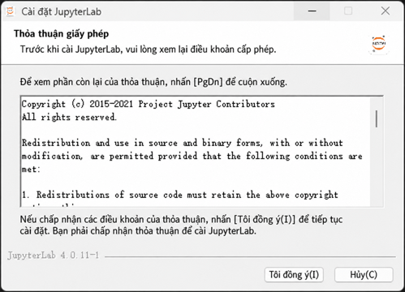
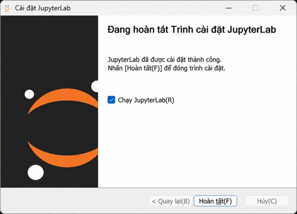
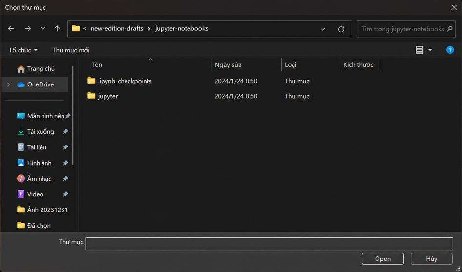

## Cài Jupyter và JupyterLab Desktop trên máy

[Xem hướng dẫn cài đặt cho Windows](#nguoi-dung-windows)

### Người dùng macOS

macOS trước đây đi kèm Python 2.7, thường ở đường dẫn `/usr/local/bin/python`; để dùng Python phiên bản mới hơn, bạn cần tự cài đặt.

### 1. Cài Homebrew

Trước hết hãy cài `Homebrew` trong Terminal để sau này có thể dùng lệnh `brew` cài thêm phần mềm:

```bash
/bin/bash -c "$(curl -fsSL https://raw.githubusercontent.com/Homebrew/install/HEAD/install.sh)"
```

### 2. Cài Miniconda

Tiếp theo, dùng `brew` cài Miniconda, một công cụ nhỏ để quản lý Python.

```bash
brew install miniconda
```

Sau khi cài xong, chạy lệnh sau trong Terminal:

```bash
conda init "$(basename "${SHELL}")"
```

Bước này quan trọng: lệnh sẽ cập nhật các tệp hệ thống cần thiết để `conda` hoạt động bình thường. Trên máy tác giả, lệnh sửa tệp `~/.zshrc` và thêm nội dung sau. Bạn cũng có thể thêm thủ công:

```bash
# conda init "$(basename "${SHELL}")"
# >>> conda initialize >>>
# !! Contents within this block are managed by 'conda init' !!
__conda_setup="$('/opt/homebrew/Caskroom/miniconda/base/bin/conda' 'shell.zsh' 'hook' 2> /dev/null)"
if [ $? -eq 0 ]; then
    eval "$__conda_setup"
else
    if [ -f "/opt/homebrew/Caskroom/miniconda/base/etc/profile.d/conda.sh" ]; then
        . "/opt/homebrew/Caskroom/miniconda/base/etc/profile.d/conda.sh"
    else
        export PATH="/opt/homebrew/Caskroom/miniconda/base/bin:$PATH"
    fi
fi
unset __conda_setup
# <<< conda initialize <<<
```

Sau đó, kiểm tra trạng thái `conda` hiện tại:

```bash
which conda
conda --version
```

### 3. Xác nhận phiên bản Python

```bash
which -a python
# Bạn sẽ thấy ít nhất hai vị trí Python
# Python đi kèm JupyterLab Desktop (mặc định cũ là v3.8.17) sẽ không xuất hiện ở đây
# ~/Library/jupyterlab-desktop/jlab_server/bin/python
python --version
# Kết quả phải là phiên bản do Miniconda cài, ví dụ Python 3.11.5
```

Một máy có thể cài nhiều phiên bản Python. Mỗi phiên bản và các thành phần liên quan nằm trong cùng một thư mục, rồi Python interpreter trong thư mục đó dùng các thành phần cùng môi trường.

Ví dụ Python interpreter `/opt/homebrew/Caskroom/miniconda/base/bin/python` dùng các thành phần trong `/opt/homebrew/Caskroom/miniconda/base/`. Môi trường này tên `base`, có thể kích hoạt bằng `conda activate base`.

### 4. Cài module JupyterLab

```bash
python -m pip install jupyterlab
```

### 5. Cài JupyterLab Desktop

```bash
brew install --cask jupyterlab
```

Trên macOS, do thiết lập quyền hệ thống, công cụ dòng lệnh `jlab` đi kèm JupyterLab Desktop cần được cài thủ công:

```bash
sudo chmod 755 /Applications/JupyterLab.app/Contents/Resources/app/jlab
sudo ln -s /Applications/JupyterLab.app/Contents/Resources/app/jlab /usr/local/bin/jlab
```

Bạn có thể dùng “Bundled Python environment” đi kèm JupyterLab Desktop, nhưng phiên bản Python của nó là 3.8.17. Interpreter trong bundle là `~/Library/jupyterlab-desktop/jlab_server/bin/python`; các thành phần liên quan nằm trong `~/Library/jupyterlab-desktop/jlab_server/`.


Muốn dùng Python mới hơn, ví dụ Python 3.11.5, hãy dùng môi trường Python do bạn cài bằng `conda`.

Sau khi mở JupyterLab Desktop, góc trên bên phải hiện tên môi trường Python đang dùng, ban đầu thường là `conda: jlab_server`. Nhấp vào tên này để mở menu có ô nhập:


Nhập đường dẫn Python đã cài bằng `conda` vào ô này rồi nhấn `Enter`:

```bash
# Dùng lệnh này để lấy đường dẫn Python mặc định:
which python
# Kết quả: /opt/homebrew/Caskroom/miniconda/base/bin/python
# Sao chép "/opt/homebrew/Caskroom/miniconda/base/bin/python" vào ô nhập
```

Sau đó bạn có thể dùng phiên bản Python đã chọn trong JupyterLab Desktop:


Nếu cần, trong `Settings > Server` của JupyterLab Desktop, bạn có thể đặt một môi trường Python làm mặc định:


### 6. Dùng lệnh jlab

Trong Terminal, dùng lệnh sau để mở JupyterLab Desktop với thư mục hiện tại làm thư mục làm việc. Lưu ý dấu `&` ở cuối:

```bash
jlab . &
```

Nếu bỏ dấu `&`, Terminal phải mở trong suốt thời gian dùng JupyterLab Desktop.

Dùng lệnh sau để mở một tệp `.ipynb` bằng JupyterLab Desktop, ví dụ:

```bash
jlab sample.ipynb &
```

### 7. Dùng giao diện JupyterLab Desktop

Người dùng thông thường sẽ quen với giao diện đồ họa. Giao diện JupyterLab Desktop khá trực quan; các thao tác cơ bản thường dùng là:

* `Shift+Enter`: chạy mã trong một ô.
* Nhấn `d` hai lần liên tiếp: xóa một ô.
* Kéo thả bằng chuột: di chuyển một ô và đổi thứ tự thực thi mã.
* ……

### 8. Cách dùng Python cơ bản

Bạn có thể tham khảo [Tự học là một kỹ năng](https://github.com/selfteaching/the-craft-of-selfteaching) hoặc [Python Cheatsheets in Jupyter Notebooks](https://github.com/xiaolai/Python-Cheatsheets-in-Jupyter-Notebooks).

### Người dùng Windows

Chuẩn bị: kết nối mạng hoạt động bình thường.

### 1. Tải tệp cài đặt

1. [Tải trình quản lý môi trường Python Anaconda](https://www.anaconda.com/download#downloads)

Nhấp `64-Bit Graphical Installer ...` bên dưới biểu tượng Windows để tải tệp.

2. [Tải JupyterLab Desktop](https://github.com/jupyterlab/jupyterlab-desktop/releases)

Nhấp `... Setup-Windows.exe` để tải tệp.

### 2. Cài Anaconda

Tìm tệp `Anaconda3 ... .exe` đã tải về, nhấp đúp chạy trình cài đặt. Hãy chọn đúng các mục dưới đây:


Xác nhận lựa chọn rồi nhấp Install:


> Ở giai đoạn cuối, máy có thể chậm và trông như bị treo. Đừng lo, chỉ cần chờ vì trình cài đặt đang giải nén, tải và cài các thành phần.

Khi xuất hiện chữ Completed, cài đặt đã thành công. Nhấp Next:


Ở bước Finish, nhớ bỏ chọn ô này:


Nhấp Finish.

### 3. Cấu hình môi trường Python Anaconda

Sau khi cài xong, hệ thống sẽ tự mở Anaconda Navigator:


Khi Anaconda Navigator báo có bản mới, nhấp No, remind me later để chưa nâng cấp:


> Nếu kết nối mạng ổn định, bạn có thể nâng cấp ngay. Dù có nâng cấp hay không, các bước sau không thay đổi.

Nhấp Environments ở cạnh trái cửa sổ để vào cấu hình môi trường:


Nhấp Create ở góc dưới bên trái để tạo môi trường Python mới dùng riêng cho việc học tiếng Anh:


> Tránh thay đổi môi trường Python hệ thống để không làm lỗi các ứng dụng khác dùng Python.

Trong hộp thoại hiện ra, nhập tên môi trường ảo là EnTrainEVM vào dòng Name:


> Bạn có thể đặt tên khác miễn dễ nhận biết, nhưng không nên chỉ dùng chữ số.
>

Trong Packages, chọn **Python 3.11.7**.

Nhấp Create để tạo môi trường.


Thanh tiến trình ở góc dưới bên phải sẽ chạy khi môi trường Python đang được tạo.

> Cần có kết nối mạng ổn định trong suốt quá trình. Nếu tạo thất bại, nguyên nhân thường là mạng.

Khi thấy màn hình dưới đây, môi trường đã tạo thành công.


> Nếu chưa cập nhật Anaconda Navigator, thông báo bản mới có thể hiện ra lần nữa. Tiếp tục chọn No, remind me later.
>
> 

Nhấp Home ở cạnh trái, cuộn xuống tìm Jupyter Lab và nhấp Install:


Khi thanh tiến trình ở góc dưới bên phải hoàn tất, cài đặt đã thành công. Bạn có thể đóng Anaconda Navigator.

Lúc này, môi trường Python dùng để học tiếng Anh đã **cấu hình xong**.

### 4. Cài JupyterLab Desktop

Mở thư mục tải xuống, nhấp đúp `JupyterLab-Setup-Windows` để chạy trình cài đặt. Khi hệ thống yêu cầu quyền quản trị, nhấp `Yes` để cho phép:



Nhấp I agree để bắt đầu cài đặt.



Khi cài xong, nhấp Finish.

### 5. Cấu hình JupyterLab Desktop

Hệ thống sẽ tự chạy JupyterLab Desktop:


Nhấp Open Folder, chọn thư mục chứa tài liệu học rồi nhấp Open:



Ở góc trên bên phải cửa sổ có biểu tượng màu xanh, hãy nhấp vào:


Trong menu hiện ra, chọn môi trường luyện tiếng Anh EnTrainEVM vừa tạo:


Khi thấy màn hình này, hãy chờ một lúc:


Khi thấy màn hình này, JupyterLab Desktop đã cài thành công.


### 6. Dùng lệnh jlab

Trong PowerShell, dùng lệnh sau để mở JupyterLab Desktop với thư mục hiện tại làm thư mục làm việc:

```bash
jlab .
```

Lưu ý: khi mở JupyterLab Desktop bằng `jlab` trong PowerShell, không được đóng cửa sổ PowerShell, nhưng có thể thu nhỏ.

Dùng lệnh sau để mở một tệp `.ipynb` bằng JupyterLab Desktop, ví dụ:

```bash
jlab sample.ipynb
```

### 7. Dùng giao diện JupyterLab Desktop

Người dùng thông thường sẽ quen với giao diện đồ họa. JupyterLab Desktop khá trực quan; các thao tác cơ bản gồm:

* `Shift+Enter`: chạy mã trong một ô.
* Nhấn `d` hai lần liên tiếp: xóa một ô.
* Kéo thả bằng chuột: di chuyển một ô và đổi thứ tự thực thi mã.
* ……

### 8. Cách dùng Python cơ bản

Bạn có thể tham khảo [Tự học là một kỹ năng](https://github.com/selfteaching/the-craft-of-selfteaching) hoặc [Python Cheatsheets in Jupyter Notebooks](https://github.com/xiaolai/Python-Cheatsheets-in-Jupyter-Notebooks).
