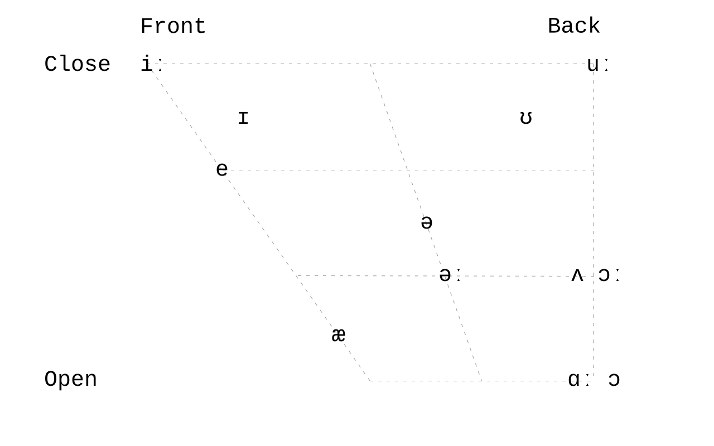
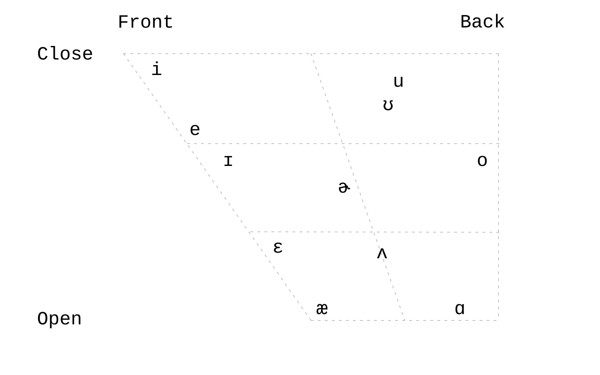
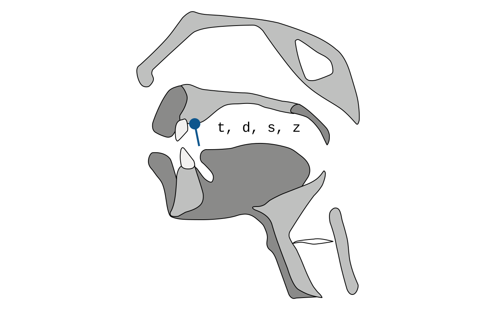
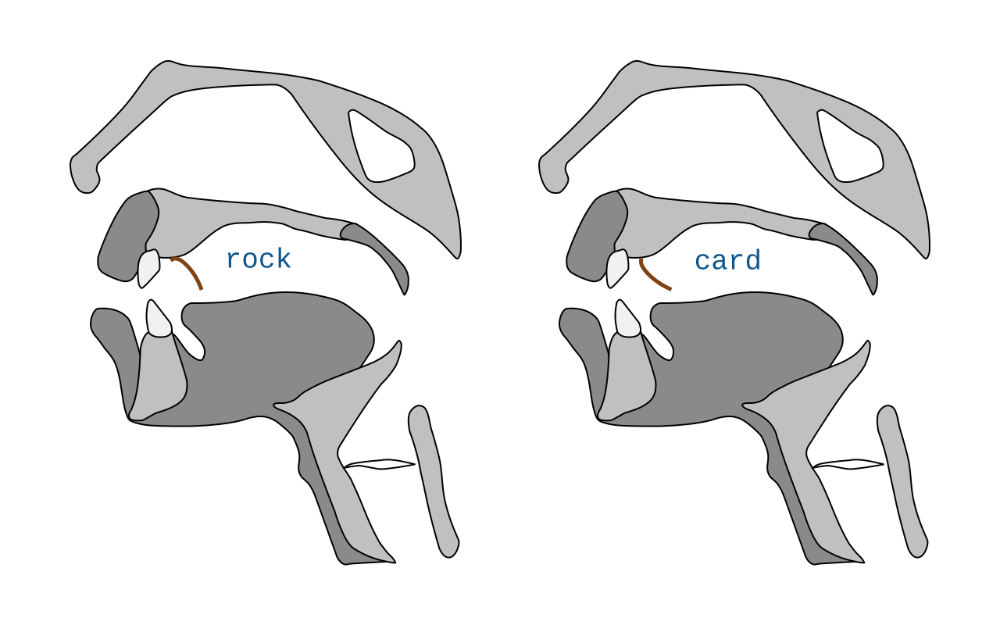
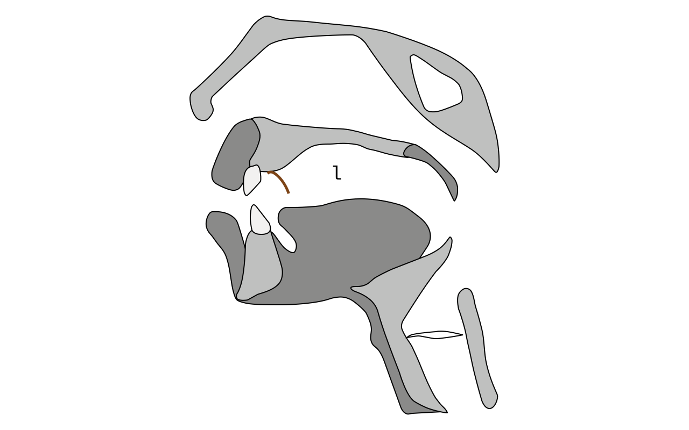

# Giáo trình ngữ âm tiếng Anh ngắn gọn

Li Xiaolai &copy; 2024

> [!Important]
>
> Lưu ý: Đây chưa phải **bản cuối cùng**. Đây là **bản nháp** hoàn thành ngày 4 tháng 2 năm 2024, sau một số lần chỉnh sửa. Trong khoảng một năm tới, tác giả có thể tiếp tục thay đổi tài liệu. Dù thay đổi có vẻ nhỏ, mỗi chi tiết đều có thể quan trọng. Cuối cùng, Li Xiaolai dự định công bố mở tài liệu này và các văn bản liên quan. Trước khi bản cuối hoàn thành, văn bản, hình ảnh, âm thanh và video vẫn được giữ bản quyền, không cho phép trích dẫn.
>
> Tài liệu này có nhiều quan điểm khác với thông lệ. Các ý chính gồm:
>
> > - Sáu nguyên âm cơ bản
> > - `æ` thực chất là nguyên âm dài
> > - Vị trí và tư thế khởi đầu của đầu lưỡi khi phát một số phụ âm
> > - Một English Phonetic Pangram được thiết kế riêng
> > - Đơn vị cơ bản nhất của lời nói tự nhiên thực ra là âm tiết
> > - Tám khía cạnh quyết định nhịp điệu: cao độ, độ trầm, lên xuống, nhấn nhẹ, nhanh chậm
> > - Một yếu tố then chốt bị bỏ qua lâu nay: ngắt nghỉ
> > - ……
>
> Dù khó đưa ra tuyên bố bản quyền cho các ý này, chúng được liệt kê để tránh việc sao chép không ghi nguồn.
>
> Tài liệu được viết bằng [Typora](https://typora.io/). Khi cần thiết, Markdown có lẫn mã HTML, như một số bảng và thẻ audio/video.
>
> Trên GitHub, thẻ audio/video có thể không hiển thị đúng và báo `Your browser does not support the audio element.`. GitHub cũng không hỗ trợ một số liên kết nhảy trong tài liệu này.
>
> Để đọc thuận tiện, bạn có thể tải tài liệu về, mở bằng Typora, hoặc dùng [pandoc](https://pandoc.org/) chuyển sang HTML rồi mở bằng trình duyệt.
>
> Tài liệu cần cộng đồng hỗ trợ rà soát, chẳng hạn lỗi chính tả và định dạng. Bạn có thể gửi issue hoặc pull request. Cảm ơn!
>
> 2024.02.06

---

Âm vị (phoneme) là đơn vị không thể chia nhỏ hơn trong lời nói. Âm vị tiếng Anh được chia thành nguyên âm và phụ âm.

## 1. Nền tảng

> [!Note]
>
> Phần 1.1 và 1.2 dùng hệ phiên âm D.J. phổ biến. Xem [2.4](#24-dj-kk-va-ipa) về cách ghi phát âm Mỹ. D.J. được dùng rộng rãi trong các từ điển tiếng Anh uy tín như [Cambridge English Pronouncing Dictionary](https://dictionary.cambridge.org/pronunciation/english/dictionary), [Oxford English Dictionary](https://www.oed.com/), [Longman Dictionary of Contemporary English](https://www.ldoceonline.com/) và [Collins COBUILD](https://www.collinsdictionary.com/dictionary/english).

### 1.1. Nguyên âm

Tiếng Anh có tổng cộng 20 nguyên âm.

<table>
<tbody>
 <tr>
  <td colspan="2">Nguyên âm đơn</td>
  <td>Nguyên âm đôi</td>
 </tr>
 <tr>
  <td>Nguyên âm ngắn</td>
  <td>ʌ, e, ə, ɪ, ʊ, ɒ</td>
  <td rowspan="2">aɪ, eɪ, ɔɪ, aʊ, əʊ, eə, ɪə, ʊə</td>
 </tr>
 <tr>
  <td>Nguyên âm dài</td>
  <td>ɑː, æ, əː, iː, uː, ɔː</td>
 </tr>
</tbody>
</table>

### 1.2. Phụ âm

Tiếng Anh có tổng cộng 28 phụ âm.

<table>
<tbody>
 <tr>
  <td rowspan="2">Âm tắc</td>
  <td>Phụ âm vô thanh</td>
  <td>p, t, k</td>
 </tr>
 <tr>
  <td>Phụ âm hữu thanh</td>
  <td>b, d, g</td>
 </tr>
 <tr>
  <td rowspan="2">Âm xát</td>
  <td>Phụ âm vô thanh</td>
  <td colspan="2">f, s, θ, ʃ, h</td>
 </tr>
 <tr>
  <td>Phụ âm hữu thanh</td>
  <td colspan="2">v, z, ð, ʒ, r</td>
 </tr>
 <tr>
  <td rowspan="2">Âm tắc xát</td>
  <td>Phụ âm vô thanh</td>
  <td>tʃ, tr, ts</td>
 </tr>
 <tr>
  <td>Phụ âm hữu thanh</td>
  <td>dʒ, dr, dz</td>
 </tr>
 <tr>
  <td>Âm mũi</td>
  <td>Phụ âm hữu thanh</td>
  <td>m, n, ŋ</td>
 </tr>
 <tr>
  <td>Âm bên</td>
  <td>Phụ âm hữu thanh</td>
  <td>l</td>
 </tr>
 <tr>
  <td>Bán nguyên âm</td>
  <td>Phụ âm hữu thanh</td>
  <td>j, w</td>
 </tr>
</tbody>
</table>

### 1.3. Âm tiết

Có lẽ vì cấu trúc não người về cơ bản giống nhau, mọi ngôn ngữ có nhiều đặc điểm chung ở tầng nền tảng, dù con người nói các ngôn ngữ khác nhau. Chẳng hạn, **mỗi âm tiết có một và chỉ một nguyên âm**.

Từ tiếng Anh có ít nhất một âm tiết. Những từ xuất hiện thường xuyên như _a/an_, _the_, _of_, _to_, _for_ đều là từ một âm tiết. Một số từ rất dài, gồm nhiều âm tiết. Một trong những từ dài nhất trong từ điển tiếng Anh có 19 âm tiết và 45 chữ cái:

> _[Pneumonoultramicroscopicsilicovolcanoconiosis](https://en.wikipedia.org/wiki/Pneumonoultramicroscopicsilicovolcanoconiosis)_
>
> ` ˌnumənəʊˌəltrəˌmaɪkrəˌskɑpɪkˌsɪləkəʊvɑlˌkeɪnəʊˌkəʊniˈəʊsəs`
>
> <audio controls><source src="audios/En-us-pneumonoultramicroscopicsilicovolcanoconiosis.ogg.mp3">Your browser does not support the audio element.</source></audio>

Âm tiết tiếng Anh thường có các dạng sau, trong đó `c` là phụ âm và `v` là nguyên âm:

| Syllable Structure | examples           |
| ------------------ | ------------------ |
| `v`                | _a_, `ə`           |
| `vc`               | _add_, `æd`        |
| `cv`               | _the_, `ðə`        |
| `cvc`              | _dog_, `dɔg`       |
| `ccv`              | _flee_, `fliː`     |
| `vcc`              | _east_, `iːst`     |
| `cvcc`             | _task_, `tæsk`     |
| `ccvc`             | _speed_, `spiːd`   |
| `ccvcc`            | _thrust_, `θrʌst`  |
| `cvccc`            | _text_, `tekst`    |
| `ccvccc`           | _flexed_, `flekst` |

Nếu một từ có nhiều âm tiết, để đọc trôi chảy, rõ và dễ nhận biết, một âm tiết có thể mang **trọng âm**. Khi có nhiều âm tiết hơn, một hoặc vài âm tiết có thể mang **trọng âm phụ**. Một từ thường chỉ có một trọng âm chính, nhưng có thể có nhiều trọng âm phụ. Ví dụ: _serendipity_ `ˌserənˈdɪpɪtɪ`. Từ 19 âm tiết ở trên có 7 trọng âm phụ và 1 trọng âm chính.

Về độ dài âm tiết, so với phần lớn ngôn ngữ châu Á:

> **Âm tiết tiếng Anh hầu như luôn dài hơn tương đối.**

Trước hết, nguyên âm trong âm tiết tiếng Anh có thể là nguyên âm dài hoặc nguyên âm đôi, còn nguyên âm trong âm tiết của nhiều ngôn ngữ châu Á thường có độ dài bằng nhau.

Đó là so sánh giữa các nguyên âm. Hãy tiếp tục với phụ âm.

Âm tiết của nhiều ngôn ngữ châu Á hiếm khi bắt đầu bằng hai phụ âm, trong khi điều này rất phổ biến ở tiếng Anh. Chúng cũng hiếm khi kết thúc bằng hai hoặc ba phụ âm mà vẫn phải phát âm rõ, còn tiếng Anh lại thường có. Mỗi phụ âm cần được phát rõ nên cần thời gian. Ví dụ cuối trong bảng, _flexed_, `flekst`, chỉ có một âm tiết. Dù nguyên âm `e` trong âm tiết này là nguyên âm ngắn, toàn bộ cách phát âm vẫn dài hơn một âm tiết điển hình trong nhiều ngôn ngữ châu Á.

## 2. Giải thích nền tảng

### 2.1. Nguyên âm

Tiếng Anh có tổng cộng 20 nguyên âm.

Các giáo trình phổ biến thường không xếp `æ` là nguyên âm dài, có lẽ vì khi hệ D.J. được công bố lần đầu năm 1917, [Daniel Jones](<https://en.wikipedia.org/wiki/Daniel_Jones_(phonetician)>) không gắn ký hiệu dài cho âm này: viết `æ` thay vì `æː`. Điều đó dễ hiểu vì `æ` đã trông khác `e`. Tuy vậy, `æ` thực sự là phiên bản dài hơn của nguyên âm ngắn `e`.

Sáu nguyên âm ngắn `ʌ, e, ə, ɪ, ʊ, ɒ` là nền tảng của hệ nguyên âm tiếng Anh, giống như các “gốc”. Mười sáu nguyên âm còn lại hoặc là các phiên bản dài hơn đã thay đổi đôi chút: `ɑː, æ, əː, iː, uː, ɔː`, hoặc là tổ hợp của chúng, tức nguyên âm đôi: `aɪ, eɪ, ɔɪ, aʊ, əʊ, eə, ɪə, ʊə`.

> [!Important]
>
> “Thay đổi đôi chút” nghĩa là sáu cặp `ʌ/ɑː`, `e/æ`, `ɪ/iː`, `ə/əː`, `ʊ/uː`, `ɒ/ɔː` không đơn thuần là hai độ dài của cùng một âm. Vị trí cộng hưởng luồng khí trong miệng khi phát mỗi âm khác nhau, xem [2.1.1](#211-vi-tri-cong-huong-luong-khi-trong-mieng).

#### 2.1.1. Vị trí cộng hưởng luồng khí trong miệng

Mỗi nguyên âm có “vị trí cộng hưởng luồng khí trong miệng” khác nhau khi phát âm, không bao gồm nguyên âm đôi. Đây cũng là kết quả nghiên cứu của Daniel Jones, tác giả hệ D.J.; hình minh họa được vẽ lại từ [Wikipedia](https://en.wikipedia.org/wiki/Vowel_diagram):

Lưu ý: công trình của Daniel Jones rất quan trọng, nhưng đó là một nỗ lực mô tả gần đúng, không phải chuẩn tuyệt đối. Tiếng Anh có nhiều giọng địa phương khác nhau. Sau đây là vị trí cộng hưởng khi người ở [California, Hoa Kỳ nói tiếng Anh](https://en.wikipedia.org/wiki/California_English):

Trước hết, thói quen phát âm của mỗi người khác nhau; không phải mọi người trên thế giới dùng đúng cùng vị trí cộng hưởng để phát cùng một nguyên âm. Khi nhận biết lời nói, não không cần đối chiếu và phân tích mọi tham số của từng âm vị. Nó nhận biết bằng vài mẫu khái quát, đồng thời dựa vào yếu tố ngoài âm vị như ngữ cảnh, xem [4.1](#41-trôi-chảy).

> [!note]
>
> Mô hình chuyển giọng nói thành văn bản [Whisper](https://github.com/openai/whisper) do OpenAI công bố năm 2022 đạt tốc độ và độ chính xác vượt trội chủ yếu nhờ thuật toán phân tích ngữ cảnh của từng từ trong lời nói, bằng nhiều kiểu nhận dạng mẫu, thay vì chỉ nhận diện từng âm vị. Trước đó, phần lớn mô hình nhận dạng giọng nói dựa nhiều hơn vào phân tích âm vị nên chậm và kém chính xác hơn.

Khi luyện, hãy cố đưa **vị trí cộng hưởng luồng khí trong miệng** của các nguyên âm tiếng Anh ra sau nhất có thể, gần về phía cổ họng. Lý do là nguyên âm của các ngôn ngữ châu Á thường có vị trí cộng hưởng ở phía trước hơn.

> **Điểm nào khác cách phát âm tiếng mẹ đẻ thì đó là trọng tâm cần rèn.**

Làm thế nào? Hãy nghe kỹ ba biến thể của `ɑ` dưới đây, suy ngẫm và thử nhiều lần. Âm thanh lấy từ [Wikipedia](https://en.wikipedia.org/wiki/Vowel):

- Vị trí cộng hưởng ở phía trước:
  <audio controls><source src="audios/ɑ-01-PR-open_front_unrounded_vowel.ogg.mp3" type="audio/mpeg"> Your browser does not support the audio element.</source></audio>
- Vị trí cộng hưởng ở giữa:
  <audio controls> <source src="audios/ɑ-02-Open_central_unrounded_vowel.ogg.mp3" type="audio/mpeg">Your browser does not support the audio element.</source></audio>
- Vị trí cộng hưởng ở phía sau:
  <audio controls> <source src="audios/ɑ-03-Open_back_unrounded_vowel.ogg.mp3" type="audio/mpeg">Your browser does not support the audio element.</source></audio>

#### 2.1.2. `ʌ`/`ɑː`

Khi phát âm này, người Mỹ có thể dùng hẳn `ə`. Nói cách khác, với họ có năm nguyên âm ngắn thay vì sáu theo cách quen thuộc của Anh. Chẳng hạn _encourage_ được phát âm `ɪnˈkʌrɪdʒ` trong Anh Anh và `ənˈkərɪdʒ` trong Anh Mỹ, vì họ có xu hướng đọc một số `ɪ` ở âm tiết không nhấn thành `ə`.

Khi đọc nguyên âm dài `ɑː`, người Mỹ thường thêm `r` ở cuối. Vì vậy hệ K.K. dành cho phát âm Mỹ thường ghi trực tiếp là `ɑr`.

#### 2.1.3. `e`/`æ`

Một số từ điển dùng `ɛ` để ghi âm `e` trong phát âm Mỹ.

`æ` là phiên bản dài hơn của `e`. Dù không có ký hiệu dài `ː` sau nó, âm này nên được xem là nguyên âm dài. Người nói ngôn ngữ châu Á thường mở miệng rộng hơn khi phát âm này, nhưng hay vô thức đọc nó ngắn đi. Có hai điểm cần nhớ:

> 1. Kéo âm dài hơn một chút
> 2. Mở miệng rộng hơn một chút

Điểm thứ nhất quan trọng hơn. Hãy thử nhiều lần với _apple_ `ˈæpəl` và _banana_ `bəˈnænə`, chủ ý kéo dài `æ` hơn một chút.

#### 2.1.4. ` ə`/`əː`

Khi đọc hai âm này, người Mỹ thường thêm `ʳ` ở cuối, nhưng không phải lúc nào cũng thêm. Ví dụ _worker_ đọc là `wəːkəʳ`, không phải `wəːʳkəʳ`.

Người mới học dễ thêm quá mức `ʳ` mỗi khi gặp hai âm này, chẳng hạn có thể đọc _focus_ thành `fəʊkəʳs`.

Một số từ điển dùng `ɜ` để ghi `ə`. Với phát âm Mỹ, `əʳ` có thể viết là `ɚ`, còn `əːʳ` có thể viết là `ɜː` hoặc `ɝ`.

Trong lời nói tự nhiên liền mạch, nguyên âm ở nhiều âm tiết không nhấn có xu hướng rút thành `ə`, đặc biệt là `ɪ`. Chẳng hạn _individual_ `ˌɪndɪˈvɪdʒjʊəl` thực tế có thể đọc là `ˌɪndəˈvɪdʒəwəl`: `jʊ` cũng thành `ə`, rồi có âm thêm `w` giữa `ʊ` và `ə`, xem [2.2.13](#2213-j-w). Nhiều từ điển hiện ghi trực tiếp dạng sau.

#### 2.1.5. `ɪ`/`iː`

Cặp nguyên âm này không chỉ khác độ dài. `ɪ` thường không được xem hoàn toàn là bản ngắn của `iː`; nó gần với âm nằm giữa `e` và `i`, có vị trí cộng hưởng lùi hơn `iː` một chút. Nó nghe gần như phiên bản ngắn hơn của `eɪ`.

Tuy nhiên, khi ở cuối từ, `ɪ` có xu hướng giống phiên bản ngắn của nguyên âm dài `iː`, tức `i`.

Sau khi Daniel Jones qua đời, Alfred C. Gimson tiếp nhận công việc và năm 1977 phát hành phiên bản D.J. thứ 14. Phiên bản này đưa vào các ký hiệu `ɪ ʊ ɒ ɜː` để thay cho `i u ɔ əː` trước đó.

Năm 1997, Peter Roach tiếp quản, đổi tên _English Pronouncing Dictionary_ (_EPD_) thành _Cambridge English Pronouncing Dictionary_ (_CEPD_) và phát hành D.J. phiên bản 15. Ngoài `ɝ, ɚ, t̬` để ghi phát âm Mỹ, phiên bản này đổi `ɪ` ở cuối từ thành `i`. Vì thế _happy_ không còn ghi `ˈhæpɪ` mà là `ˈhæpi`. Phần lớn bản ghi giọng người thật của các từ điển cũng được sửa tương ứng.

Hãy nghe lặp lại bản phát âm người thật của Cambridge cho từ _responsibility_:

> UK
>
> <audio controls><source src="audios/ukresou030.mp3" type="audio/mpeg">Your browser does not support the audio element.</source></audio>
>
> US
>
> <audio controls><source src="audios/eus73963.mp3" type="audio/mpeg">Your browser does not support the audio element.</source></audio>

#### 2.1.6. `ʊ`/`uː`

Mọi ngôn ngữ trên thế giới đều dùng cặp nguyên âm này gần như giống nhau, nên chúng không khó đọc. Có một chi tiết: khi đọc nguyên âm dài `uː` trong tiếng Anh, khẩu hình khép hơn và môi hơi nhô hơn so với nguyên âm ngắn `ʊ`.

#### 2.1.7. `ɔ`/`ɔː`

Khi phát cặp nguyên âm này, chuyển động môi rất rõ: hãy tạo hình tròn nhỏ bằng môi rồi bắt đầu phát âm. Người Mỹ có thể đọc `ɔː` thành `ɔʳ`, gần với nguyên âm đôi `ɔᵊʳ`, nhưng không phải mọi trường hợp đều như vậy, cần kiểm tra từng từ.

Ban đầu hệ D.J. dùng `ɔ` cho nguyên âm ngắn và `ɔː` cho nguyên âm dài. Sau đó nguyên âm ngắn `ɔ` được thay bằng `ɒ`, ký hiệu có nét khép ở phía trên.

#### 2.1.8. `aɪ, eɪ, ɔɪ, aʊ, əʊ, eə, ɪə, ʊə`

Các ngôn ngữ châu Á về cơ bản không có nguyên âm đôi giống tiếng Anh. Nguyên âm tiếng Hàn, tiếng Nhật và một số vần tiếng Trung có tổ hợp gồm hai âm vị cơ bản, nhưng chúng dài bằng các nguyên âm hoặc vần khác, không dài gần gấp đôi nguyên âm ngắn như nguyên âm đôi tiếng Anh.

Ví dụ, trong pinyin *tài lèi le*, phần vần của *tài* gần với nguyên âm đôi `aɪ`, còn phần vần của *lèi* gần với `eɪ`. Tuy vậy, chúng khác nhau vì nguyên âm đôi tiếng Anh dài hơn.

Nguyên âm đôi tiếng Anh là tổ hợp của hai nguyên âm. Âm phát lướt từ nguyên âm thứ nhất sang nguyên âm thứ hai, nên về độ dài tương đương nguyên âm dài. Nhịp điệu giống nhóm ba nốt bằng nhau trong một phách: âm vị đầu dài hơn, âm vị sau ngắn hơn.

Khi đọc chúng, cũng cần đưa **vị trí cộng hưởng luồng khí trong miệng** ra sau, nhưng quan trọng hơn là **đọc đủ dài**: dùng thời lượng của hai nguyên âm và phát âm đầy đặn.

Người nói các ngôn ngữ châu Á thường đọc mọi nguyên âm đôi với độ dài của nguyên âm đơn, và hay vô thức đọc nhiều nguyên âm dài thành phiên bản ngắn hơn. Một lý do là các ngôn ngữ này thường coi ký tự, thay vì từ, là đơn vị nhỏ nhất; mỗi ký tự thường là một âm tiết với nguyên âm có độ dài bằng nhau.

Ba nguyên âm đôi có `ʊ`, gồm `aʊ, əʊ, ʊə`, cần phối hợp chuyển động môi để phát đúng. Năm nguyên âm đôi còn lại `aɪ, eɪ, ɔɪ, eə, ɪə` được hoàn thành khi môi gần như không di chuyển, chủ yếu nhờ chuyển động vùng họng.

> [!Note]
>
> Trong một số phiên bản D.J., `əʊ` cũng được viết là `oʊ`, nên vài từ điển hiện dùng `oʊ`. Tác giả cho rằng `əʊ` hợp lý hơn vì `o` không xuất hiện trong sáu âm vị nền tảng.

### 2.2. Phụ âm

Xét tương đối, phát âm sai gây cản trở hiểu thường đến từ nguyên âm nhiều hơn phụ âm. Mỗi âm tiết có một và chỉ một nguyên âm. Nếu âm tiết là một tế bào, nguyên âm duy nhất là hạt nhân. Dù phụ âm thường bị xem là nguồn gốc chính của giọng địa phương, lỗi nguyên âm mới ảnh hưởng nhiều nhất đến việc truyền đạt thông tin trôi chảy. Lỗi phụ âm thường chỉ làm giọng địa phương rõ hơn mà không cản trở giao tiếp.

Arnold Schwarzenegger, ngôi sao hành động Hollywood, có tiếng mẹ đẻ là tiếng Đức. Dù sống ở Mỹ nhiều năm, từng làm thống đốc, đóng phim và diễn thuyết khắp nơi, ông vẫn có giọng rõ. Ông tự trào rằng giọng của mình “dày như cơ ngực” trong _[Be Useful: Seven Tools for Life](https://www.amazon.com/Be-Useful-Seven-Tools-Life/dp/B0C1HR5D9S/)_ năm 2023. Quan sát kỹ cho thấy đa số nguyên âm của ông khá chính xác; giọng chủ yếu do phụ âm nhưng không hề cản trở người nghe hiểu.

Vì thế phụ âm vẫn là trọng tâm. Mỗi ngôn ngữ có **cách phát phụ âm** và **cách kết hợp phụ âm với nguyên âm** riêng. Ngay cả phụ âm tưởng chung giữa tiếng mẹ đẻ và tiếng Anh cũng có khác biệt nhỏ, vốn là nguồn của giọng địa phương. Muốn giảm giọng địa phương và tái tạo phát âm, cần rèn phụ âm kỹ.

Không thể phân tích mọi khác biệt giữa mọi ngôn ngữ và tiếng Anh. Phần sau chủ yếu lấy khác biệt giữa Quan thoại và tiếng Anh làm ví dụ, nhưng nguyên lý giống nhau:

> **Điểm nào khác cách phát âm tiếng mẹ đẻ thì đó là trọng tâm cần rèn.**

> [!Important]
>
> Bạn có thể cần tự bổ sung mọi mục trong tài liệu này. Ngay cả Quan thoại cũng có nhiều giọng địa phương. Dựa vào giọng sẵn có, hãy phân tích cách phát từng âm và tìm phần cần sửa. Nếu tiếng mẹ đẻ là tiếng Việt, hãy đối chiếu từng âm vị với âm Việt gần nhất. Với bất cứ tiếng mẹ đẻ nào, điều quan trọng là **biến tài liệu này thành tài liệu cá nhân hóa cho chính bạn**.

#### 2.2.1. `p, b, m, n, f, k, g, h`

Những phụ âm này khá dễ với người nói Quan thoại vì cách phát của chúng trong hai ngôn ngữ gần nhau.

Tuy vậy, thói quen từ pinyin có thể khiến người học thêm nguyên âm `ə` sau phụ âm đầu. Trong D.J., các dạng như `bə, pə, mə, fə, gə, kə, hə, nə` không phải cách đọc phụ âm tách rời trong tiếng Anh.

Thói quen cũ có thể chen vào ngôn ngữ mới và khiến người học vô thức thêm `ə` sau các âm này. Ví dụ, _please_ có thể bị đọc nhầm thành _police_.

#### 2.2.2. `f`, `v`

`f` không khó với người nói Quan thoại vì ngôn ngữ này có âm tương tự. Người nói tiếng Hàn có thể khó với `f` vì tiếng Hàn không có âm đó, nên dễ thay bằng `p`, đọc _photo_ thành `pəʊtəʊ`.

Nhưng `v`, phiên bản hữu thanh của `f`, không có trong Quan thoại, nên cần học và luyện riêng, không thay bằng `w`. Ví dụ, không đọc _every_ thành `ˈewərɪ`. Tiếng Hàn cũng không có âm này nên người nói tiếng Hàn dễ thay bằng `b`, đọc _video_ thành `ˈbɪdioʊ`.

`f` và `v` có thể khó khi người học chưa quen động tác này. Hãy lặp lại nhiều lần: đặt răng trên chạm môi dưới rồi mới bắt đầu phát âm.

Nghiên cứu cho thấy âm không tồn tại trong tiếng mẹ đẻ đôi khi dễ học hơn âm gần giống đã có. Điều này trái với trực giác: với âm hoàn toàn mới, chỉ cần luyện trực tiếp; với âm gần giống, người học dễ vô thức dùng âm tiếng mẹ đẻ. Đừng nghĩ rằng mình mãi không phát được một âm. Hãy tiếp tục thử, nhưng đừng hình thành thói quen thay bằng âm gần đúng.

> Flege, J. (1995). "Second language speech learning: Theory, findings and problems". In Winifred Strange (ed.). _Speech perception and linguistic experience: Theoretical and methodological issues_. Baltimore: York Press. pp. 233–277

#### 2.2.3. `m, n, ŋ`

`m` ở cuối âm tiết không khó với người nói Quan thoại. Người phát âm Quan thoại chuẩn cũng phân biệt được âm mũi trước `n` và âm mũi sau `ŋ` ở cuối âm tiết. Một số giọng địa phương khó phân biệt chúng, ví dụ có thể đọc pinyin *yīng xióng* thành *yīn xión*. Cách khắc phục là rèn dứt khoát động tác phát âm mũi sau.

Khi âm mũi trước `n` đứng trước âm vòm mềm `k`, nó tự nhiên chuyển thành âm mũi sau `ŋ`. Ví dụ _tank_ thường được từ điển ghi là `tæŋk`.

Khi `ŋ` ở cuối từ và tiếp theo là âm tiết bắt đầu bằng nguyên âm, nó thường được đọc thành `n` để nối với âm tiết sau, ví dụ:

> - _going out_ ⭢ `goʊɪn aʊt`
> - _sing a song_ ⭢ `sɪn ə sɔŋ`
> - _wrong idea_ ⭢ `rɔn aɪˈdiə`
> - _thinking of_ ⭢ `ˈθɪŋkɪn əv`

#### 2.2.4. `t, d, s, z; ʃ, tʃ, dʒ`

Bốn phụ âm `t, d, s, z` là trọng tâm cần điều chỉnh với người nói Quan thoại. Chúng có âm gần giống trong Quan thoại nên khác biệt tinh tế dễ bị bỏ qua. Tuy nhiên, khác biệt nhỏ ấy ảnh hưởng lớn đến chất lượng âm thanh, vì bốn phụ âm này cùng `ʃ, tʃ, dʒ` chịu ảnh hưởng trực tiếp của chúng, tổng cộng bảy phụ âm, xuất hiện với tần suất rất cao trong tiếng Anh.

Điểm then chốt khi phát `t, d, s, z` là vị trí đầu lưỡi lúc bắt đầu âm.

Trong Quan thoại, đầu lưỡi khi bắt đầu `t, d` đặt sát răng; với `s, z`, đầu lưỡi gần răng nhưng để hở cho luồng khí đi qua. Ví dụ gốc dùng pinyin *wǒ tī sǐ nǐ* để cảm nhận vị trí này.

Trong tiếng Anh, đầu lưỡi khi bắt đầu `t, d` chạm vùng ngay phía sau ranh giới răng và lợi như hình, không chạm răng. Với `s, z`, vị trí đầu lưỡi tương tự nhưng để một khe hở cho luồng khí đi qua.

Vị trí đầu lưỡi của `t, d, s, z` cũng ảnh hưởng ba phụ âm `ʃ, tʃ, dʒ`. Quan thoại có các âm quặt lưỡi gần tương ứng `sh, ch, zh`; xác định đúng vị trí đầu lưỡi của ba âm này giúp bắt đầu các âm tiếng Anh `t, d, s, z`. Khác biệt là đầu lưỡi của `sh, zh` chạm ngạc trên, tương ứng cách phát `ʃ, dʒ` tiếng Anh. Với `s, z` tiếng Anh, đầu lưỡi vẫn cách ngạc trên một khoảng và không gần răng như `s, z` Quan thoại.

Người nói Quan thoại cần học động tác mới cho các phụ âm này. Có thể bắt đầu luyện lặp lại với _students_ `ˈstudənts`, rồi luôn chú ý vị trí đầu lưỡi lúc bắt đầu âm.

#### 2.2.5. `t, d`

`t` và `d` xuất hiện với tần suất rất cao trong tiếng Anh, nên cần đặc biệt chú ý các chi tiết liên quan.

##### 2.2.5.1. Lược âm

Khi sau `t` hoặc `d` là một phụ âm, động tác đầu lưỡi vẫn hoàn thành nhưng không đẩy luồng khí ra, nên ta không nghe thấy âm. Hiện tượng này gọi là **lược âm** (_elision_). Cách gọi này dễ gây hiểu lầm: không nghe thấy không có nghĩa là âm không tồn tại. Đó là một khoảng ngắt có thật, dù không nhìn thấy hay nghe rõ. Ở vị trí `t, d` có một **khoảng ngắt rất nhỏ**. Đôi khi đầu lưỡi chưa hoàn tất động tác, nhưng khoảng ngắt vẫn còn và người không phải bản ngữ thường bỏ qua nó.

_postcart_ không phải `poʊsˌkɑrd` mà là `ˈpoʊs·ˌkɑrd`; `·` biểu thị khoảng ngắt cực ngắn ấy. Tương tự, _hotdog_ không phải `ˈhɑˌdɔg` mà là `ˈhɑ·ˌdɔg`; _partner_ không phải `ˈpɑrnər` mà là `ˈpɑr·nər`; _hard-nosed_ không phải `ˌhɑːˈnoʊzd` mà là `ˌhɑːr·ˈnoʊzd`.

##### 2.2.5.2. Phụ âm kép

Hiện tượng này không chỉ có với `t, d`.

Khi phụ âm cuối âm tiết trước giống phụ âm đầu âm tiết sau, đó là **phụ âm kép** (_geminates_). Trong lời nói tự nhiên liền mạch, hai phụ âm chỉ được phát một lần, nhưng có thể vẫn cảm nhận được phụ âm trước qua một khoảng ngắt rất nhỏ. Về cơ chế, nó giống **lược âm** ở [2.2.5.1](#2251-luoc-am). Hai phụ âm kề nhau gần giống cũng có thể tạo hiện tượng này.

Ví dụ, _at that time_ không phải `ət ðæt taɪm` mà là `ə·ðætaɪm`: `t` đầu do đứng trước phụ âm nên bị **lược âm**, không nghe thấy nhưng khoảng ngắt vẫn còn, ký hiệu bằng `·`; `t` thứ hai và thứ ba là **phụ âm kép** nên chỉ phát một lần. Tương tự, _a bad day_ không phải `ə bæd deɪ` mà là `ə bæ deɪ`.

##### 2.2.5.3. Đồng hóa

Khi một từ kết thúc bằng `t` gặp từ bắt đầu bằng `ju`, đọc nối thường biến `t` thành `tʃ`; `d` gặp `ju` thường thành `dʒ`. Đây là **đồng hóa** (_assimilation_). Ví dụ phổ biến: _Don't you?_ `dəʊn tʃju?` và _Would you?_ `wʊ dʒju?`. Khi đặt đúng vị trí đầu lưỡi cho `t, d`, xem [2.2.4](#224-t-d-s-z-ʃ-tʃ-dʒ), việc nối với `ju` sẽ tự nhiên diễn ra như vậy.

##### 2.2.5.4. Âm bật lưỡi

Khi `t` nằm giữa hai nguyên âm, trong một từ hoặc giữa các từ, nó có thể thành **âm bật lưỡi** (_alveolar flapping t_), thường ghi `t̬` và nghe rất gần `d`. Hiện tượng này rất phổ biến, như _bea**t**en, bo**tt**om, bu**tt**er, daugh**t**er, wa**t**er, wri**tt**en, how abou**t** it, here a**t** our universi**t**y, no**t** a**t** all, set i**t** up_.

##### 2.2.5.5. Lược bỏ âm

Nhiều người Mỹ có một thói quen khác với `t`: khi `t` theo sau `n`, cách nói khiến ta không nghe thấy `t`, gọi là **lược bỏ âm** (_dropping_). Ví dụ _interview_ có thể nghe là `ˈɪnəˌvju`, _international_ có thể nghe là `ˌɪnəˈnæʃənəl`. `h` cũng thường bị lược, xem [2.2.8](#228-h).

#### 2.2.6. `tr, dr, ts, dz`

`tr` và `tʃ` nghe rất gần nhau, có cùng vị trí đầu lưỡi nhưng tư thế lưỡi hơi khác. Với `tr`, đầu lưỡi chạm ngạc gần vùng sau ranh giới răng-lợi, xem [2.2.4](#224-t-d-s-z-ʃ-tʃ-dʒ); với `tʃ`, phần mặt lưỡi ngay sau đầu lưỡi chạm ngạc. Khác biệt giữa `dr` và `dʒ` cũng tương tự.

Thực tế, nhiều người bản ngữ cũng không phân biệt rõ `tr/tʃ` hay `dr/dʒ`. Nhiều từ điển tiếng Anh ghi _tree_ trực tiếp là `tʃiː`, _driver_ là `ˈdʒaɪvər`.

Nhiều người châu Âu phân biệt chúng tự nhiên do thói quen tiếng mẹ đẻ, trong đó `tr` và `dr` được phát liên tiếp. Ví dụ người Nga hoặc Đức có thể đọc _tree_ là `t·riː` với `r` rung đầu lưỡi, và _driver_ là `d·raɪvə` với cùng kiểu `r`.

Khi phát `ts` và `dz`, vị trí đầu lưỡi lúc bắt đầu giống `t` và `d`. `ts` khá giống `c` trong pinyin Quan thoại, chỉ khác ở chỗ đầu lưỡi không đặt trên răng. Với `dz`, chỉ cần chỉnh đúng vị trí khởi đầu của `d`, cũng là vị trí của `z`, là đủ. Trên thực tế `dz` nghe gần như không khác `z`.

#### 2.2.7. `sp, st, sk`

Ba phụ âm vô thanh `p, t, k` tương ứng với ba phụ âm hữu thanh `b, d, g`.

Cần lưu ý rằng `p, t, k` thường trở nên hữu thanh khi đứng sau `s`.

> - _speak_ `spiːk` thực tế được đọc gần `sbiːk`
> - _student_ `ˈstudənt` thực tế được đọc gần `ˈsdudənt`
> - _school_ `skuːl` thực tế được đọc gần `sguːl`

#### 2.2.8. `h`

Phát riêng `h` thường không khó, nhưng có một chi tiết cần chú ý.

Khi có phụ âm khác đứng trước, `h` thường bị **lược bỏ** (_dropping_). Ví dụ, đọc tách _Was he hurt?_ là `wɒz hi hərt?`, nhưng trong lời nói liền mạch có thể thành `wzi həːt?`: `h` biến mất. _let him_ có thể thành `let̬ɪm`, còn _household_ nghe gần như `ˈhaʊˌsoʊld`.

#### 2.2.9. `θ, ð`

Giáo trình ở trường thường nhấn mạnh phải kẹp đầu lưỡi giữa hai răng khi phát `θ, ð`. Điều đó không cần quá cứng nhắc: đầu lưỡi không nhất thiết phải đưa hẳn ra ngoài răng, chỉ cần chạm răng trên trước khi bắt đầu âm.

#### 2.2.10. `r`

`r` vốn không khó, nhưng tiếng Anh Mỹ có đặc điểm gây khó: vấn đề không phải vị trí đầu lưỡi lúc bắt đầu âm mà là tư thế đầu lưỡi. Trong Anh Anh, `r` có một tư thế, đầu lưỡi hướng trước gần ngạc trên. Trong Anh Mỹ, _rock_ `rɔk` dùng đầu lưỡi hướng trước, còn _card_ `kɑːʳd` dùng tư thế cuộn sau.

#### 2.2.11. `l`

Cũng như `r`, `l` có thể đứng trước hoặc sau nguyên âm. Nhiều ngôn ngữ châu Á có âm hóa `r`, nên `r` sau nguyên âm thường không khó. Khó ở `l` sau nguyên âm, tình huống gần như không có trong nhiều ngôn ngữ châu Á.

Khó ở `l` sau nguyên âm. Trong _individual_ `ˌɪndɪˈvɪdʒəwəl`, hoặc từ một âm tiết đơn giản _girl_ `gəːl`, `l` sau nguyên âm thường bị bỏ qua.

Điểm then chốt là `l` sau nguyên âm có một động tác đầu lưỡi đầy đủ: sau khi phát `ə`, đầu lưỡi được nâng lên đến khi chạm ngạc trên.

Một số người nghe được `l` cuối nên không bỏ qua nó. Nhưng vì không thấy vị trí và tư thế đầu lưỡi, người học có thể dùng cách khác để tạo khác biệt họ nghe được: có người thay `l` cuối bằng `əʊ` kèm chuyển động môi và đọc _girl_ là `gəʊ`; người nói tiếng Hàn có thể thay `l` bằng `r` và đọc thành `gəːr`.

Vì vậy cần đặc biệt chú ý `l` sau nguyên âm: đặt đúng đầu lưỡi, hoàn tất động tác và không cử động môi, nếu không sẽ xuất hiện âm `ʊ`.

#### 2.2.12. `ʒ`

`ʒ` không có trong tiếng Trung, là âm nằm giữa `r` và `dʒ`. Âm này khá khó với người nói ngôn ngữ châu Á. May mắn là nó hiếm trong tiếng Anh: chỉ có 69 từ trong 10.000 từ thông dụng nhất và số từ xuất hiện rất thường xuyên chỉ vài chục:

> - _beige_ - `beɪʒ` - A pale sandy yellow-brown color
> - _collage_ - `kəˈlɑːʒ` - A piece of art made by sticking various different materials such as photographs and pieces of paper or fabric onto a backing
> - _corsage_ - `kɔːrˈsɑːʒ` - A small bouquet of flowers worn on a woman's dress or around her wrist
> - _decision_ - `dɪˈsɪʒən` - A conclusion or resolution reached after consideration
> - _decoupage_ - `ˌdeɪkuːˈpɑːʒ` - The art or craft of decorating objects with paper cut-outs
> - _garage_ - `ɡəˈrɑːʒ` - A building for housing a motor vehicle
> - _genre_ - `ˈʒɑːnrə` - A category of artistic composition, as in music or literature
> - _leisure_ - `ˈleʒər` - Time free from work or duties
> - _massage_ - `məˈsɑʒ` - The rubbing and kneading of muscles and joints of the body with the hands, especially to relieve tension or pain
> - _measure_ - `ˈmeʒər` - To ascertain the size, amount, or degree of something
> - _mirage_ - `mɪˈrɑːʒ` - An optical illusion caused by atmospheric conditions
> - _montage_ - `mɒnˈtɑːʒ` - The technique of producing a new composite whole from fragments of pictures, text, or music
> - _pleasure_ - `ˈpleʒər` - A feeling of happy satisfaction and enjoyment
> - _regime_ - `reɪˈʒiːm` - A government, especially an authoritarian one
> - _rouge_ - `ruːʒ` - A red powder or cream used as a cosmetic for coloring the cheeks or lips
> - _treasure_ - `ˈtreʒər` - A quantity of precious metals, gems, or other valuable objects
> - _usual_ - `ˈjuʒəwəl` - Habitually or typically occurring or done
> - _vision_ - `ˈvɪʒən` - The ability to see; sight

Chỉ cần luyện lặp lại, âm này không khó như thoạt tưởng. Hãy phát `dʒ`, gần với `zh` trong pinyin, rồi hạ nhẹ phần lưỡi đang chạm ngạc để tạo một khe cho luồng khí đi qua. Khe này là khác biệt giữa `ʒ` và `dʒ`.

Hãy nhớ rằng âm không có trong tiếng mẹ đẻ đôi khi dễ học hơn âm gần giống. `ʒ` quá giống `dʒ`, gần với `zh` pinyin, nên người nói Quan thoại thường thay toàn bộ bằng `dʒ`.

#### 2.2.13. `j, w`

Hai phụ âm này khi đứng đầu một âm tiết không gây trở ngại cho đa số người học.

Điểm đáng chú ý là khi một âm tiết kết thúc bằng nguyên âm nối với âm tiết sau bắt đầu bằng nguyên âm, hai âm này đôi khi được chèn vào. Ngữ âm học gọi hiện tượng này là **thêm âm** (_intrusion_).

- Thêm `j` khi âm tiết trước kết thúc bằng `ɪ`

> - _I am_ - `ˈaɪ ˈæm` ⭢ `ˈaɪjæm`
> - _He is_ - `ˈhiː ˈɪz` ⭢ `ˈhiːjɪz`.
> - _She is_ - `ˈʃiː ˈɪz` ⭢ `ˈʃiːjɪz`.
> - _They are_ - `ˈðeɪ ˈɑːr` ⭢ `ˈðeɪjɑːr`.

- Thêm `w` khi âm tiết trước kết thúc bằng `ʊ`

> - _Go away_ - `ˈɡəʊ əˈweɪ` ⭢ `ˈɡəʊwəˈweɪ`
> - _Do all_ - `ˈduː ˈɔːl` ⭢ `ˈduːwɔːl`
> - _Do it_ - `ˈduː ˈɪt` ⭢ `ˈduːwɪt`
> - _Throw it_ - `ˈθrəʊ ˈɪt` ⭢ `ˈθrəʊwɪt`

Ví dụ _individual_ `ˌɪndɪˈvɪdʒəwəl` đã nêu là từ đa âm tiết. Nhìn kỹ, nửa sau `dʒə-wəl` cũng phát triển từ `dʒju-əl` bằng cách chèn `w` qua _intrusion_.

### 2.3. Nối âm

Trong các giáo trình phát âm phổ biến, “nối âm” thường bị xếp vào “kỹ thuật nâng cao”. Cách xếp này không cần thiết vì nối âm thực chất rất cơ bản.

Lời nói tự nhiên luôn liền mạch, nên đơn vị cơ bản không phải là từ mà là âm tiết. Ở góc độ này, lời nói tự nhiên của mọi ngôn ngữ đều như vậy.

> Bề mặt tiếng Anh có vẻ lấy từ làm đơn vị cơ bản...
>
> Nhưng xét lời nói liền mạch, âm tiết mới là đơn vị cơ bản.

Vì mọi lời nói tự nhiên lấy âm tiết làm đơn vị cơ bản, xử lý rõ các âm tiết kề nhau vốn là kỹ năng nền tảng.

Ví dụ về nối âm (_catenation_) giữa hai từ: trong _clean up_, `n` cuối âm tiết trước và âm tiết bắt đầu bằng nguyên âm `ʌp` nghe như cùng một âm tiết, thành `kli ˈnʌp`. Lý do là lời nói tự nhiên lấy âm tiết làm đơn vị nền tảng.

Vì lời nói liền mạch còn có cao độ, đường nét giai điệu, nhấn nhẹ và tốc độ, xem [3.3](#33-cao-do), [3.4](#34-len-xuong), [3.5](#35-nhan-nhe), [3.6](#36-nhanh-cham), một số âm tự nhiên thay đổi hoặc có biến thể.

Không chỉ các âm tiết kề nhau có thể nối, một số âm vị còn thay đổi trong quá trình nối. Tóm lại:

> - Nguyên âm không nhấn thường rút gọn thành `ə`, xem [2.1.4](#214-əəː).
> - `t, d` thường có nhiều biến thể, xem [2.2.5](#225-t-d):
>   - lược âm (_elision_), xem [2.2.5.1](#2251-luoc-am);
>   - phụ âm kép (_geminates_), xem [2.2.5.2](#2252-phu-am-kep);
>   - đồng hóa (_assimilation_), xem [2.2.5.3](#2253-dong-hoa).
> - Âm bật lưỡi (_alveolar flapping_), xem [2.2.5.4](#2254-am-bat-luoi).
> - `h` và `t` có thể bị lược bỏ (_dropping_), xem [2.2.8](#228-h), [2.2.5.5](#2255-luoc-bo-am).
> - `ŋ` có thể được đọc thành `n`, xem [2.2.3](#223-m-n-ŋ).
> - `j` và `w` có thể vô thức được chèn vào, tạo hiện tượng thêm âm (_intrusion_), xem [2.2.13](#2213-j-w).
> - Các phụ âm giống hoặc gần giống nhau có thể tạo phụ âm kép (_geminates_), xem [2.2.5.2](#2252-phu-am-kep).

Tất cả đều là nền tảng, không phải kỹ thuật cao cấp; gọi chúng là nâng cao có thể gây hiểu lầm.

Sau đây là một câu Joey nói trong _[Friends](https://www.imdb.com/title/tt0108778/) S01E01_:

> _Come on... you're going out with the guy... there's got to be something wrong with him._
>
> <audio controls><source src="audios/friends-s01e01-joey.mp3" type="audio/mpeg">Your browser does not support the audio element.</audio></audio>
>
> `kʌm ʌn... jʊ-ar goʊɪŋ aʊt wɪθ ðə gaɪ... ðez gɒt tʊ biː ˈsʌmθɪŋ rɔŋ wɪθ hɪm.`

Một câu ngắn này có nhiều chi tiết đáng chú ý, và đến đây bạn có thể hiểu phần lớn:

> - _Come on_ được nối thành `ˈkə·ˈmɑːn`. Joey dùng giọng Mỹ, trong đó `ʌ` gần như `ə`; `ʌn` mang trọng âm nên kéo dài và nghe như `ɑː`, xem [3.5](#35-nhan-nhe).
> - _you're_ `jʊ-ar` có thêm `w` rất nhẹ, cần nghe kỹ mới nhận ra: `jʊ war`, xem [2.2.13](#2213-j-w).
> - Trong _going out_, `ŋ` của `goʊɪŋ aʊt` thành `n`, rồi nối với âm tiết sau thành `goʊwɪ·naʊt`; tại đây cũng có thêm `w`, xem [2.2.3](#223-m-n-ŋ), [2.2.13](#2213-j-w).
> - Trong _with the_ `wɪθ ðə`, hai phụ âm gần nhau `θ· ð` thành phụ âm kép; âm trước chỉ còn khoảng ngắt: `wɪ·ðə`, xem [2.2.5.2](#2252-phu-am-kep).
> - Trong _got to_ `gɒt tʊ`, hai `t` tạo phụ âm kép, âm trước chỉ còn khoảng ngắt; `to` sau đó bị yếu hóa thành `tə`, thậm chí nghe như `t`: `gɒ·t(ə)`, xem [2.2.5.2](#2252-phu-am-kep), [3.5](#35-nhan-nhe).
> - _something_ được nói là `ˈsəmθɪn`, xem [2.2.3](#223-m-n-ŋ).
> - Trong _with him_, `h` bị lược nên thành `wɪ·θɪm`, xem [2.2.8](#228-h).

Sau khi hiểu đầy đủ [3. Nâng cao](#3-nang-cao), bạn còn có thể nhận ra các chi tiết quan trọng khác, chẳng hạn [3.5 Nhấn nhẹ](#35-nhan-nhe) được nhắc hai lần trong ví dụ.

### 2.4. D.J., K.K. và IPA

Ký hiệu phát âm tiếng Anh thường dùng D.J. cho Anh Anh và K.K. cho Anh Mỹ. Ngoài ra còn IPA, Bảng mẫu tự ngữ âm quốc tế, có thể ghi mọi ngôn ngữ gồm cả tiếng Anh. Ba hệ này đều được sửa đổi nhiều lần từ khi xuất bản, nên các từ điển tiếng Anh hiện dùng những cách ghi không hoàn toàn giống nhau.

> [!Note]
>
> Từ điển phát âm tiếng Anh do Daniel Jones biên soạn đại diện cho [Received Pronunciation](https://en.wikipedia.org/wiki/Received_Pronunciation), RP, cách phát âm phổ biến trong giới được giáo dục ở Anh, đặc biệt miền nam nước Anh.

Khác biệt cốt lõi giữa ba hệ nằm chủ yếu ở cách ghi nguyên âm; cách ghi phụ âm gần như không khác.

<table>
<tbody>
  <tr>
  <td><strong>DJ</strong></td>
  <td><strong>KK</strong></td>
  <td><strong>IPA</strong></td>
  <td><strong>Ví dụ</strong></td>
  <td><strong>DJ</strong></td>
  <td><strong>KK</strong></td>
  <td><strong>IPA</strong></td>
  <td><strong>Ví dụ</strong></td>
 </tr>
 <tr>
  <td>ʌ</td>
  <td>ʌ</td>
  <td>ʌ</td>
  <td>s<em>u</em>n</td>
  <td>ɑː</td>
  <td>ɑr</td>
  <td>ɑ</td>
  <td>h<em>o</em>t</td>
 </tr>
 <tr>
  <td>æ</td>
  <td>æ</td>
  <td>æ</td>
  <td>f<em>a</em>t</td>
  <td colspan="4"></td>
 </tr>
 <tr>
  <td>e</td>
  <td>ɛ</td>
  <td>e</td>
  <td>h<em>ea</em>d</td>
  <td colspan="4"></td>
 </tr>
 <tr>
  <td>ə</td>
  <td>ɚ</td>
  <td>ə</td>
  <td><em>a</em>gain</td>
  <td>əː/ɜː</td>
  <td>ɝ</td>
  <td>ɝ</td>
  <td>b<em>ir</em>d</td>
 </tr>
 <tr>
  <td>ɪ</td>
  <td>ɪ</td>
  <td>ɪ</td>
  <td>s<em>i</em>t</td>
  <td>iː</td>
  <td>i</td>
  <td>iː</td>
  <td>s<em>ea</em>t</td>
 </tr>
 <tr>
  <td>ʊ</td>
  <td>u</td>
  <td>ʊ</td>
  <td>p<em>u</em>t</td>
  <td>uː</td>
  <td>u</td>
  <td>uː</td>
  <td>t<em>oo</em></td>
 </tr>
 <tr>
  <td>ɒ</td>
  <td>ɒ</td>
  <td>ɒ</td>
  <td>d<em>o</em>g</td>
  <td>ɔː</td>
  <td>ɔ/ɔr</td>
  <td>ɔː</td>
  <td>f<em>our</em></td>
 </tr>
 <tr>
  <td>aɪ</td>
  <td>aɪ</td>
  <td>aɪ</td>
  <td>p<em>ie</em></td>
  <td colspan="4"></td>
 </tr>
 <tr>
  <td>eɪ</td>
  <td>e</td>
  <td>eɪ</td>
  <td>p<em>ai</em>n</td>
  <td colspan="4"></td>
 </tr>
 <tr>
  <td>ɔɪ</td>
  <td>ɔɪ</td>
  <td>ɔɪ</td>
  <td>c<em>oi</em>n</td>
  <td colspan="4"></td>
 </tr>
 <tr>
  <td>aʊ</td>
  <td>au</td>
  <td>aʊ</td>
  <td>h<em>ou</em>se</td>
  <td colspan="4"></td>
 </tr>
 <tr>
  <td>əʊ</td>
  <td>o</td>
  <td>əʊ</td>
  <td>n<em>o</em>se</td>
  <td colspan="4"></td>
 </tr>
 <tr>
  <td>ɪə</td>
  <td>ɪr</td>
  <td>ɪə</td>
  <td>r<em>ear</em></td>
  <td colspan="3"></td>
  <td></td>
 </tr>
 <tr>
  <td>eə</td>
  <td>ɛr</td>
  <td>eə</td>
  <td>h<em>air</em></td>
  <td colspan="4"></td>
 </tr>
 <tr>
  <td>ʊə</td>
  <td>ʊr</td>
  <td>ʊə</td>
  <td>p<em>oor</em></td>
  <td colspan="4"></td>
 </tr>
</tbody></table>

Hệ D.J. trải qua nhiều lần sửa đổi, sau đó do Cambridge tiếp nhận và phát hành phiên bản 15 năm 1997, bổ sung ký hiệu để ghi cả phát âm Mỹ.

Có thể tóm lược cách ghi phát âm Mỹ như sau:

> - `ʌ` rất gần `ə`, thậm chí thường được thay thẳng bằng `ə`. Ví dụ _but_ `bʌt` được ghi là `bət`.
> - Nguyên âm dài và ngắn không thống nhất phân biệt bằng `ː`, mà dùng các cặp `ə/ɑ`, `ə/ɜ`, `ɚ/ɝ`, `e/æ`, `ɪ/i`, `ʊ/u`, `ɒ/ɔ`.
> - `e` đôi khi được ghi bằng `ɛ`.
> - `ə` thường có âm `ʳ` nên được ghi là `ɚ`; khi không có âm `ʳ` thì ghi là `ɜ`.
> - Nguyên âm dài `əː` cũng thường có âm `ʳ` nên ghi là `ɝ`.
> - Các nguyên âm đôi kết thúc bằng `ə` đều dùng `r`: `ɪə` ⭢ `ɪr`, `eə` ⭢ `er`, `ʊə` ⭢ `ʊr`.
> - `ɪ` ở cuối từ được ghi là `i`, nhưng không phải nguyên âm dài.
> - `ɪ` trong âm tiết không nhấn có thể được ghi là `ə`.
> - Âm bật lưỡi của `t` được ghi bằng `t̬`.

### 2.5. Học phiên âm

Bản chất của việc học phiên âm là tạo liên kết hai chiều **âm thanh ⭤ ký hiệu**: nghe âm biết cách ghi, nhìn ký hiệu biết âm đại diện.

Thứ tự tập trung nên là âm thanh trước, ký hiệu sau: **âm thanh ⭢ ký hiệu**, rồi mới đến liên kết hai chiều. Nhiều người làm ngược lại, nhìn ký hiệu trước, không nhớ hết nên mắc kẹt và không tiến xa hơn.

Não người giỏi nhớ âm thanh hơn các ký hiệu. Mọi người đều nhớ âm trước rồi mới học ký hiệu tương ứng, sau khi đã quen thuộc sâu với âm thanh mới dành nhiều thời gian để nắm các ký hiệu phức tạp.

Tiếp tục học khi chưa thuộc hết phiên âm không còn là vấn đề vì từ điển đã điện tử hóa và đều có bản đọc giọng người thật.

> [!Caution]
>
> Đừng vì có bản đọc giọng người thật mà hoàn toàn bỏ qua phiên âm.
>
> **Hãy chủ ý nhìn ít nhất một lần vào phiên âm**. Nhìn đủ nhiều thì tự nhiên sẽ nhớ.

Một con đường dễ theo là luyện lặp lại một _English Phonetic Pangram_, đoạn văn ngắn chứa mọi chữ cái. _The quick brown fox jumps over the lazy dog_ là _English Pangram_ kinh điển, quen thuộc trong bài luyện gõ tiếng Anh.

> **pangram** `ˈpænˌɡræm` _noun_
> a sentence or verse that contains all the letters of the alphabet.

_Phonetic Pangram_ dưới đây chỉ có khoảng 50 từ, đọc một lần mất 15 giây. Nếu cần, mỗi ngày hãy nhìn văn bản và phiên âm rồi đọc liền mười lần. Mỗi lượt đều đi qua mọi âm vị tiếng Anh. Càng nhìn nhiều, bạn càng quen và đến mức nào đó sẽ nhớ hẳn; cố học thuộc mọi ký hiệu trong một lần thì khó hơn nhiều.

> Jane, a bright young girl, loves to read books at leisure in rooms or play on a sunny day outdoor here and there with boys. She vowed to buy a red ear dog. She thought it was unique, for sure. She'll feed it dough and cheese bar. She'll love it very much.
>
> `dʒeɪn, ə braɪt jʌŋ gəː(r)l, lʌvz tuː riːd bʊks æt liːʒə(r) ɪn ruːmz ɔːr pleɪ ɒn ə ˈsʌni deɪ aʊtˈdɔː(r) hɪə and ðeə(r) wɪð bɔɪz. ʃiː vaʊd tuː baɪ ə red ɪə(r) dɒg. ʃiː θɔːt ɪt wɒz juːˈniːk, fɔː(r) ʃʊə(r). ʃiːl fiːd ɪt dəʊ ænd tʃiːz bɑː(r). ʃiːl lʌv ɪt ˈveri mʌtʃ.`
>
> Voice: Alloy (Male)
>
> <audio controls><source src="audios/phonetic-pangram-alloy.mp3" type="audio/mpeg">Your browser does not support the audio element.</source></audio>
>
> Voice: Nova (Female)
>
> <audio controls><source src="audios/phonetic-pangram-nova.mp3" type="audio/mpeg">Your browser does not support the audio element.</source></audio>

> [!Important]
>
> Hãy luyện _Pangram_ này mỗi ngày, tập trung và dần đọc chính xác hơn từng âm vị.

### 2.6. Chọn Anh Anh hay Anh Mỹ

Người mới thường băn khoăn nên chọn phát âm Anh Anh hay Anh Mỹ.

Quan điểm của tác giả: **không cần quá bận tâm**. Có học liệu nào thì học theo học liệu đó, Anh Anh hay Anh Mỹ đều được. Tiếng Anh có lẽ là ngôn ngữ có nhiều giọng địa phương nhất: Anh, Scotland, New Zealand, Canada, Australia đều có đặc trưng riêng. Các nước dùng tiếng Anh là ngôn ngữ chính thức như Philippines, Ấn Độ, Thái Lan và Singapore cũng vậy.

Sở dĩ không cần bận tâm là vì không thể chỉ chọn bằng ý chí. Một giọng cụ thể như Anh Anh hay Anh Mỹ cần nhiều ảnh hưởng từ môi trường xung quanh hơn là chỉ tự luyện.

Ngay trong một quốc gia, người ở các vùng khác nhau dù nói cùng ngôn ngữ vẫn có đặc điểm riêng. Khi chuyển đến một nơi khác sống, giọng của bạn thường dần chịu ảnh hưởng của nơi đó. Đây là cách não thích nghi với môi trường. Trong một môi trường cụ thể, não tự động tinh chỉnh. Nếu không sống trong môi trường ấy mà cố áp giọng cụ thể nào đó, việc này trở nên rất khó.

Vì vậy người mới chưa nhất thiết cần chọn giữa nhiều giọng, hay chỉ hai giọng. Dù cố chọn ngay từ đầu, về sau giọng của bạn thường thành một “giọng quốc tế”, vì bạn không sống trong môi trường bao quanh bởi một giọng cụ thể để não có cơ hội tinh chỉnh theo nó.

## 3. Nâng cao

Có thể hình dung nói như hát, hoặc học ngoại ngữ như học một bài hát mới. Về bản chất, hai hoạt động không khác nhiều: đều là phát âm theo cách trước đó ta chưa quen.

Lời nói tự nhiên chỉ là phiên bản tối giản của giọng hát. Biến đổi cao độ trong lời nói ở phạm vi hẹp, kỹ thuật phát âm và yêu cầu nhịp điệu đều cơ bản. Vì thế nhiều người hát không hay nhưng mọi người đều có thể nói bình thường.

### 3.1. Điều gì quan trọng hơn?

Bài hát chủ yếu gồm giai điệu và nhịp điệu, lời nói tự nhiên cũng vậy. Để giọng hát và lời nói dễ nghe, cần chú ý các mặt sau:

> **Cao độ**, **lên xuống**, **nhấn nhẹ**, **nhanh chậm** và **ngắt nghỉ**, yếu tố nhiều người không coi trọng.

“Cao độ” là thay đổi _pitch_. “Lên xuống” là thay đổi _tone_, gồm lên, bằng và xuống. “Nhấn nhẹ” (_stress_) là âm tiết hoặc nốt có trọng âm hay không. “Nhanh chậm” (_speed_) là tốc độ phát một nhóm âm tiết: bốn nốt trong một nhịp là nhanh, một nốt kéo dài hai nhịp là chậm.

Phép so sánh này giúp ta hiểu lời nói liền mạch là chuỗi âm tiết, không phải tập hợp từ, vì lời nói tự nhiên lấy âm tiết làm đơn vị nền tảng, xem [2.3](#23-noi-am).

Vì vậy để nói rõ, liền mạch và dễ nghe, quan trọng là sắp xếp từng âm tiết, tức xử lý cao độ, lên xuống, nhấn nhẹ, nhanh chậm và ngắt nghỉ.

> Người học dùng các hệ chữ viết Đông Á dễ lầm tưởng lời nói lấy “chữ” làm đơn vị, nên không nhận ra rằng mọi lời nói thực chất lấy âm tiết làm đơn vị cơ bản, xem [2.3](#23-noi-am). Bề mặt các ngôn ngữ này thường là một chữ cho một âm tiết, nên cách hiểu ấy không hẳn vô lý. Tuy nhiên nó dễ kéo sang tiếng Anh: họ vô thức coi từ là đơn vị lời nói cơ bản, vì trong suy nghĩ của họ chữ ở ngôn ngữ Đông Á tương ứng với từ tiếng Anh.

Phát từng âm vị đúng có vẻ cơ bản hơn, nhưng thực tế cao độ, lên xuống, nhấn nhẹ và nhanh chậm quan trọng hơn. Quan trọng hơn nữa là ngắt nghỉ, điều nhiều người không để ý.

Cần một ví dụ có vẻ không liên quan để hiểu điều này, vì bản chất nó liên quan cách não hoạt động.

Tôi từng thấy một _Infinite Zoom Art_ trên [Reddit](https://www.reddit.com/r/moviecritic/comments/195b90j/can_you_name_all_the_films_depicted_in_this/), chứa nhiều áp phích phim; dưới đây là một phần được ghép lại:

Điểm thú vị của các áp phích là rất nhiều chi tiết bị bỏ qua. Nhìn kỹ sẽ thấy mọi khuôn mặt đều để trống, không hề vẽ lông mày, mắt, mũi hay miệng vốn thường được coi là quan trọng nhất, nhưng chỉ nhìn thoáng bạn vẫn biết đó là ai.

Khi nhận biết một thứ, ta không dựa vào mọi chi tiết mà dựa vào một số điểm then chốt. Đây là chìa khóa để não hoàn thành nhận dạng mẫu nhanh chóng, như đã nêu ở [2.1.1](#211-vi-tri-cong-huong-luong-khi-trong-mieng). Chỉ cần các điểm then chốt hiện diện là nhận diện được; độ chính xác của nhiều chi tiết khác, kể cả khi bị thiếu, không còn là trọng tâm.

Phát âm vị đúng giống các nét mặt có thể bị lược trong áp phích, còn cao độ, lên xuống, nhấn nhẹ, nhanh chậm và ngắt nghỉ là các điểm then chốt giúp người nghe nhận ra lời nói. Không thể bỏ qua âm vị, nhưng cần có thứ tự ưu tiên vì thời gian và sự chú ý có hạn: trước hết tập trung vào **ngắt nghỉ, cao độ, lên xuống, nhấn nhẹ, nhanh chậm**, rồi đến **phát chính xác từng âm vị**.

### 3.2. Ngắt nghỉ

Không ai có thể nói liên tục mãi không ngừng, nên lời nói tự nhiên luôn có các kiểu ngắt nghỉ. Có hai loại:

> - Ngắt để lấy hơi, thường ở giữa các cụm ý gồm nhiều từ.
> - Ngắt không lấy hơi, thường trước trọng âm; âm cuối của âm tiết trước có thể kéo dài.

Trước hết, hãy nghe đoạn này:

> _Yet, it is a fact of life that an unlettered peasant is considered ignorant._
>
> <audio controls><source src="audios/yet-it-is-a-fact-of-life.mp3" type="audio/mpeg">Your browser does not support the audio element.</source></audio>
>
> Dưới đây là _Waveform_ (dạng sóng) và _Pitch Contour_ (đường cao độ) của đoạn âm thanh:
>
> 
>
> - Đoạn nói lấy từ bản Audible của _Knowledge and Decisions_ do Thomas Sowell viết.
> - Ảnh _Pitch Contour_ lấy từ công cụ học tập [Enjoying](https://github.com/zuodaotech/everyone-can-use-english).

Trong Waveform, ta thấy rõ hai chỗ “ngắt để lấy hơi”, đánh dấu bằng `|`. Với câu ngắn, bạn không nhất thiết phải lấy hơi:

> Yet, | it is a fact of life | that an _un·lettered_ peasant is considered ignorant.

Còn một chỗ “ngắt không lấy hơi” trước trọng âm, đánh dấu bằng `·`, cần nghe kỹ mới nhận ra. Trong _un·lettered_, `un` kéo dài còn âm tiết `let` sau đó mang trọng âm.

Có thể bạn sẽ ngạc nhiên: hai từ _an unlettered_ không nối với nhau, nhưng giữa _an_ và _un_ lại có một “ngắt không lấy hơi” rõ: _an·un·lettered_.

Trong lời nói tự nhiên, để nói rõ một âm tiết trọng âm, thường cần:

> 1. Nâng cao độ của âm tiết trọng âm.
> 2. Để làm vậy, hãy ngắt một chút hoặc kéo dài nhẹ âm tiết trước.

Trước hết hãy đọc _especially_ `ɪˈspeʃəlɪ` theo thói quen, rồi thử cách khác:

> - Kéo dài rõ `s` trong `ɪs`, giữ luồng khí rung.
> - Sau đó nâng cao độ và đọc rõ âm tiết trọng âm `ˈpe`.
> - Rồi đọc trôi chảy phần `ʃəlɪ` còn lại.

Hãy thử thêm _abstraction_:

> - Sau `æb`, ngắt rõ vì `b` không kéo dài được: miệng đã khép, luồng khí không rung.
> - Sau đó nâng cao độ và nói rõ âm tiết trọng âm `ˈstræk`.
> - Rồi đọc trôi chảy phần `ʃən` còn lại.

Có cảm thấy khác không? Nhiều ngôn ngữ châu Á không phân biệt trọng âm và không trọng âm theo cách này, nên không có thói quen chủ ý ngắt hoặc kéo dài âm tiết trước để làm rõ trọng âm.

Bạn còn nhớ khi nói về `t` ở [2.2.5](#225-t-d), ta đã gặp khoảng ngắt “không nhìn thấy”, thậm chí “không nghe thấy” nhưng vẫn tồn tại. Đó cũng là kiểu ngắt không lấy hơi ở đây.

Ngắt không lấy hơi trong lời nói tự nhiên thường bị người học ngôn ngữ thứ hai bỏ qua, và cả giáo trình phát âm phổ biến cũng thường không chú ý đủ đến chi tiết then chốt này.

Khi theo đuổi sự trôi chảy, nhiều người lầm tưởng nối âm ở [2.3](#23-noi-am) là yếu tố lớn nhất. Nối âm quan trọng, nhưng ngắt nghỉ còn quan trọng hơn: **không có ngắt nghỉ thì không có nhịp điệu**, và cả nói lẫn hát đều không thể không có ngắt nghỉ.

### 3.3. Cao độ

Âm tiết được phát rõ có thể đi kèm thay đổi cao thấp của _pitch_.

> Yet, | it is a fact of **life** | that an _un·lettered_ **pea**sant is considered **ig**norant.

Trong câu này, từ một âm tiết _Yet_ và _life_, âm tiết đầu của _peasant_, và âm tiết đầu _ig_ của _ignorant_ đều được nâng _pitch_ rõ. Công cụ phân tích lời nói giúp ta “thấy” điều đó:

<video controls width="720"> <source src="videos/yet-it-is-a-fact-of-life.mp4" type="video/mp4"></source>Your browser does not support the video tag. </video>

Nếu bạn có thể hát nhịp $\frac{4}{4}$ `| 3 2 1 - |`, thực ra ai cũng có thể hát ba nốt này.

<video controls width="720"> <source src="videos/321.mp4" type="video/mp4"></source>Your browser does not support the video tag. </video>

Bạn có thể hát _fact_, _fact_, _fact_ ở ba nốt khác nhau, `fækt(3) fækt(2) fækt(1-)`, để cảm nhận thay đổi cao độ trong lời nói. Thật ra, nói chỉ là phiên bản rất đơn giản của hát vì giai điệu (_melody_) chỉ biến đổi trong vùng cao độ (_pitch region_) rất hẹp.

### 3.4. Lên xuống

Khi người nước ngoài học tiếng Trung, việc khó là thanh điệu của mỗi chữ: bốn thanh và thanh nhẹ. Âm `ma` có thể là `mā, má, mǎ, mà` hoặc `ma`; với người nói tiếng Anh, điều này khó vì thanh khác nhau làm thay đổi nghĩa.

Âm tiết tiếng Anh không có thanh điệu cố định và thay đổi thanh điệu không đổi nghĩa. Về lý thuyết, một âm tiết có thể đọc bằng, lên hoặc xuống, như *big*➙, *big*➚, *big*➘, *fact*➙, *fact*➚, *fact*➘.

Lưu ý: âm tiết có nguyên âm ngắn khi đọc bằng sẽ tự nhiên kéo dài phần nào.

Với từ nhiều âm tiết, có hai trường hợp:

> - Trọng âm ở âm tiết cuối: a·dapt➙, a·dapt➚, a·dapt➘.
> - Trọng âm ở âm tiết áp chót: com·po➘nent➙, com·po➘nent➚, com·po➘nent; con·di➘tion➙, con·di➘tion➚, con·di➘tion. Vì thanh điệu đã hoàn tất rõ ở âm tiết áp chót có trọng âm, âm tiết cuối chỉ cần đọc nhẹ.

Đây là thói quen nhiều người chưa từng hình thành:

> Khi học từ tiếng Anh mới, hãy đọc nó nhiều lần với từng trong ba kiểu thanh điệu.

### 3.5. Nhấn nhẹ

Trong lời nói tự nhiên, không thể đọc mọi từ với mức nhấn như nhau: một số từ được nhấn, các từ khác nhẹ hơn.

Hãy cảm nhận bốn phiên bản của cùng một câu dưới đây. Ví dụ lấy từ trang của [Macquarie University](https://www.mq.edu.au/about/about-the-university/our-faculties/medicine-and-health-sciences/departments-and-centres/department-of-linguistics/our-research/phonetics-and-phonology/speech/phonetics-and-phonology/Intonation-tobi-introduction):

> _Marianna made the marmalade..._
>
> 1. <audio controls><source src="audios/marm1.wav" type="audio/mpeg">Your browser does not support the audio element.</source></audio>
>
> 2. <audio controls><source src="audios/marm2.wav" type="audio/mpeg">Your browser does not support the audio element.</source></audio>
>
> 3. <audio controls><source src="audios/marm3.wav" type="audio/mpeg">Your browser does not support the audio element.</source></audio>
>
> 4. <audio controls><source src="audios/marm4.wav" type="audio/mpeg">Your browser does not support the audio element.</source></audio>

Lấy phiên bản đầu làm ví dụ, hãy xem hình sau:

Ngoài một số từ được **nhấn mạnh**, nhiều từ khác sẽ được **đọc nhẹ**.

Sau đây là hai câu đầu của một bài nghe TOEFL. Hãy chú ý khác biệt giữa hai lần xuất hiện của từ **community**:

> _Community_ service is an important component of education here at our university. We encourage all students to volunteer for at least one _community_ activity before they graduate.

<audio controls><source src="audios/toefl-sampe-01.mp3" type="audio/mpeg">Your browser does not support the audio element.</source></audio>

Trong bản ghi này, mọi từ được nhấn mạnh được in đậm trong văn bản bên dưới; từ không đánh dấu là từ đọc nhẹ:

> **Community** **service** is an **important** **component** of **education** **here** at our **university**. We **encourage** **all** **students** to **volunteer** for at **least** **one** community **activity** **before** they **graduate**.

Trong lời nói tự nhiên, nhiều từ thông dụng được **đọc nhẹ**, đặc biệt các từ đơn âm rất phổ biến.

Mọi ngôn ngữ đều có hiện tượng này vì các từ ấy quá quen, dễ hiểu hoặc tương đối ít quan trọng. Người nói vì vậy phát chúng nhanh hơn, nhẹ hơn, thậm chí lược hoặc gộp chúng.

Ví dụ nguồn nêu cách người Bắc Kinh rút gọn một cụm Quan thoại thành pinyin gần `bù(r)dào`, trong đó âm giữa được làm mờ gần như chỉ còn `r`. Người nghe vẫn hiểu và thường quen sau vài lần nghe.

Khi một từ được nhấn hoặc đọc nhẹ, độ dài nguyên âm và vị trí trọng âm của nó, với từ nhiều âm tiết, cũng thay đổi. Những biến đổi thường gặp:

Nếu một từ, hoặc âm tiết, được nhấn mạnh thì:

> - Nguyên âm dài được đọc rõ, đủ dài, thậm chí nghe dài hơn.
> - Nguyên âm đôi được đọc đầy đặn và linh hoạt.
> - Nguyên âm ngắn ở trọng âm cũng dài hơn.
> - Âm tiết trọng âm có thể mang các thanh điệu khác nhau: bằng, lên hoặc xuống.
> - Âm tiết trọng âm có thể có cao độ khác nhau, thường là mức cao trong ba mức cao, trung, thấp.

Nếu một từ, hoặc âm tiết, được đọc nhẹ thì:

> - Nguyên âm dài ngắn lại, gần bằng nguyên âm ngắn.
> - Âm tiết trọng âm trở nên nhẹ như âm tiết không nhấn.
> - Nhiều nguyên âm thay đổi và tiến gần `ə`.
> - `ə` sau các phụ âm vô thanh `s`, `t`, `k`, `f` có thể bị lược hẳn.
> - Cao độ của cả từ thường là thấp, cao nhất chỉ tới mức trung trong ba mức cao, trung, thấp.

Ngay cả khi đọc riêng một từ, độ dài nguyên âm cũng chịu tác động của trọng âm. Ví dụ _city_ có trọng âm ở âm tiết đầu và hai nguyên âm giống nhau: `ˈsɪ-t̬ɪ`. Khi nhấn đủ mạnh âm tiết đầu, bạn sẽ tự nhiên thấy `ɪ` đầu dài hơn `ɪ` thứ hai.

Phần lớn trợ động từ, động từ nối, giới từ, liên từ, mạo từ và đại từ có hai dạng: **dạng nhấn** (_accented form_) và **dạng yếu** (_weak form_). Chúng thường là từ đơn âm và trong lời nói tự nhiên thường ở dạng yếu. Danh sách bên dưới nêu những cặp phổ biến, không phải quy tắc cứng: không phải mọi hư từ đều phải đọc yếu, cũng không phải mọi thực từ đều phải nhấn.

> - a: `eɪ` → `ə`
> - am: `æm` → `əm, m`
> - an: `æn` → `ən, n`
> - and: `ænd` → `ənd, nd, ən, n`
> - any: `'eni` → `ni`
> - are: `ɑ:` → `ə`
> - as: `æs` → `əz`
> - at: `æt` → `ət`
> - but: `bʌt` → `bət`
> - can: `kæn` → `kən, kn, kŋ`
> - could: `kud` → `kəd, kd`
> - do: `duː` → `du, də, d`
> - does: `dʌz` → `dəz`
> - for: `fɔː` → `fə, f`
> - from: `frɔm` → `frəm, frm`
> - had: `hæd` → `həd, əd, d`
> - has: `hæz` → `həz, əz`
> - have: `hæv` → `həv, həf, əv, əf`
> - he: `hiː` → `hi, iː, i`
> - her: `həː` → `hə, əː, ə`
> - him: `him` → `im`
> - his: `hiz` → `iz`
> - I: `ai` → `aː, ə`
> - is: `iz` → `s, z`
> - many: `'meni` → `mni`
> - me: `miː` → `mi`
> - must: `mʌst` → `məst, məs`
> - my: `mai` → `mi`
> - of: `əv` → `əv, v, f, ə`
> - our: `ɑʊɚ` → `ɑr` ⭢ `ɑ`
> - shall: `ʃæl` → `ʃəl, ʃl`
> - she: `ʃiː` → `ʃi`
> - should: `ʃud` → `ʃəd, ʃd, ʃt`
> - so: `səʊ` → `sə`
> - some: `sʌm` → `səm, sm`
> - such: `sʌʧ` → `səʧ`
> - than: `ðæn` → `ðən, ðn`
> - that: `ðæt` → `ðət`
> - the: `ði:` → `ði, ðə`
> - them: `ðem` → `ðəm, ðm, əm, m`
> - then: `ðen` → `ðən`
> - to: `tuː` → `tu, tə, t`
> - us: `us` → `əs`
> - was: `wɔz` → `wəz, wə`
> - we: `wiː` → `wi`
> - were: `wəː` → `wə`
> - when: `wen` → `wən`
> - will: `wɪl` → `əl, l`
> - would: `wuːd` → `wəd, əd`
> - you: `juː` → `ju, jə`

### 3.6. Nhanh chậm

Trong lời nói tự nhiên, âm tiết được nhấn thường chậm hơn, có thay đổi cao độ và thanh điệu; nguyên âm dài được đọc đủ dài, nguyên âm đôi đủ đầy đặn.

Ngược lại, các âm tiết khác được đọc nhẹ, thường rất nhẹ và nhanh, có thể đi kèm nhiều biến đổi âm.

Vẫn dùng câu này làm ví dụ:

> Community service is an important component of education _here at our uni_·**ver**·_sity_. We encourage all students to volunteer for at least one community activity before they graduate.

<audio controls><source src="audios/toefl-sampe-01.mp3" type="audio/mpeg">Your browser does not support the audio element.</source></audio>

Hãy nghe kỹ chuỗi âm tiết _here at our uni_·**ver**·_sity_. Dạng tách rời là `ˈhiə æt ɑʊə ˌjunəˈvərsəti`, nhưng bản nghe có thể là `ˈhiə·(æ)t̬ɑ(ʊə)ˌjunə·ˈvərsəti`, trong đó âm vị trong ngoặc bị lược gần như không nghe được.

> - _at_ bị đọc nhẹ thành `ət`, trong đó `ə` gần như bị lược.
> - _our_ nếu đọc riêng là `ɑʊə`, nhưng chỉ còn `ɑ` khi yếu hóa, xem [3.5](#35-nhan-nhe). Đây là giọng Mỹ của bài TOEFL nên nghe như thêm `r`, thành `ɑr`, xem [2.1.2](#212-ʌɑː).
> - `t` trong _at_ nằm giữa hai nguyên âm nên thành `t̬`, rất gần `d`, xem [2.2.5](#225-t-d).
> - Để đọc rõ âm tiết trọng âm có nguyên âm dài `vəː` trong _university_, có một khoảng ngắt nhỏ sau âm tiết `junə·`, xem [3.2](#32-ngat-nghi), và `vəː` được đọc bằng, xem [3.4](#34-len-xuong).

Trong đời sống hằng ngày, đa số người nói không chủ ý về **nhịp điệu** và cảm thấy không cần thiết. Nhưng người được rèn cho việc đọc, thu âm, diễn thuyết hoặc diễn xuất sẽ vô thức hoặc chủ ý kiểm soát nhịp điệu.

Đó là lý do nhiều người thấy khó khi bắt chước bản ghi ngoại ngữ: họ bỏ qua nhịp điệu, và quên rằng giọng mẫu thường đã được rèn chuyên nghiệp, thậm chí là một màn thể hiện chất lượng cao và khó bắt chước.

Tuy vậy, nhịp điệu lời nói không quá phức tạp: nó gồm nhấn nhẹ, nhanh chậm và ngắt nghỉ phù hợp. Thêm cao độ và lên xuống tạo thành giai điệu khiến lời nói dễ nghe hơn.

## 4. Tổng kết

### 4.1. Trôi chảy

> **Điểm nào khác cách phát âm tiếng mẹ đẻ thì đó là trọng tâm cần rèn.**

Đây là lần nhấn mạnh thứ ba.

Như đã nói, trong phần lớn trường hợp, âm tiết tiếng Anh dài hơn nhiều so với “chữ” trong các ngôn ngữ châu Á, xem [1.3](#13-am-tiet). Điều này tạo ra khác biệt lớn về nhịp điệu và ngữ điệu. Nếu bỏ qua khác biệt ấy, nó sẽ thành chướng ngại khó vượt qua.

Ngoài ra còn nhiều chi tiết khác, chẳng hạn:

> - Các khoảng ngắt nhỏ, xem [3.2](#32-ngat-nghi).
> - Nguyên âm ngắn có thể dài hơn khi được nhấn, xem [3.5](#35-nhan-nhe). Hãy thử _This is a **big** **city**!_: để nhấn **_big_**, bạn sẽ tự nhiên đọc gần `biːg` thay vì `bɪg`; khi nhấn **_city_**, `ɪ` đầu cũng dài hơn một chút.

Chưa hết.

Một nguyên nhân tinh tế khác khiến người mới nói tiếng Anh nhanh bất thường là áp lực tâm lý từ một ngộ nhận phổ biến. Khi nghe ngôn ngữ mình không hiểu, mọi người thường tưởng người kia nói rất nhanh.

Đó là ảo giác do không hiểu. Khi nghe tiếng mẹ đẻ, não có thể xử lý theo câu; khi phải lùi xuống mức âm vị, lại gặp nhiều âm lạ, não cần nhiều công sức hơn. Không hiểu thì không nhớ được, và càng dễ tưởng người kia nói quá nhanh.

Trên thế giới, người nói bất kỳ ngôn ngữ nào cũng tự chia nhóm ý, chọn nhấn nhẹ và ngắt phù hợp, không chỉ giữa câu mà cả trong câu, thậm chí giữa âm tiết trong từ. Không ai nói mà không thở; tốc độ bình thường không thể quá nhanh.

Khi không hiểu và không nhớ được, não giống máy tính chạy quá nhiều ứng dụng, quá tải CPU và bộ nhớ. Từ đó nảy sinh cảm giác người kia nói nhanh dù họ đang nói ở tốc độ hoàn toàn bình thường.

Một ngộ nhận tiếp theo là nói đủ nhanh sẽ thành trôi chảy. Thực ra trôi chảy gần như không phụ thuộc vào nhanh chậm mà phụ thuộc phát âm đúng, từ ngữ chính xác, cú pháp và cách dùng tự nhiên, logic rõ ràng và **nhịp điệu**, gồm ngắt nghỉ, nhấn nhẹ và nhanh chậm.

Đọc **nguyên âm dài** và **nguyên âm đôi** thành bản ngắn hơn, nhất là `æ`, xem [2.1.3](#213-eæ); không phát rõ nhiều **phụ âm**; bỏ qua các **khoảng ngắt** tinh tế nhưng có thật, xem [2.2.5.1](#2251-luoc-am); thậm chí chèn **nguyên âm không tồn tại** sau một số phụ âm, trong khi hiện tượng **thêm âm** phổ biến lại vắng mặt, xem [2.2.13](#2213-j-w). Những điều bất ngờ về nhịp điệu này ảnh hưởng mạnh nhất đến khả năng nhận diện. Người nói càng tự thấy mình trôi chảy nhanh, người nghe càng khó theo kịp.

Vì vậy khi nói hãy thư giãn. Khi bạn hiểu được, ảo giác sẽ biến mất; não xử lý được phần lớn thông tin, CPU không quá tải, bộ nhớ không tràn và tốc độ của đối phương sẽ có cảm giác chậm lại. Đây là vấn đề có thể tự giải quyết dần bằng luyện tập đều đặn.

Vì vậy lúc mới bắt đầu, **hãy chủ ý nói chậm lại**. Trôi chảy không dựa vào tốc độ, ít nhất không chỉ dựa vào tốc độ. Nói quá nhanh dễ sai, càng nhanh càng sai nhiều. Trôi chảy và tốc độ cũng không phải thứ cần theo đuổi ngay từ đầu.

Trước đó đã nhắc Arnold Schwarzenegger, ngôi sao hành động Hollywood, có giọng rất đặc trưng nhưng vẫn diễn đạt rõ và trôi chảy. Nhìn từ người nghe, các yếu tố quyết định độ trôi chảy có thể xếp theo mức độ quan trọng như sau:

> - Ý nghĩa trọn vẹn, ngữ cảnh phong phú
> - Cách dùng tự nhiên
> - Logic rõ ràng
> - Ngữ pháp đúng
> - Dùng từ chính xác
> - Nhịp điệu
>   - Ngắt nghỉ
>   - Nhấn nhẹ
>   - Nhanh chậm
> - Ngữ điệu
>   - Cao độ
>   - Lên xuống
> - Âm vị
>   - Nguyên âm
>   - Phụ âm

Ngay cả ở tầng âm vị tương đối ít quan trọng, vẫn có thứ tự ưu tiên: nguyên âm quan trọng hơn phụ âm, xem [2.2](#22-phu-am). Nhưng nhiều người mắc kẹt ngay ở tầng ít quan trọng nhất, nên càng quan trọng càng ít được luyện và ít được chú ý. Đó là mấu chốt dẫn đến thất bại.

### 4.2. Cảm xúc

Sau khi phát đúng từng âm vị, thích ứng biến đổi trong lời nói liền mạch, nắm nhịp điệu, cao độ, lên xuống, nhấn nhẹ và nhanh chậm, còn điều gì nữa?

Khi bắt chước, phần khó nhất không phải các trọng tâm đã giải thích. Có một thứ có thể không bắt chước được, và một thứ thực sự có thể bắt chước được.

Thứ có thể không bắt chước được là **chất giọng**. Cuối cùng mỗi người có giọng, quãng giọng và âm lượng khác nhau. Chỉ người có năng lực bắt chước rất mạnh mới tạo được chất giọng giống người khác. Với hoạt động nói vốn là phiên bản đơn giản của hát, yêu cầu ấy hơi quá mức.

Nhưng có thứ có thể bắt chước: **cảm xúc**. Căng thẳng, phấn khích, mệt mỏi, thất vọng, sợ hãi, buồn, vui, kỳ vọng. Dù không thể giống hệt, bạn có thể thể hiện cùng cảm xúc theo cách của mình và đạt kết quả rất gần.

Hạn chế lớn của giọng người tạo bởi AI là chưa thể hiện **cảm xúc đầy đủ**. Nó đã làm tốt việc nghe như người thật nói nhưng vẫn thiếu biểu đạt cảm xúc. Bản ghi AI tại thời điểm tài liệu gốc viết cũng mô phỏng nối âm ít hơn, xem [2.3](#23-noi-am).

Phim hành động và giật gân hấp dẫn nhưng không phải học liệu tốt nhất vì hội thoại thường nghèo. Phim cảnh sát lặp lại _Freeze! Drop your gun!_ hoặc _You have the right to remain silent_; phim chiến tranh thường lặp _Get down!_ hay _Go! Go! Go!_. Càng nhiều hành động càng ít ngôn ngữ, và cảm xúc thường chỉ là giận dữ hoặc buồn bã.

Vì vậy, **sitcom** và **talk show** thường là học liệu tốt: chúng giàu cảm xúc và biểu đạt rất rõ. **Phim tài liệu** cũng thường phù hợp. Câu chữ đơn giản, tốc độ nói chậm, phát âm rõ và cảm xúc đầy đủ. Hoạt hình hoặc truyện tranh có thuyết minh cho thiếu niên, thậm chí trẻ nhỏ, còn biểu đạt cảm xúc mạnh đến mức gần như cường điệu.

Nếu thấy những cách trên hơi ngượng, hãy học hát **bài hát tiếng Anh**. Mỗi âm tiết có cao độ và giai điệu riêng; thậm chí một từ có thể kéo dài trọn một hoặc hai ô nhịp, nên không cho phép sai lệch dù rất nhỏ. Đây là một môi trường luyện tập xuất sắc.

Nếu 20% công dụng của lời nói là truyền đạt nhận định về sự việc, thì 80% còn lại hẳn là để truyền đạt cảm xúc, phải không? Khi học ngoại ngữ, chúng ta thường quá lý trí. Lý trí là phẩm chất tốt, nhưng đôi khi lại có thể thành chướng ngại khó vượt qua. Thật đáng tiếc.

> [!Note]
>
> Học liệu dạy âm vị tiếng Anh tốt nhất có thể tìm trên mạng là ứng dụng [the Sounds of Speech™](https://soundsofspeech.uiowa.edu/) của Đại học Iowa, Hoa Kỳ, có trên iOS và Android. Xem [bản demo](https://soundsofspeech.uiowa.edu/assets/images/sos-video.mp4). Ứng dụng tập trung vào phát âm Anh-Mỹ. Khi tác giả viết phiên bản đầu của _Ai cũng có thể dùng tiếng Anh_ năm 2010, đây là tài liệu web miễn phí nên có thể chụp và trích dẫn trực tiếp. Hiện nó là ứng dụng trả phí, khoảng \$4.99, và vẫn rất đáng tiền.
>
> Một nguồn miễn phí khác đáng dùng: [Sounds American](https://soundsamerican.net/).
